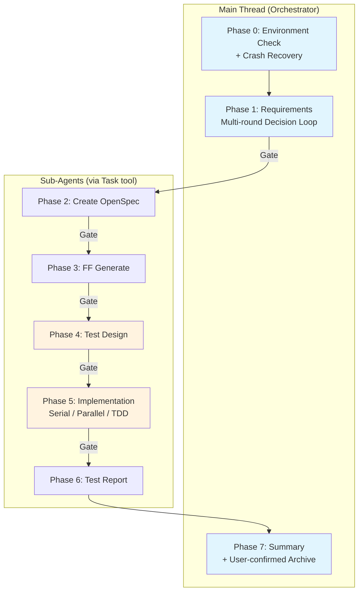

> **[中文版](README.zh.md)** | English (default)

# lorainwings-plugins

> A Claude Code plugin marketplace — spec-driven autopilot orchestration and parallel AI engineering control-plane.

[](https://github.com/lorainwings/claude-autopilot/actions/workflows/ci.yml)
[](LICENSE)

## Plugins

| Plugin | Version | Description |
|--------|---------|-------------|
| [spec-autopilot](plugins/spec-autopilot/) | 5.5.1 | Spec-driven autopilot orchestration for delivery pipelines — 8-phase workflow with 3-layer gate system and crash recovery |
| [parallel-harness](plugins/parallel-harness/) | 1.7.0 | Parallel AI engineering control-plane — task-graph scheduling, 9-gate system, RBAC governance, cost-aware model routing |
| [daily-report](plugins/daily-report/README.md) | 1.2.8 | Auto-generate and submit daily work reports from git commits and Lark chat history |

## Quick Install

```bash
# 1. Add marketplace
claude plugin marketplace add lorainwings/claude-autopilot

# 2. Install spec-autopilot (project-level)
claude plugin install spec-autopilot@lorainwings-plugins --scope project

# 3. Install parallel-harness (project-level)
claude plugin install parallel-harness@lorainwings-plugins --scope project

# 4. Install daily-report (project-level)
claude plugin install daily-report@lorainwings-plugins --scope project

# 5. Restart Claude Code
```

## What is spec-autopilot?

**spec-autopilot** is a Claude Code plugin that automates the full software delivery lifecycle: from requirements gathering through implementation, testing, reporting, and archival.

### Key Features

- **8-Phase Pipeline** — Requirements → OpenSpec → FF Generate → Test Design → Implementation → Test Report → Archive
- **3-Layer Gate System** — TaskCreate dependencies + Hook checkpoint validation + AI checklist verification
- **Crash Recovery** — Automatic checkpoint scanning and session resume
- **Anti-Rationalization** — 16 pattern detection to prevent sub-agents from skipping work
- **TDD Cycle** — RED-GREEN-REFACTOR with deterministic L2 validation
- **Requirements Routing** — Auto-classify as Feature/Bugfix/Refactor/Chore with dynamic gate thresholds
- **Event Bus** — Real-time event streaming via `events.jsonl` + WebSocket
- **GUI V2 Dashboard** — Three-column real-time dashboard with decision_ack feedback loop
- **Parallel Execution** — Domain-level parallel agents with file ownership enforcement
- **Modular Test Suite** — 104 test files with 1245+ assertions

### Architecture



## What is parallel-harness?

**parallel-harness** is a Claude Code plugin that provides a task-graph-driven parallel AI engineering platform. It enables multi-agent orchestration with strict governance, cost control, and quality gates.

### Key Features

- **Task Graph Orchestration** — Decompose complex requirements into a structured DAG with dependency tracking
- **Multi-Agent Parallel Scheduling** — Execute independent tasks concurrently with strict file ownership isolation
- **Cost-Aware Model Routing** — 3-tier automatic routing with escalation, downgrade, and budget control
- **9-Gate System** — test, lint, review, security, perf, coverage, policy, documentation, release readiness
- **Policy-as-Code** — Declarative policy rules with path boundaries, budget limits, model tier caps
- **RBAC Governance** — 4 built-in roles (admin/developer/reviewer/viewer), 12 fine-grained permissions
- **Audit Trail** — Full event-level audit with timeline replay, JSON/CSV export
- **PR/CI Integration** — GitHub PR creation, review comments, CI failure analysis via `gh` CLI
- **Session Persistence** — Memory/file dual adapters with checkpoint recovery

### Architecture

```
runtime/
├── engine/          — Unified Orchestrator Runtime (entry API)
├── orchestrator/    — Task Graph, Intent Analysis, Complexity, Ownership
├── scheduler/       — DAG Batch Scheduling
├── models/          — 3-Tier Model Router
├── session/         — Context Packing
├── verifiers/       — Verification Result Schema
├── observability/   — Event Bus (38 event types)
├── workers/         — Worker Runtime, Retry, Downgrade
├── guards/          — Merge Guard
├── gates/           — Gate System (9 gate types)
├── persistence/     — Session/Run/Audit Persistence
├── integrations/    — PR/CI Integration (GitHub)
├── governance/      — RBAC, Approval, Human-in-the-loop
├── capabilities/    — Skill/Hook/Instruction Extension Layer
└── schemas/         — GA-Level Data Contracts
```

## What is daily-report?

**daily-report** is a Claude Code Skill plugin that automates internal daily work report generation and submission. It aggregates git commit history and Lark (Feishu) chat messages to produce structured reports with automatic categorization and time allocation.

### Key Features

- **Multi-Source Aggregation** — Combines git commit logs and Lark chat history for comprehensive daily reports
- **Parallel Data Collection** — Multi-Agent architecture for concurrent git repo scanning, Lark group crawling, and API queries
- **Auto-Categorization** — Keyword-based intelligent work item classification (development, bugfix, refactoring, docs, meetings)
- **Smart Time Allocation** — 8h/day proportional distribution with 0.5h granularity
- **AES Encrypted Login** — Secure AES-256-CBC password encryption for internal system authentication
- **Token Auto-Refresh** — Automatic credential management with expired token re-authentication
- **Batch Submission** — One-click submission with duplicate date detection and auto-skip
- **Interactive Review** — Table-format preview with AskUserQuestion confirmation before submission

### Workflow

```
Phase 0: Init (first run) → Phase 1: Env Check → Phase 2: Collect (5-way parallel)
    → Phase 3: Generate + Review → Phase 4: Batch Submit
```

## Documentation

### spec-autopilot

| Document | Description |
|----------|-------------|
| [Quick Start](plugins/spec-autopilot/docs/getting-started/quick-start.md) | 5-minute quick start guide |
| [Integration Guide](plugins/spec-autopilot/docs/getting-started/integration-guide.md) | Step-by-step project onboarding |
| [Configuration](plugins/spec-autopilot/docs/getting-started/configuration.md) | Complete YAML field reference |
| [Architecture](plugins/spec-autopilot/docs/architecture/overview.md) | System architecture overview |
| [Phases](plugins/spec-autopilot/docs/architecture/phases.md) | Per-phase execution guide |
| [Gates](plugins/spec-autopilot/docs/architecture/gates.md) | 3-layer gate deep dive |
| [Config Tuning](plugins/spec-autopilot/docs/operations/config-tuning-guide.md) | Per-project-type optimization |
| [Troubleshooting](plugins/spec-autopilot/docs/operations/troubleshooting.md) | Common errors and recovery |
| [Plugin README](plugins/spec-autopilot/README.md) | Full plugin documentation |
| [Changelog](plugins/spec-autopilot/CHANGELOG.md) | Version history |

> All documentation is available in both [English](plugins/spec-autopilot/docs/README.md) and [中文](plugins/spec-autopilot/docs/README.zh.md).

### parallel-harness

| Document | Description |
|----------|-------------|
| [Architecture](plugins/parallel-harness/docs/architecture/overview.md) | System architecture overview |
| [Operator Guide](plugins/parallel-harness/docs/operator-guide.md) | Installation, deployment, operations |
| [Policy Guide](plugins/parallel-harness/docs/policy-guide.md) | Policy rule configuration |
| [Integration Guide](plugins/parallel-harness/docs/integration-guide.md) | GitHub PR, CI, custom gates, hooks |
| [Admin Guide](plugins/parallel-harness/docs/admin-guide.md) | Administration and RBAC setup |
| [Troubleshooting](plugins/parallel-harness/docs/troubleshooting.md) | Common errors and solutions |
| [Examples](plugins/parallel-harness/docs/examples/basic-flow.md) | Step-by-step flow examples |
| [FAQ](plugins/parallel-harness/docs/FAQ.md) | Frequently asked questions |
| [Plugin README](plugins/parallel-harness/README.md) | Full plugin documentation |

### daily-report

| Document | Description |
|----------|-------------|
| [Setup Guide](plugins/daily-report/skills/daily-report/references/setup-guide.md) | First-time initialization walkthrough |
| [Plugin README](plugins/daily-report/README.md) | Full plugin documentation |
| [Changelog](plugins/daily-report/CHANGELOG.md) | Version history |

## Requirements

- **Claude Code** CLI (v1.0.0+)
- **python3** (3.8+) — required for spec-autopilot hook scripts
- **bun** (1.0+) — required for parallel-harness runtime and tests
- **bash** (4.0+) — hook script execution
- **Node.js** — required for daily-report (lark-cli dependency)
- **git** — version control integration

## Repository Structure

```
claude-autopilot/
├── .claude-plugin/          # Marketplace configuration
│   └── marketplace.json
├── .github/workflows/       # CI/CD
│   ├── ci.yml               # Unified CI entry (detect → matrix → summary)
│   ├── ci-sweep.yml         # Scheduled full sweep
│   └── release-please.yml
├── .githooks/               # Git hooks (pre-commit, pre-push)
├── dist/                    # Built plugins (for marketplace install)
│   ├── spec-autopilot/
│   ├── parallel-harness/
│   └── daily-report/
├── plugins/                 # Plugin source code
│   ├── spec-autopilot/
│   │   ├── skills/          # 12 Skill definitions
│   │   ├── scripts/         # Hook scripts + utilities
│   │   ├── hooks/           # Hook registration
│   │   ├── gui/             # GUI V2 dashboard (React + Tailwind)
│   │   ├── tests/           # 104 test files, 1245+ assertions
│   │   └── docs/            # Full documentation (EN + ZH)
│   └── parallel-harness/
│       ├── runtime/         # 17 core modules (engine, orchestrator, scheduler, etc.)
│       ├── skills/          # Skill definitions (harness, plan, dispatch, verify)
│       ├── config/          # Default config + policy files
│       ├── tools/           # CLI tools and utilities
│       ├── tests/           # 295 tests, 649 assertions
│       └── docs/            # Full documentation
│   └── daily-report/
│       └── skills/          # Skill definition + setup guide
├── Makefile                 # Build, test, setup shortcuts
├── README.md                # This file
├── LICENSE                  # MIT License
├── CONTRIBUTING.md          # Contribution guidelines
└── SECURITY.md              # Security policy
```

## Contributing

We welcome contributions! Please see [CONTRIBUTING.md](CONTRIBUTING.md) for guidelines.

Plugin-only changes trigger only the matching plugin CI jobs within the unified `ci.yml` workflow. After a release PR is merged into `main`, `release-please` and the post-release job rebuild `dist/`, sync plugin docs, refresh the root README version table, and update `.claude-plugin/marketplace.json`.

```bash
# Clone the repository
git clone https://github.com/lorainwings/claude-autopilot.git
cd claude-autopilot

# One-time setup: activate git hooks
make setup

# Run tests
make test

# Build distribution
make build
```

## Security

For security concerns, please see [SECURITY.md](SECURITY.md).

## License

This project is licensed under the MIT License — see the [LICENSE](LICENSE) file for details.
