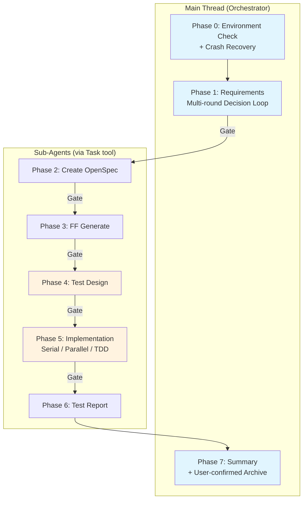

> **[中文版](README.zh.md)** | English (default)

# lorainwings-plugins

> A Claude Code plugin marketplace — spec-driven autopilot orchestration for software delivery pipelines.

[](https://github.com/lorainwings/claude-autopilot/actions/workflows/test.yml)
[](LICENSE)

## Plugins

| Plugin | Version | Description |
|--------|---------|-------------|
| [spec-autopilot](plugins/spec-autopilot/) | 5.1.25 | Spec-driven autopilot orchestration for delivery pipelines — 8-phase workflow with 3-layer gate system and crash recovery |

## Quick Install

```bash
# 1. Add marketplace
claude plugin marketplace add lorainwings/claude-autopilot

# 2. Install plugin (project-level)
claude plugin install spec-autopilot@lorainwings-plugins --scope project

# 3. Restart Claude Code
```

## What is spec-autopilot?

**spec-autopilot** is a Claude Code plugin that automates the full software delivery lifecycle: from requirements gathering through implementation, testing, reporting, and archival.

### Key Features

- **8-Phase Pipeline** — Requirements → OpenSpec → FF Generate → Test Design → Implementation → Test Report → Archive
- **3-Layer Gate System** — TaskCreate dependencies + Hook checkpoint validation + AI checklist verification
- **Crash Recovery** — Automatic checkpoint scanning and session resume
- **Anti-Rationalization** — 16 pattern detection to prevent sub-agents from skipping work
- **TDD Cycle** — RED-GREEN-REFACTOR with deterministic L2 validation
- **Requirements Routing** — Auto-classify as Feature/Bugfix/Refactor/Chore with dynamic gate thresholds
- **Event Bus** — Real-time event streaming via `events.jsonl` + WebSocket
- **GUI V2 Dashboard** — Three-column real-time dashboard with decision_ack feedback loop
- **Parallel Execution** — Domain-level parallel agents with file ownership enforcement
- **Modular Test Suite** — 76 test files with 692+ assertions

### Architecture



## Documentation

| Document | Description |
|----------|-------------|
| [Quick Start](plugins/spec-autopilot/docs/getting-started/quick-start.md) | 5-minute quick start guide |
| [Integration Guide](plugins/spec-autopilot/docs/getting-started/integration-guide.md) | Step-by-step project onboarding |
| [Configuration](plugins/spec-autopilot/docs/getting-started/configuration.md) | Complete YAML field reference |
| [Architecture](plugins/spec-autopilot/docs/architecture/overview.md) | System architecture overview |
| [Phases](plugins/spec-autopilot/docs/architecture/phases.md) | Per-phase execution guide |
| [Gates](plugins/spec-autopilot/docs/architecture/gates.md) | 3-layer gate deep dive |
| [Config Tuning](plugins/spec-autopilot/docs/operations/config-tuning-guide.md) | Per-project-type optimization |
| [Troubleshooting](plugins/spec-autopilot/docs/operations/troubleshooting.md) | Common errors and recovery |
| [Plugin README](plugins/spec-autopilot/README.md) | Full plugin documentation |
| [Changelog](plugins/spec-autopilot/CHANGELOG.md) | Version history |

> All documentation is available in both [English](plugins/spec-autopilot/docs/README.md) and [中文](plugins/spec-autopilot/docs/README.zh.md).

## Requirements

- **Claude Code** CLI (v1.0.0+)
- **python3** (3.8+) — required for hook scripts
- **bash** (4.0+) — hook script execution
- **git** — version control integration

## Repository Structure

```
claude-autopilot/
├── .claude-plugin/          # Marketplace configuration
│   └── marketplace.json
├── .github/workflows/       # CI/CD
│   └── test.yml
├── .githooks/               # Git hooks (pre-commit)
├── dist/                    # Built plugin (for marketplace install)
│   └── spec-autopilot/
├── plugins/                 # Plugin source code
│   └── spec-autopilot/
│       ├── skills/          # 7 Skill definitions
│       ├── scripts/         # Hook scripts + utilities
│       ├── hooks/           # Hook registration
│       ├── gui/             # GUI V2 dashboard (React + Tailwind)
│       ├── tests/           # 76 test files, 692+ assertions
│       └── docs/            # Full documentation (EN + ZH)
├── Makefile                 # Build, test, setup shortcuts
├── README.md                # This file
├── LICENSE                  # MIT License
├── CONTRIBUTING.md          # Contribution guidelines
└── SECURITY.md              # Security policy
```

## Contributing

We welcome contributions! Please see [CONTRIBUTING.md](CONTRIBUTING.md) for guidelines.

```bash
# Clone the repository
git clone https://github.com/lorainwings/claude-autopilot.git
cd claude-autopilot

# One-time setup: activate git hooks
make setup

# Run tests
make test

# Build distribution
make build
```

## Security

For security concerns, please see [SECURITY.md](SECURITY.md).

## License

This project is licensed under the MIT License — see the [LICENSE](LICENSE) file for details.
