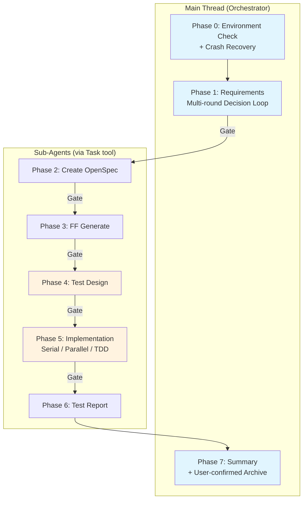

> [English](README.md) | 中文

# lorainwings-plugins

> Claude Code 插件市场 — 规范驱动的全自动交付流水线编排 + 并行 AI 工程控制面。

[](https://github.com/lorainwings/claude-autopilot/actions/workflows/ci.yml)
[](LICENSE)

## 插件列表

| 插件 | 版本 | 说明 |
|------|------|------|
| [spec-autopilot](plugins/spec-autopilot/README.zh.md) | 5.3.0 | 规范驱动的交付流水线编排 — 8 阶段工作流 + 三层门禁 + 崩溃恢复 |
| [parallel-harness](plugins/parallel-harness/README.zh.md) | 1.3.0 | 并行 AI 工程控制面 — 任务图调度、9 类门禁、RBAC 治理、成本感知模型路由 |
| [daily-report](plugins/daily-report/README.zh.md) | 1.2.6 | 基于 git 提交和飞书聊天记录，自动生成并提交内控日报 |

## 快速安装

```bash
# 1. 添加市场
claude plugin marketplace add lorainwings/claude-autopilot

# 2. 安装 spec-autopilot（项目级）
claude plugin install spec-autopilot@lorainwings-plugins --scope project

# 3. 安装 parallel-harness（项目级）
claude plugin install parallel-harness@lorainwings-plugins --scope project

# 4. 安装 daily-report（项目级）
claude plugin install daily-report@lorainwings-plugins --scope project

# 5. 重启 Claude Code
```

## 什么是 spec-autopilot？

**spec-autopilot** 是一个 Claude Code 插件，自动化完整的软件交付生命周期：从需求收集到实施、测试、报告和归档。

### 核心特性

- **8 阶段流水线** — 需求 → OpenSpec → FF 生成 → 测试设计 → 实施 → 测试报告 → 归档
- **三层门禁系统** — TaskCreate 依赖链 + Hook 检查点验证 + AI 检查清单验证
- **崩溃恢复** — 自动检查点扫描和会话恢复
- **反合理化检测** — 16 种模式检测，防止子 Agent 跳过工作
- **TDD 循环** — RED-GREEN-REFACTOR，L2 确定性验证
- **需求路由** — 自动分类为 Feature/Bugfix/Refactor/Chore，动态调整门禁阈值
- **事件总线** — 通过 `events.jsonl` + WebSocket 实时事件流
- **GUI V2 大盘** — 三栏实时仪表盘，含 decision_ack 决策反馈闭环
- **并行执行** — 域级并行 Agent，文件所有权强制
- **模块化测试** — 102 个测试文件，1245+ 个断言

### 架构



## 什么是 parallel-harness？

**parallel-harness** 是一个 Claude Code 插件，提供任务图驱动的并行 AI 工程平台。它支持多 Agent 编排，具备严格的治理体系、成本控制和质量门禁。

### 核心特性

- **任务图编排** — 将复杂需求拆解为结构化 DAG，自动依赖追踪
- **多 Agent 并行调度** — 独立任务并发执行，文件所有权严格隔离
- **成本感知模型路由** — 三层自动路由，支持升级、降级和预算控制
- **9 类门禁系统** — test、lint、review、security、perf、coverage、policy、documentation、release readiness
- **策略即代码** — 声明式策略规则，支持路径边界、预算限制、模型档位上限
- **RBAC 治理** — 4 种内置角色（admin/developer/reviewer/viewer），12 种细粒度权限
- **审计追踪** — 完整事件级审计，支持时间线回放、JSON/CSV 导出
- **PR/CI 集成** — GitHub PR 创建、Review 评论、CI 失败分析（基于 `gh` CLI）
- **Session 持久化** — 内存/文件双适配器，支持断点恢复

### 架构

```
runtime/
├── engine/          — 统一运行时 Orchestrator（入口 API）
├── orchestrator/    — 任务图、意图分析、复杂度评分、所有权规划
├── scheduler/       — DAG 批次调度
├── models/          — 三层模型路由
├── session/         — 上下文打包
├── verifiers/       — 验证结果 Schema
├── observability/   — 事件总线（38 种事件类型）
├── workers/         — Worker 运行时、重试、降级
├── guards/          — Merge Guard
├── gates/           — 门禁系统（9 类门禁）
├── persistence/     — Session/Run/Audit 持久化
├── integrations/    — PR/CI 集成（GitHub）
├── governance/      — RBAC、审批、人工介入
├── capabilities/    — Skill/Hook/Instruction 扩展层
└── schemas/         — GA 级数据契约
```

## 什么是 daily-report？

**daily-report** 是一个 Claude Code Skill 插件，自动化内控日报的生成与提交。它聚合 git 提交记录和飞书聊天消息，生成结构化工作日报，并自动完成分类匹配和工时分配。

### 核心特性

- **多源数据聚合** — 整合 git 提交日志和飞书群聊消息，全面覆盖每日工作内容
- **并行数据采集** — 多 Agent 架构，并发执行 git 仓库扫描、飞书群消息爬取和 API 查询
- **智能分类匹配** — 基于关键词自动匹配事项分类（需求开发、问题修复、代码重构、文档编写、会议沟通）
- **智能工时分配** — 每天固定 8h，按条目数等比分配，0.5h 粒度
- **AES 加密登录** — AES-256-CBC 密码加密，安全对接内控系统
- **Token 自动刷新** — 自动管理凭据，过期自动重新登录
- **批量提交** — 一键提交，自动检测并跳过已填日期
- **交互式审核** — 表格形式预览，AskUserQuestion 确认后提交

### 工作流

```
阶段 0: 初始化（首次）→ 阶段 1: 环境检查 → 阶段 2: 数据采集（5 路并行）
    → 阶段 3: 生成 + 审核 → 阶段 4: 批量提交
```

## 文档

### spec-autopilot

| 文档 | 说明 |
|------|------|
| [快速开始](plugins/spec-autopilot/docs/getting-started/quick-start.zh.md) | 5 分钟快速入门 |
| [项目接入指南](plugins/spec-autopilot/docs/getting-started/integration-guide.zh.md) | 分步项目接入 |
| [配置参考](plugins/spec-autopilot/docs/getting-started/configuration.zh.md) | 完整 YAML 字段参考 |
| [架构总览](plugins/spec-autopilot/docs/architecture/overview.zh.md) | 系统架构概述 |
| [阶段详解](plugins/spec-autopilot/docs/architecture/phases.zh.md) | 各阶段执行指南 |
| [门禁系统](plugins/spec-autopilot/docs/architecture/gates.zh.md) | 三层门禁深入解析 |
| [配置调优](plugins/spec-autopilot/docs/operations/config-tuning-guide.zh.md) | 按项目类型优化 |
| [故障排查](plugins/spec-autopilot/docs/operations/troubleshooting.zh.md) | 常见错误与恢复 |
| [插件 README](plugins/spec-autopilot/README.zh.md) | 完整插件文档 |
| [更新日志](plugins/spec-autopilot/CHANGELOG.md) | 版本历史 |

> 所有文档均提供 [English](plugins/spec-autopilot/docs/README.md) 和 [中文](plugins/spec-autopilot/docs/README.zh.md) 双语版本。

### parallel-harness

| 文档 | 说明 |
|------|------|
| [架构总览](plugins/parallel-harness/docs/architecture/overview.zh.md) | 系统架构概述 |
| [运维指南](plugins/parallel-harness/docs/operator-guide.zh.md) | 安装、部署、运维 |
| [策略指南](plugins/parallel-harness/docs/policy-guide.zh.md) | 策略规则配置 |
| [集成指南](plugins/parallel-harness/docs/integration-guide.zh.md) | GitHub PR、CI、自定义门禁、Hooks |
| [管理指南](plugins/parallel-harness/docs/admin-guide.zh.md) | 管理与 RBAC 设置 |
| [故障排查](plugins/parallel-harness/docs/troubleshooting.zh.md) | 常见错误与解决方案 |
| [示例](plugins/parallel-harness/docs/examples/basic-flow.zh.md) | 分步流程示例 |
| [常见问题](plugins/parallel-harness/docs/FAQ.zh.md) | 常见问题解答 |
| [插件 README](plugins/parallel-harness/README.zh.md) | 完整插件文档 |

### daily-report

| 文档 | 说明 |
|------|------|
| [初始化引导](plugins/daily-report/skills/daily-report/references/setup-guide.md) | 首次配置完整指南 |
| [插件 README](plugins/daily-report/README.zh.md) | 完整插件文档 |
| [更新日志](plugins/daily-report/CHANGELOG.md) | 版本历史 |

## 系统要求

- **Claude Code** CLI (v1.0.0+)
- **python3** (3.8+) — spec-autopilot Hook 脚本依赖
- **bun** (1.0+) — parallel-harness 运行时和测试依赖
- **bash** (4.0+) — Hook 脚本执行
- **Node.js** — daily-report 依赖（lark-cli）
- **git** — 版本控制集成

## 仓库结构

```
claude-autopilot/
├── .claude-plugin/          # 市场配置
│   └── marketplace.json
├── .github/workflows/       # CI/CD
│   ├── ci.yml               # 统一 CI 入口（检测 → 矩阵 → 汇总）
│   ├── ci-sweep.yml         # 定时全量扫描
│   └── release-please.yml
├── .githooks/               # Git hooks (pre-commit, pre-push)
├── dist/                    # 构建产出（用于市场安装）
│   ├── spec-autopilot/
│   ├── parallel-harness/
│   └── daily-report/
├── plugins/                 # 插件源码
│   ├── spec-autopilot/
│   │   ├── skills/          # 7 个 Skill 定义
│   │   ├── scripts/         # Hook 脚本 + 工具
│   │   ├── hooks/           # Hook 注册
│   │   ├── gui/             # GUI V2 大盘 (React + Tailwind)
│   │   ├── tests/           # 102 个测试文件，1245+ 个断言
│   │   └── docs/            # 完整文档 (中英双语)
│   └── parallel-harness/
│       ├── runtime/         # 15 个核心模块 (engine, orchestrator, scheduler 等)
│       ├── skills/          # Skill 定义 (harness, plan, dispatch, verify)
│       ├── config/          # 默认配置 + 策略文件
│       ├── tools/           # CLI 工具和辅助脚本
│       ├── tests/           # 219 个测试，499 个断言
│       └── docs/            # 完整文档
│   └── daily-report/
│       └── skills/          # Skill 定义 + 初始化引导
├── Makefile                 # 构建、测试、初始化快捷入口
├── README.md                # 英文说明
├── README.zh.md             # 本文件
├── LICENSE                  # MIT 许可证
├── CONTRIBUTING.md          # 贡献指南
└── SECURITY.md              # 安全策略
```

## 贡献

欢迎贡献！请参阅 [CONTRIBUTING.zh.md](CONTRIBUTING.zh.md) 了解指南。

插件级改动只会触发统一 `ci.yml` 中对应插件的 CI jobs。Release PR 合入 `main` 后，`release-please` 与 post-release job 会自动重建 `dist/`、同步插件文档、回写根 README 版本表，并更新 `.claude-plugin/marketplace.json`。

```bash
# 克隆仓库
git clone https://github.com/lorainwings/claude-autopilot.git
cd claude-autopilot

# 一键初始化：激活 git hooks
make setup

# 运行测试
make test

# 构建分发包
make build
```

## 安全

安全相关问题请参阅 [SECURITY.md](SECURITY.md)。

## 许可证

本项目基于 MIT 许可证开源 — 详见 [LICENSE](LICENSE) 文件。
