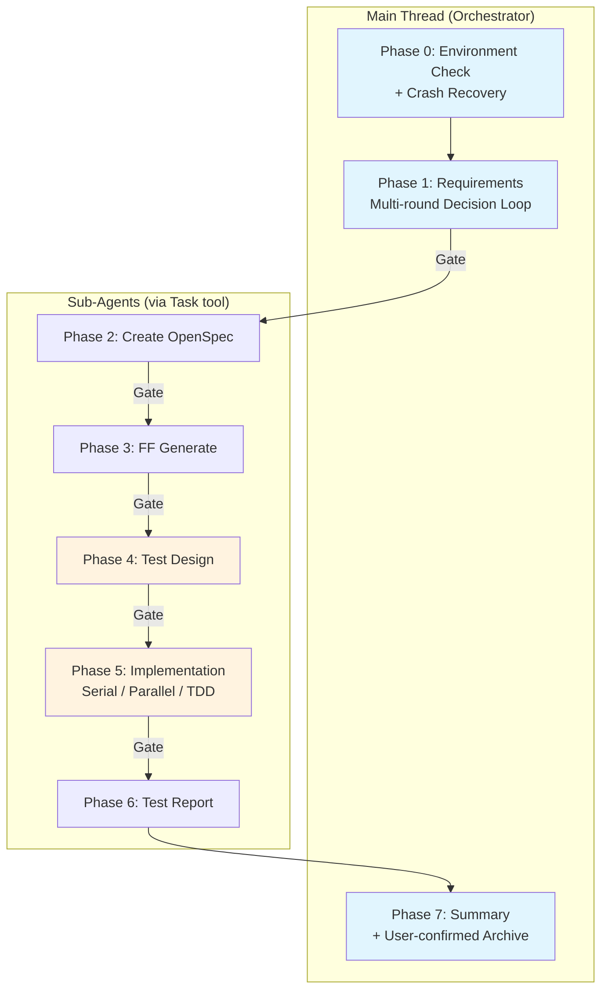

> [English](README.md) | 中文

# lorainwings-plugins

> Claude Code 插件市场 — 规范驱动的全自动交付流水线编排。

[](https://github.com/lorainwings/claude-autopilot/actions/workflows/test.yml)
[](LICENSE)

## 插件列表

| 插件 | 版本 | 说明 |
|------|------|------|
| [spec-autopilot](plugins/spec-autopilot/README.zh.md) | 5.1.2 | 规范驱动的交付流水线编排 — 8 阶段工作流 + 三层门禁 + 崩溃恢复 |

## 快速安装

```bash
# 1. 添加市场
claude plugin marketplace add lorainwings/claude-autopilot

# 2. 安装插件（项目级）
claude plugin install spec-autopilot@lorainwings-plugins --scope project

# 3. 重启 Claude Code
```

## 什么是 spec-autopilot？

**spec-autopilot** 是一个 Claude Code 插件，自动化完整的软件交付生命周期：从需求收集到实施、测试、报告和归档。

### 核心特性

- **8 阶段流水线** — 需求 → OpenSpec → FF 生成 → 测试设计 → 实施 → 测试报告 → 归档
- **三层门禁系统** — TaskCreate 依赖链 + Hook 检查点验证 + AI 检查清单验证
- **崩溃恢复** — 自动检查点扫描和会话恢复
- **反合理化检测** — 16 种模式检测，防止子 Agent 跳过工作
- **TDD 循环** — RED-GREEN-REFACTOR，L2 确定性验证
- **需求路由** — 自动分类为 Feature/Bugfix/Refactor/Chore，动态调整门禁阈值
- **事件总线** — 通过 `events.jsonl` + WebSocket 实时事件流
- **GUI V2 大盘** — 三栏实时仪表盘，含 decision_ack 决策反馈闭环
- **并行执行** — 域级并行 Agent，文件所有权强制
- **模块化测试** — 53 个测试文件，约 340 个断言

### 架构



## 文档

| 文档 | 说明 |
|------|------|
| [快速开始](plugins/spec-autopilot/docs/getting-started/quick-start.zh.md) | 5 分钟快速入门 |
| [项目接入指南](plugins/spec-autopilot/docs/getting-started/integration-guide.zh.md) | 分步项目接入 |
| [配置参考](plugins/spec-autopilot/docs/getting-started/configuration.zh.md) | 完整 YAML 字段参考 |
| [架构总览](plugins/spec-autopilot/docs/architecture/overview.zh.md) | 系统架构概述 |
| [阶段详解](plugins/spec-autopilot/docs/architecture/phases.zh.md) | 各阶段执行指南 |
| [门禁系统](plugins/spec-autopilot/docs/architecture/gates.zh.md) | 三层门禁深入解析 |
| [配置调优](plugins/spec-autopilot/docs/operations/config-tuning-guide.zh.md) | 按项目类型优化 |
| [故障排查](plugins/spec-autopilot/docs/operations/troubleshooting.zh.md) | 常见错误与恢复 |
| [插件 README](plugins/spec-autopilot/README.zh.md) | 完整插件文档 |
| [更新日志](plugins/spec-autopilot/CHANGELOG.md) | 版本历史 |

> 所有文档均提供 [English](plugins/spec-autopilot/docs/README.md) 和 [中文](plugins/spec-autopilot/docs/README.zh.md) 双语版本。

## 系统要求

- **Claude Code** CLI (v1.0.0+)
- **python3** (3.8+) — Hook 脚本依赖
- **bash** (4.0+) — Hook 脚本执行
- **git** — 版本控制集成

## 仓库结构

```
claude-autopilot/
├── .claude-plugin/          # 市场配置
│   └── marketplace.json
├── .github/workflows/       # CI/CD
│   └── test.yml
├── dist/                    # 构建产出（用于市场安装）
│   └── spec-autopilot/
├── plugins/                 # 插件源码
│   └── spec-autopilot/
│       ├── skills/          # 7 个 Skill 定义
│       ├── scripts/         # Hook 脚本 + 工具
│       ├── hooks/           # Hook 注册
│       ├── gui/             # GUI V2 大盘 (React + Tailwind)
│       ├── tests/           # 53 个测试文件，约 340 个断言
│       └── docs/            # 完整文档 (中英双语)
├── README.md                # 英文说明
├── README.zh.md             # 本文件
├── LICENSE                  # MIT 许可证
├── CONTRIBUTING.md          # 贡献指南
├── SECURITY.md              # 安全策略
└── CODE_OF_CONDUCT.md       # 社区行为准则
```

## 贡献

欢迎贡献！请参阅 [CONTRIBUTING.md](CONTRIBUTING.md) 了解指南。

```bash
# 克隆仓库
git clone https://github.com/lorainwings/claude-autopilot.git
cd claude-autopilot

# 运行测试
bash plugins/spec-autopilot/tests/run_all.sh

# 语法检查所有脚本
for f in plugins/spec-autopilot/scripts/*.sh; do
  bash -n "$f" && echo "OK: $(basename $f)" || echo "FAIL: $(basename $f)"
done

# 构建分发包
bash plugins/spec-autopilot/scripts/build-dist.sh
```

## 安全

安全相关问题请参阅 [SECURITY.md](SECURITY.md)。

## 许可证

本项目基于 MIT 许可证开源 — 详见 [LICENSE](LICENSE) 文件。
