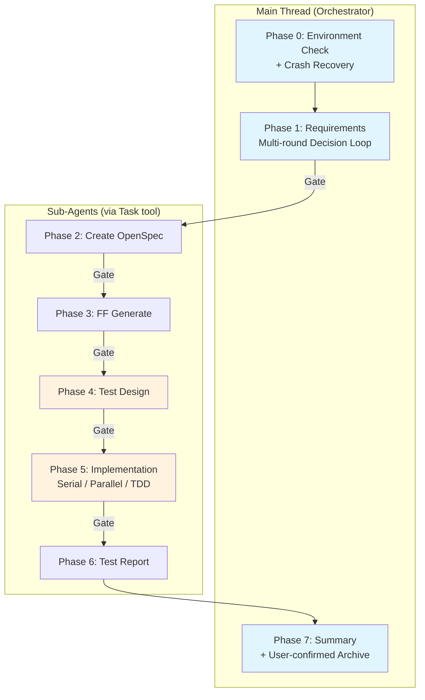
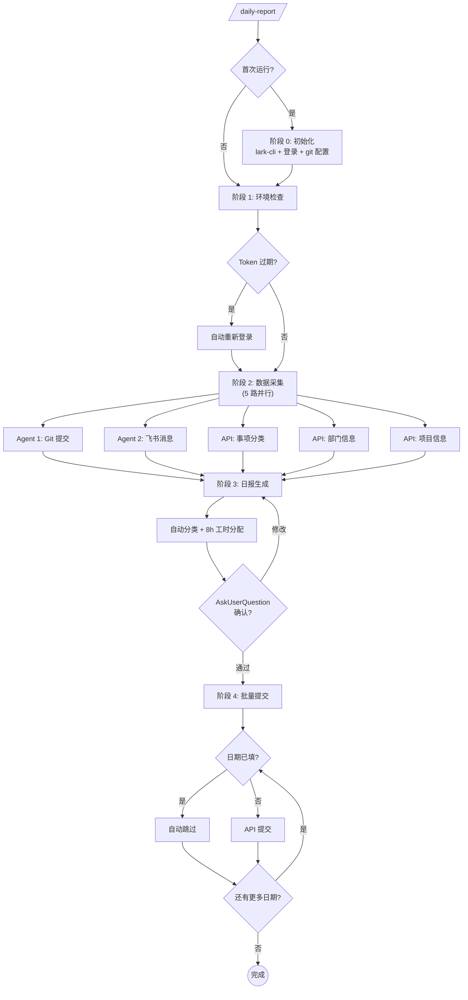
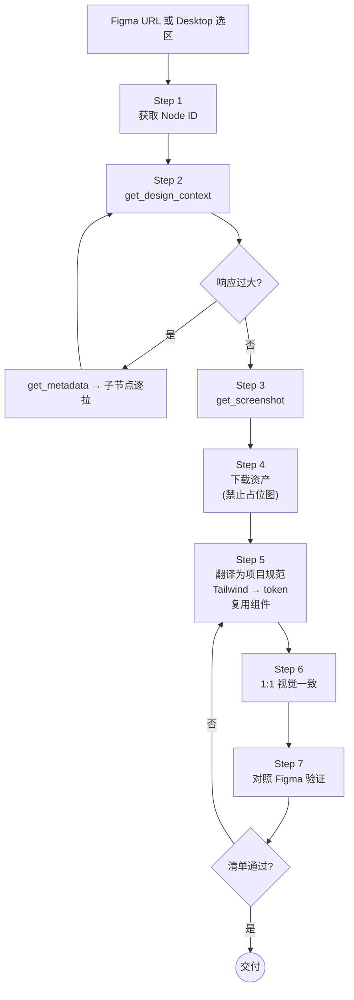
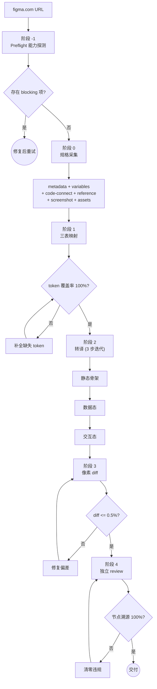
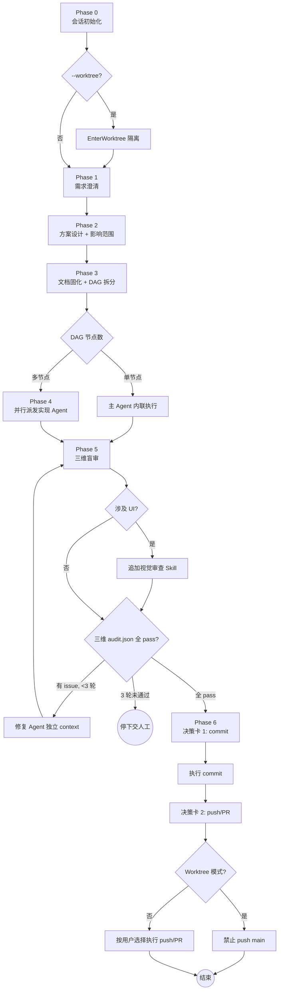

> [English](README.md) | 中文

# stoicatom-plugins

> Claude Code 插件市场 — 规范驱动的全自动交付流水线编排 + 并行 AI 工程控制面。

[](https://github.com/stoicatom/claude-autopilot/actions/workflows/ci.yml)
[](LICENSE)

## 插件列表

| 插件 | 版本 | 说明 |
|------|------|------|
| [spec-autopilot](plugins/spec-autopilot/README.zh.md) | 5.15.2 | 规范驱动的交付流水线编排 — 8 阶段工作流 + 三层门禁 + 崩溃恢复 |
| [parallel-harness](plugins/parallel-harness/README.zh.md) | 1.9.1 | 并行 AI 工程控制面 — 任务图调度、9 类门禁、RBAC 治理、成本感知模型路由 |
| [daily-report](plugins/daily-report/README.zh.md) | 1.3.0 | 基于 git 提交和飞书聊天记录，自动生成并提交内控日报 |
| [figma-codegen](plugins/figma-codegen/README.zh.md) | 1.0.0 | Figma 设计稿到代码 7 步翻译 SKILL（适配自 OpenAI figma-implement-design），追求 1:1 视觉一致 |
| [slim-task](plugins/slim-task/README.zh.md) | 0.8.0 | 结构化 7 阶段任务执行 SOP，支持多语言与 worktree 并行 — 会话初始化、需求澄清、影响范围锁定、DAG 并行子 Agent 派发、独立审计盲审 |

## 快速安装

```bash
# 1. 添加市场
claude plugin marketplace add stoicatom/claude-autopilot

# 2. 安装 spec-autopilot（项目级）
claude plugin install spec-autopilot@stoicatom-plugins --scope project

# 3. 安装 parallel-harness（项目级）
claude plugin install parallel-harness@stoicatom-plugins --scope project

# 4. 安装 daily-report（项目级）
claude plugin install daily-report@stoicatom-plugins --scope project

# 5. 安装 figma-codegen（项目级）
claude plugin install figma-codegen@stoicatom-plugins --scope project

# 6. 安装 slim-task（项目级）
claude plugin install slim-task@stoicatom-plugins --scope project

# 7. 重启 Claude Code
```

## 什么是 spec-autopilot？

**spec-autopilot** 是一个 Claude Code 插件，自动化完整的软件交付生命周期：从需求收集到实施、测试、报告和归档。

### 核心特性

- **8 阶段流水线** — 需求 → OpenSpec → FF 生成 → 测试设计 → 实施 → 测试报告 → 归档
- **三层门禁系统** — TaskCreate 依赖链 + Hook 检查点验证 + AI 检查清单验证
- **崩溃恢复** — 自动检查点扫描和会话恢复
- **反合理化检测** — 16 种模式检测，防止子 Agent 跳过工作
- **TDD 循环** — RED-GREEN-REFACTOR，L2 确定性验证
- **需求路由** — 自动分类为 Feature/Bugfix/Refactor/Chore，动态调整门禁阈值
- **事件总线** — 通过 `events.jsonl` + WebSocket 实时事件流
- **GUI V2 大盘** — 三栏实时仪表盘，含 decision_ack 决策反馈闭环
- **并行执行** — 域级并行 Agent，文件所有权强制
- **模块化测试** — 104 个测试文件，1245+ 个断言

### 架构


```mermaid
graph TB
    subgraph "Main Thread (Orchestrator)"
        P0[Phase 0: Environment Check<br/>+ Crash Recovery]
        P1[Phase 1: Requirements<br/>Multi-round Decision Loop]
        P7[Phase 7: Summary<br/>+ User-confirmed Archive]
    end

    subgraph "Sub-Agents (via Task tool)"
        P2[Phase 2: Create OpenSpec]
        P3[Phase 3: FF Generate]
        P4[Phase 4: Test Design]
        P5[Phase 5: Implementation<br/>Serial / Parallel / TDD]
        P6[Phase 6: Test Report]
    end

    P0 --> P1
    P1 -->|Gate| P2
    P2 -->|Gate| P3
    P3 -->|Gate| P4
    P4 -->|Gate| P5
    P5 -->|Gate| P6
    P6 --> P7

    style P0 fill:#e1f5fe
    style P1 fill:#e1f5fe
    style P7 fill:#e1f5fe
    style P4 fill:#fff3e0
    style P5 fill:#fff3e0
```

## 什么是 parallel-harness？

**parallel-harness** 是一个 Claude Code 插件，提供任务图驱动的并行 AI 工程平台。它支持多 Agent 编排，具备严格的治理体系、成本控制和质量门禁。

### 核心特性

- **任务图编排** — 将复杂需求拆解为结构化 DAG，自动依赖追踪
- **多 Agent 并行调度** — 独立任务并发执行，文件所有权严格隔离
- **成本感知模型路由** — 三层自动路由，支持升级、降级和预算控制
- **9 类门禁系统** — test、lint、review、security、perf、coverage、policy、documentation、release readiness
- **策略即代码** — 声明式策略规则，支持路径边界、预算限制、模型档位上限
- **RBAC 治理** — 4 种内置角色（admin/developer/reviewer/viewer），12 种细粒度权限
- **审计追踪** — 完整事件级审计，支持时间线回放、JSON/CSV 导出
- **PR/CI 集成** — GitHub PR 创建、Review 评论、CI 失败分析（基于 `gh` CLI）
- **Session 持久化** — 内存/文件双适配器，支持断点恢复

### 架构


```mermaid
graph LR
    A[用户意图] --> B[意图分析器]
    B --> C[任务图构建器]
    C --> D["TaskGraph (DAG)"]
    D --> E[所有权规划]
    E --> F[调度器]
    F --> G["SchedulePlan (批次)"]
    G --> H[上下文打包]
    H --> I[模型路由]
    I --> J[Worker 运行时]
    J --> K[门禁系统]
    K --> L[Merge Guard]
    L --> M[PR 提供器]
    M --> N[结果综合器]
    N --> O[QualityReport]
```

## 什么是 daily-report？

**daily-report** 是一个 Claude Code Skill 插件，自动化内控日报的生成与提交。它聚合 git 提交记录和飞书聊天消息，生成结构化工作日报，并自动完成分类匹配和工时分配。

### 核心特性

- **多源数据聚合** — 整合 git 提交日志和飞书群聊消息，全面覆盖每日工作内容
- **并行数据采集** — 多 Agent 架构，并发执行 git 仓库扫描、飞书群消息爬取和 API 查询
- **智能分类匹配** — 基于关键词自动匹配事项分类（需求开发、问题修复、代码重构、文档编写、会议沟通）
- **智能工时分配** — 每天固定 8h，按条目数等比分配，0.5h 粒度
- **AES 加密登录** — AES-256-CBC 密码加密，安全对接内控系统
- **Token 自动刷新** — 自动管理凭据，过期自动重新登录
- **批量提交** — 一键提交，自动检测并跳过已填日期
- **交互式审核** — 表格形式预览，AskUserQuestion 确认后提交

### 工作流


```mermaid
flowchart TD
    START[/daily-report/] --> INIT{首次运行?}
    INIT -->|是| P0["阶段 0: 初始化<br/>lark-cli + 登录 + git 配置"]
    INIT -->|否| P1["阶段 1: 环境检查"]
    P0 --> P1
    P1 --> TOKEN{Token 过期?}
    TOKEN -->|是| REFRESH[自动重新登录] --> P2
    TOKEN -->|否| P2["阶段 2: 数据采集<br/>(5 路并行)"]
    P2 --> GIT[Agent 1: Git 提交]
    P2 --> LARK[Agent 2: 飞书消息]
    P2 --> API1[API: 事项分类]
    P2 --> API2[API: 部门信息]
    P2 --> API3[API: 项目信息]
    GIT & LARK & API1 & API2 & API3 --> P3["阶段 3: 日报生成"]
    P3 --> CAT[自动分类 + 8h 工时分配] --> REVIEW{AskUserQuestion<br/>确认?}
    REVIEW -->|通过| P4["阶段 4: 批量提交"]
    REVIEW -->|修改| P3
    P4 --> DUP{日期已填?}
    DUP -->|是| SKIP[自动跳过] --> NEXT
    DUP -->|否| SUB[API 提交] --> NEXT{还有更多日期?}
    NEXT -->|是| DUP
    NEXT -->|否| DONE((完成))
```

## 什么是 figma-codegen？

**figma-codegen** 是一个 Claude Code Skill 插件，把 Figma 设计稿翻译为生产级代码，追求 1:1 视觉一致。它是 OpenAI 官方 [figma-implement-design](https://github.com/openai/skills/tree/main/skills/.curated/figma-implement-design) 在 Claude Code 生态上的忠实适配。

### 核心特性

- **7 步确定性工作流** — 获取 Node ID → 拉取设计上下文 → 截取视觉基准 → 下载资产 → 翻译为项目规范 → 实现 1:1 视觉一致 → 对照 Figma 验证
- **三种 Figma MCP 模式** — Remote MCP / Figma Desktop MCP / 本地 `figma-developer-mcp`；Desktop 模式支持选区驱动（无需 URL）
- **Reference vs Final Code** — Figma MCP 输出（通常是 React + Tailwind）作为设计意图参考，utility class 替换为项目 token，复用已有组件
- **资产硬规则** — `localhost` 资产直接使用；严禁用占位图或第三方 icon 包替代 MCP 返回的资产
- **设计系统优先** — 优先项目设计 token，允许 spacing/sizing 微调以保留视觉一致
- **验证清单** — 完工前 7 维清单（布局 / 排版 / 颜色 / 交互 / 响应式 / 资产 / 无障碍）
- **忠实适配上游** — SKILL.md 与 OpenAI 7 步结构对齐，便于追上游 diff

### 工作流


```mermaid
flowchart TD
    URL["Figma URL 或 Desktop 选区"] --> S1["Step 1<br/>获取 Node ID"]
    S1 --> S2["Step 2<br/>get_design_context"]
    S2 --> LARGE{响应过大?}
    LARGE -->|是| META[get_metadata → 子节点逐拉]
    META --> S2
    LARGE -->|否| S3["Step 3<br/>get_screenshot"]
    S3 --> S4["Step 4<br/>下载资产<br/>(禁止占位图)"]
    S4 --> S5["Step 5<br/>翻译为项目规范<br/>Tailwind → token<br/>复用组件"]
    S5 --> S6["Step 6<br/>1:1 视觉一致"]
    S6 --> S7["Step 7<br/>对照 Figma 验证"]
    S7 --> CHECK{清单通过?}
    CHECK -->|否| S5
    CHECK -->|是| DONE((交付))
```

### 核心特性

- **强制规格采集** — Figma MCP 5 步严格顺序（metadata → variables → code-connect → design-context → screenshot），跳任意一步即 Fail
- **三张映射表** — `tokens.md` / `node-map.md` / `component-policy.md` 写完才能动键盘，token 覆盖率要求 100%
- **转译铁律** — 框架中性规则，把 React+Tailwind reference 翻译为项目目标栈（Vue/Vant、Element Plus 等）
- **像素 diff 硬门禁** — 基于 pixelmatch 的客观比对（diff ≤ 0.5%），替代主观视觉审查
- **三步迭代** — 静态骨架 → 数据态 → 交互态，每步独立 diff 门禁
- **独立 review** — 主 agent 不得自评通过，并行派发 review subagent
- **技术栈无关骨架** — `SKILL.md` 不锁栈，各栈细节下沉到 `references/vendor-*.md`

### 工作流


```mermaid
flowchart TD
    URL["figma.com URL"] --> PRE["阶段 -1<br/>Preflight 能力探测"]
    PRE --> BLOCK{存在 blocking 项?}
    BLOCK -->|是| ABORT((修复后重试))
    BLOCK -->|否| S0["阶段 0<br/>规格采集"]
    S0 --> META["metadata + variables<br/>+ code-connect + reference<br/>+ screenshot + assets"]
    META --> S1["阶段 1<br/>三表映射"]
    S1 --> COV{token 覆盖率 100%?}
    COV -->|否| FIX1[补全缺失 token] --> COV
    COV -->|是| S2["阶段 2<br/>转译 (3 步迭代)"]
    S2 --> SKEL[静态骨架] --> DATA[数据态] --> INTER[交互态]
    INTER --> S3["阶段 3<br/>像素 diff"]
    S3 --> DIFF{"diff <= 0.5%?"}
    DIFF -->|否| FIXDIFF[修复偏差] --> S3
    DIFF -->|是| S4["阶段 4<br/>独立 review"]
    S4 --> TRACE{节点溯源 100%?}
    TRACE -->|否| FIXREV[清零违规] --> S4
    TRACE -->|是| DONE((交付))
```

## 什么是 slim-task？

**slim-task** 是一个纯 Skill 型 Claude Code 插件，为 AI 任务执行提供 7 阶段标准操作流程（SOP）。它解决了 AI 执行编码任务时反复出现的 8 类失败模式——从跳过需求澄清到自己给自己打分——把每个任务变成可审计、可并行、可隔离的工作流。

### 核心特性

- **主检子执** — 主 Agent 只做检查/决策/派发/验证，实现与质量审计始终交给独立子 Agent
- **多语言配置** — `--lang` 参数 + `.claude/slim-task.json` 持久化；AI 对话、决策卡、生成文档、子 Agent prompt 全部按配置语言输出（默认 `zh-CN`）；Conventional Commits 前缀保持英文
- **Worktree 隔离** — 可选 `--worktree` / `--base` 把整个流水线运行在独立 git worktree 内（复用 Claude Code 原生 `EnterWorktree`）；commit 永不自动 merge 或 push 到 `main`
- **DAG 并行派发** — 子任务按依赖关系拆解为 DAG，同层任务全部并行派发，无数量上限
- **影响范围合约** — 必填的文件级影响范围表先由用户审批，超范围修改被禁止
- **Phase 5 盲审反作弊** — 质量检查派发三个独立 auditor 子 Agent（`scope-auditor` / `practice-auditor` / `engineering-auditor`）在隔离 context 内执行；写实现的 Agent 不得评自己的代码
- **7 个用户检查点** — 每个阶段转换都需用户明确确认；commit 还需额外 `AskUserQuestion` 授权

### 工作流


```mermaid
flowchart TD
    P0["Phase 0<br/>会话初始化"] --> WT{--worktree?}
    WT -->|是| EW[EnterWorktree 隔离] --> P1
    WT -->|否| P1["Phase 1<br/>需求澄清"]
    P1 --> P2["Phase 2<br/>方案设计 + 影响范围"]
    P2 --> P3["Phase 3<br/>文档固化 + DAG 拆分"]
    P3 --> DAG{DAG 节点数}
    DAG -->|单节点| INL[主 Agent 内联执行] --> P5
    DAG -->|多节点| PAR["Phase 4<br/>并行派发实现 Agent"] --> P5
    P5["Phase 5<br/>三维盲审"] --> UI{涉及 UI?}
    UI -->|是| VIS[追加视觉审查 Skill] --> AUD
    UI -->|否| AUD{三维 audit.json 全 pass?}
    AUD -->|有 issue, <3 轮| FIX[修复 Agent 独立 context] --> P5
    AUD -->|3 轮未通过| STOP((停下交人工))
    AUD -->|全 pass| P6["Phase 6<br/>决策卡 1: commit"]
    P6 --> COMMIT[执行 commit] --> P6P[决策卡 2: push/PR]
    P6P --> WTM{Worktree 模式?}
    WTM -->|是| NOPUSH[禁止 push main] --> END((结束))
    WTM -->|否| PUSH[按用户选择执行 push/PR] --> END
```

## 文档

### spec-autopilot

| 文档 | 说明 |
|------|------|
| [快速开始](plugins/spec-autopilot/docs/getting-started/quick-start.zh.md) | 5 分钟快速入门 |
| [项目接入指南](plugins/spec-autopilot/docs/getting-started/integration-guide.zh.md) | 分步项目接入 |
| [配置参考](plugins/spec-autopilot/docs/getting-started/configuration.zh.md) | 完整 YAML 字段参考 |
| [架构总览](plugins/spec-autopilot/docs/architecture/overview.zh.md) | 系统架构概述 |
| [阶段详解](plugins/spec-autopilot/docs/architecture/phases.zh.md) | 各阶段执行指南 |
| [门禁系统](plugins/spec-autopilot/docs/architecture/gates.zh.md) | 三层门禁深入解析 |
| [配置调优](plugins/spec-autopilot/docs/operations/config-tuning-guide.zh.md) | 按项目类型优化 |
| [故障排查](plugins/spec-autopilot/docs/operations/troubleshooting.zh.md) | 常见错误与恢复 |
| [插件 README](plugins/spec-autopilot/README.zh.md) | 完整插件文档 |
| [更新日志](plugins/spec-autopilot/CHANGELOG.md) | 版本历史 |

> 所有文档均提供 [English](plugins/spec-autopilot/docs/README.md) 和 [中文](plugins/spec-autopilot/docs/README.zh.md) 双语版本。

### parallel-harness

| 文档 | 说明 |
|------|------|
| [架构总览](plugins/parallel-harness/docs/architecture/overview.zh.md) | 系统架构概述 |
| [运维指南](plugins/parallel-harness/docs/operator-guide.zh.md) | 安装、部署、运维 |
| [策略指南](plugins/parallel-harness/docs/policy-guide.zh.md) | 策略规则配置 |
| [集成指南](plugins/parallel-harness/docs/integration-guide.zh.md) | GitHub PR、CI、自定义门禁、Hooks |
| [管理指南](plugins/parallel-harness/docs/admin-guide.zh.md) | 管理与 RBAC 设置 |
| [故障排查](plugins/parallel-harness/docs/troubleshooting.zh.md) | 常见错误与解决方案 |
| [示例](plugins/parallel-harness/docs/examples/basic-flow.zh.md) | 分步流程示例 |
| [常见问题](plugins/parallel-harness/docs/FAQ.zh.md) | 常见问题解答 |
| [插件 README](plugins/parallel-harness/README.zh.md) | 完整插件文档 |

### daily-report

| 文档 | 说明 |
|------|------|
| [初始化引导](plugins/daily-report/skills/daily-report/references/setup-guide.md) | 首次配置完整指南 |
| [插件 README](plugins/daily-report/README.zh.md) | 完整插件文档 |
| [更新日志](plugins/daily-report/CHANGELOG.md) | 版本历史 |

### figma-codegen

| 文档 | 说明 |
|------|------|
| [插件 README](plugins/figma-codegen/README.zh.md) | 完整插件文档 |
| [CLAUDE.md](plugins/figma-codegen/CLAUDE.md) | 插件工程规则 |
| [更新日志](plugins/figma-codegen/CHANGELOG.md) | 版本历史 |

### slim-task

| 文档 | 说明 |
|------|------|
| [插件 README](plugins/slim-task/README.zh.md) | 完整插件文档、参数说明、worktree 注意事项 |
| [SKILL.md](plugins/slim-task/skills/slim-task/SKILL.md) | 7 阶段 SOP 定义、子 Agent prompt 模板 |
| [CLAUDE.md](plugins/slim-task/CLAUDE.md) | 插件工程规则、Worktree 硬约束、Phase 5 反作弊隔离 |
| [更新日志](plugins/slim-task/CHANGELOG.md) | 版本历史 |

## 系统要求

- **Claude Code** CLI (v1.0.0+)
- **python3** (3.8+) — spec-autopilot Hook 脚本依赖
- **bun** (1.0+) — parallel-harness 运行时和测试依赖
- **bash** (4.0+) — Hook 脚本执行
- **Node.js** — daily-report 依赖（lark-cli）
- **git** — 版本控制集成

## 仓库结构

```
claude-autopilot/
├── .claude-plugin/          # 市场配置
│   └── marketplace.json
├── .github/workflows/       # CI/CD
│   ├── ci.yml               # 统一 CI 入口（检测 → 矩阵 → 汇总）
│   ├── ci-sweep.yml         # 定时全量扫描
│   └── release-please.yml
├── .githooks/               # Git hooks (pre-commit, pre-push)
├── dist/                    # 构建产出（用于市场安装）
│   ├── spec-autopilot/
│   ├── parallel-harness/
│   ├── daily-report/
│   ├── figma-codegen/
│   └── slim-task/
├── plugins/                 # 插件源码
│   ├── spec-autopilot/
│   │   ├── skills/          # 12 个 Skill 定义
│   │   ├── scripts/         # Hook 脚本 + 工具
│   │   ├── hooks/           # Hook 注册
│   │   ├── gui/             # GUI V2 大盘 (React + Tailwind)
│   │   ├── tests/           # 104 个测试文件，1245+ 个断言
│   │   └── docs/            # 完整文档 (中英双语)
│   ├── parallel-harness/
│   │   ├── runtime/         # 17 个核心模块 (engine, orchestrator, scheduler 等)
│   │   ├── skills/          # Skill 定义 (harness, plan, dispatch, verify)
│   │   ├── config/          # 默认配置 + 策略文件
│   │   ├── tools/           # CLI 工具和辅助脚本
│   │   ├── tests/           # 295 个测试，649 个断言
│   │   └── docs/            # 完整文档
│   ├── daily-report/
│   │   └── skills/          # Skill 定义 + 初始化引导
│   ├── figma-codegen/
│   │   └── skills/          # Skill 定义 + 各栈 references
│   └── slim-task/
│       └── skills/          # 7 阶段 SOP Skill（纯 Markdown，无运行时）
├── Makefile                 # 构建、测试、初始化快捷入口
├── README.md                # 英文说明
├── README.zh.md             # 本文件
├── LICENSE                  # MIT 许可证
├── CONTRIBUTING.md          # 贡献指南
└── SECURITY.md              # 安全策略
```

## 贡献

欢迎贡献！请参阅 [CONTRIBUTING.zh.md](CONTRIBUTING.zh.md) 了解指南。

插件级改动只会触发统一 `ci.yml` 中对应插件的 CI jobs。Release PR 合入 `main` 后，`release-please` 与 post-release job 会自动重建 `dist/`、同步插件文档、回写根 README 版本表，并更新 `.claude-plugin/marketplace.json`。

```bash
# 克隆仓库
git clone https://github.com/stoicatom/claude-autopilot.git
cd claude-autopilot

# 一键初始化：激活 git hooks
make setup

# 运行测试
make test

# 构建分发包
make build
```

## 安全

安全相关问题请参阅 [SECURITY.md](SECURITY.md)。

## 许可证

本项目基于 MIT 许可证开源 — 详见 [LICENSE](LICENSE) 文件。
