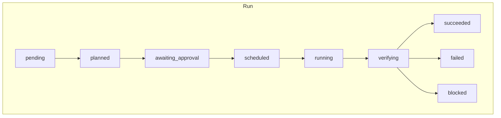
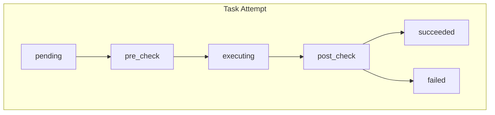

# parallel-harness Plugin CLAUDE.md

> 此文件为 parallel-harness 插件的工程法则。
> 所有 AI Agent 在执行期间必须遵守。
> 版本: 1.5.0 (GA) <!-- x-release-please-version -->

## 核心约束

1. **先建图再调度**: 任何并行执行都必须先构建 TaskGraph，禁止直接开 worker
2. **文件所有权强制**: Worker 只能修改 allowed_paths 内的文件，MergeGuard 在汇总前复检
3. **实现与验证分离**: Worker 不能自我验证，必须经过独立 Gate System
4. **最小上下文原则**: 默认不喂全仓，默认不喂无关历史，超预算自动摘要
5. **成本感知路由**: 模型 tier 由 Model Router 自动决定，不手工硬编码
6. **策略即代码**: 所有约束通过 PolicyEngine 声明式执行，不在业务逻辑中硬编码
7. **审计优先**: 所有关键动作必须通过 AuditTrail 记录，支持回放和追溯
8. **RBAC 治理**: 关键操作需要角色授权，敏感动作需要审批

## 模块架构

```
runtime/
├── engine/          — 统一运行时 Orchestrator (入口 API)
├── orchestrator/    — 任务图、意图分析、复杂度评分、所有权规划
├── scheduler/       — DAG 批次调度
├── models/          — 三层模型路由
├── session/         — 上下文打包
├── verifiers/       — 验证结果 Schema
├── observability/   — 事件总线
├── workers/         — Worker 运行时、重试、降级
├── guards/          — Merge Guard
├── gates/           — Gate System (test/lint/review/security/coverage/policy/doc/release)
├── persistence/     — Session/Run/Audit 持久化
├── integrations/    — PR/CI 集成 (GitHub)
├── governance/      — RBAC、审批、人工介入
├── capabilities/    — Skill/Hook/Instruction 扩展层
└── schemas/         — GA 级数据契约
```

## 四类角色边界

| 角色 | 可做 | 不可做 |
|------|------|--------|
| Planner | 分析意图、构建图、分配所有权 | 直接修改代码 |
| Worker | 在所有权范围内实现任务 | 修改范围外文件、跳过测试 |
| Verifier/Gate | 独立验证结果、阻断不合格输出 | 修改代码、降低标准 |
| Synthesizer | 综合决策、生成报告 | 重新执行任务 |

## 状态机





## 降级策略

1. 冲突率 > 30%：自动降级为半串行
2. Gate 连续 3 次 block：降级为串行 + tier-3
3. 关键路径任务阻塞 > 2 轮：优先串行处理

## 质量硬约束

1. 每个 worker 输出必须经过 Gate System 检查
2. Gate 结论可以阻断流程（blocking gate）
3. 禁止跳过 gate 步骤（除非 admin 角色 override）
4. 所有决策记录到 audit trail
5. 预算耗尽时自动停止，不静默继续

## 测试要求

- 所有新代码必须有对应测试
- 测试覆盖 happy path 和关键 failure path
- 使用 `bun test` 运行测试
- 295+ 测试基线必须保持通过
