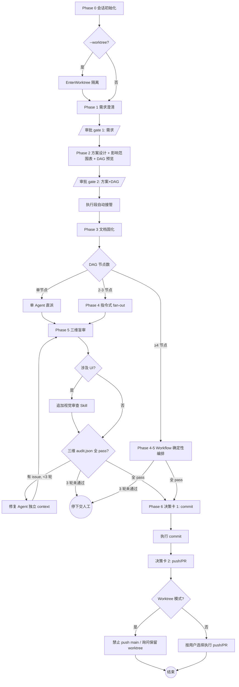

多阶段 SOP 编排器。主 Agent 只做检查/决策/派发/验证（主检子执），实现 Agent 做实际编码，审计 Agent 做独立盲审。任务按 DAG 拓扑序最大化并行。

## 全局护栏

1. **主 Agent 禁止直接写代码** — 只做需求澄清、方案设计、任务拆分、派发、汇总、提交确认
2. **Phase 2 审批前禁止任何代码变更**
3. **影响范围即合约** — 禁止修改影响范围表之外的任何文件
4. **审批点前置收敛** — 人工决策集中在三处关键边界：Phase 1（需求审批）、Phase 2（方案+DAG 审批）、Phase 6（commit + push 双授权）。这三处**必须**调用 `AskUserQuestion`。Phase 2 审批通过后，Phase 3-5 为执行段，**默认自动推进**（见「自动推进与异常暂停协议」），仅异常时暂停。`--interactive` 模式下恢复每阶段检查点
5. **禁止未经确认的 commit/push** — Phase 6 commit 与 push 分别独立授权（两次决策卡）
6. **UI 改动必检** — 涉及 UI 时必须调用 `frontend-design` 或 `ui-ux-pro-max` Skill
7. **完全独立** — 本插件不依赖任何其他插件的基础设施
8. **语言一致性** — 面向用户的内容全部使用 `${LANG}`（默认 `zh-CN`）；Conventional Commits 前缀保持英文；代码标识符/API 名/框架关键字保持原文
9. **Worktree 模式硬约束** — 禁止 commit 仓库共享配置文件；禁止 auto-merge 回 main 或 push 到 origin/main
10. **审计隔离** — 实现 Agent ≠ 审计 Agent；审计 Agent prompt 严禁注入实现 Agent 的对话历史、思考记录、自评结论
11. **分支命名规范** — 工作分支必须符合 `<type>/<slug>` 格式，type 限定为：`feat` / `fix` / `refactor` / `docs` / `chore` / `test` / `perf`；slug 仅含小写字母、数字、连字符；Phase 6 commit 前强制校验，不合规则阻断并提示重命名
12. **Workflow 编排授权** — 本 SKILL 在 Phase 4-5 指示主 Agent 调用 `Workflow` 工具做确定性编排；用户执行 `/slim-task` 即构成对该工具的 opt-in 授权，无需额外询问

## 术语约定

| 术语 | 含义 |
|------|------|
| 实现 Agent | Phase 4 中执行编码的子 Agent |
| 审计 Agent | Phase 5 中做质量检查的独立子 Agent（scope/practice/engineering） |
| 修复 Agent | Phase 5 中修复 issue 的独立子 Agent |

## 阶段总览

| Phase | 目标 | 关键产出 | 阶段转换 |
|-------|------|---------|--------|
| 0 | 会话初始化 | 语言/Worktree 配置 + .gitignore 自检 | 自动 → Phase 1（仅条件性授权 .gitignore/worktree） |
| 1 | 需求澄清 | 精炼需求摘要 | **审批 gate** → Phase 2 |
| 2 | 方案设计 + DAG 预览 | 方案 + 影响范围表 + DAG 拆分 | **审批 gate** → Phase 3 |
| 3 | 文档固化 | 任务文档 | 自动 → Phase 4（文档自审通过即推进） |
| 4 | DAG 并行执行 | 实现 Agent 交付物 | 自动 → Phase 5 |
| 5 | 独立审计盲审 | 三维 audit.json | 自动 → Phase 6（全 pass）/ 自动修复（≤3轮）/ 3轮未过停下交人工 |
| 6 | 提交确认 | commit + 可选 push/PR | **两次独立决策卡** |

> **执行段定义**：Phase 3-5 为「执行段」，默认全自动推进，仅「自动推进与异常暂停协议」定义的异常触发暂停。`--interactive` 模式下每个 Phase 末尾恢复标准检查点。

### 流程决策图



阅读约定：菱形=分支决策，圆角矩形=终止，平行四边形=人工审批 gate。执行段（Phase 3-5）分支判断失败即触发异常暂停，禁止跨级跳转。

## 检查点标准协议

检查点分两类，语义截然不同：

| 类型 | 出现位置 | 行为 |
|------|---------|------|
| **审批 gate** | Phase 1 / Phase 2 / Phase 6 | **必须**调用 `AskUserQuestion`，等待用户显式授权 |
| **自动 transition** | Phase 0 / Phase 3 / Phase 4 / Phase 5 | 默认**不询问**用户，满足推进条件即进入下一阶段；仅异常时暂停 |

> `--interactive` 模式：所有「自动 transition」点降级为审批 gate，恢复每阶段 `AskUserQuestion` 检查点。该模式供用户需要逐阶段把控时显式开启。各阶段检查点形态详见 `references/params-and-interactive.md`。

### 审批 gate 强制规则（Phase 1 / 2 / 6）

- 必须调用 `AskUserQuestion` 工具发起决策卡，禁止用纯文本提问（如"要不要继续"、"看起来如何"、"是否 OK"）替代
- 自由文本回复（如用户答"不错"、"可以"）**不自动视为采纳**，必须再次发起决策卡或显式询问
- 决策卡至少包含 3 个选项：①**采纳进入下阶段**（明确进入 Phase N+1）；②**修改后重审**（回到当前 Phase 调整）；③**终止流程**（结束整个 slim-task 会话）
- 选项标签按 `${LANG}` 配置语言输出

**Phase 6 特殊规则**：必须执行**两次**独立的 `AskUserQuestion` 决策卡 —— ①Commit 决策卡（确认 commit message 与变更范围）；②Push/PR 决策卡（commit 完成后立即发起，确认是否 push 及是否创建 PR）。两次决策卡严禁合并为单次询问。

**历史指令不构成授权**：用户在更早消息中的笼统指令（如"提交推送拉 PR"、"全部弄完"）**不能跳过**任何审批 gate 的 `AskUserQuestion` 调用。每个审批 gate 必须在执行时刻重新获取授权。

---

## 自动推进与异常暂停协议

Phase 2 审批通过后，执行段（Phase 3-5）默认全自动接管，无需用户逐阶段确认。这是「审批即自动接管」的核心。

### 正常路径（全程不询问用户）

以下条件全部满足时，Phase 3 → 4 → 5 → Phase 6 入口连续自动推进：所有操作均为可逆操作（写文件、创建分支，未触及 commit/push）；实际改动文件均在 Phase 2 审批的影响范围表内；无外部系统副作用（无网络写操作、无 commit/push、无生产环境变更）；各阶段产出物完整（文档自审通过、审计 json 齐全）。

### 异常暂停触发条件（任一满足立即暂停，向用户报告）

执行段出现以下任一信号即暂停，把控制权交回主线程发起 `AskUserQuestion`。每条暂停都必须展示足够用户决策的信息 + 明确的可选动作，禁止只说"出错了"。**完整的展示内容、用户可选动作、自动回滚机制见 `references/exception-pause.md`**，主 Agent 触发暂停时据此构造决策卡。

| # | 触发条件 |
|---|---------|
| 1 | 影响范围表外的文件被修改 |
| 2 | Phase 5 修复循环触达 3 轮仍有未关闭 issue |
| 3 | 子 Agent 返回失败/空结果，或 Workflow 派发的 agent 返回 null |
| 4 | 子 Agent 升级回传（遇多条合法路径无法自治） |
| 5 | 文档自审失败且自动修正后仍不通过 |
| 6 | 三维 audit.json 任一缺失或为空对象（违反盲审完整性，见 Red Flags） |
| 7 | 用户主动中断（见下方主动暂停入口） |

> 暂停≠终止：暂停后用户可选择修复方向继续，或终止。异常暂停**不绕过**任何质量约束。异常 #1/#3/#5 支持自动回滚到 Phase 2 审批态（详见 reference）。

### 执行段进度透明

执行段虽自动推进，但**禁止静默**——每个关键节点必须向用户输出一行进度（Workflow 模式用 `log()`，指令式模式用普通文本）：Phase 3 文档自审通过→报「✓ 文档固化完成，进入执行」；Phase 4 每层启动/完成→报「Layer N：派发 X 个任务 / 完成 Y/X」；Phase 5 每轮审计→报「审计第 R/3 轮：scope/practice/engineering」+ 结果摘要；进入 Phase 6 前→报「✓ 三维审计通过，准备提交确认」。

### 用户主动暂停入口

执行段进行中，用户随时可中断（`Esc` / `TaskStop` 后台任务 / 直接发话叫停）。主 Agent 感知中断后**不得无视继续**，立即进入异常 #7：保存当前 checkpoint，展示进度，发起恢复决策卡。禁止"等这一步跑完再说"式拖延。

### Checkpoint 落盘与恢复

执行段是长流程，须防 context 压缩/会话断开/崩溃导致全部重跑。

- **落盘时机**：每个 Phase 转换、每层 DAG 完成、每轮修复结束、每次异常暂停前
- **落盘内容**：见 `references/checkpoint-schema.md`（phase / dag-progress / fix-round / files-modified / pending-decision）
- **落盘路径**：`.claude/slim-task/checkpoints/{task-slug}-{phase}.json`（覆盖写最新态）
- **恢复逻辑**：会话重入时先扫该目录，存在 checkpoint 则向用户展示「检测到中断于 Phase N，从断点恢复 / 重新开始」决策卡；恢复时跳过已完成层，重入未完成的修复循环（复用已落盘 round 计数，不清零）
- **清理**：Phase 6 commit 成功后删除本 task 的 checkpoint 目录

---

## Phase 0: 会话初始化

1. **参数解析**：从 args 提取 `--lang` / `--worktree` / `--base` / `--interactive`；各参数合法值域与非法处理见 `references/params-and-interactive.md`
2. **语言决策**（优先级）：命令行 `--lang` > 仓库 `.claude/slim-task.json` 的 `language` 字段 > 默认 `zh-CN`；首次确定后写入 `.claude/slim-task.json`（不存在则创建）持久化为后续默认值
3. **`.gitignore` 自检**（首次运行必检）：检查仓库 `.gitignore` 是否含 `.claude/slim-task.json` 与 `.claude/slim-task/`（运行时配置 + Phase 5 审计落盘）；任一缺失则经 `AskUserQuestion` 决策卡确认后追加（禁止静默写入），用户拒绝则继续但提示后续 commit 须人工排除这些路径；仓库无 `.gitignore` 时提示用户在根创建并加入上述两条
4. **Worktree 决策**：`--worktree` 未出现则跳过保持当前工作树；出现则：a. `AskUserQuestion` 确认基线分支（默认 `head` 当前分支；可选 `origin/main` 或自定义）→ b. 调用 `EnterWorktree(name=slim-<task-slug>-<timestamp>)` → c. 检查 `.gitignore` 是否含 `.claude/worktrees/`，缺失则比照 step 3 流程补齐
5. **记录 `${BASE_REF}`**：当前工作分支名（非 worktree 模式）或 `--base` 指定分支（worktree 模式），写入 `.claude/slim-task.json` 的 `baseRef` 字段，供 Phase 6 push 决策卡使用
6. **分支命名前置校验**：检查当前工作分支名是否匹配 `^(feat|fix|refactor|docs|chore|test|perf)/[a-z0-9-]+$`；不合规则**此刻**（代码未写、改名零成本）通过 `AskUserQuestion` 提示 `git branch -m <new-name>`，阻断后续直到合规。前置于此避免 Phase 6 代码写完才改名引发 rebase 冲突
7. **输出初始化摘要**：`LANG=... | WORKTREE=<path 或 none> | BASE_REF=<branch> | GITIGNORE=<ok 或 patched/skipped>`

**阶段转换**：自动 transition → Phase 1。Phase 0 无独立审批 gate（`.gitignore` 追加与 worktree 基线分支已在 step 3/4 内通过 `AskUserQuestion` 做条件性授权）。`--interactive` 模式下追加标准检查点「采纳 → Phase 1 / 修改配置 / 终止」。

---

## Phase 1: 需求澄清

**原则**：一次一问、多选优先、迭代推进、明确退出。

**Step 1 — 维度扫描**：解析用户输入的任务描述，识别以下维度的缺失/歧义：

| 优先级 | 维度 | 典型问题 |
|--------|------|---------|
| P0 | 目标/意图 | 要实现什么、为什么做 |
| P1 | 范围/边界 | 包含什么、排除什么 |
| P2 | 验收标准 | 怎样算完成、成功指标 |
| P3 | 技术约束 | 性能要求、兼容性、依赖限制 |
| P4 | 隐含假设 | 需要用户确认的推断 |

**Step 2 — 迭代澄清循环**（问到清楚为止）：

1. 若维度扫描结果为 0 个歧义点 → 跳过循环，直接到 Step 3
2. 按优先级选取最高未解决维度，构造**单一问题**：优先提供 2-4 个具体多选选项 + 1 个"其他（请补充）"；每轮最后一个选项固定为「已足够清晰，无需继续」；经 `AskUserQuestion` 发送（选项按 `${LANG}`）
3. 吸收回答 → 更新维度状态；若回答引入新歧义，追加到待解决列表
4. **退出判定**（满足任一即退出循环）：所有 P0-P2 维度已有明确答案 / 用户选「已足够清晰，无需继续」/ 澄清已达 5 轮（防无限打转，强制转 Phase 2 并提示「已澄清 5 轮，进入方案设计；如仍有歧义可在 Phase 2 审批时要求回 Phase 1」）
5. 未退出 → 回到步骤 2

**Step 3 — 输出**：精炼需求摘要（bulleted list，按 `${LANG}`），包含关键假设列表。

**审批 gate**：执行审批 gate 强制规则，选项为「采纳 → Phase 2 / 补充澄清（重入循环）/ 终止」。用户选「补充澄清」时重入 Step 2 循环继续迭代。这是三处关键人工边界之一，无论 `--interactive` 与否都必须执行。

---

## Phase 2: 方案设计 + DAG 预览

### 2a 最佳实践调研

- **优先使用 AI 内置知识**推荐最佳实践、设计模式、已知陷阱
- **仅当内置知识可能过时时**（新版本 API、新发布的库、近期安全公告）使用 `WebSearch` 补充

### 2b 代码库扫描

- 派发 `Explore` 子 Agent（`subagent_type: Explore`）扫描代码库，查找相关代码、可复用工具函数、现有设计模式、潜在冲突点；可同时派发多个 Explore Agent 扫描不同维度

### 2c 方案输出

向用户展示（按 `${LANG}`）：

1. **方案描述**（1-3 段，含推荐理由和替代方案对比）
2. **影响范围表**（必须）：

| 操作 | 文件路径 | 理由 |
|------|---------|------|
| 修改 | `src/xxx.ts` | 具体原因 |
| 新增 | `src/yyy.ts` | 具体原因 |
| 不可触碰 | `src/zzz.ts` | 超出范围 |

1. **破坏性变更评估**（必须）：逐项判定是否破坏并附说明 —— 公开 API/接口签名、数据库 schema/数据格式、配置文件/环境变量、依赖版本、用户可见行为
1. **业务影响分析**：对现有功能的影响等级（无 / 低 / 中 / 高）+ 受影响的上下游模块/调用方
1. **回滚方案**：上线后如何安全回退（`git revert` 是否充分 / 是否需数据迁移回退脚本）
1. **风险与权衡**

### 2d DAG 拆分预览

在审批前先做 DAG 拆分，使「批准方案」与「批准任务拆分」合并为一次决策：

1. 将方案分解为原子子任务
2. 分析依赖关系，构建 **DAG（有向无环图）**
3. 识别 DAG 层级：**Layer 0**（无前置依赖，可立即并行）、**Layer 1**（依赖 Layer 0）、**Layer N**（依此类推）
4. 每个子任务必须包含：**Objective**（要完成什么）、**File boundary**（允许修改的文件列表，必须是影响范围表子集）、**Dependencies**（前置子任务 ID）、**Output format**（完成标准）
5. 向用户展示 DAG 层级结构 + 节点清单（按 `${LANG}`），标注预计执行模式：节点数=1→单 Agent 直派；2-3→指令式 fan-out；≥4→Workflow 确定性编排

**审批 gate**：执行审批 gate 强制规则，选项为「批准方案+DAG → 执行段 / 修改方案或拆分 / 终止」。这是三处关键人工边界之一，无论 `--interactive` 与否都必须执行。**此 gate 通过后，Phase 3-5 执行段自动接管，不再逐阶段询问用户。**

---

## Phase 3: 文档固化

> DAG 拆分已在 Phase 2d 完成并随方案一并审批。Phase 3 仅做文档固化，是执行段的第一步。

### 3a 文档固化

在项目中写入 `docs/tasks/{YYYY-MM-DD}/{task-slug}.{lang}.md`，内容包含：Phase 1 的需求摘要；Phase 2 的方案设计 + 影响范围表 + DAG 拆分；执行时间戳 + Worktree 路径（若启用）。

**文档自审**（写入后立即执行，通过则继续，未通过则修正后再继续）：

| # | 检查项 | 判定标准 |
|---|--------|---------|
| 1 | 无 placeholder | 不存在 `TODO`、`TBD`、`???`、`<待补充>` 等占位符 |
| 2 | 无内部矛盾 | 需求摘要与方案设计不冲突；影响范围表与方案描述一致 |
| 3 | 无歧义表述 | 每条需求可被不同读者产生相同理解 |
| 4 | 无遗漏 | Phase 1 所有已确认维度在文档中均有对应描述 |

**阶段转换**：自动 transition → Phase 4。文档自审通过即推进，**不询问用户**。自审修正后仍不通过时，按「自动推进与异常暂停协议」异常 #5 暂停。`--interactive` 模式下追加标准检查点「采纳 → Phase 4 / 修改文档 / 终止」。

---

## Phase 4: DAG 最大化并行执行

### 执行模式分流（按 DAG 节点数）

Phase 2d 已确定执行模式。三档分流：

| 节点数 | 模式 | 机制 |
|--------|------|------|
| 1 | 单 Agent 直派 | 主 Agent 派发单个实现 Agent（**非主 Agent 自己写代码**，仍遵守护栏 1）；复用下方「指令式 fan-out 协议」，退化为单层单 Agent |
| 2-3 | 指令式 fan-out | 主 Agent 用 `Agent` 工具逐层并行派发（见下方「指令式 fan-out 协议」） |
| ≥4 | Workflow 确定性编排 | 主 Agent 调用 `Workflow` 工具，Phase 4-5 合并为一段确定性脚本（见下方「Workflow 编排协议」） |

> 选择阈值的根因：Workflow 拉起开销与 token 成本较高，小任务用指令式 fan-out 更省更透明；≥4 节点时确定性编排（自动 barrier、修复轮次硬计数、三维审计强制并行）的收益压过成本。

### 指令式 fan-out 协议（1-3 节点）

1. **Layer 0 启动**：所有无依赖任务同时派发（`Agent` 工具，`run_in_background: true`）；1 节点时该层仅一个 Agent。每个实现 Agent 的 prompt 按 `references/impl-agent-prompt.md` 的结构化模板（Objective / File Boundary / Task Boundary / Language / Output JSON）填充
2. **Barrier 硬约束**：本层每个 Agent 必须用 `TaskOutput(task_id, block=true)` 逐一等待，**全部**返回后才派发 Layer N+1；禁止收到任一通知就推进。设最大等待（建议 3600s），超时按异常 #3 处理
3. **文件边界校验**：每个 Agent 汇报 `modified_files` 后，主 Agent 核对其 ⊆ 影响范围表；越界即按异常 #1 处理（不等到 Phase 5 才发现）
4. **失败处理**：任一 Agent 报告失败/超时 → 停止后续层派发，按异常 #3 处理
5. **升级回传**：子 Agent 遇多条合法路径无法自治 → 按异常 #4，由主 Agent 据回传选项发起 `AskUserQuestion`
6. **主 Agent 职责**：监控完成通知，逐层落盘 checkpoint，汇总执行结果

**阶段转换（指令式/单 Agent 模式）**：自动 transition → Phase 5。本层全部成功即推进，**不询问用户**；失败按异常暂停 #3。`--interactive` 模式下追加标准检查点「进入 Phase 5 审计 / 回退修复 / 终止」。

### Workflow 编排协议（≥4 节点）

主 Agent 调用 `Workflow` 工具，将 Phase 4（DAG 并行执行）与 Phase 5（三维盲审 + 修复循环）合并为一段确定性脚本。控制流（逐层 barrier、修复轮次计数、三维审计并行）由 JS 引擎保证，单个 `agent()` 内部仍是模型驱动。

完整的**输入契约 + 脚本骨架 + 输出契约（status → 主 Agent 动作映射）**见 `references/workflow-orchestration.md`，主 Agent 进入 ≥4 节点分支时读取并据此生成脚本。要点：脚本的 `parallel([scope, practice, engineering])` 三路缺一即违反护栏 10，`while (round < 3)` 上限禁止改大；每个 `agent()` 都是隔离 context，天然满足盲审隔离。Workflow 返回后，主 Agent 按输出契约表把 `status` 映射到对应异常暂停（见「自动推进与异常暂停协议」）或进入 Phase 6。

**阶段转换**：Workflow 模式下 Phase 4-5 已合并，主 Agent 直接处理 Workflow 返回值，按输出契约表分流（`pass` → Phase 6；其余 → 对应异常暂停）。`--interactive` 模式下，Workflow 返回 `pass` 后追加标准检查点「进入 Phase 6 / 派修复 Agent / 终止」。

---

## Phase 5: 质量检查（独立审计 Agent 盲审）

### 核心反作弊原则

写实现的 Agent ≠ 审实现的 Agent。主 Agent 只做派发与汇总，**不做实质审查**。

### Rationalizations 反例表

主 Agent 与审计 Agent 在执行 Phase 5 时常见的"偷懒理由"清单。**任何与下表语义相近的内部独白都视为绕过，必须立即停下并改走右列动作**。表外但同类的理由同样视为绕过。

| 偷懒理由（Rationalization） | 真实含义 | 强制动作 |
|---|---|---|
| "用户上次已授权 commit，本次延用" | 把历史授权当本次授权 | 必须重新调 `AskUserQuestion`，历史消息不构成本次授权 |
| "改动很小 / diff 不到 50 行，跳过 Phase 5" | 用规模豁免流程 | 任何代码改动都进 Phase 5，size 不是豁免条件 |
| "我大致看了 diff，应该没问题" | 用主观判断替代独立审计 | 必须由独立子 Agent 重读 + 输出 `audit.json` |
| "lint/test 在 Phase 4 已经跑过了" | 把过往验证当本次验证 | engineering-auditor 必须重新执行 lint/build/typecheck，禁止缓存或复用历史输出 |
| "审计 Agent 报了 issue 但看起来无关紧要" | 主观降级 issue 严重度 | issue 一律进入修复循环，严重度仅决定优先级，不决定是否处理 |
| "修复 3 轮还有 issue，剩下的留给用户" | 用上限规避根因分析 | 触达 3 轮上限必须 **停下** 让用户人工介入，禁止 silent skip |
| "审计 Agent 可以共用 Phase 4 的 context 节省 token" | 破坏盲审隔离 | 审计 Agent 必须 `general-purpose` 独立派发，不复用任何 Agent ID 或 prompt |
| "范围表里没列这个文件但顺手改了" | 用便利性绕过影响范围合约 | 视为越界，scope-audit 必须报 issue；如确需扩展须回到 Phase 2 重审范围表 |
| "我自己读一遍代码当 review，不派审计 Agent 了" | 主 Agent 自审 | 主 Agent 严禁实质审查；必须独立派发三维 auditor |
| "用户没问 audit 报告，跳过展示直接进 Phase 6" | 用沉默替代质量关 | 必须按 `${LANG}` 展示统一审计报告；全 pass 才自动进 Phase 6 |
| "Worktree 模式所以审计可以更宽松" | 用隔离强度换取流程豁免 | Worktree 不改变 Phase 5 任何强度要求 |
| "审计 Agent 自己也说 issues=[]，那应该没问题" | 用单一审计源代替三维交叉 | 三维 audit.json 必须独立产出，缺一不可 |
| "执行段自动推进了，质量门也可以一起跳过" | 把「免确认」误读为「免质量」 | 自动 transition 仅免去用户**确认动作**，三维盲审/影响范围/修复循环等质量约束全部不变 |
| "Workflow 脚本里少派一个 auditor 也能跑" | 篡改确定性脚本绕过三维 | Workflow 脚本的 `parallel([scope,practice,engineering])` 三路缺一即违反护栏 10，禁止删减 |

### Red Flags - STOP 清单

以下任一信号一旦出现，**立即停止当前动作**，回到全局护栏重新校验：

1. 主 Agent 正在直接 `Edit` / `Write` 业务代码文件（违反全局护栏第 1 条）
2. Phase 5 三维 audit.json 中有任一文件不存在或为空对象
3. audit.json `issues=[]` 但 `git diff` 行数 > 200 且未附执行日志
4. 任一审计 Agent 的 prompt 中出现 Phase 4 实现 Agent 的 ID、对话片段、自评摘要
5. 修复循环计数 ≥ 3 且仍存在未关闭 issue
6. 范围表外的文件出现在 `git diff` 中且 scope-audit 未报 issue
7. Phase 6 即将 commit 但未先展示 Phase 5 统一审计报告、或审计未全 pass 即推进
8. 出现"基于历史指令"、"上次已确认"、"用户应该是想要"等推断式授权语言
9. Workflow 脚本被改成少于三路 auditor、或 `while` 上限被改大于 3

### 隔离硬约束

- 审计/修复 Agent 一律 `general-purpose` 独立派发，**不复用** Phase 4 任何 Agent ID，prompt **严禁**注入实现 Agent 的对话历史/思考/自评（同护栏 10）
- **禁止向审计 Agent 暴露的信息类型**（逐项排除，构造 prompt 时核对）：① Phase 4 实现 Agent 的对话/思考/自评；② 本地 debug/temp 文件与编译产物；③ commit message / 文件 rename 历史；④ 未消毒的 diff 上下文
- **Diff 消毒**：注入审计的 diff 必须用 `git diff --unified=0 --no-ext-diff --ignore-all-space -- <影响范围内文件>`，仅含改动行号+内容，剥离上下文与无关痕迹（消毒命令详见 `references/audit-diff-sanitize.md`）
- **prompt 构造规范**：三个 auditor 的 prompt 用同一模板填充，参数白名单 `{任务描述, 影响范围表, 清洁diff, 项目规范引用}`，黑名单永久排除 `{实现Agent ID, 实现prompt, 实现对话}`；禁止手工字符串拼接夹带黑名单项
- 审计产物落盘：`.claude/slim-task/audits/{task-slug}/`

### 三维审计派发

三个 auditor 独立并行派发（缺一不可），各自输出 JSON 落盘到审计目录：

| 维度 | Agent | prompt 注入 | 职责 | 输出 |
|------|-------|------------|------|------|
| 5a 范围 | scope-auditor | 任务描述 + 影响范围表（Phase 2 审批版）+ 清洁 diff（消毒后） | 改动文件是否越界 + 表中预期改动是否发生 | `scope-audit.json`（越界/遗漏文件列表） |
| 5b 实践 | practice-auditor | 任务描述 + Phase 2 方案 + 清洁 diff + 规范引用（`CLAUDE.md` / `.claude/rules/`） | 对照方案与规范评分，标记偏离违规 | `practice-audit.json` |
| 5c 工程 | engineering-auditor | 项目根 + 影响范围内文件 + lint/build/typecheck 命令（从 `CLAUDE.md` / `Makefile` 发现） | 执行 lint/build/typecheck 捕获失败 | `engineering-audit.json`（失败命令+日志） |

**5d UI 检查**（涉及 UI 改动时）：提示用户调用 `frontend-design` 或 `ui-ux-pro-max` Skill 做视觉一致性审查。

### 汇总与修复流程

> Workflow 模式（≥4 节点）下，三维派发 + 修复循环已由 Workflow 脚本确定性执行（`parallel()` 强制三路并行、`while(round<3)` 硬计数）；主 Agent 仅消费 Workflow 返回值，跳过本小节手动循环，直接执行下方阶段转换。
>
> 指令式 fan-out 模式（2-3 节点）与内联模式（1 节点）下，主 Agent 手动执行以下循环：

1. 主 Agent 读取 3 份 `audit.json`
2. 向用户展示统一审计报告（按 `${LANG}`）
3. 若存在 issue：派发修复 Agent（独立 context，不复用 Phase 4 Agent ID）修复
   - **继承关系**：fixer-round-N 在前轮改动基础上修复（工作区已含前轮改动），但 prompt **仅注入当前 issue 列表 JSON**，不注入前轮审计报告（防泄漏审计思路）
   - **计数规范**：修复 Agent 返回 null 也算一轮，round 计数不受网络延迟影响；派发前先落盘 checkpoint 记录 round 值
4. 修复后再次派发 5a/5b/5c 审计 Agent 复核（同样独立 context、同样消毒 diff）
5. **修复循环上限 3 次**，超过则按异常暂停 #2 停下让用户人工介入

**阶段转换**：条件化自动 transition。
- 三维 audit 全 pass → 展示审计摘要，自动进入 Phase 6，**不询问用户**
- 存在 issue 且修复轮次 < 3 → 自动进入修复循环（指令式）或由 Workflow 内部处理（Workflow 模式），**不询问用户**
- 修复触达 3 轮仍有 issue → 异常暂停 #2，交人工介入
- `--interactive` 模式下追加标准检查点「批准 → Phase 6 / 派修复 Agent / 终止」

---

## Phase 6: 提交确认

### 核心铁律

- 历史笼统指令**不构成本阶段授权**，必须重新发起 `AskUserQuestion`
- 严禁主 Agent 自行执行 `git commit` / `git push` / `gh pr create` 后追溯告知

### 执行步骤

1. **分支名复核**：分支命名已在 Phase 0「分支命名前置校验」步完成。此处仅复核当前分支名仍匹配 `^(feat|fix|refactor|docs|chore|test|perf)/[a-z0-9-]+$`；若执行中被改动致不合规，`AskUserQuestion` 提示重命名后再继续
2. **BASE_REF 再验证**：`git branch -r` 确认 `${BASE_REF}` 分支仍存在（防 Phase 0 后被删/改名）；不存在则 `AskUserQuestion` 让用户重选（候选：本地分支 / `origin/main` / 当前 HEAD），并回写 `.claude/slim-task.json`
3. **副产物 staging**（`git add` 精确添加，禁止 `git add .` / `-A`）：`docs/tasks/{YYYY-MM-DD}/{task-slug}.*`（Phase 3 固化文档）；`.claude/slim-task/audits/{task-slug}/*.json`（三维审计证据，质量证明，必须随代码同步 commit，禁止遗漏）；`.gitignore`（若 Phase 0 追加了忽略规则）
4. **产物黑名单检查**：扫描 staged 区域，若命中运行时产物（`.claude/slim-task/checkpoints/`、`.claude/worktrees/`）或仓库共享配置（`release-please-config.json` / `.release-please-manifest.json` / `.claude-plugin/marketplace.json`，worktree 模式必查）→ 提示 `git restore --staged <path>` 移出；用户坚持则拒绝 commit
5. **Staging 校验**：`git diff --cached --name-only` 展示将提交的完整文件清单，连同 diff 摘要 + 提议的 Conventional Commits message 一并展示（按 `${LANG}`）
6. **第一次 `AskUserQuestion`（Commit 决策卡）**：「确认 commit」/「修改 message 后再 commit」/「取消回 Phase 5」。选「修改 message」仅改 message 不重审；但若用户**同时改了代码**，必须先清理旧审计报告并回 Phase 5 重新审计（防代码与审计证据不同步）
7. commit 后**立即第二次 `AskUserQuestion`（Push/PR 决策卡）**：「push 到 origin/<current-branch> + 开 PR」/「push 到 origin/<current-branch>（不开 PR）」/「push 到 origin/${BASE_REF}（仅当 BASE_REF ≠ main/master）」/「保留本地不 push」；worktree 模式下「push 到 main/master」**永远禁用**，不出现在决策卡
8. 按决策执行，完成后汇报；**清理本 task 的 checkpoint 目录**
9. **Worktree 收尾**：`AskUserQuestion` 询问是否 `ExitWorktree(action=keep)` 保留。若保留，展示：worktree 绝对路径 + 分支名 + 合并指引 + 冲突回退方法：

   ```bash
   git fetch && git checkout main && git merge worktree-slim-<slug>
   # 冲突时：git merge --abort 回退，或手工解决后 git commit
   ```

10. **用户拒绝 commit**：列出手动调整事项，保留 checkpoint，结束流程
