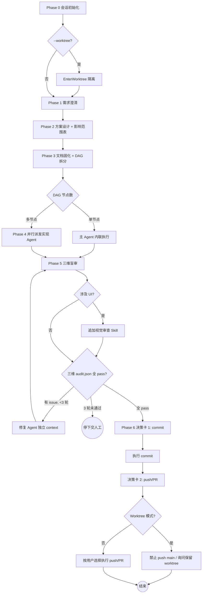

多阶段 SOP 编排器。主 Agent 只做检查/决策/派发/验证（主检子执），实现 Agent 做实际编码，审计 Agent 做独立盲审。任务按 DAG 拓扑序最大化并行。

## 全局护栏

1. **主 Agent 禁止直接写代码** — 只做需求澄清、方案设计、任务拆分、派发、汇总、提交确认
2. **Phase 2 审批前禁止任何代码变更**
3. **影响范围即合约** — 禁止修改影响范围表之外的任何文件
4. **每阶段必须有用户检查点** — 执行下方「检查点标准协议」，强制调用 `AskUserQuestion`，禁止纯文本提问替代
5. **禁止未经确认的 commit/push** — Phase 6 commit 与 push 分别独立授权（两次决策卡）
6. **UI 改动必检** — 涉及 UI 时必须调用 `frontend-design` 或 `ui-ux-pro-max` Skill
7. **完全独立** — 本插件不依赖任何其他插件的基础设施
8. **语言一致性** — 面向用户的内容全部使用 `${LANG}`（默认 `zh-CN`）；Conventional Commits 前缀保持英文；代码标识符/API 名/框架关键字保持原文
9. **Worktree 模式硬约束** — 禁止 commit 仓库共享配置文件；禁止 auto-merge 回 main 或 push 到 origin/main
10. **审计隔离** — 实现 Agent ≠ 审计 Agent；审计 Agent prompt 严禁注入实现 Agent 的对话历史、思考记录、自评结论
11. **分支命名规范** — 工作分支必须符合 `<type>/<slug>` 格式，type 限定为：`feat` / `fix` / `refactor` / `docs` / `chore` / `test` / `perf`；slug 仅含小写字母、数字、连字符；Phase 6 commit 前强制校验，不合规则阻断并提示重命名

## 术语约定

| 术语 | 含义 |
|------|------|
| 实现 Agent | Phase 4 中执行编码的子 Agent |
| 审计 Agent | Phase 5 中做质量检查的独立子 Agent（scope/practice/engineering） |
| 修复 Agent | Phase 5 中修复 issue 的独立子 Agent |

## 阶段总览

| Phase | 目标 | 关键产出 | 检查点 |
|-------|------|---------|--------|
| 0 | 会话初始化 | 语言/Worktree 配置 + .gitignore 自检 | 标准检查点 → Phase 1 |
| 1 | 需求澄清 | 精炼需求摘要 | 标准检查点 → Phase 2 |
| 2 | 方案设计 | 方案 + 影响范围表 | 标准检查点 → Phase 3 |
| 3 | 文档固化 + DAG 拆分 | 任务文档 + DAG 图 | 标准检查点 → Phase 4 |
| 4 | DAG 并行执行 | 实现 Agent 交付物 | 标准检查点 → Phase 5 |
| 5 | 独立审计盲审 | 三维 audit.json | 标准检查点 → Phase 6 |
| 6 | 提交确认 | commit + 可选 push/PR | 两次独立决策卡 |

### 流程决策图



阅读约定：菱形为分支决策，圆角矩形为终止状态。任何分支判断失败时回退到上一个检查点，禁止跨级跳转。

## 检查点标准协议

每个 Phase 结束时**必须**执行以下检查点流程，无例外。

**强制工具调用**：

- 必须调用 `AskUserQuestion` 工具发起决策卡
- 禁止用纯文本提问（如"要不要继续"、"看起来如何"、"是否 OK"）作为检查点替代
- 自由文本回复（如用户答"不错"、"可以"）**不自动视为采纳**，必须再次发起决策卡或显式询问

**决策卡标准格式**：每个检查点决策卡至少包含 3 个选项：

1. **采纳进入下阶段** — 明确进入 Phase N+1
2. **修改后重审** — 回到当前 Phase 进行调整
3. **终止流程** — 结束整个 slim-task 会话

选项标签按 `${LANG}` 配置语言输出。

**Phase 6 特殊规则**：必须执行**两次**独立的 `AskUserQuestion` 决策卡：

1. Commit 决策卡 — 确认 commit message 与变更范围
2. Push/PR 决策卡 — commit 完成后立即发起，确认是否 push 及是否创建 PR

两次决策卡严禁合并为单次询问。

**历史指令不构成授权**：用户在更早消息中的笼统指令（如"提交推送拉 PR"、"全部弄完"）**不能跳过**任何检查点的 `AskUserQuestion` 调用。每个检查点必须在执行时刻重新获取授权。

---

## Phase 0: 会话初始化

1. **参数解析**：从 args 提取 `--lang` / `--worktree` / `--base`
2. **语言决策**（优先级）：
   - 命令行 `--lang` > 仓库 `.claude/slim-task.json` 的 `language` 字段 > 默认 `zh-CN`
   - 首次确定后写入 `.claude/slim-task.json`（若不存在则创建）持久化为后续默认值
3. **`.gitignore` 自检**（首次运行必检）：
   - 检查仓库 `.gitignore` 是否包含 `.claude/slim-task.json` 与 `.claude/slim-task/`（运行时配置 + Phase 5 审计落盘）
   - 任一缺失：通过 `AskUserQuestion` 决策卡确认后追加，禁止静默写入；用户拒绝则继续但提示后续 commit 必须人工排除这些路径
   - 仓库无 `.gitignore` 时：提示用户在仓库根创建并加入上述两条
4. **Worktree 决策**：
   - 若 `--worktree` 未出现：跳过，保持当前工作树
   - 若 `--worktree` 出现：
     a. `AskUserQuestion` 确认基线分支（默认 `head` 当前分支；可选 `origin/main` 或自定义）
     b. 调用 `EnterWorktree(name=slim-<task-slug>-<timestamp>)`
     c. 检查 `.gitignore` 是否包含 `.claude/worktrees/`，缺失则比照 step 3 流程补齐
5. **记录 `${BASE_REF}`**：当前工作分支名（非 worktree 模式）或 `--base` 指定分支（worktree 模式），写入 `.claude/slim-task.json` 的 `baseRef` 字段，供 Phase 6 push 决策卡使用
6. **输出初始化摘要**：`LANG=... | WORKTREE=<path 或 none> | BASE_REF=<branch> | GITIGNORE=<ok 或 patched/skipped>`

**检查点**：执行检查点标准协议，选项为「采纳 → Phase 1 / 修改配置 / 终止」。

---

## Phase 1: 需求澄清

1. 解析用户输入的任务描述
2. 识别：歧义点、缺失上下文、隐含假设、边界条件、验收标准
3. 使用 `AskUserQuestion` 向用户提出结构化澄清问题（选项按 `${LANG}`）
4. 若任务已足够清晰，列出关键假设请用户确认
5. **输出**：精炼需求摘要（bulleted list，按 `${LANG}`）

**检查点**：执行检查点标准协议，选项为「采纳 → Phase 2 / 补充澄清 / 终止」。

---

## Phase 2: 方案设计

### 2a 最佳实践调研

- **优先使用 AI 内置知识**推荐最佳实践、设计模式、已知陷阱
- **仅当内置知识可能过时时**（新版本 API、新发布的库、近期安全公告）使用 `WebSearch` 补充

### 2b 代码库扫描

- 派发 `Explore` 子 Agent（`subagent_type: Explore`）扫描代码库
- 查找：相关代码、可复用的工具函数、现有设计模式、潜在冲突点
- 可同时派发多个 Explore Agent 扫描不同维度

### 2c 方案输出

向用户展示（按 `${LANG}`）：

1. **方案描述**（1-3 段，含推荐理由和替代方案对比）
2. **影响范围表**（必须）：

| 操作 | 文件路径 | 理由 |
|------|---------|------|
| 修改 | `src/xxx.ts` | 具体原因 |
| 新增 | `src/yyy.ts` | 具体原因 |
| 不可触碰 | `src/zzz.ts` | 超出范围 |

3. **破坏性变更评估**（必须）：

| 维度 | 是否破坏性 | 说明 |
|------|-----------|------|
| 公开 API / 接口签名 | 是/否 | 具体影响 |
| 数据库 schema / 数据格式 | 是/否 | 迁移方案 |
| 配置文件 / 环境变量 | 是/否 | 兼容策略 |
| 依赖版本 | 是/否 | 升级路径 |
| 用户可见行为 | 是/否 | 影响范围 |

4. **业务影响分析**：对现有功能的影响等级（无影响 / 低 / 中 / 高）+ 受影响的上下游模块/调用方
5. **回滚方案**：若上线后发现问题，如何安全回退（`git revert` 是否充分 / 是否需要数据迁移回退脚本）
6. **风险与权衡**

**检查点**：执行检查点标准协议，选项为「批准方案 → Phase 3 / 修改方案 / 终止」。

---

## Phase 3: 文档固化 + DAG 任务拆分

### 3a 文档固化

在项目中写入 `docs/tasks/{YYYY-MM-DD}/{task-slug}.{lang}.md`，内容包含：

- Phase 1 的需求摘要
- Phase 2 的方案设计 + 影响范围表
- 执行时间戳 + Worktree 路径（若启用）

### 3b DAG 任务拆分

1. 将方案分解为原子子任务
2. 分析依赖关系，构建 **DAG（有向无环图）**
3. 识别 DAG 层级：
   - **Layer 0**：无前置依赖（可立即并行）
   - **Layer 1**：依赖 Layer 0
   - **Layer N**：依此类推
4. 每个子任务必须包含：
   - **Objective**：具体要完成什么
   - **File boundary**：允许修改的文件列表（源自影响范围表）
   - **Dependencies**：前置子任务 ID
   - **Output format**：完成标准

**检查点**：执行检查点标准协议，选项为「采纳 DAG → Phase 4 / 修改拆分 / 终止」。

---

## Phase 4: DAG 最大化并行执行

### 执行协议

1. **Layer 0 启动**：所有无依赖任务同时派发（`Agent` 工具，`run_in_background: true`）
2. **逐层推进**：Layer N 全部完成后，自动派发 Layer N+1
3. **无并行上限**：同层任务全部同时派发
4. **单任务优化**：若 DAG 仅有 1 个节点，主 Agent 直接内联执行
5. **主 Agent 职责**：监控完成通知，汇总执行结果

### 子 Agent Prompt 模板

每个实现 Agent 的 prompt 必须包含以下结构化字段：

```
## Objective
{子任务目标}

## File Boundary
仅允许修改以下文件：{文件列表}
严禁修改此范围外的任何文件。

## Task Boundary
不要做超出目标范围的额外工作（不重构无关代码、不添加不需要的功能）。

## Language
Respond in ${LANG}. Code identifiers and English-only conventions
(commit prefix, API names, framework keywords) stay original.

## Output
完成后汇报：修改了哪些文件、做了什么变更、是否有遗留问题。
```

填写说明：

- `{子任务目标}` ← DAG 节点的 Objective 字段
- `{文件列表}` ← DAG 节点的 File boundary 字段（必须是影响范围表的子集）
- `${LANG}` ← Phase 0 初始化的语言配置

**检查点**：执行检查点标准协议，选项为「进入 Phase 5 审计 / 回退修复 / 终止」。

---

## Phase 5: 质量检查（独立审计 Agent 盲审）

### 核心反作弊原则

写实现的 Agent ≠ 审实现的 Agent。主 Agent 只做派发与汇总，**不做实质审查**。

### Rationalizations 反例表

主 Agent 与审计 Agent 在执行 Phase 5 时常见的"偷懒理由"清单。**任何与下表语义相近的内部独白都视为绕过，必须立即停下并改走右列动作**。表外但同类的理由同样视为绕过。

| 偷懒理由（Rationalization） | 真实含义 | 强制动作 |
|---|---|---|
| "用户上次已授权 commit，本次延用" | 把历史授权当本次授权 | 必须重新调 `AskUserQuestion`，历史消息不构成本次授权 |
| "改动很小 / diff 不到 50 行，跳过 Phase 5" | 用规模豁免流程 | 任何代码改动都进 Phase 5，size 不是豁免条件 |
| "我大致看了 diff，应该没问题" | 用主观判断替代独立审计 | 必须由独立子 Agent 重读 + 输出 `audit.json` |
| "lint/test 在 Phase 4 已经跑过了" | 把过往验证当本次验证 | engineering-auditor 必须重新执行 lint/build/typecheck，禁止缓存或复用历史输出 |
| "审计 Agent 报了 issue 但看起来无关紧要" | 主观降级 issue 严重度 | issue 一律进入修复循环，严重度仅决定优先级，不决定是否处理 |
| "修复 3 轮还有 issue，剩下的留给用户" | 用上限规避根因分析 | 触达 3 轮上限必须 **停下** 让用户人工介入，禁止 silent skip |
| "审计 Agent 可以共用 Phase 4 的 context 节省 token" | 破坏盲审隔离 | 审计 Agent 必须 `general-purpose` 独立派发，不复用任何 Agent ID 或 prompt |
| "范围表里没列这个文件但顺手改了" | 用便利性绕过影响范围合约 | 视为越界，scope-audit 必须报 issue；如确需扩展须回到 Phase 2 重审范围表 |
| "我自己读一遍代码当 review，不派审计 Agent 了" | 主 Agent 自审 | 主 Agent 严禁实质审查；必须独立派发三维 auditor |
| "用户没问 audit 报告，跳过展示直接进 Phase 6" | 用沉默替代检查点 | 必须按 `${LANG}` 展示统一审计报告并执行标准检查点 |
| "Worktree 模式所以审计可以更宽松" | 用隔离强度换取流程豁免 | Worktree 不改变 Phase 5 任何强度要求 |
| "审计 Agent 自己也说 issues=[]，那应该没问题" | 用单一审计源代替三维交叉 | 三维 audit.json 必须独立产出，缺一不可 |

### Red Flags - STOP 清单

以下任一信号一旦出现，**立即停止当前动作**，回到全局护栏重新校验：

1. 主 Agent 正在直接 `Edit` / `Write` 业务代码文件（违反全局护栏第 1 条）
2. Phase 5 三维 audit.json 中有任一文件不存在或为空对象
3. audit.json `issues=[]` 但 `git diff` 行数 > 200 且未附执行日志
4. 任一审计 Agent 的 prompt 中出现 Phase 4 实现 Agent 的 ID、对话片段、自评摘要
5. 修复循环计数 ≥ 3 且仍存在未关闭 issue
6. 范围表外的文件出现在 `git diff` 中且 scope-audit 未报 issue
7. Phase 6 即将 commit 但未先展示 Phase 5 统一审计报告并通过检查点
8. 出现"基于历史指令"、"上次已确认"、"用户应该是想要"等推断式授权语言

### 隔离硬约束

- 审计 Agent 的 prompt **严禁**注入 Phase 4 实现 Agent 的对话历史、思考记录、自评内容
- 审计 Agent 与修复 Agent 均使用 `general-purpose` subagent_type 独立派发
- **不复用** Phase 4 任何 Agent ID
- 审计产物落盘路径：`.claude/slim-task/audits/{task-slug}/`

### 三维审计派发

#### 5a 范围审查 — scope-auditor

prompt 注入内容：

- 任务描述（Phase 1 摘要）
- 影响范围表（Phase 2 审批版本）
- 完整 `git diff` 输出

职责：判定所有改动文件是否在影响范围表内 + 表中预期改动是否真的发生。
输出：`scope-audit.json`（含越界文件、遗漏文件列表）。

#### 5b 最佳实践对标 — practice-auditor

prompt 注入内容：

- 任务描述 + Phase 2c 方案
- 完整 `git diff` 输出
- 项目编码规范引用（`CLAUDE.md` / `.claude/rules/code-quality.md` 等路径）

职责：对照方案与项目规范评分；标记偏离与违规。
输出：`practice-audit.json`。

#### 5c 工程检查 — engineering-auditor

prompt 注入内容：

- 项目根路径 + 影响范围内文件路径
- 项目 lint / build / typecheck 命令清单（从 `CLAUDE.md` / `Makefile` 自动发现）

职责：执行 lint / build / typecheck，捕获所有失败。
输出：`engineering-audit.json`（含失败命令、错误日志）。

#### 5d UI 检查（涉及 UI 改动时）

提示用户调用 `frontend-design` 或 `ui-ux-pro-max` Skill 进行视觉一致性审查。

### 汇总与修复流程

1. 主 Agent 读取 3 份 `audit.json`
2. 向用户展示统一审计报告（按 `${LANG}`）
3. 若存在 issue：派发修复 Agent（独立 context，不复用 Phase 4 Agent ID）修复
4. 修复后再次派发 5a/5b/5c 审计 Agent 复核（同样独立 context）
5. **修复循环上限 3 次**，超过则停下让用户人工介入
6. 全部通过后执行检查点

**检查点**：执行检查点标准协议，选项为「批准 → Phase 6 / 派修复 Agent / 终止」。

---

## Phase 6: 提交确认

### 核心铁律

- 历史笼统指令**不构成本阶段授权**，必须重新发起 `AskUserQuestion`
- 严禁主 Agent 自行执行 `git commit` / `git push` / `gh pr create` 后追溯告知

### 执行步骤

1. **分支命名校验**：检查当前分支名是否匹配 `^(feat|fix|refactor|docs|chore|test|perf)/[a-z0-9-]+$`；不合规则通过 `AskUserQuestion` 提示用户重命名（`git branch -m <new-name>`），阻断后续步骤直到合规
2. **副产物 staging**：自动将本次 slim-task 产出的中间产物加入 staged 区域：
   - `docs/tasks/{YYYY-MM-DD}/{task-slug}.*` — Phase 3 固化的任务文档
   - `.gitignore` — 若 Phase 0 追加了忽略规则
   - 使用 `git add` 精确添加上述路径，禁止 `git add .` 或 `git add -A`
3. 展示（按 `${LANG}`）：变更文件列表 + diff 摘要 + 提议的 Conventional Commits 格式 commit message
4. **Worktree 模式禁用文件检查**：staged 文件命中 `release-please-config.json` / `.release-please-manifest.json` / `.claude-plugin/marketplace.json` 则拒绝 commit
5. **第一次 `AskUserQuestion`（Commit 决策卡）**：
   - 「确认 commit」 / 「修改 message 后再 commit」 / 「取消回 Phase 5」
6. commit 后**立即第二次 `AskUserQuestion`（Push/PR 决策卡）**，选项：
   - 「push 到 origin/<current-branch> + 开 PR」
   - 「push 到 origin/<current-branch>（不开 PR）」
   - 「push 到 origin/${BASE_REF}（仅当 BASE_REF ≠ main/master 时可选）」
   - 「保留本地不 push」
   - worktree 模式下：「push 到 main/master」选项**永远禁用**，不出现在决策卡中
7. 按决策执行，完成后汇报
8. **Worktree 收尾**：`AskUserQuestion` 询问是否 `ExitWorktree(action=keep)` 保留 worktree，并给出合并指引：

   ```bash
   git fetch && git checkout main && git merge worktree-slim-<slug>
   ```

9. **用户拒绝 commit**：列出手动调整事项，结束流程
