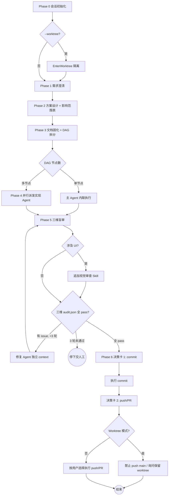

多阶段 SOP 编排器。主 Agent 只做检查/决策/派发/验证（主检子执），实现 Agent 做实际编码，审计 Agent 做独立盲审。任务按 DAG 拓扑序最大化并行。

## 全局护栏

1. **主 Agent 禁止直接写代码** — 只做需求澄清、方案设计、任务拆分、派发、汇总、提交确认
2. **Phase 2 审批前禁止任何代码变更**
3. **影响范围即合约** — 禁止修改影响范围表之外的任何文件
4. **每阶段必须有用户检查点** — 执行标准检查点协议（见 `references/checkpoint-protocol.md`）
5. **禁止未经确认的 commit/push** — Phase 6 commit 与 push 分别独立授权（两次决策卡）
6. **UI 改动必检** — 涉及 UI 时必须调用 `frontend-design` 或 `ui-ux-pro-max` Skill
7. **完全独立** — 本插件不依赖任何其他插件的基础设施
8. **语言一致性** — 面向用户的内容全部使用 `${LANG}`（默认 `zh-CN`）；Conventional Commits 前缀保持英文；代码标识符/API 名/框架关键字保持原文
9. **Worktree 模式硬约束** — 禁止 commit 仓库共享配置文件；禁止 auto-merge 回 main 或 push 到 origin/main
10. **审计隔离** — 实现 Agent ≠ 审计 Agent；审计 Agent prompt 严禁注入实现 Agent 的过程信息（详见 `references/phase5-audit-protocol.md`）

## 术语约定

| 术语 | 含义 |
|------|------|
| 实现 Agent | Phase 4 中执行编码的子 Agent |
| 审计 Agent | Phase 5 中做质量检查的独立子 Agent（scope/practice/engineering） |
| 修复 Agent | Phase 5e 中修复 issue 的独立子 Agent |

## 阶段总览

各阶段详细 SOP 见 `references/phase-sop.md`。

| Phase | 目标 | 关键产出 | 检查点 |
|-------|------|---------|--------|
| 0 | 会话初始化 | 语言/Worktree 配置 | 标准检查点 → Phase 1 |
| 1 | 需求澄清 | 精炼需求摘要 | 标准检查点 → Phase 2 |
| 2 | 方案设计 | 方案 + 影响范围表 | 标准检查点 → Phase 3 |
| 3 | 文档固化 + DAG 拆分 | 任务文档 + DAG 图 | 标准检查点 → Phase 4 |
| 4 | DAG 并行执行 | 实现 Agent 交付物 | 标准检查点 → Phase 5 |
| 5 | 独立审计盲审 | 三维 audit.json | 标准检查点 → Phase 6 |
| 6 | 提交确认 | commit + 可选 push/PR | 两次独立决策卡 |

### 流程决策图

阅读约定：菱形为分支决策，圆角矩形为终止状态。任何分支判断失败时回退到上一个检查点，禁止跨级跳转。

### Phase 0: 会话初始化

解析 `--lang` / `--worktree` / `--base` 参数，确定语言配置（优先级：命令行 > `.claude/slim-task.json` > 默认 `zh-CN`），首次运行检查 `.gitignore` 是否忽略 `.claude/slim-task.json` 与 `.claude/slim-task/`（缺失则经 `AskUserQuestion` 授权后补齐），按需创建 worktree。输出初始化摘要后执行检查点。

### Phase 1: 需求澄清

将模糊任务描述转化为精确需求摘要。识别歧义点、缺失上下文、隐含假设、边界条件。通过 `AskUserQuestion` 结构化澄清。输出精炼需求摘要后执行检查点。

### Phase 2: 方案设计

三步走：最佳实践调研（AI 知识优先，过时时 WebSearch 补充）→ 代码库扫描（Explore Agent）→ 方案输出（含影响范围表）。影响范围表为后续所有 Phase 的文件边界合约。执行检查点。

### Phase 3: 文档固化 + DAG 拆分

将方案固化到 `docs/tasks/{YYYY-MM-DD}/{task-slug}.{lang}.md`。按依赖关系拆分为 DAG 层级（Layer 0 无依赖可并行，Layer N 依赖 Layer N-1）。每个子任务含 Objective / File boundary / Dependencies / Output format。执行检查点。

### Phase 4: DAG 并行执行

按 DAG 拓扑序逐层派发实现 Agent（`run_in_background: true`），同层无上限并行。单任务时主 Agent 直接内联执行。子 Agent prompt 格式见 `references/subagent-prompt-template.md`。全部完成后执行检查点。

### Phase 5: 独立审计盲审

并行派发 scope-auditor / practice-auditor / engineering-auditor 三个独立审计 Agent。审计协议见 `references/phase5-audit-protocol.md`。涉及 UI 时提示调用视觉审查。有 issue 则派修复 Agent → 复核（上限 3 轮）。全部通过后执行检查点。

### Phase 6: 提交确认

两次独立 `AskUserQuestion`：先 commit 决策卡，再 push/PR 决策卡。Worktree 模式禁止 push 到 main，收尾时询问是否保留 worktree。用户拒绝 commit 则列出手动调整事项并结束。详见 `references/phase-sop.md` Phase 6 节。
