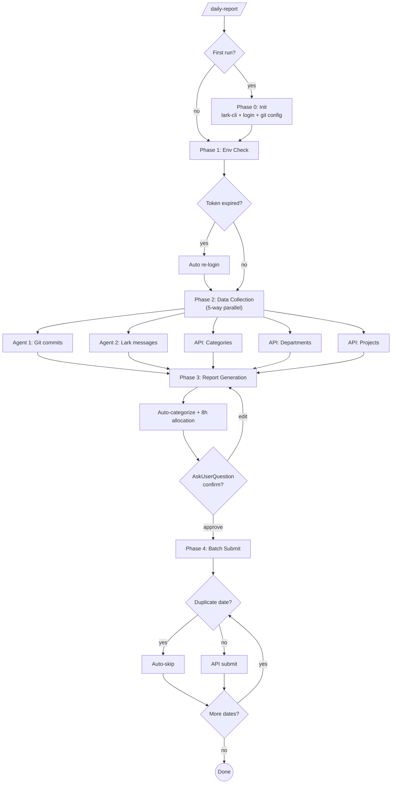

> **[中文版](README.zh.md)** | English (default)

# daily-report

> Auto-generate and submit daily work reports from git commits and Lark chat history.

[](../../LICENSE)


## Overview

**daily-report** is a Claude Code Skill plugin that automates internal daily work report generation and submission. It aggregates git commit history and Lark (Feishu) chat messages to produce structured reports with automatic categorization and time allocation.

## Key Features

- **Multi-Source Aggregation** — Combines git commit logs and Lark (Feishu) chat history for comprehensive daily reports
- **Parallel Data Collection** — Multi-Agent architecture for concurrent git repo scanning, Lark group crawling, and API queries
- **Auto-Categorization** — Keyword-based intelligent work item classification (development, bugfix, refactoring, docs, meetings)
- **Smart Time Allocation** — 8h/day proportional distribution with 0.5h granularity
- **AES Encrypted Login** — Secure AES-256-CBC password encryption for internal system authentication
- **Token Auto-Refresh** — Automatic credential management with expired token re-authentication
- **Batch Submission** — One-click submission with duplicate date detection and auto-skip
- **Interactive Review** — Table-format preview with AskUserQuestion confirmation before submission

## Quick Start

### Install

```bash
claude plugin install daily-report@lorainwings-plugins --scope project
```

### Usage

```bash
# Generate today's report
/daily-report

# Generate for a specific date
/daily-report --date 2026-03-28

# Generate for a date range
/daily-report --range 2026-03-24~2026-03-28

# Re-run initialization
/daily-report --init
```

### First-Time Setup

On first run, the plugin guides you through a one-time setup (~3-5 minutes):

1. **Lark CLI Setup** — Install and authorize lark-cli for Feishu chat access
2. **Internal System Login** — Configure company name, username, and password
3. **Git Repository Config** — Specify which repos and author names to scan

> All configuration is saved locally at `~/.config/daily-report/config.json`. Subsequent runs skip setup entirely — instant startup.

## Workflow



| Phase | Name | Key Output |
|-------|------|------------|
| 0 | Init (first run only) | lark-cli OAuth + login token + git config |
| 1 | Env Check | Config validation + token refresh |
| 2 | Data Collection | Git commits + Lark messages + API metadata |
| 3 | Report Generation | Categorized report + time allocation |
| 4 | Batch Submit | Per-day API submission + result summary |

## Configuration

Stored at `~/.config/daily-report/config.json` (auto-created during first run, permissions `600`):

| Field | Description | Auto-derived |
|-------|-------------|:---:|
| `pageUrl` | Internal report page URL | — |
| `baseUrl` | Protocol + domain | Yes |
| `apiPrefix` | API path prefix | Yes |
| `tenantName` | Company name (login page) | — |
| `username` | Login username | — |
| `password` | Login password (local only, encrypted for transmission) | — |
| `token` | Bearer access token | Yes |
| `userId` / `deptId` | User and department IDs | Yes |
| `larkOpenId` | Feishu user open_id | Yes |
| `repos` | Git repository paths | — |
| `gitAuthor` | Git author name(s), `\|`-separated | — |

## Requirements

- **Claude Code** CLI (v1.0.0+)
- **Node.js** — required for lark-cli
- **git** — commit history scanning
- **lark-cli** — Feishu chat access (auto-installed during setup)

## Documentation

| Document | Description |
|----------|-------------|
| [Setup Guide](skills/daily-report/references/setup-guide.md) | First-time initialization walkthrough |
| [Changelog](CHANGELOG.md) | Version history |

## License

MIT — see [LICENSE](../../LICENSE).
