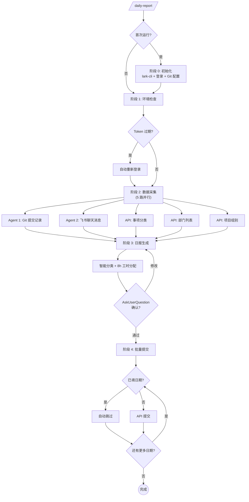

> [English](README.md) | 中文

# daily-report

> 基于 git 提交和飞书聊天记录，自动生成并提交内控日报。

[](../../LICENSE)


## 概述

**daily-report** 是一个 Claude Code Skill 插件，自动化内控日报的生成与提交。它聚合 git 提交记录和飞书聊天消息，生成结构化工作日报，并自动完成分类匹配和工时分配。

## 核心特性

- **多源数据聚合** — 整合 git 提交日志和飞书群聊消息，全面覆盖每日工作内容
- **并行数据采集** — 多 Agent 架构，并发执行 git 仓库扫描、飞书群消息爬取和 API 查询
- **智能分类匹配** — 基于关键词自动匹配事项分类（需求开发、问题修复、代码重构、文档编写、会议沟通）
- **智能工时分配** — 每天固定 8h，按条目数等比分配，0.5h 粒度
- **AES 加密登录** — AES-256-CBC 密码加密，安全对接内控系统
- **Token 自动刷新** — 自动管理凭据，过期自动重新登录
- **批量提交** — 一键提交，自动检测并跳过已填日期
- **交互式审核** — 表格形式预览，AskUserQuestion 确认后提交

## 快速开始

### 安装

```bash
claude plugin install daily-report@stoicatom-plugins --scope project
```

### 使用

```bash
# 生成今日日报
/daily-report

# 生成日期范围的日报
/daily-report 生成本月的日报

# 指定日期
/daily-report --date 2026-03-28

# 指定日期范围
/daily-report --range 2026-03-24~2026-03-28

# 重新初始化配置
/daily-report --init
```

### 首次配置

首次运行时，插件会引导你完成一次性配置（约 3-5 分钟）:

1. **飞书 CLI 配置** — 安装 lark-cli 并完成飞书 OAuth 授权
2. **内控系统登录** — 配置公司名称、用户名和密码
3. **Git 仓库配置** — 指定需要扫描的仓库路径和作者名

> 所有配置保存在本地 `~/.config/daily-report/config.json`。后续使用直接跳过配置，秒级启动。

## 工作流



| 阶段 | 名称 | 关键产出 |
|------|------|---------|
| 0 | 初始化（仅首次） | lark-cli OAuth + 登录 Token + Git 配置 |
| 1 | 环境检查 | 配置校验 + Token 刷新 |
| 2 | 数据采集 | Git 提交 + 飞书消息 + API 元数据 |
| 3 | 日报生成 | 分类匹配 + 工时分配 |
| 4 | 批量提交 | 按天 API 提交 + 结果汇总 |

## 配置说明

配置文件路径: `~/.config/daily-report/config.json`（首次运行自动创建，权限 `600`）:

| 字段 | 说明 | 自动获取 |
|------|------|:---:|
| `pageUrl` | 内控日报页面地址 | — |
| `baseUrl` | 协议+域名 | 是 |
| `apiPrefix` | API 路径前缀 | 是 |
| `tenantName` | 公司名称（登录页） | — |
| `username` | 登录用户名 | — |
| `password` | 登录密码（仅本地存储，传输时加密） | — |
| `token` | Bearer 访问令牌 | 是 |
| `userId` / `deptId` | 用户 ID 和部门 ID | 是 |
| `larkOpenId` | 飞书用户 open_id | 是 |
| `repos` | Git 仓库路径列表 | — |
| `gitAuthor` | Git 作者名，`\|` 分隔多个 | — |

## 系统要求

- **Claude Code** CLI (v1.0.0+)
- **Node.js** — lark-cli 依赖
- **git** — 提交记录扫描
- **lark-cli** — 飞书聊天消息获取（首次配置时自动安装）

## 文档

| 文档 | 说明 |
|------|------|
| [初始化引导](skills/daily-report/references/setup-guide.md) | 首次配置完整指南 |
| [更新日志](CHANGELOG.md) | 版本历史 |

## 许可证

MIT — 详见 [LICENSE](../../LICENSE)。
