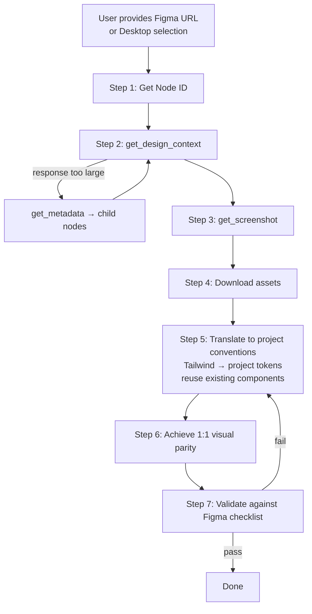

> [中文版](README.zh.md) | **English (default)**

# figma-codegen

[](https://github.com/stoicatom/claude-autopilot)
[](./skills/figma-codegen/SKILL.md)
[](https://github.com/stoicatom/claude-autopilot/blob/main/LICENSE)

> Translate Figma designs into production-ready code with 1:1 visual fidelity.
> Adapted from OpenAI's official [figma-implement-design](https://github.com/openai/skills/tree/main/skills/.curated/figma-implement-design) skill, tuned for Claude Code.

---

## What it does

A single Claude Code SKILL that walks you through 7 deterministic steps to translate a Figma node into production code:

1. **Get Node ID** — parse from URL or use Figma Desktop selection
2. **Fetch Design Context** — `get_design_context` (with `get_metadata` fallback for large nodes)
3. **Capture Visual Reference** — `get_screenshot` as the source of truth
4. **Download Required Assets** — never replace MCP-returned assets with placeholders or third-party icon packs
5. **Translate to Project Conventions** — replace Tailwind utilities with project tokens, reuse existing components
6. **Achieve 1:1 Visual Parity** — prefer design system tokens, allow minimal spacing/sizing adjustments
7. **Validate Against Figma** — checklist over layout, typography, colors, interactive states, responsive behavior, assets, accessibility

## Workflow



## When to use

| Trigger | Use this skill |
| --- | --- |
| User says "implement this Figma design" / "figma 转代码" / "实现这个设计稿" | ✅ |
| User pastes a `figma.com/design/...?node-id=...` URL | ✅ |
| User wants pixel-faithful UI from a Figma node | ✅ |

| Trigger | Switch to |
| --- | --- |
| Create / edit / delete nodes inside Figma | `figma-use` |
| Build a full Figma page from code or description | `figma-generate-design` |
| Only generate Code Connect mappings | `figma-code-connect-components` |
| Author reusable agent rules (`CLAUDE.md` / `AGENTS.md`) | `figma-create-design-system-rules` |

## Prerequisites

- Figma MCP server connected via one of three modes:
  - **Remote MCP**: `claude mcp add figma --transport http https://mcp.figma.com/mcp`
  - **Figma Desktop MCP**: enable MCP in Figma Desktop
  - **Local figma-developer-mcp**: `claude mcp add figma -- npx -y figma-developer-mcp --figma-api-key=$FIGMA_TOKEN`
- A Figma URL `https://figma.com/design/:fileKey/:fileName?node-id=1-2`
  - **Or** a node selected in Figma Desktop (when using `figma-desktop` MCP)
- A project with an established design system (recommended)

## Installation

This plugin ships in the `stoicatom-plugins` Claude Code marketplace.

```bash
# Add the marketplace (one-time setup)
/plugin marketplace add stoicatom/claude-autopilot

# Install figma-codegen
/plugin install figma-codegen@stoicatom-plugins
```

## Usage

```
/figma-codegen https://figma.com/design/kL9xQn2VwM8pYrTb4ZcHjF/DesignSystem?node-id=42-15
```

Or simply describe your intent — Claude will auto-trigger the skill when it detects design implementation requests.

## Layout

```
plugins/figma-codegen/
├── .claude-plugin/plugin.json       # Plugin metadata
├── README.md / README.zh.md          # Bilingual docs
├── CHANGELOG.md                      # Maintained by release-please
├── version.txt                       # Source of truth for version
├── CLAUDE.md                         # Plugin-scoped agent rules
├── tools/build-dist.sh               # Build script
└── skills/figma-codegen/
    ├── SKILL.md                      # 7-step workflow (Chinese-primary)
    ├── LICENSE.txt                   # Figma Developer Terms
    ├── agents/claude.yaml            # MCP dependency declaration
    └── assets/                       # Marketplace icons
```

## License

- Plugin code: [MIT](https://github.com/stoicatom/claude-autopilot/blob/main/LICENSE)
- SKILL content adapted from OpenAI: subject to [Figma Developer Terms](https://www.figma.com/legal/developer-terms/)

## Credits

This skill is a faithful Claude Code adaptation of OpenAI's [figma-implement-design](https://github.com/openai/skills/tree/main/skills/.curated/figma-implement-design). Major workflow design credit goes to the OpenAI Skills team and Figma Dev Mode MCP team.
