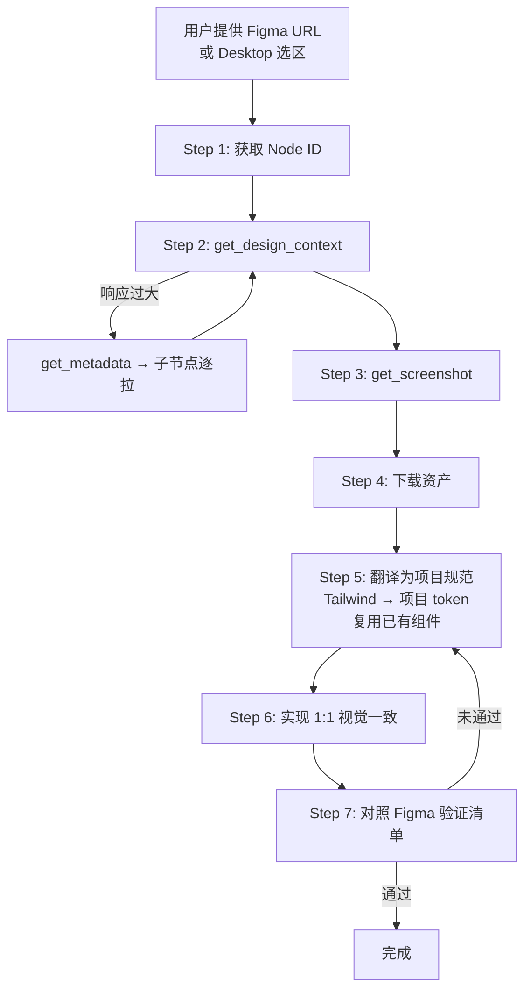

> **中文版** | [English](README.md)

# figma-codegen

[](https://github.com/lorainwings/claude-autopilot)
[](./skills/figma-codegen/SKILL.md)
[](https://github.com/lorainwings/claude-autopilot/blob/main/LICENSE)

> 把 Figma 设计稿翻译为生产级代码,追求像素级视觉一致(1:1 visual parity)。
> 改编自 OpenAI 官方 [figma-implement-design](https://github.com/openai/skills/tree/main/skills/.curated/figma-implement-design) skill,针对 Claude Code 适配。

---

## 它做什么

一份 Claude Code SKILL,带你按 7 步把 Figma 节点翻译为生产级代码:

1. **获取 Node ID** — 从 URL 解析或使用 Figma Desktop 选区
2. **拉取设计上下文** — `get_design_context`(大节点降级到 `get_metadata`)
3. **截取视觉基准** — `get_screenshot` 作为真值基准
4. **下载所需资产** — 严禁用占位图或新增 icon 包替代 MCP 返回的资产
5. **翻译为项目规范** — Tailwind utility class 替换为项目 token,复用已有组件
6. **实现 1:1 视觉一致** — 优先项目设计系统 token,允许 spacing/sizing 微调
7. **对照 Figma 验证** — 布局 / 排版 / 颜色 / 交互 / 响应式 / 资产 / 无障碍 7 维清单

## 工作流



## 何时使用

| 触发场景 | 使用本 SKILL |
| --- | --- |
| 用户说 "implement this Figma design" / "figma 转代码" / "实现这个设计稿" | ✅ |
| 用户粘贴 `figma.com/design/...?node-id=...` URL | ✅ |
| 用户想从 Figma 节点获得保真 UI | ✅ |

| 触发场景 | 切换到 |
| --- | --- |
| 在 Figma 内创建 / 编辑 / 删除节点 | `figma-use` |
| 从代码或描述构建完整 Figma 页面 | `figma-generate-design` |
| 仅生成 Code Connect 映射 | `figma-code-connect-components` |
| 编写可复用的 Agent 规则(`CLAUDE.md` / `AGENTS.md`) | `figma-create-design-system-rules` |

## 前置条件

- Figma MCP server 已连接,三种模式之一:
  - **Remote MCP**:`claude mcp add figma --transport http https://mcp.figma.com/mcp`
  - **Figma Desktop MCP**:Figma Desktop 开启 MCP 开关
  - **本地 figma-developer-mcp**:`claude mcp add figma -- npx -y figma-developer-mcp --figma-api-key=$FIGMA_TOKEN`
- Figma URL `https://figma.com/design/:fileKey/:fileName?node-id=1-2`
  - **或** Figma Desktop 中选中的节点(使用 `figma-desktop` MCP 时)
- 项目最好已有设计系统(推荐)

## 安装

本插件托管于 `lorainwings-plugins` Claude Code 插件市场。

```bash
# 添加 marketplace(一次性配置)
/plugin marketplace add lorainwings/claude-autopilot

# 安装 figma-codegen
/plugin install figma-codegen@lorainwings-plugins
```

## 使用

```
/figma-codegen https://figma.com/design/kL9xQn2VwM8pYrTb4ZcHjF/DesignSystem?node-id=42-15
```

或者直接描述你的意图 — Claude 检测到设计实现需求时会自动触发本 SKILL。

## 目录结构

```
plugins/figma-codegen/
├── .claude-plugin/plugin.json       # 插件元信息
├── README.md / README.zh.md          # 双语文档
├── CHANGELOG.md                      # 由 release-please 维护
├── version.txt                       # 版本号真值源
├── CLAUDE.md                         # 插件级 Agent 规则
├── tools/build-dist.sh               # 构建脚本
└── skills/figma-codegen/
    ├── SKILL.md                      # 7 步工作流(中文为主)
    ├── LICENSE.txt                   # Figma Developer Terms
    ├── agents/claude.yaml            # MCP 依赖声明
    └── assets/                       # Marketplace 图标
```

## 许可证

- 插件代码:[MIT](https://github.com/lorainwings/claude-autopilot/blob/main/LICENSE)
- SKILL 内容改编自 OpenAI:遵循 [Figma Developer Terms](https://www.figma.com/legal/developer-terms/)

## 致谢

本 SKILL 是 OpenAI [figma-implement-design](https://github.com/openai/skills/tree/main/skills/.curated/figma-implement-design) 在 Claude Code 上的忠实适配。工作流核心设计 credit 归属 OpenAI Skills 团队与 Figma Dev Mode MCP 团队。
