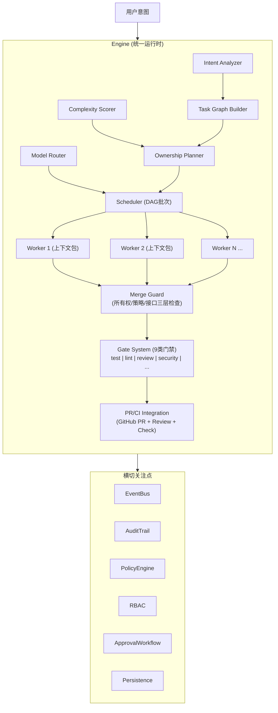
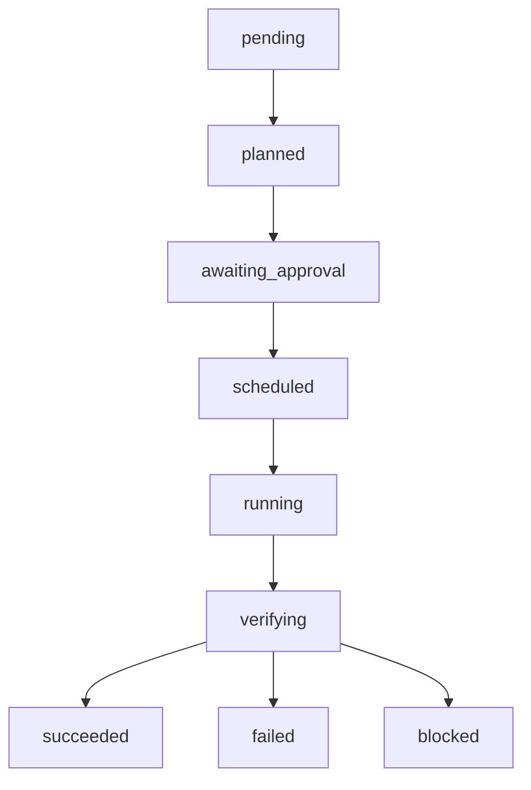
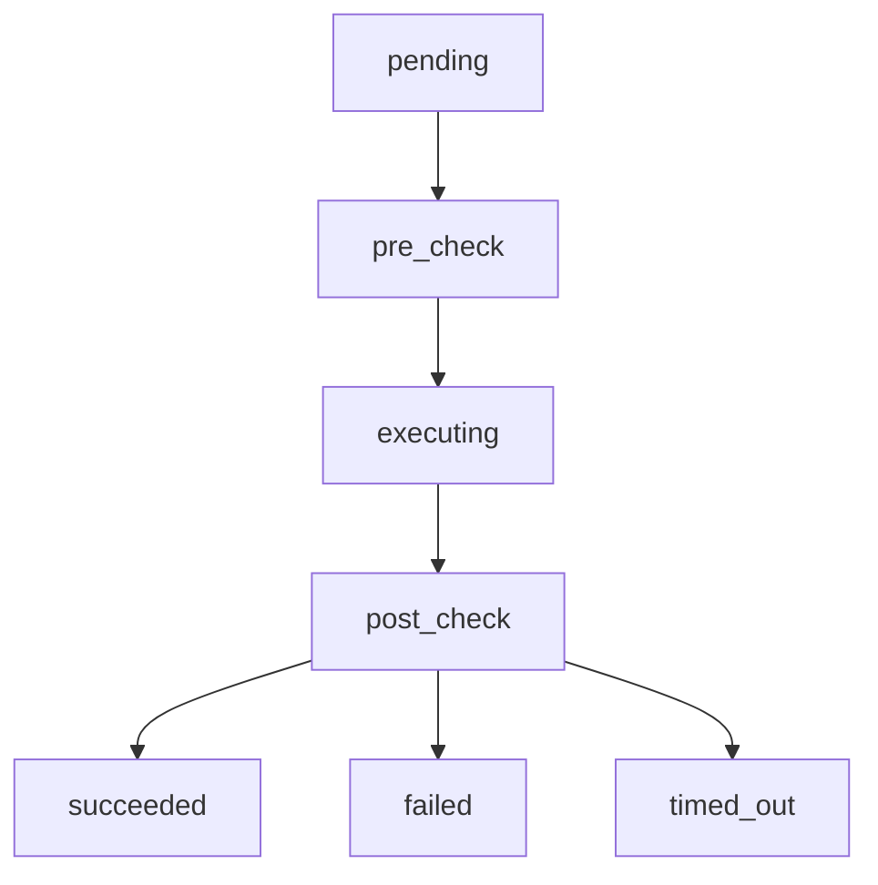

> [English](README.md) | 中文

# parallel-harness v1.5.0 <!-- x-release-please-version -->

> Claude Code 并行 AI 工程控制面插件 — 商业化 GA 版本

## 什么是 parallel-harness？

`parallel-harness` 是一个 Claude Code 插件，提供**任务图驱动的并行 AI 工程平台**：

- **任务图拆解**：将复杂需求分析为结构化的任务 DAG
- **多 Agent 并行调度**：基于依赖关系并行执行无冲突任务，文件所有权严格隔离
- **成本感知模型路由**：根据任务复杂度自动选择合适的模型档位（tier-1/2/3）
- **9 类门禁系统**：test / lint_type / review / security / perf / coverage / policy / documentation / release_readiness
- **RBAC 治理**：4 种内置角色（admin/developer/reviewer/viewer），12 种细粒度权限
- **审计追踪**：完整的事件日志、回放、导出，支持 JSON/CSV 格式
- **CI/PR 闭环**：GitHub PR 创建、Review 评论、Check Status、CI 失败分析
- **Session 持久化**：内存/文件双适配器，支持断点恢复

## 版本信息

- **版本**: v1.5.0 (GA) <!-- x-release-please-version -->
- **Schema 版本**: 1.0.0
- **运行时**: Bun
- **语言**: TypeScript
- **测试**: 295 pass / 0 fail / 649 expect()

## 模块列表

runtime 包含 17 个核心模块：

| 序号 | 模块 | 路径 | 职责 | 成熟度 |
|------|------|------|------|--------|
| 1 | Engine | `runtime/engine/` | 统一运行时 Orchestrator，生命周期管理 | GA |
| 2 | Orchestrator | `runtime/orchestrator/` | 意图分析、任务图、复杂度评分、所有权规划 | GA |
| 3 | Scheduler | `runtime/scheduler/` | DAG 批次调度，关键路径优先 | GA |
| 4 | Models | `runtime/models/` | 三层模型路由（tier-1/2/3），失败自动升级 | GA |
| 5 | Session | `runtime/session/` | 上下文打包、最小上下文原则 | GA |
| 6 | Verifiers | `runtime/verifiers/` | 验证结果 Schema | GA |
| 7 | Observability | `runtime/observability/` | EventBus 事件总线 | GA |
| 8 | Workers | `runtime/workers/` | Worker 运行时、能力注册、重试、降级 | GA |
| 9 | Guards | `runtime/guards/` | Merge Guard（所有权/策略/接口三层检查） | GA |
| 10 | Gates | `runtime/gates/` | 9 类门禁系统（可阻断/可扩展） | GA |
| 11 | Persistence | `runtime/persistence/` | Session/Run/Audit 持久化，回放引擎 | GA |
| 12 | Integrations | `runtime/integrations/` | GitHub PR/CI 集成（仅 GitHub） | Beta |
| 13 | Governance | `runtime/governance/` | RBAC、审批工作流、人工介入 | GA |
| 14 | Lifecycle | `runtime/lifecycle/` | Skill 生命周期运行时、注册表、阶段推断 | GA |
| 15 | Capabilities | `runtime/capabilities/` | Skill/Hook/Instruction 扩展层 | Beta |
| 16 | Schemas | `runtime/schemas/` | GA 级数据契约（统一 ID、版本、类型） | GA |
| 17 | Server | `runtime/server/` | HTTP/WebSocket 服务端 | GA |

> **成熟度说明**: GA = 生产就绪，已测试覆盖；Beta = 功能可用但接口可能调整

## 安装

```bash
# 通过 Claude Code 插件市场安装
claude plugin install parallel-harness@lorainwings-plugins --scope project

# 手动安装（开发环境）
cd plugins/parallel-harness
bun install
```

## 快速开始

### 1. 使用主编排 Skill

安装后在 Claude Code 中使用 `/harness` 命令启动主编排流程：

```
用户: /harness 将 utils.ts 中的所有 helper 函数拆分到独立模块
```

`/harness` skill 会先调用 `runtime/scripts/execute-harness.ts`，再由 TypeScript runtime 作为真正的执行入口。进入 worker 阶段后，runtime 会在嵌套 Claude 会话里显式调用对应的 namespaced stage skill，例如：

1. `/parallel-harness:harness-dispatch` — Worker 派发 / 所有权范围内实现
2. `/parallel-harness:harness-verify` — 验证 / 门禁导向审查

### 2. 配置运行参数

编辑 `config/default-config.json`：

```json
{
  "run_config": {
    "max_concurrency": 5,
    "budget_limit": 100000,
    "max_model_tier": "tier-3",
    "enabled_gates": ["test", "lint_type", "review", "policy"],
    "pr_strategy": "single_pr"
  }
}
```

### 3. 配置策略规则

编辑 `config/default-policy.json` 定义安全和合规策略，参见 [策略配置指南](docs/policy-guide.zh.md)。

## 架构概览



## 四类角色边界

| 角色 | 可做 | 不可做 |
|------|------|--------|
| **Planner** | 分析意图、构建图、分配所有权 | 直接修改代码 |
| **Worker** | 在所有权范围内实现任务 | 修改范围外文件、跳过测试 |
| **Verifier/Gate** | 独立验证结果、阻断不合格输出 | 修改代码、降低标准 |
| **Synthesizer** | 综合决策、生成报告 | 重新执行任务 |

## 状态机

**Run 状态机**:


**Task Attempt 状态机**:


## 降级策略

| 条件 | 降级动作 |
|------|----------|
| 冲突率 > 30% | 自动降级为半串行 |
| Gate 连续 3 次 block | 降级为串行 + tier-3 |
| 关键路径阻塞 > 2 轮 | 优先串行处理 |

## 与 spec-autopilot 的关系

两者是**产品分层关系**，不是替代关系：

| 维度 | spec-autopilot | parallel-harness |
|------|---------------|-----------------|
| 核心模型 | 8 阶段线性流水线 | 任务 DAG + 动态调度 |
| 调度方式 | 按 Phase 顺序执行 | 按依赖关系并行批次 |
| 质量保证 | 三层门禁系统 | 9 类 Gate System |
| 模型控制 | 手动路由提示 | 自动 Tier 路由 + 失败升级 |
| 上下文 | 完整 Phase 上下文 | 每个任务最小上下文包 |
| 治理 | Hook 脚本 | RBAC + 审批 + 策略引擎 |
| 适用场景 | 规范驱动的交付流程 | 复杂多模块并行工程 |

**选择建议**：
- 流程明确、阶段式交付 → `spec-autopilot`
- 复杂工程、多 Agent 并行、治理优先 → `parallel-harness`

## 测试覆盖

```
295 pass / 0 fail / 649 expect() calls
13 个测试文件覆盖全部 runtime 模块
```

测试覆盖包括：
- 任务图构建与 DAG 验证
- 所有权规划与冲突检测
- 调度器批次生成
- 模型路由与升级策略
- 上下文打包
- 9 类 Gate 评估器
- Merge Guard 三层检查
- RBAC 权限验证
- 审批工作流
- Session/Run 持久化
- AuditTrail 记录与查询
- PR Summary 渲染
- CI 失败解析
- EventBus 发布订阅
- Worker 执行控制器

## 文档索引

- [运维指南](docs/operator-guide.zh.md)
- [管理员指南](docs/admin-guide.zh.md)
- [策略配置指南](docs/policy-guide.zh.md)
- [集成指南](docs/integration-guide.zh.md)
- [故障排查](docs/troubleshooting.zh.md)
- [FAQ](docs/FAQ.zh.md)
- [安全与合规](docs/security-compliance.zh.md)
- [发布检查清单](docs/release-checklist.zh.md)
- [基本流程示例](docs/examples/basic-flow.zh.md)
- [市场接入准备](docs/marketplace-readiness.zh.md)
- [架构概览](docs/architecture/overview.zh.md)
- [能力注册](docs/capabilities/capability-registry.zh.md)

> 所有文档均提供 [English](docs/README.md) 和 [中文](docs/README.zh.md) 双语版本。

## 许可证

MIT
