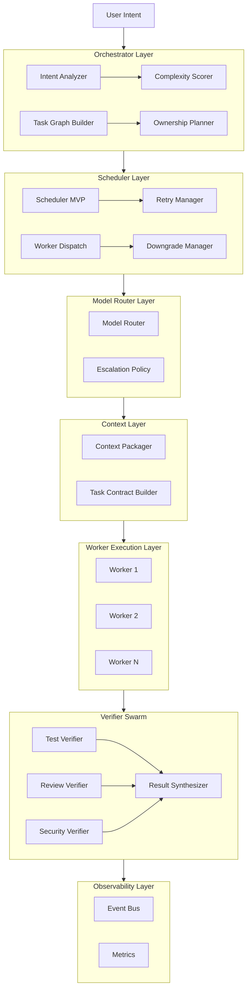
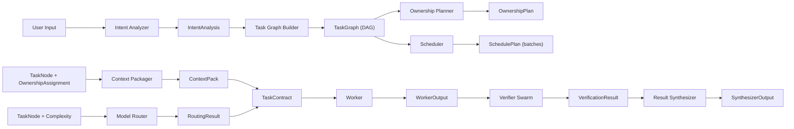

> **[中文版](overview.zh.md)** | English (default)

# parallel-harness Architecture Overview

## 1. System Purpose

`parallel-harness` is a Claude Code plugin that provides a task-graph-driven parallel AI engineering control plane.

Core design principles:
- Build the graph first, then schedule, then verify
- Separate implementation from verification
- Cost-aware automatic model routing
- Minimal context packages
- Strict file ownership isolation

## 2. Architecture Layers

## 3. Core Data Flow

## 4. Four First-Class Roles (Enhanced from BMAD-METHOD)

| Role | Responsibility | Input | Output |
|------|---------------|-------|--------|
| Planner | Understand intent, build task graph | User intent + project context | TaskGraph |
| Worker | Execute specific tasks | TaskContract | WorkerOutput |
| Verifier | Independently verify results | Task + WorkerOutput | VerificationResult |
| Synthesizer | Aggregate all results | All outputs + verifications | SynthesizerOutput |

## 5. Model Tier Strategy (Enhanced from claude-code-switch)

| Tier | Use Case | Context Budget | Cost |
|------|----------|---------------|------|
| tier-1 | search, format, rename, lint-fix | 16K | Low |
| tier-2 | implementation, test, general review | 64K | Medium |
| tier-3 | planning, design, critical review | 200K | High |

Automatic routing rules:
- Base tier is selected based on task complexity
- High-risk tasks are escalated by one tier
- Each retry escalates by one tier
- tier-3 is the ceiling

## 6. Module Maturity

**GA (Production-Ready)**:
- Engine — Unified Orchestrator Runtime, lifecycle management
- Orchestrator — Intent analysis, task graph building, complexity scoring, ownership planning
- Scheduler — DAG batch scheduling, critical path priority
- Models — 3-tier model router (tier-1/2/3), automatic escalation on failure
- Session — Context packing, minimal context principle
- Verifiers — Verification result schema
- Observability — EventBus (38 event types)
- Workers — Worker runtime, capability registry, retry, downgrade
- Guards — Merge Guard (ownership/policy/interface 3-layer checking)
- Gates — 9-type gate system (blocking/extensible)
- Persistence — Session/Run/Audit persistence, replay engine
- Governance — RBAC, approval workflows, human-in-the-loop
- Lifecycle — Skill lifecycle runtime, registry, observability, phase inference
- Schemas — GA-level data contracts (unified ID, version, types)
- Server — HTTP/WebSocket server

**Beta (Functional, interfaces may change)**:
- Integrations — GitHub PR/CI integration (GitHub only)
- Capabilities — Skill/Hook/Instruction extension layer
