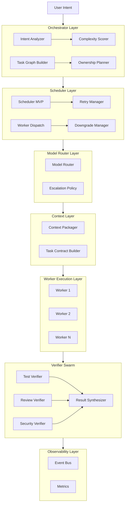
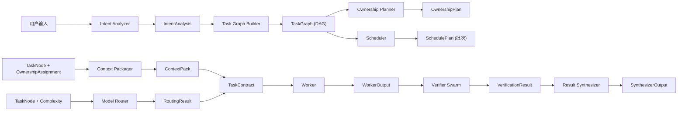

> [English](overview.md) | 中文

# parallel-harness 架构概览

## 1. 系统定位

`parallel-harness` 是一个 Claude Code 插件，提供任务图驱动的并行 AI 工程控制面。

核心设计原则：
- 先建图，再调度，再验证
- 实现与验证分离
- 成本感知的自动模型路由
- 最小上下文包
- 文件所有权严格隔离

## 2. 架构层次

## 3. 核心数据流

## 4. 四类一等角色 (来自 BMAD-METHOD 增强)

| 角色 | 职责 | 输入 | 输出 |
|------|------|------|------|
| Planner | 理解意图，构建任务图 | 用户意图 + 项目上下文 | TaskGraph |
| Worker | 执行具体任务 | TaskContract | WorkerOutput |
| Verifier | 独立验证结果 | Task + WorkerOutput | VerificationResult |
| Synthesizer | 综合所有结果 | 所有 outputs + verifications | SynthesizerOutput |

## 5. 模型 Tier 策略 (来自 claude-code-switch 增强)

| Tier | 适用场景 | 上下文预算 | 成本 |
|------|---------|-----------|------|
| tier-1 | search, format, rename, lint-fix | 16K | 低 |
| tier-2 | implementation, test, general review | 64K | 中 |
| tier-3 | planning, design, critical review | 200K | 高 |

自动路由规则：
- 基于任务复杂度选择基础 tier
- 高风险提升一级
- 每次重试提升一级
- tier-3 为封顶

## 6. 模块成熟度

**GA（生产就绪）**：
- Engine — 统一运行时 Orchestrator，生命周期管理
- Orchestrator — 意图分析、任务图构建、复杂度评分、所有权规划
- Scheduler — DAG 批次调度，关键路径优先
- Models — 三层模型路由（tier-1/2/3），失败自动升级
- Session — 上下文打包、最小上下文原则
- Verifiers — 验证结果 Schema
- Observability — EventBus 事件总线（38 种事件类型）
- Workers — Worker 运行时、能力注册、重试、降级
- Guards — Merge Guard（所有权/策略/接口三层检查）
- Gates — 9 类门禁系统（可阻断/可扩展）
- Persistence — Session/Run/Audit 持久化，回放引擎
- Governance — RBAC、审批工作流、人工介入
- Lifecycle — Skill 生命周期运行时、注册表、可观测性、阶段推断
- Schemas — GA 级数据契约（统一 ID、版本、类型）
- Server — HTTP/WebSocket 服务端

**Beta（功能可用，接口可能调整）**：
- Integrations — GitHub PR/CI 集成（仅 GitHub）
- Capabilities — Skill/Hook/Instruction 扩展层
