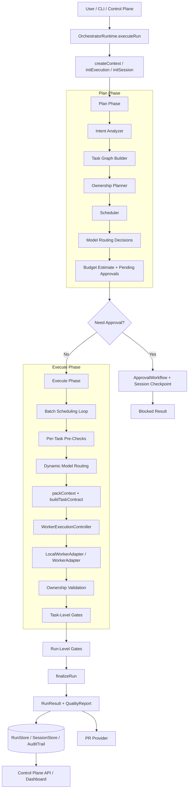
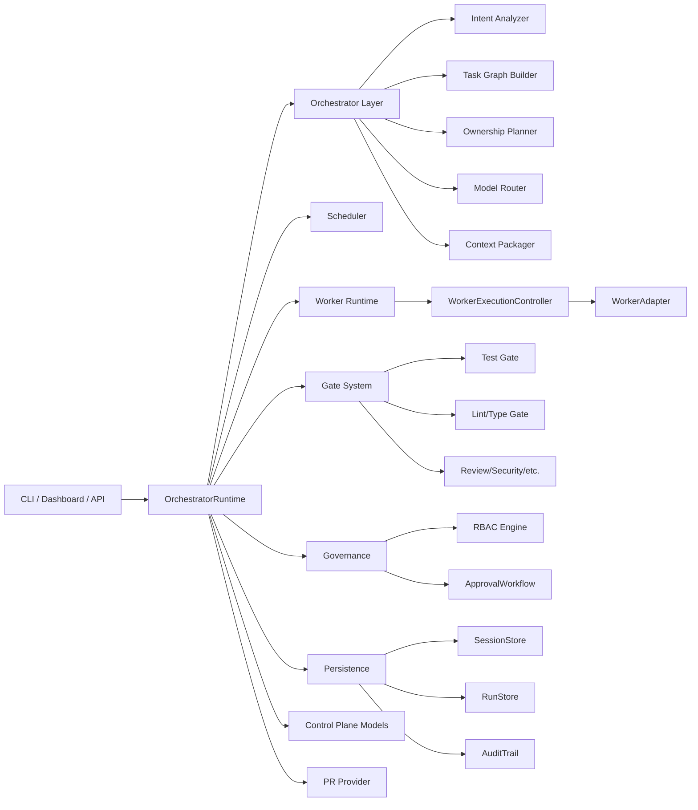

# 01. parallel-harness 生命周期基线架构设计

## 1. 文档定位

本文描述的是 `parallel-harness` 当前代码库的 **As-Is 基线架构**，不是 README 中的理想化目标图。所有判断都以当前工作区源码为准，重点覆盖：

- 生命周期主链路
- 模块边界与数据流
- 核心实现原理
- 现状与目标宣传之间的主要偏差

核心代码依据：

- `runtime/engine/orchestrator-runtime.ts:448-651`
- `runtime/engine/orchestrator-runtime.ts:659-750`
- `runtime/engine/orchestrator-runtime.ts:753-1075`
- `runtime/gates/gate-system.ts:770-823`
- `runtime/persistence/session-persistence.ts:69-356`
- `runtime/server/control-plane.ts:283-405`

## 2. 总体结论

当前 `parallel-harness` 已经具备一个完整的控制平面骨架：`RunRequest` 进入统一运行时后，会经历意图分析、任务图构建、所有权规划、批次调度、worker 执行、gate 验证、结果汇总、审计持久化，以及可选的 PR 输出和控制面展示。

但从“真实实现”看，它更接近一个 **可运行的 orchestrator skeleton**：

- 生命周期已经打通，状态机、审计、恢复、控制面接口都存在。
- 核心编排仍高度依赖启发式规则，而不是 repo-aware 的语义分析。
- 并发安全、上下文最小化、独立验证等“强保证”能力，在实现层面尚未完全闭环。

## 3. 生命周期总图

## 4. 组件视图

## 5. 生命周期分解

### 5.1 入口与运行上下文初始化

`OrchestratorRuntime.executeRun()` 是统一入口，负责创建：

- `ExecutionContext`
- `RunExecution`
- `SessionState`
- 初始审计事件

对应实现：

- `runtime/engine/orchestrator-runtime.ts:448-467`
- `runtime/engine/orchestrator-runtime.ts:1106-1175`

这里奠定了整个 run 的共享上下文：

- `ctx.config` 作为全局运行配置
- `ctx.costLedger` 作为统一成本账本
- `ctx.policyEngine` 作为策略判断入口
- `ctx.auditLog` 作为批量审计缓冲
- `ctx.collectedGateResults` 作为最终质量报告的数据源

### 5.2 Plan 阶段

Plan 阶段由 `planPhase()` 实现：

- 意图分析：`analyzeIntent()`
- 任务图构建：`buildTaskGraph()`
- 所有权规划：`planOwnership()`
- 调度计划：`createSchedulePlan()`
- 初始模型路由：`routeModel()`
- 预算估算与审批请求生成

对应实现：

- `runtime/engine/orchestrator-runtime.ts:659-750`

该阶段输出 `RunPlan`，其中包含：

- `task_graph`
- `ownership_plan`
- `schedule_plan`
- `routing_decisions`
- `budget_estimate`
- `pending_approvals`

### 5.3 Execute 阶段

执行阶段使用预先生成的 `schedule_plan.batches` 顺序推进，每个 batch 内部并发：

- 对任务做依赖检查
- 执行 pre-check
- 重新进行动态模型路由
- 构建 `TaskContract`
- 调用 worker
- 做 post-check 与 task-level gates

对应实现：

- `runtime/engine/orchestrator-runtime.ts:753-817`
- `runtime/engine/orchestrator-runtime.ts:819-1075`

这说明当前 runtime 的并行模型是：

1. 先离线生成 batch
2. 再按 batch 并发执行
3. batch 之间串行推进

### 5.4 Verify 阶段

task-level gate 在每个任务成功后立即执行，run-level gate 在所有 batch 结束后执行。

对应实现：

- task-level：`runtime/engine/orchestrator-runtime.ts:997-1053`
- run-level：`runtime/engine/orchestrator-runtime.ts:1077-1100`
- gate 注册与执行：`runtime/gates/gate-system.ts:770-823`

当前 gate system 包含 9 类 gate：

- `test`
- `lint_type`
- `review`
- `security`
- `perf`
- `coverage`
- `policy`
- `documentation`
- `release_readiness`

### 5.5 Finalize / Persist / PR / Control Plane

收尾阶段由 `finalizeRun()`、持久化存储、可选 PR 输出、控制面查询组成：

- `finalizeRun()` 生成 `RunResult` 和 `RunQualityReport`
- `RunStore`/`SessionStore`/`AuditTrail` 负责落盘
- `PRProvider` 负责可选 PR 创建
- `Control Plane` 提供运行数据查询与审批/取消入口

对应实现：

- finalize：`runtime/engine/orchestrator-runtime.ts:1306-1380`
- 持久化：`runtime/persistence/session-persistence.ts:69-356`
- PR：`runtime/integrations/pr-provider.ts:127-289`
- 控制面：`runtime/server/control-plane.ts:283-405`

## 6. 核心实现原理

### 6.1 Graph-First 而不是 Free-Form Agent Loop

当前架构不是让 agent 自由决定下一步，而是先构建任务图，再进行调度和执行。这与 LangGraph / AutoGen 一类框架的“stateful orchestration”思路一致，但当前实现仍停留在规则驱动的 DAG 构建。

### 6.2 Ownership-First 而不是 Worker-First

在 runtime 看，所有任务都先生成 `OwnershipPlan`，然后才允许 dispatch。也就是说，作者的设计理念是把“文件边界”当成并行安全的第一公民，而不是把 worker 数量当成第一公民。

### 6.3 Retry-Driven 动态路由

模型路由不是只在计划阶段发生一次。每次 attempt 都会依据：

- 复杂度
- 风险
- 剩余预算
- 重试次数

重新计算 tier，见：

- `runtime/engine/orchestrator-runtime.ts:829-839`
- `runtime/models/model-router.ts:140-169`

### 6.4 审批是运行时阻断点，而不是外围流程

审批并不是控制面上的附属操作，而是 runtime 内建状态的一部分。无论是计划期冲突审批还是任务执行前审批，都会：

- 切换到 `blocked`
- 写入 `SessionState.checkpoint`
- 支持 `approveAndResume()`

这说明系统从一开始就把“可中断、可恢复、可审批”视为控制平面的核心能力。

### 6.5 审计与查询是内生能力

`AuditTrail` 不是日志打印器，而是持久化查询对象：

- 能 `query`
- 能 `getTimeline`
- 能 `export(json/csv)`

这使得控制面和 replay 能够建立在统一事件源之上。

## 7. 当前数据对象主线

系统内最关键的数据对象如下：

| 阶段 | 输入 | 输出 |
|------|------|------|
| Ingest | `RunRequest` | `ExecutionContext`, `RunExecution`, `SessionState` |
| Plan | `RunRequest` | `RunPlan` |
| Execute | `TaskNode`, `OwnershipPlan`, `TaskContract` | `TaskAttempt`, `WorkerOutput` |
| Verify | `WorkerOutput`, `RunPlan` | `GateResult[]` |
| Finalize | `RunExecution`, `RunPlan`, `GateResult[]` | `RunResult` |
| Operate | `RunExecution`, `RunResult`, `AuditEvent[]` | `RunDetail`, `RunSummary` |

## 8. As-Is 与 To-Be 的差距

从代码可以看出，项目文档中的目标架构比当前实现更成熟。主要差距包括：

| 主题 | 目标表述 | 当前现实 |
|------|----------|----------|
| 意图理解 | 深度理解业务意图与依赖 | 当前是规则/关键词分析 |
| 上下文打包 | 最小上下文包驱动执行 | runtime 实际没有向 packager 提供文件内容 |
| 并发安全 | 严格文件所有权隔离 | 规划有所有权模型，但强约束闭环还不完整 |
| Gate 独立性 | 多维度高保真验证 | 真实执行与启发式检查混合存在 |
| Worker 隔离 | 受控执行环境 | 目前主适配器仍是 prompt 驱动 CLI 包装层 |

## 9. 基线判断

如果把当前系统放在架构成熟度曲线上，它已经越过“纯概念文档”阶段，进入“可运行控制平面骨架”阶段；但距离“工业级高保真编排框架”，还差三件事：

1. 把规划层的结构化对象，变成真正的执行硬约束。
2. 把验证层从启发式检查，升级为独立、可重复、可防作弊的 gate。
3. 把上下文、所有权、审批、审计四条线完全闭环到 worker 执行边界。

## 10. 参考源码

- `runtime/engine/orchestrator-runtime.ts`
- `runtime/orchestrator/intent-analyzer.ts`
- `runtime/orchestrator/task-graph-builder.ts`
- `runtime/orchestrator/ownership-planner.ts`
- `runtime/scheduler/scheduler.ts`
- `runtime/models/model-router.ts`
- `runtime/session/context-packager.ts`
- `runtime/workers/worker-runtime.ts`
- `runtime/gates/gate-system.ts`
- `runtime/persistence/session-persistence.ts`
- `runtime/server/control-plane.ts`
