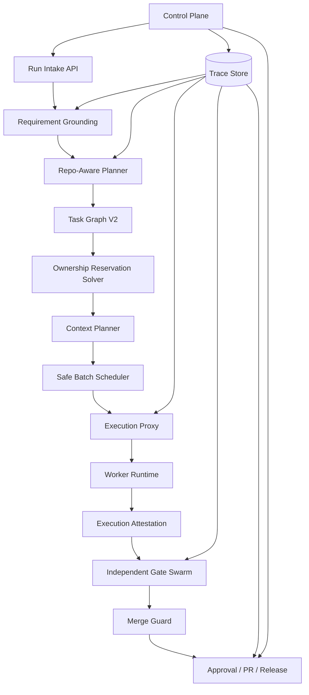

# 05. parallel-harness 终极修复与增强蓝图

## 1. 北极星目标

把 `parallel-harness` 从“可运行的 orchestrator skeleton”，升级成一个面向软件交付的 **高保真并行 AI 工程控制平面**。

这个目标可以浓缩成一句话：

**让每个 agent 只在必要上下文内、以明确写边界、在可审计与可恢复条件下工作，并由独立验证体系决定结果是否可以进入主分支。**

## 2. 目标架构原则

### 2.1 五个不可妥协原则

1. **Graph-first**
   所有复杂任务必须先建图，再执行。
2. **Least-context**
   每个 task 只能获得最小必要证据，不得共享全量历史。
3. **Least-write**
   每个 task 必须有显式 read-set / write-set reservation。
4. **Independent verification**
   作者不能做自己的最终裁判。
5. **Durable governance**
   审批、阻断、恢复、审计必须是 runtime 内生能力。

### 2.2 设计目标

| 维度 | 目标 |
|------|------|
| 正确性 | 防止错误并发写、防止策略越权、防止 reward hacking |
| 稳定性 | 重试改变条件而不是重复赌博 |
| 可恢复性 | checkpoint + resume 基于状态，不基于长对话 |
| 可治理性 | policy / approval / audit 从接口到执行全链闭环 |
| 可观测性 | 任何 run 都可追溯 task、gate、成本、证据、审批链 |

## 3. 目标架构图



## 4. 模块改造蓝图

## 4.1 Requirement Grounding 层

在现有 `analyzeIntent()` 前新增一层 `Requirement Grounding`，负责把自然语言需求转成结构化交付契约。

输出对象建议：

```ts
export interface RequirementGrounding {
  request_id: string;
  restated_goal: string;
  acceptance_matrix: Array<{
    category: "functional" | "regression" | "security" | "performance" | "documentation";
    criterion: string;
    blocking: boolean;
  }>;
  ambiguity_items: string[];
  assumptions: string[];
  impacted_modules: string[];
  delivery_artifacts: string[];
  required_approvals: string[];
}
```

### 必做增强

1. 强制输出验收矩阵，而不是只保留自然语言 goal。
2. 高歧义请求禁止直接进入 dispatch。
3. grounding 结果写入 audit trail，并成为后续 gate 的上游真相源。

## 4.2 Repo-Aware Planner 层

替换当前纯关键词式 `Intent Analyzer + Task Graph Builder`，引入 repo-aware planning：

- 文件树摘要
- import / dependency graph
- 历史测试映射
- 符号引用
- 改动候选模块

### 新的计划输出

```ts
export interface PlannedTaskV2 {
  task_id: string;
  title: string;
  objective: string;
  depends_on: string[];
  read_set: string[];
  write_set: string[];
  interface_outputs: string[];
  verifier_plan: string[];
  risk: "low" | "medium" | "high" | "critical";
}
```

### 必做增强

1. 任务到域的映射必须基于 repo 证据，不允许 round-robin。
2. 依赖边必须支持“接口产出依赖”，不只支持路径重叠推断。
3. 计划阶段就要算出 change-based test obligations。

## 4.3 Ownership Reservation Solver

现有 `OwnershipPlan` 要从“建议书”升级成“调度前硬约束”。

### 新语义

- `read_set`：可共享
- `write_set`：不可共享
- `reserved_paths`：运行前原子保留
- `merge_guard_only`：仅在最终合并阶段可冲突，不允许同批并发

### 调度规则

1. 任意两个 task 的 `write_set` 交集非空，不得进入同一并发批次。
2. `write_set` 与上游 `interface_outputs` 冲突时，优先强制串行。
3. 保留失败直接回退到 `hybrid` 或 `serial`，不允许“先跑再看”。

## 4.4 Context Planner / Context Envelope V2

把当前 `packContext()` 升级为真正可治理的上下文系统。

```ts
export interface ContextEnvelopeV2 {
  task_id: string;
  requirement_capsule: string;
  dependency_outputs: Array<{ task_id: string; artifact_ref: string }>;
  evidence_items: Array<{
    type: "file" | "snippet" | "symbol" | "test" | "policy";
    ref: string;
    rationale: string;
  }>;
  token_budget: number;
  occupancy_ratio: number;
  compaction_policy: "none" | "summarize" | "retrieve_only" | "symbol_only";
}
```

### 必做增强

1. runtime 必须真正注入文件/snippet 证据，禁止空 context pack。
2. 每个 attempt 都记录 `occupancy_ratio` 和 `compaction_policy`。
3. 对 verifier/gate 单独构造 verifier context，不能复用 author context。

## 4.5 Execution Proxy

这是最重要的重构点。应在 `LocalWorkerAdapter` 之前增加真正的执行代理层。

### 职责

- 绑定真实模型 tier -> provider/model
- enforce tool allowlist / denylist
- enforce filesystem sandbox
- enforce cwd / repo root
- capture tool calls / stdout / stderr / diff
- 生成 execution attestation

### 输出对象

```ts
export interface ExecutionAttestation {
  attempt_id: string;
  worker_id: string;
  repo_root: string;
  tool_calls: Array<{ name: string; args_hash: string; started_at: string; ended_at: string }>;
  modified_files: string[];
  git_diff_ref: string;
  sandbox_violations: string[];
  actual_model: string;
  token_usage: { input: number; output: number; reasoning?: number };
}
```

### 必做增强

1. `model_tier` 必须映射成真实 provider/model，而不是 env 提示。
2. `ToolPolicy` 必须变成强执行规则。
3. diff attestation 必须在任何路径模式下都可用，不能因为相对路径失效。

## 4.6 Independent Gate Swarm

当前 gate system 需要重构成两层：

### 4.6.1 Hard Gates

具有真实阻断语义，必须有证据：

- unit/integration/e2e test
- type/lint/build
- policy
- security scan
- merge guard
- hidden regression suite

### 4.6.2 Signal Gates

只给风险信号，不伪装成同等级阻断：

- summary quality
- suspicious file count
- test-delta anomaly
- documentation drift

### 新 gate 结果对象

```ts
export interface GateEvidenceBundle {
  gate_id: string;
  gate_type: string;
  verdict: "passed" | "failed" | "warning";
  blocking: boolean;
  evidence_refs: string[];
  produced_by: "tool" | "verifier_agent" | "hidden_suite" | "policy_engine";
  anti_gaming_signals: string[];
}
```

### 4.6.3 Run Evidence Aggregator

在 run-level gate 之前新增 `RunEvidenceAggregator`，统一聚合：

- 所有 task 的 `ExecutionAttestation`
- 全量 modified files
- test/build/type/security 工件引用
- coverage 与 mutation 结果
- 上游审批/策略决策

没有这个聚合层，run-level gates 只能变成“接口存在，但缺少燃料”。

## 4.7 Merge Guard 成为主链强制环节

`MergeGuard` 不应只是库对象，必须进入主链：

1. task 全部完成后执行一次
2. PR 创建前执行一次
3. release_readiness 前执行一次

阻断条件至少包含：

- concurrent write conflicts
- out-of-scope writes
- hidden test failure
- policy denial
- execution attestation 缺失

## 4.8 Control Plane API 设计

建议把控制面升级为真正的 orchestration control API。

### 建议接口

```http
POST   /api/runs
POST   /api/runs/:runId/cancel
POST   /api/runs/:runId/tasks/:taskId/retry
POST   /api/runs/:runId/approvals/:approvalId/approve
POST   /api/runs/:runId/approvals/:approvalId/reject
GET    /api/runs
GET    /api/runs/:runId
GET    /api/runs/:runId/graph
GET    /api/runs/:runId/trace
GET    /api/runs/:runId/gates
GET    /api/runs/:runId/audit
```

### 关键要求

1. `GET /graph` 必须以 `RunPlan.task_graph` 为真相源。
2. `retryTask` 必须支持图级重调度，不再返回“尚未实现”。
3. control plane 应显示 reservation、context occupancy、gate evidence、approval chain。
4. dashboard 认证不再允许 `?token=` query 参数透传。

## 5. 策略与治理蓝图

## 5.1 Policy Engine V2

必须支持：

- `priority`
- `strictest enforcement`
- `log`
- 统一 `PolicyDecision`
- dry-run explain 模式

建议语义：

```ts
type Enforcement = "block" | "approve" | "warn" | "log";

interface PolicyDecisionV2 {
  matched_rules: string[];
  effective_enforcement: Enforcement;
  rationale: string[];
}
```

## 5.2 Approval 模型

审批不再只覆盖 conflict / sensitive write，而应覆盖：

- model tier escalation beyond cap
- hidden suite override
- sensitive path write
- budget override
- release override

## 5.3 审计模型

每次 run 至少要能回放：

- requirement grounding
- graph build rationale
- reservation decisions
- context envelope metadata
- worker attestation
- gate evidence bundle
- approval decisions

## 5.4 Hook Engine V2

hook 需要从“旁路回调”升级成“可控编排动作”。

建议返回协议：

```ts
interface HookEffect {
  continue: boolean;
  patch_request?: Record<string, unknown>;
  patch_contract?: Record<string, unknown>;
  force_approval?: string[];
  emit_findings?: string[];
}
```

规则：

1. `pre_plan` hook 可补充或拒绝 request。
2. `pre_dispatch` hook 可补充 contract、强制审批或降级并发。
3. `pre_verify` hook 可追加 verifier。
4. hook 的 effect 必须被 runtime 真正消费，而不是只记录日志。

## 6. 防 reward hacking 蓝图

### 必须新增的反作弊机制

1. **作者与 verifier 身份隔离**
   作者 agent 不能生成最终 gate verdict。
2. **隐藏回归集**
   verifier 看到的测试不能完全等于作者看到的测试。
3. **Mutation / Differential Check**
   防止弱测试。
4. **Diff Attestation**
   防止“口头说改了，实际没改”。
5. **Change-based test obligations**
   源码变更多、风险越高，测试 obligation 越高。

## 7. 对当前模块的改造建议

| 当前模块 | 建议动作 | 原因 |
|----------|----------|------|
| `intent-analyzer.ts` | 重构 | 当前是关键词/MVP 实现 |
| `task-graph-builder.ts` | 重构 | 依赖推断与域映射不够可靠 |
| `ownership-planner.ts` | 重构 | 需要 reservation 语义 |
| `context-packager.ts` | 重构 | 需要证据系统与 occupancy 指标 |
| `worker-runtime.ts` | 重构 | 需要真正的 execution proxy |
| `gate-system.ts` | 重构 | 需要 hard gates / signal gates 分层 |
| `merge-guard.ts` | 集成并增强 | 目前没有进入主链 |
| `control-plane.ts` | 扩展 | 需要 graph truth source 与 task retry |
| `pr-provider.ts` | 重构 | 需要 cwd/repo isolation |
| `session-persistence.ts` | 保留并增强 | 持久化抽象方向正确 |

## 8. 建议实施路线图

## 阶段 P0：把“核心承诺”变成真

1. 接入 repo-aware planning
2. 实现 ownership reservation
3. 打通 real context envelope
4. 引入 execution proxy
5. 强制 merge guard 主链执行
6. 修复 result persistence 时序
7. 修复 `max_model_tier` 全链路 enforcement

## 阶段 P1：把“质量系统”变成真

1. gate 分层重构
2. hidden regression suite
3. mutation / differential checks
4. approval matrix 扩展
5. control plane graph + retry + trace 页面

## 阶段 P2：把“行业领先”变成真

1. Benchmark harness on real repos / SWE-bench-like suite
2. provider abstraction and multi-runtime backends
3. richer quality scoring and release readiness model
4. org-level policy packs / instruction packs / MCP governance

## 9. 完成态定义

当以下条件同时成立时，才可以把项目重新定义为“行业级高保真 harness”：

1. 任意并发写冲突都能在 dispatch 前被阻止或降级。
2. 任意 worker 修改都能产出 execution attestation。
3. 任意 run 恢复都基于结构化状态，而不是长历史回放。
4. 任意发布决策都能追溯到 gate evidence 和 approval chain。
5. 任意高风险改动都经过独立 verifier，而不是作者自证。

## 10. 最终判断

`parallel-harness` 的最佳版本，不应该是“更会写 prompt 的编排器”，而应该是：

**一个把需求、上下文、写边界、执行、验证、审批、审计全部结构化的工程交付操作系统。**

这条路线比“再堆几个 agent”更难，但也正是它真正有机会做到行业差异化的地方。
