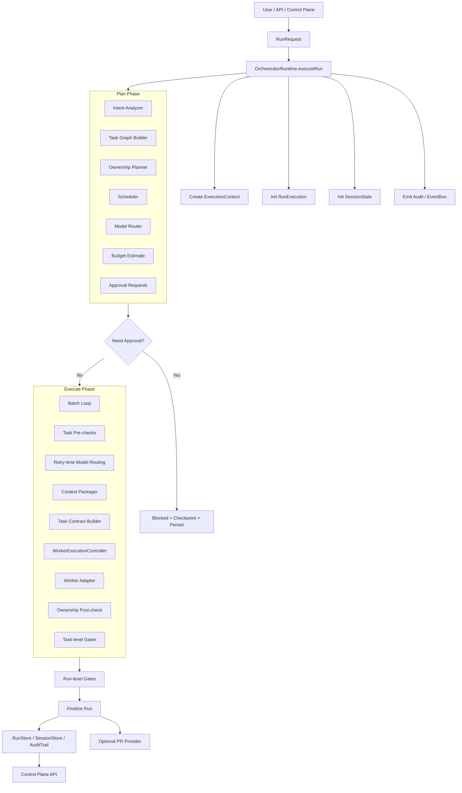
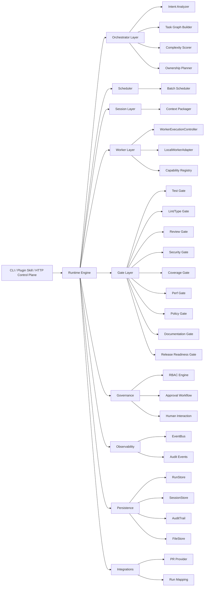

# 01. parallel-harness 全流程架构设计与实现原理

## 1. 文档定位

本文是 `parallel-harness` 在 `2026-03-29` 的 **As-Is 基线架构设计文档**。目标不是重复 README 的理想化宣传，而是把当前仓库里已经存在的控制面、运行时、调度、治理、门禁、持久化与集成链路准确画出来，作为后续修复和增强的统一基线。

分析依据以当前源码为准，重点文件包括：

- `runtime/engine/orchestrator-runtime.ts`
- `runtime/orchestrator/*.ts`
- `runtime/scheduler/scheduler.ts`
- `runtime/session/context-packager.ts`
- `runtime/workers/worker-runtime.ts`
- `runtime/gates/gate-system.ts`
- `runtime/guards/merge-guard.ts`
- `runtime/governance/governance.ts`
- `runtime/persistence/session-persistence.ts`
- `runtime/server/control-plane.ts`

## 2. 总体判断

当前 `parallel-harness` 已经具备一个完整的并行 AI 工程控制面骨架：

- 有统一入口 `OrchestratorRuntime.executeRun()`
- 有 Run/Attempt 状态机
- 有 plan -> schedule -> execute -> verify -> finalize 主链路
- 有 task graph、ownership、model routing、gate、approval、audit、persistence、control plane

但它当前更准确的定位仍然是：

**一个可运行、可测试、可演示的 orchestrator skeleton，而不是已经完成强约束闭环的工业级 harness。**

原因不是“模块缺失”，而是多个核心承诺还没有从文档概念落成执行期硬约束，例如：

- 文件所有权仍是路径级建议，不是强隔离执行模型
- 上下文包接口存在，但主链路默认拿不到真实代码证据
- gate 存在 9 类，但多类仍是启发式代理项
- merge guard、降级管理、复盘指标、PR-level gate 还没有真正串入主闭环

## 3. 生命周期总图



## 4. 模块分层图



## 5. 真实主链路

### 5.1 入口与上下文创建

统一入口是 `OrchestratorRuntime.executeRun()`。它负责创建：

- `ExecutionContext`
- `RunExecution`
- `SessionState`
- 初始审计事件

这一步建立了整个 run 的共享事实源：

- `ctx.config`：全局运行配置
- `ctx.costLedger`：成本账本
- `ctx.policyEngine`：策略评估入口
- `ctx.auditLog`：待刷盘审计缓冲
- `ctx.collectedGateResults`：全局质量结果集合

### 5.2 Plan Phase

Plan 阶段当前由五个核心动作组成：

1. `analyzeIntent()`：从自然语言请求提取核心目标、子目标、工作域、风险、建议模式
2. `buildTaskGraph()`：把子目标转成任务节点，构建 DAG，计算关键路径
3. `planOwnership()`：生成路径级独占/共享读所有权方案
4. `createSchedulePlan()`：按 DAG 生成并发批次
5. `routeModel()`：为任务生成初始模型 tier 建议

当前 planner 的本质是 **规则驱动的启发式 planner**，不是 repo-aware planner：

- 域识别依赖关键词
- 路径映射依赖 `known_modules` 和 round-robin 域分配
- 依赖推断主要依赖路径重叠与 schema/config 关键词

### 5.3 Approval Branch

计划阶段如果产生审批请求，运行时会直接进入阻断态，而不是继续派发：

- 写入 checkpoint
- 持久化 `execution` 与 `result`
- 等待 `approveAndResume()` 或 `rejectRun()`

这说明审批在当前架构里已经是 runtime 内生能力，而不是控制面外挂。

### 5.4 Execute Phase

执行阶段是典型的 “offline schedule + batch runtime” 模型：

1. 遍历 `schedule_plan.batches`
2. 批次内 `Promise.all` 并发执行
3. 批次间串行推进

每个 task 的执行路径是：

1. pre-check：policy / approval / budget / capability / ownership
2. retry-time route：每次 attempt 重新路由模型 tier
3. `packContext()`：打包上下文
4. `buildTaskContract()`：构造任务合同
5. `WorkerExecutionController.execute()`：执行 worker
6. post-check：路径越界校验
7. task-level gates：test / lint_type / review / policy 等

### 5.5 Verify Phase

当前验证是两层结构：

- task-level gate：每个 task 完成后立即执行
- run-level gate：全部批次执行后统一执行

需要特别说明：

- 文档中出现的 `Verifier Swarm`、`VerificationResult`、`Result Synthesizer` 更接近概念层
- 真实主链路里已经落地的是 `GateSystem`
- `MergeGuard` 虽然实现了，但尚未真正串到主链路

### 5.6 Finalize / Persist / PR / Control Plane

收尾阶段会：

1. 汇总 completed / failed / skipped tasks
2. 生成 `RunResult`
3. 生成 `RunQualityReport`
4. 写入 `RunStore`
5. 刷审计日志
6. 完成 session
7. 如果配置了 PR provider，则生成 PR 和 review comments

控制面不是独立系统，而是 `RuntimeBridge` 到 `OrchestratorRuntime` 的薄层桥接。

## 6. 状态机

### 6.1 Run 状态机

当前代码中的真实状态集合是：

```text
pending
-> planned
-> awaiting_approval
-> scheduled
-> running
-> verifying
-> succeeded | failed | blocked | partially_failed | cancelled
-> archived
```

和 README/overview 的差异主要有：

- 实际存在 `partially_failed`
- 实际存在 `cancelled`
- 实际存在 `archived`

### 6.2 Task Attempt 状态机

```text
pending
-> pre_check
-> executing
-> post_check
-> succeeded | failed | timed_out | cancelled
```

## 7. 关键数据对象

当前全流程依赖以下主对象：

| 对象 | 作用 |
|------|------|
| `RunRequest` | 用户输入、actor、project、run config |
| `ExecutionContext` | 运行期共享上下文 |
| `IntentAnalysis` | 请求解析结果 |
| `TaskGraph` | 任务 DAG |
| `OwnershipPlan` | 所有权方案 |
| `SchedulePlan` | 批次调度计划 |
| `RoutingDecision` | 模型 tier 决策 |
| `ContextPack` | 最小上下文包 |
| `TaskContract` | Worker 结构化合同 |
| `TaskAttempt` | 单次 attempt 生命周期 |
| `GateResult` | 单个门禁结果 |
| `RunExecution` | 运行中状态 |
| `RunResult` | 最终输出 |

## 8. 设计原则与现实实现

### 8.1 已经成型的原则

- Graph-first：先 plan，再 dispatch
- Runtime-native governance：审批、策略、RBAC 在 runtime 内部
- Fail-visible：大量事件、审计、状态都可查询
- Cost-aware routing：模型路由与预算相连
- Session durability：具备 checkpoint / resume 骨架

### 8.2 尚未完全成型的原则

- Least-context：上下文打包接口存在，但默认没有真实文件输入
- Least-write：所有权更多是路径级规划，不是执行期原子 reservation
- Independent verification：真实执行链仍主要依赖 gate，merge guard 未入主链
- Safe parallelism：并发执行共享同一工作树，缺乏真正隔离

## 9. 当前架构的现实边界

### 9.1 Planner 仍然是启发式

当前 intent 和 graph 层缺少：

- 仓库文件树 grounding
- import / symbol / dependency grounding
- 变更影响分析
- 现有测试映射

因此它更像 “合理猜测的并行计划器”，而不是 “基于 repo 证据的并行计划器”。

### 9.2 Ownership 仍然是路径级

当前所有权模型的现实边界：

- 只有路径级控制，没有符号级控制
- general task 可能退化到项目根目录
- 冲突在规划期可发现，但 merge guard 未进入执行主链

### 9.3 Context Pack 仍然偏接口壳

`packContext()` 的策略本身是清晰的：

- allowed-path 文件筛选
- 前 N 行 snippet
- 超预算时截短压缩

但主链路的 `getAvailableFiles()` 当前返回空数组，所以默认没有真实代码证据进入上下文包。

### 9.4 Gates 是真实主闭环，Verifiers 仍偏概念层

对当前项目而言，真正已经接线的是：

- `GateSystem`
- task-level / run-level gate

尚未完全接线的是：

- verifier swarm
- merge guard
- PR-level gates
- 独立 evidence aggregator

## 10. 与产品目标的差距

结合你们的插件目标，当前架构距离“全流程稳定编排插件”主要还有五个差距：

1. 需求理解还没有 repo-aware grounding
2. UI/技术方案/实现/测试/报告还没有统一 contract
3. 并行执行还没有真实隔离的 worktree/sandbox
4. 验证还没有形成 hard gates + independent review + evidence bundle
5. 报告生成还没有建立在完整 trace、cost、evidence、risk 汇总之上

## 11. 结论

当前 `parallel-harness` 的正确表述应当是：

**它已经拥有一套完整的 GA 级控制面骨架，但还没有完成从“架构正确”到“执行期强约束闭环”的最后一公里。**

因此，后续增强不应该再停留在“再加一个模块”，而应该集中做五件事：

- repo-aware planning
- write-set reservation
- execution proxy / sandbox
- evidence-based independent verification
- fail-closed persistence and control plane
