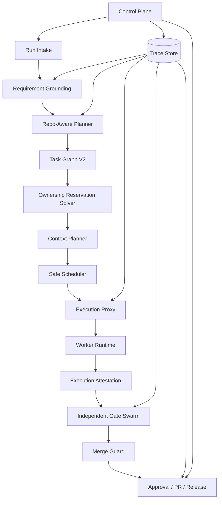

# 05. parallel-harness 修复与增强蓝图

## 1. 北极星目标

把 `parallel-harness` 从“可运行的并行 orchestrator skeleton”升级为：

**面向产品研发全生命周期的高稳定、高约束、高可追溯 harness 编排插件。**

这套插件必须稳定覆盖：

- 需求澄清
- 产品设计
- UI 设计
- 技术方案
- 架构设计
- 前后端代码实现
- 测试设计与质量验证
- 报告生成与发布决策

## 2. 设计原则

### 2.1 五个不可妥协原则

1. `Graph-first`
   复杂任务必须先 plan，再 execute。
2. `Least-context`
   每个任务只能拿到最小必要证据。
3. `Least-write`
   每个任务必须有显式 read-set / write-set。
4. `Independent-verification`
   作者不能做自己的最终裁判。
5. `Durable-governance`
   审批、阻断、恢复、审计必须是 runtime 内生能力。

### 2.2 四个产品级目标

- 正确性：防止错误并发写、防止越权、防止伪完成
- 稳定性：重试改变条件，失败可恢复
- 治理性：审批、策略、证据、审计可闭环
- 专业性：输出方案、报告、验证结论都可追溯

## 3. 目标架构



## 4. 核心改造方案

### 4.1 Workstream A: Requirement Grounding

在当前 `analyzeIntent()` 前新增 `Requirement Grounding` 层，先把自然语言需求固化为结构化交付契约。

建议输出：

```ts
interface RequirementGrounding {
  request_id: string;
  restated_goal: string;
  acceptance_matrix: Array<{
    category: "functional" | "ui" | "architecture" | "security" | "performance" | "testing" | "documentation";
    criterion: string;
    blocking: boolean;
  }>;
  ambiguity_items: string[];
  assumptions: string[];
  impacted_modules: string[];
  required_artifacts: string[];
  required_approvals: string[];
}
```

必须做到：

- 高歧义请求不能直接进入 dispatch
- 验收矩阵成为后续所有 gate 的统一真相源
- 报告必须引用 grounding 中的 criterion

### 4.2 Workstream B: Repo-Aware Planner

替换当前启发式 planner，增加 repo-aware grounding：

- 文件树摘要
- import / dependency graph
- changed module candidates
- symbol reference graph
- existing tests map

建议新的任务对象：

```ts
interface PlannedTaskV2 {
  task_id: string;
  phase: "product" | "ui" | "architecture" | "implementation" | "testing" | "reporting";
  objective: string;
  depends_on: string[];
  read_set: string[];
  write_set: string[];
  artifact_outputs: string[];
  verifier_plan: string[];
  risk: "low" | "medium" | "high" | "critical";
}
```

### 4.3 Workstream C: Ownership Reservation Solver

把所有权从“路径级建议”升级为“调度前硬约束”。

新的语义：

- `read_set`：可共享
- `write_set`：不可共享
- `reserved_paths`：原子 reservation
- `merge_guard_only`：不允许同批并发，只允许最终收敛时对齐

调度规则：

1. write-set 相交的任务禁止同批并发
2. 高风险任务默认降并发
3. reservation 失败立即回退到 hybrid 或 serial

### 4.4 Workstream D: Context Planner / Envelope V2

把现有 `packContext()` 升级为真正的上下文治理系统。

建议：

```ts
interface ContextEnvelopeV2 {
  task_id: string;
  policy_capsule: string;
  requirement_capsule: string;
  dependency_outputs: Array<{ task_id: string; artifact_ref: string }>;
  evidence_items: Array<{
    type: "file" | "snippet" | "symbol" | "issue" | "adr" | "test" | "policy";
    ref: string;
    rationale: string;
  }>;
  token_budget: number;
  occupancy_ratio: number;
  compaction_policy: "none" | "summarize" | "retrieve_only" | "symbol_only";
}
```

必须做到：

- 主链路真实加载文件/snippet
- 每次 attempt 记录 `occupancy_ratio`
- verifier 上下文与 author 上下文分离

### 4.5 Workstream E: Execution Proxy

这是最关键的执行期升级。

在 `LocalWorkerAdapter` 前增加真正的 execution proxy，负责：

- 真实模型 tier -> provider/model 映射
- tool allowlist / denylist enforcement
- 文件系统 sandbox
- worktree / branch / patch 隔离
- tool call tracing
- diff attestation

建议输出：

```ts
interface ExecutionAttestation {
  attempt_id: string;
  task_id: string;
  actual_model: string;
  tool_calls: Array<{ name: string; args_hash: string; started_at: string; ended_at: string }>;
  modified_files: string[];
  git_diff_ref: string;
  sandbox_violations: string[];
  token_usage: { input: number; output: number; reasoning?: number };
}
```

### 4.6 Workstream F: Independent Gate Swarm

把当前 gate system 拆成两层：

#### F1. Hard Gates

- test
- lint / type / build
- policy
- security scan
- merge guard
- hidden regression
- release readiness

#### F2. Signal Gates

- summary quality
- suspicious diff size
- test delta anomaly
- documentation drift
- perf suspicion

建议所有 gate 统一产出：

```ts
interface GateEvidenceBundle {
  gate_id: string;
  gate_type: string;
  verdict: "passed" | "failed" | "warning";
  blocking: boolean;
  evidence_refs: string[];
  produced_by: "tool" | "verifier_agent" | "hidden_suite" | "policy_engine";
  anti_gaming_signals: string[];
}
```

### 4.7 Workstream G: Run Evidence Aggregator

新增 `RunEvidenceAggregator`，在 run-level gate 与报告层之前统一聚合：

- execution attestation
- modified files
- test/build/type/security artifacts
- coverage delta
- approval chain
- cost ledger
- gate evidence

没有这个聚合层，报告与发布结论都只能基于碎片信息。

### 4.8 Workstream H: Control Plane V2

控制面升级目标：

- run timeline
- task graph board
- attempt trace
- gate evidence viewer
- approval inbox
- cost dashboard
- replay / resume / cancel
- report export

并解决：

- control-plane actor 权限问题
- durable store 原子写入问题
- 状态与结果一致性问题

## 5. 分阶段落地计划

### Phase 0: 正确性止血

目标：

- 修复最严重的 fail-closed 与状态机问题
- 修复结果持久化时序问题
- 修复控制面与 RBAC 不兼容问题

完成标准：

- run-level gate 阻断后不会被判为 succeeded
- skipped tasks 不会生成 succeeded 最终态
- durable result 始终等于最终真相

### Phase 1: 真实隔离执行

目标：

- execution proxy 上线
- worktree / sandbox / tool enforcement 上线
- ownership reservation 与 safe scheduler 打通

完成标准：

- 同批任务不会共享无隔离工作树
- tool policy 为强执行，不再只是 env hint
- merge guard 进入主链

### Phase 2: 上下文与规划升级

目标：

- repo-aware planner
- requirement grounding
- context envelope v2

完成标准：

- 每个 task 都能追溯 evidence refs
- ambiguity 高的任务不会直接执行
- 每个 attempt 都有 context budget 与 occupancy 记录

### Phase 3: Gate 与报告升级

目标：

- hard gates / signal gates 拆分
- hidden regression / anti-gaming signals
- run evidence aggregator
- 专业化报告生成

完成标准：

- 报告可引用证据
- gate 结论有 evidence bundle
- 测试、审查、发布结论可回放

### Phase 4: 全流程产品化

目标：

- 产品设计、UI 设计、技术方案、实现、测试、报告统一纳入同一 harness
- 阶段级模板、角色、verifier、artifact schema 全面标准化

完成标准：

- 一个 run 可跨多个阶段追溯
- 阶段交付物统一进入报告与发布决策

## 6. 优先级排序

### P0

- 修状态机 fail-closed
- 修 final status 判定
- 修 durable result 写入顺序
- 接入 merge guard

### P1

- execution proxy
- ownership reservation
- control-plane governance
- FileStore 原子落盘

### P2

- requirement grounding
- repo-aware planner
- context envelope v2

### P3

- gate swarm v2
- evidence aggregator
- report generation v2
- full lifecycle phase orchestration

## 7. 验收指标

建议为后续版本设置可量化指标：

| 指标 | 目标 |
|------|------|
| 状态机正确性 | 所有 blocked / failed / partially_failed 终态均 fail-closed |
| 并发冲突率 | 同批 write-set 冲突为 0 |
| 上下文预算 | 90% 以上 attempt 具备显式 occupancy 记录 |
| 测试义务覆盖 | 高风险改动 100% 进入测试计划与 gate |
| anti-gaming 检测 | 源码变更无测试变更时 100% 产出信号或阻断 |
| 报告可追溯性 | 所有关键结论都带 evidence refs |
| 恢复能力 | 长流程支持 task-level resume，不需整局重来 |
| 控制面闭环 | cancel / approve / reject / replay 全部在治理模式下可用 |

## 8. 与你们插件目标的对应关系

如果目标是“最强的 parallel-harness 编排插件”，最终产品结构建议是：

- `Lifecycle Harness`
  - 统一编排研发全流程
- `Execution Harness`
  - 强执行隔离与模型路由
- `Verification Harness`
  - gate、review、hidden tests、release readiness
- `Governance Harness`
  - approval、policy、RBAC、audit
- `Reporting Harness`
  - 专业报告、证据汇总、交付归档

## 9. 结论

当前项目并不需要推倒重来。最合理的路线是：

**保留现有 Runtime Engine 骨架，围绕 planner、context、execution、verification、governance 五条主线做闭环增强。**

只要把这五条主线打通，`parallel-harness` 就能从“会并行的 agent 控制面”升级成“真正能稳定覆盖产品研发全流程的治理型编排插件”。
