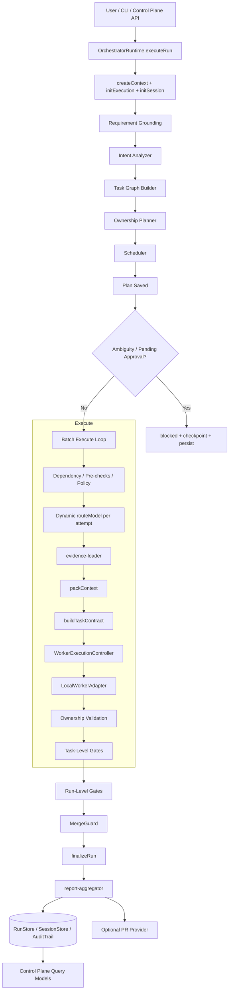
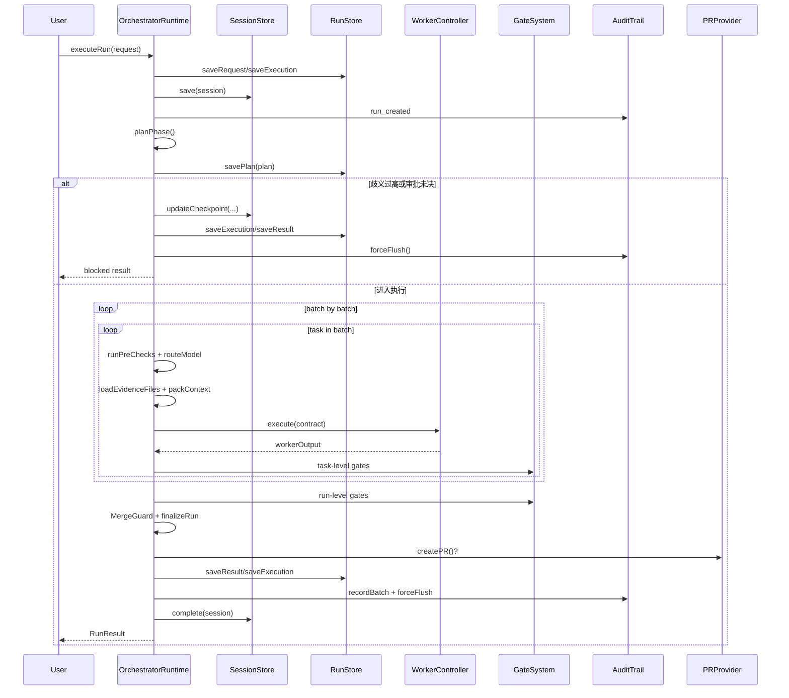
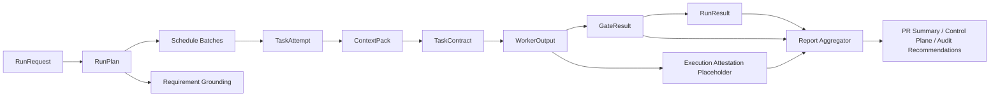

# 01. parallel-harness 生命周期与 As-Is 架构设计

## 1. 文档目标

本文描述的是 `parallel-harness` 在 **2026-03-30 当前工作区** 中已经落地的真实架构，而不是 README 中的理想化蓝图。目标有三件事：

1. 给出从需求进入到报告/PR 产出的完整生命周期主链。
2. 给出当前模块边界、数据流、控制流和证据流。
3. 明确 As-Is 已经做到什么、还缺什么，作为后续增强蓝图的基线。

本文依据的核心实现：

- `runtime/engine/orchestrator-runtime.ts:449-719`
- `runtime/engine/orchestrator-runtime.ts:739-836`
- `runtime/engine/orchestrator-runtime.ts:839-1197`
- `runtime/engine/orchestrator-runtime.ts:1203-1500`
- `runtime/engine/orchestrator-runtime.ts:1510-1594`
- `runtime/engine/orchestrator-runtime.ts:1860-1947`
- `runtime/models/model-router.ts:140-168`
- `runtime/session/context-packager.ts:55-97`
- `runtime/orchestrator/requirement-grounding.ts:18-84`
- `runtime/gates/gate-system.ts:73-128`
- `runtime/gates/gate-system.ts:175-823`
- `runtime/workers/execution-proxy.ts:35-72`
- `runtime/integrations/pr-provider.ts:127-289`
- `runtime/integrations/report-aggregator.ts:24-45`
- `runtime/capabilities/capability-registry.ts:94-247`

本地验证基线：

- `cd plugins/parallel-harness && bun test` -> `241 pass / 0 fail / 535 expect() / 10 files`
- `cd plugins/parallel-harness && bunx tsc --noEmit` -> 失败

## 2. 执行摘要

`parallel-harness` 已经不是“只有概念图”的项目。当前实现中，统一运行时已经把以下链路接到了主链上：

- `Requirement Grounding`
- `Intent Analyzer`
- `Task Graph Builder`
- `Ownership Planner`
- `Scheduler`
- 动态 `Model Router`
- `evidence-loader + packContext`
- `WorkerExecutionController`
- task-level gates
- run-level gates
- `MergeGuard`
- `finalizeRun`
- `report-aggregator`
- 可选 PR 集成
- `RunStore / SessionStore / AuditTrail / Control Plane`

但它当前更准确的定位仍然是：

**一个已经打通主生命周期、具备治理骨架的并行 orchestrator，而不是已经完成执行硬化的工业级 harness。**

主要原因不是“少功能”，而是这几条控制链还没完全闭环：

- 规划层对象还没有全部下沉成执行硬约束。
- worker 执行边界仍以 prompt 和事后校验为主。
- gate 中只有一部分是真实工程检测，另一部分仍是启发式信号。
- 上下文预算、需求 grounding、PR 仓库隔离、可信 attestation 还没有形成强闭环。

## 3. As-Is 总体架构图

## 4. 生命周期图

## 5. 模块边界与职责

| 层 | 关键文件 | 当前职责 | As-Is 判断 |
|----|----------|----------|-------------|
| Intake / Runtime | `runtime/engine/orchestrator-runtime.ts` | 统一入口、状态机、审批恢复、主链编排 | 已是系统心脏，主链完整 |
| Requirement / Planning | `runtime/orchestrator/requirement-grounding.ts` `intent-analyzer.ts` `task-graph-builder.ts` `ownership-planner.ts` | 需求结构化、任务图、所有权、依赖 | 已接入主链，但 repo-aware 程度不足 |
| Scheduling / Routing | `runtime/scheduler/scheduler.ts` `runtime/models/model-router.ts` | 批次调度、tier 路由、重试升级 | 已工作，但 context budget 未闭环 |
| Context | `runtime/session/evidence-loader.ts` `runtime/session/context-packager.ts` | 读取证据文件、抽取 snippets、组装 `ContextPack` | 已不再是空壳，但压缩仍偏静态 |
| Worker | `runtime/workers/worker-runtime.ts` `orchestrator-runtime.ts:1860-1947` | contract 执行、超时、沙箱检查、能力匹配 | 仍以本地 CLI prompt 包装为主 |
| Governance | `runtime/governance/**` | RBAC、Policy、Approval | 主链已消费一部分，审批可 checkpoint/resume |
| Verification | `runtime/gates/gate-system.ts` `runtime/guards/merge-guard.ts` | task/run 级 gate、写集收敛 | gate 数量足够，但质量层级混杂 |
| Persistence / Audit | `runtime/persistence/session-persistence.ts` | request/plan/result/session/audit 落盘 | 方向正确，支撑查询与恢复 |
| Control Plane | `runtime/server/control-plane.ts` | run 列表、详情、审批、取消 | 读模型可用，但写模型能力仍有限 |
| Integration | `runtime/integrations/pr-provider.ts` `report-aggregator.ts` | PR 产出、报告汇总 | 已进入主链，但 repo identity 仍不硬 |
| Extension | `runtime/capabilities/capability-registry.ts` | Hook / Skill / Instruction 注册 | 有扩展面，尚未深度影响主链决策 |

## 6. 数据流与证据流

当前最关键的数据对象主线如下：

| 阶段 | 输入 | 输出 |
|------|------|------|
| Intake | `RunRequest` | `ExecutionContext` `RunExecution` `SessionState` |
| Plan | `RunRequest` | `RunPlan` |
| Execute | `TaskNode` `OwnershipPlan` `ContextPack` | `TaskAttempt` `WorkerOutput` |
| Verify | `WorkerOutput` `RunPlan` | `GateResult[]` |
| Finalize | `RunExecution` `GateResult[]` | `RunResult` |
| Operate | `RunResult` `AuditEvent[]` | `RunDetail` `RunSummary` |

## 7. 当前实现原理

### 7.1 规划是 graph-first，不是自由 agent loop

运行时先 `planPhase()`，再 `executePhase()`，不是让 agent 自由决定下一步。`RunPlan` 中已经明确包含：

- `task_graph`
- `ownership_plan`
- `schedule_plan`
- `routing_decisions`
- `budget_estimate`
- `pending_approvals`
- `requirement_grounding`

这意味着系统天然偏向“先结构化，再执行”。

### 7.2 生命周期已支持阻断、恢复与继续执行

当前实现里，“阻断”不是外围流程，而是运行时主状态的一部分：

- `requirement_grounding` 歧义过高会直接 `blocked`
- `pending_approvals` 会写 checkpoint 后阻断
- task 级审批同样会 checkpoint，并支持 `approveAndResume()`

这使得：

- `resume` 不是重跑整局
- 已完成 task 会被跳过
- 审批流和状态机已经内嵌到主链

### 7.3 并行模型是“批次内并发，批次间串行”

调度器先生成 `schedule_plan.batches`，然后 runtime 按 batch 顺序推进；每个 batch 内部 `Promise.all` 并行执行任务。它的并行语义是：

1. 规划阶段先给出依赖和批次。
2. 同批内并发执行。
3. 批次之间严格串行推进。

这比自由多 agent 更可控，但也意味着并行效率上限受调度前置推断能力影响。

### 7.4 动态模型路由已经是主链机制

`routeModel()` 不只在计划阶段执行一次，task 的每次 attempt 都会重新路由，且 `max_model_tier` 在计划期和重试期都被二次强制应用。这一点已经比旧版更稳：

- 计划阶段限幅：`orchestrator-runtime.ts:764-796`
- 重试阶段限幅：`orchestrator-runtime.ts:917-931`

当前真实短板不是“重试失去 tier 限制”，而是：

- `RoutingResult.context_budget` 没有传给 `packContext()`
- tier 仍只影响 prompt 中的 hint，而没有映射到可信执行环境

### 7.5 上下文打包已接真实证据，但仍是轻量版

当前 `getAvailableFiles()` 会通过 `evidence-loader` 读取真实文件，再喂给 `packContext()`，所以“packContext 完全空壳”这个判断已经过时。

但当前 context 仍有明显限制：

- `packContext()` 只基于 `allowed_paths` 选文件和首段 snippets
- 压缩本质上仍是裁剪片段，不是语义摘要
- `context_budget` 没和 `routeModel()` 的预算联动

因此，As-Is 可以说是“已打通证据注入”，还不能说“已完成上下文治理闭环”。

### 7.6 Worker 执行仍是 CLI prompt 包装

当前默认本地 worker 实现是：

- 根据 `TaskContract` 拼 prompt
- 调 `claude -p`
- 通过输出文本解析 `MODIFIED:` 或工具调用痕迹

这条链路能跑，但还不是强执行代理：

- cwd 可以设置
- 工具策略主要通过环境变量提示
- 路径越界主要在执行后由 ownership 和 sandbox 再检查
- `ExecutionProxy` 只是事后生成 attestation 占位对象

所以运行时已经有“执行控制面”，但还缺“执行硬隔离层”。

### 7.7 验证体系已成形，但 gate 质量不均匀

`GateSystem` 注册了 9 类 gate，并支持 task/run 层评估。当前真实情况是：

- `test` 和 `lint_type` 更接近真实工具执行
- `policy` 接了策略引擎
- `review/security/perf/coverage/documentation/release_readiness` 中有相当一部分仍是启发式或 proxy

因此它已经是“质量系统主链”，但还不能等价于“9 个同等级的硬门禁”。

### 7.8 MergeGuard 已经在主链，但位置仍偏后验

旧结论里“MergeGuard 没进主链”已经不成立。当前实现中，MergeGuard 在最终状态判定前执行，并影响 run 是否被阻断。

不过它现在仍是 **finalize 前的一次收敛检查**，而不是：

- dispatch 前 reservation
- PR 前 repo identity 复核
- release 前最终 attestation 复核

### 7.9 报告、PR、控制面都已经接上结果面

当前主链末端已经做到：

- `finalizeRun()` 汇总 `RunResult`
- `report-aggregator` 汇总 gate 证据引用
- 可选 `PRProvider` 创建 PR、评论、checks
- `Control Plane` 从 store + audit 中重建列表、详情、timeline

但也要看到：

- `report-aggregator` 现在只聚合 gate refs，不包含可信 attestation 或丰富 artifacts
- `PRProvider` 缺少显式 `repo_root/cwd`
- `Control Plane` 还没有把 graph、occupancy、reservation、evidence bundle 展示完整

## 8. As-Is 成熟度判断

### 8.1 已经成立的能力

| 能力 | 现状 |
|------|------|
| 统一生命周期主链 | 已成立 |
| task graph + ownership + scheduler | 已成立 |
| 歧义阻断 + 审批阻断 + checkpoint/resume | 已成立 |
| 动态 route + retry 升级 | 已成立 |
| evidence-loader + packContext | 已成立，但仍是 V1 |
| task/run 级 gates | 已成立 |
| MergeGuard 主链集成 | 已成立 |
| RunResult 持久化与控制面读取 | 已成立 |
| PR 集成和报告聚合 | 已成立，但非硬隔离 |

### 8.2 仍未闭环的能力

| 能力 | 当前缺口 |
|------|----------|
| repo-aware planning | 规划主要还是关键词/路径级，不是符号/依赖级 |
| grounding 消费闭环 | `acceptance_matrix` 等多数未下沉到 contract/gates |
| context budget 闭环 | 路由预算未进入 packer |
| execution hardening | worker 仍是 prompt + CLI + 事后校验 |
| trusted attestation | 不是来自真实工具链遥测 |
| gate 分层 | hard gate 与 signal gate 未正式拆开 |
| PR/repo isolation | git/gh 执行未显式绑定 repo root |
| 扩展层生效 | hooks/instructions/skills 多为注册，不是决策输入 |
| 工程基线完整性 | `bun test` 绿，但 `tsc --noEmit` 红 |

## 9. As-Is 与目标态差距

| 主题 | 目标态 | 当前现实 | 关键风险 |
|------|--------|----------|----------|
| 需求理解 | grounding 成为全链真相源 | 主要只用于入口歧义阻断 | 验收矩阵无法贯通实现与验证 |
| 规划 | repo-aware DAG + 接口依赖 | 仍偏启发式 | 大仓/复杂依赖下拆分不稳 |
| 上下文 | budget-aware context envelope | 已有 evidence pack，但不联动 routing budget | 长上下文退化无法被系统抑制 |
| 执行 | 可信 execution proxy + 隔离 | 本地 CLI prompt 包装 | 越权写入与工具滥用只能事后发现 |
| 验证 | hard/signal gate 分层 | 混合真实工具和启发式 proxy | 质量报告容易看起来比真实更强 |
| 合并 | dispatch 前 reservation + pre-PR recheck | 只有 finalize 前 MergeGuard | 冲突发现太晚 |
| 仓库集成 | repo-aware PR/CI | PR provider 无显式 repo_root | 错仓执行 git/gh |
| 审计 | 可信 attestation + evidence bundle | attestation 为后置包装 | 难支撑高风险发布审计 |

## 10. 架构结论

对当前 `parallel-harness` 最准确的架构判断是：

1. 它已经具备了从需求进入、图构建、并行执行、验证、收尾、持久化到控制面的完整主链。
2. 它真正的差异化方向不是“多 agent 数量”，而是“面向代码交付的治理型 orchestrator”。
3. 它距离“最强 harness”还差的，不是再多几个阶段名称，而是把现有对象升级成硬约束：`Requirement Grounding`、`ContextPack`、`OwnershipPlan`、`ExecutionAttestation`、`GateEvidence`、`PR repo isolation`。

换言之，当前项目最适合的下一步不是继续堆叠概念，而是把已经进入主链的这些模块做成 **可信、可证、可恢复、可阻断** 的执行闭环。
