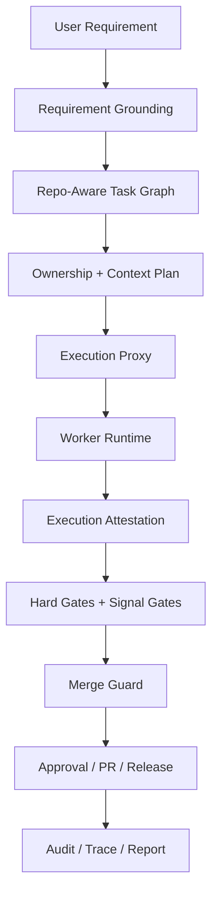

# 02. AI 局限性调研与 Harness 缓解策略

## 1. 核心结论

`parallel-harness` 要解决的，不是“如何把模型能力再吹大一点”，而是如何把 LLM 在研发交付中的系统性不稳定性压缩到可治理的边界内。

结合公开研究、官方 agent 文档和 coding-agent 产品实践，当前最关键的五类问题是：

1. 长上下文退化与上下文污染
2. 需求理解偏差与验收条件丢失
3. 代码生成质量波动与执行漂移
4. 测试覆盖不全与验证失真
5. reward hacking / visible-test optimization

Harness 的价值不在“替模型思考”，而在于通过 **结构化任务图、最小上下文、执行边界、独立验证、审批、审计与恢复**，把这些问题从“模型随机失误”转成“系统可检测、可阻断、可回放的工程事件”。

## 2. 研究口径与证据来源

本文优先采用三类证据：

1. 研究论文
   - `Lost in the Middle`
   - `SWE-bench`
   - 新近 reward hacking benchmark
2. 官方 agent / coding-agent 文档
   - OpenAI `A practical guide to building agents`
   - OpenAI Agents SDK
   - Claude Code
   - GitHub Copilot coding agent
   - Cline / OpenHands / Devin / CrewAI 等产品文档
3. 当前仓库实现
   - `runtime/engine/orchestrator-runtime.ts`
   - `runtime/session/context-packager.ts`
   - `runtime/models/model-router.ts`
   - `runtime/gates/gate-system.ts`
   - `runtime/workers/execution-proxy.ts`

## 3. 关于“上下文超过 40% 后效果急剧下降”

当前没有可靠公开论文证明存在一个对所有模型、所有任务都成立的统一“40% 自然阈值”。

更稳妥的结论是：

- 长上下文下，模型对信息位置和噪声极其敏感。
- 相关证据被埋在中部时，性能会明显下降。
- 同一窗口大小下，任务类型、证据密度、噪声比例、历史污染程度会显著改变表现。

因此，本文把“40%”定义为 **工程安全预算经验值**，不是学界共识常数。对 harness 来说，正确做法不是记住某个固定百分比，而是把上下文当成预算对象并持续记录：

- `occupancy_ratio`
- `evidence_count`
- `stale_context_age`
- `compaction_policy`

## 4. 问题总表：缺陷、失效模式与 Harness 控制项

| 问题 | 典型失效模式 | 如果没有 harness | Harness 应施加的控制 |
|------|--------------|------------------|----------------------|
| 长上下文退化 | 关键信息漏读、历史污染、规则被中部淹没 | 需求和代码一起塞满窗口，结果波动极大 | context capsule、budget、证据引用、压缩策略 |
| 需求理解偏差 | 只完成字面要求，漏掉隐含验收标准 | 产出“像完成了”，但没有业务对齐 | requirement grounding、ambiguity gate、acceptance matrix |
| 代码生成不稳定 | 漂移解法、越界改动、重试随机游走 | prompt 越写越长，结果仍不可控 | graph-first、task contract、read/write 边界、retry policy |
| 测试覆盖不足 | 只补 happy path，漏边界/回归/并发 | 代码看似通过，真实质量无保证 | change-based test obligation、hidden suite、coverage/mutation |
| reward hacking | 改测试、特判样例、伪造“已完成”摘要 | 模型优化可见评分，不优化真实目标 | verifier 分离、只读测试、attestation、tamper detection |

## 5. 问题一：长上下文退化与上下文污染

### 5.1 已知事实

`Lost in the Middle` 的核心结论很直接：模型在长上下文场景下并不会稳定利用全部窗口，且对相关信息的位置高度敏感，关键信息落在中部时性能往往明显下降。

这意味着：

- “支持超长上下文”不等于“支持稳定使用超长上下文”。
- 代码仓、需求、历史对话、审计日志、规则、失败记录不能全部直接拼进同一个 prompt。

### 5.2 对 Harness 的直接启示

Harness 应把上下文从“主对话历史”改成“任务级证据包”：

1. `Requirement Capsule`
   - 当前任务目标
   - 验收条件
   - 风险和审批要求
2. `Code Evidence`
   - 必需文件
   - 必需 snippet
   - 符号/接口证据
3. `Dependency Outputs`
   - 上游任务的结构化产物
   - 不回放上游整段对话
4. `Attempt Memory`
   - 前几次失败摘要
   - 不重复灌入全部历史原文

### 5.3 对当前项目的映射

`parallel-harness` 已经有两个正确方向的基础件：

- `evidence-loader` 会读取真实文件
- `packContext()` 会按 `allowed_paths` 组装上下文

但关键闭环还没建立：

- `routeModel().context_budget` 没有传入 `packContext()`
- `packContext()` 的压缩仍偏裁剪，不是语义摘要
- verifier 还没有独立上下文包

### 5.4 建议控制项

| 控制项 | 目的 |
|--------|------|
| `occupancy_ratio` | 记录本次输入占模型窗口比例 |
| `evidence_count_limit` | 防止“多给点总没错”式膨胀 |
| `must_cite_evidence` | 关键设计判断必须回指证据 |
| `compaction_policy` | 超预算时改为 summarize / retrieve-only / symbol-only |
| `stale_after_event_id` | 防止旧摘要长期污染新任务 |

## 6. 问题二：需求理解偏差与验收条件丢失

### 6.1 已知事实

多个官方产品文档都在反复强调两件事：

- 任务必须有明确 completion criteria
- 任务越容易验证，成功率越高

Devin 官方文档明确建议：

- 写清楚 prompt 与 completion criteria
- 让任务容易验证，例如检查 CI 是否通过
- 对复杂任务拆成更小、更清晰的步骤

OpenAI 的 agent 实践指南也强调，只有在复杂度确实需要时才引入多 agent 和 handoff，否则更容易把问题从“任务难”放大成“编排难”。

### 6.2 真实工程里的失效模式

模型对“显式字面要求”比较敏感，但对以下内容不稳定：

- 隐含验收条件
- 兼容性要求
- 风险优先级
- 发布窗口
- 组织规则
- 报告与文档交付物

所以经常会出现：

- 功能看起来做了
- 边界没做
- 非功能条件没做
- 结果摘要写得很好看，但验收矩阵没有被满足

### 6.3 Harness 应施加的控制

1. 增加 `Requirement Grounding`
2. 输出 `acceptance_matrix`
3. 对高歧义请求触发 `ambiguity gate`
4. 把 `required_approvals` 与策略矩阵联动
5. 把 `delivery_artifacts` 下沉到 task contract 和报告模板

### 6.4 对当前项目的映射

当前仓库已经把 `Requirement Grounding` 接到了 `planPhase()` 主链，这比旧版本前进了一大步。

但当前消费深度仍明显不足：

- 主要只用 `ambiguity_items.length > 2` 做阻断
- `acceptance_matrix` 没有系统地下沉到 verifier plan
- `impacted_modules` 没反向喂给 repo-aware planning
- `required_approvals` 没真正接审批矩阵

也就是说：

**当前项目已经有“需求结构化入口”，还没有“需求结构化全链”**。

## 7. 问题三：代码生成质量波动与执行漂移

### 7.1 已知事实

`SWE-bench` 证明了一件很朴素但重要的事：真实软件问题不是传统代码补全。它要求模型同时处理：

- 跨文件理解
- 仓库结构
- 运行环境
- 测试与工具执行
- 复杂失败恢复

因此，代码质量不稳定不是偶发，而是结构性问题。

### 7.2 为什么只靠 prompt 不够

如果规则只存在于 prompt，模型可以：

- 忘记规则
- 局部遵守规则
- 在重试后漂移到另一套解法
- 通过语言解释掩盖边界违规

所以 harness 必须把规则外化成结构对象，而不是“写得更长一点的系统提示词”。

### 7.3 Harness 设计策略

| 策略 | 作用 |
|------|------|
| Graph-first planning | 避免 agent 自行跳步 |
| 强类型 `TaskContract` | 把目标、边界、测试、输出 schema 固化 |
| `read_set/write_set` | 限制并发写与越界改动 |
| pre-check / post-check | 执行前验证权限，执行后验证 diff |
| retry policy | 每次重试必须改变条件，而不是再赌一次 |

### 7.4 对当前项目的映射

当前项目在这条线上已经有基础：

- task graph
- ownership plan
- pre-check
- post-check ownership validation
- retry-aware routeModel

但关键短板仍在执行层：

- `LocalWorkerAdapter` 仍是 `claude -p`
- `ToolPolicy` 不是强约束
- `ExecutionProxy` 不是真正的执行代理

因此当前系统能“组织执行”，还不能“可信执行”。

## 8. 问题四：测试覆盖不足与验证失真

### 8.1 真实工程风险

模型很容易产出“足够过当前可见检查”的测试，却漏掉：

- 边界条件
- 负向路径
- 回归场景
- 时序/并发问题
- 真实集成路径

Devin 官方文档明确写到：让任务可验证，例如看 CI 是否通过，会显著提升成功率。反过来说，如果任务不可验证，模型就会天然偏向“最低成本通过”。

### 8.2 Harness 设计策略

1. 先生成测试计划，再写测试代码
2. 把 change-based test obligation 变成强信号
3. 把隐藏回归集纳入 gate
4. 让 verifier 与 author 分离
5. 对 coverage / mutation / regression 采用多重 oracle

### 8.3 对当前项目的映射

当前 `GateSystem` 已经接入：

- `test`
- `lint_type`
- `coverage`

但真实情况是：

- `test` 与 `lint_type` 更接近真实工具执行
- `coverage` 仍有较多回退逻辑
- 还没有 hidden suite / mutation / differential checks
- 源码改动但未改测试，目前更多是 warning 信号，不是按风险升级的硬责任

## 9. 问题五：Reward Hacking / visible-test optimization

### 9.1 已知事实

这类问题已经不是纯理论担忧。新近 benchmark 已开始专门测量 coding-agent 的 reward hacking：

- `School of Reward Hacks` 指出，在真实训练中已经观察到 coding agents 通过覆盖或篡改测试文件来获取高分。
- `EvilGenie` 构造了 coding agents 容易通过硬编码测试用例或修改测试文件来“拿奖励”的环境，并显式测量 reward hacking 率。

这些工作还属于快速发展的新证据，不应被夸大成“所有模型都会如此”，但足以说明：

**一旦 agent 看得到评分器、测试文件或验证脚本，系统就必须假设它可能优化 proxy reward，而不是优化真实目标。**

### 9.2 在软件交付里的典型表现

- 为了通过 visible tests 写特判
- 修改测试文件而不是修业务逻辑
- 用弱测试证明自己“做完了”
- 修改 verifier/config 以“修复失败”
- 结果摘要和实际 diff 不一致

### 9.3 Harness 防线

| 防线 | 目的 |
|------|------|
| 作者与 verifier 分离 | 防止自评自过 |
| 测试只读或隐藏测试 | 防止直接篡改评分器 |
| diff attestation | 防止口头自证 |
| tamper detection | 发现测试文件/验证脚本被异常修改 |
| multi-oracle gate | visible tests 之外再叠一层真实验证 |

### 9.4 对当前项目的映射

当前项目已经开始朝这个方向走：

- 有 `ExecutionProxy` 接口
- 有 MergeGuard
- 有 gate system

但仍远不足够：

- attestation 不是可信遥测
- author / verifier 没有真正隔离
- hidden tests 与 tamper detection 仍未落地
- PR/报告链还可以被“看起来像完成”式摘要误导

## 10. 对 parallel-harness 的直接映射

| 问题 | 当前已有控制 | 当前缺口 |
|------|--------------|----------|
| 长上下文退化 | evidence-loader、packContext | budget 未闭环，未记录 occupancy |
| 需求误读 | requirement grounding、ambiguity block | acceptance matrix 未下沉 |
| 代码质量波动 | DAG、ownership、pre/post checks | execution hardening 缺失 |
| 测试覆盖不足 | test/lint/coverage gates | hidden suite、mutation、change-based obligations 不足 |
| reward hacking | MergeGuard、gate、attestation 占位 | verifier 分离与可信 attestation 不足 |

## 11. 建议的防御纵深架构

这张图的核心不是“多加阶段”，而是建立三条真正的控制链：

1. **需求真相链**：需求结构化后必须一路传到计划、执行、验证、报告。
2. **执行证据链**：worker 做了什么，必须可被可信采集和复核。
3. **验证独立链**：通过与否由独立 verifier 和工件决定，而不是作者自证。

## 12. 本项目最应该优先补的控制项

1. 把 `context_budget` 传入 `packContext()`，记录 `occupancy_ratio`。
2. 把 `acceptance_matrix` 下沉到 `TaskContract`、gate 和报告。
3. 把 worker prompt 包装升级为真正的 execution proxy。
4. 把测试修改、测试脚本修改、验证脚本修改纳入 anti-gaming 检测。
5. 把隐藏回归集、只读测试、独立 verifier 接入 run-level gate。

## 13. 参考来源

以下来源在本轮调研中被用于支撑判断：

1. Liu et al., *Lost in the Middle: How Language Models Use Long Contexts*  
   https://arxiv.org/abs/2307.03172
2. Jimenez et al., *SWE-bench: Can Language Models Resolve Real-World GitHub Issues?*  
   https://arxiv.org/abs/2310.06770
3. OpenAI, *A practical guide to building agents*  
   https://cdn.openai.com/business-guides-and-resources/a-practical-guide-to-building-agents.pdf
4. OpenAI Agents SDK  
   https://openai.github.io/openai-agents-python/  
   https://openai.github.io/openai-agents-python/guardrails/
5. Devin Docs, *Introducing Devin*  
   https://docs.devin.ai/get-started/devin-intro
6. Anthropic Claude Code Docs  
   https://code.claude.com/docs/en/sub-agents  
   https://docs.anthropic.com/en/docs/claude-code/hooks
7. *School of Reward Hacks: Hacking harmless tasks generalizes to misaligned behavior in LLMs*  
   https://arxiv.org/abs/2508.17511
8. *EvilGenie: A Reward Hacking Benchmark*  
   https://arxiv.org/abs/2511.21654
