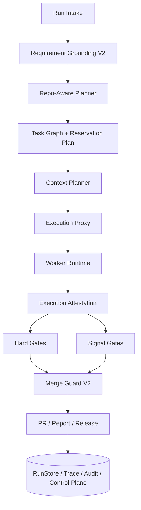

# 05. parallel-harness 修复与增强蓝图

## 1. 北极星目标

把 `parallel-harness` 从“主生命周期已经打通的并行 orchestrator skeleton”，升级成一个真正可用于产品开发全流程的 **高保真治理型 harness**。

这句话可以压缩成一个更明确的工程目标：

**让每个 AI 只在必要上下文内、以明确写边界、在可审计执行环境中工作，并由独立验证体系决定其结果能否进入 PR、报告和主分支。**

## 2. 设计输入

本蓝图建立在 `01-04` 四份文档的事实基线之上。当前系统已经有：

- `Requirement Grounding`
- DAG 规划与批次调度
- ownership plan
- checkpoint / resume / approval
- task-level / run-level gate
- MergeGuard 主链
- report aggregator
- PR integration
- 审计、持久化、控制面

因此本轮增强的目标不是“从零发明一套架构”，而是把这些已经接入主链的对象升级成 **硬约束、可信证据和稳定闭环**。

## 3. 总体架构蓝图



这张图和当前实现相比，真正新增的重点不在“模块名字”，而在以下升级：

- `Requirement Grounding` 从入口检查升级为全链真相源
- `OwnershipPlan` 从建议书升级为 reservation
- `packContext` 从静态 pack 升级为 budget-aware context envelope
- `ExecutionProxy` 从事后包装升级为真实执行代理
- `GateSystem` 从统一列表升级为 hard/signal 双层
- `PRProvider` 从工具集成升级为 repo-aware 安全输出层

## 4. 六条改造主线

## 4.1 主线 A：把 Requirement Grounding 做成真相源

### 当前状态

当前已经在 `planPhase()` 生成 `RequirementGrounding`，但大部分字段没有进入下游：

- `acceptance_matrix`
- `impacted_modules`
- `delivery_artifacts`
- `required_approvals`

### 目标

把 grounding 从“入口防呆”升级为“后续所有阶段共享的真相源”。

### 具体改造

1. 保留现有 `RequirementGrounding` 数据结构，但新增下游消费协议：

```ts
interface GroundingBindings {
  acceptance_criteria: string[];
  verifier_plan: string[];
  required_artifacts: string[];
  required_approvals: string[];
  impacted_modules: string[];
}
```

2. 在 `TaskGraphBuilder` 中，把 `acceptance_matrix` 映射到 task-level acceptance。
3. 在 `Scheduler` / `OwnershipPlanner` 中，把 `impacted_modules` 作为 repo-aware 先验。
4. 在 `PolicyEngine` 中消费 `required_approvals`。
5. 在 `report-aggregator` 中强制按 `delivery_artifacts` 验收报告结构。

### 完成标准

- 任一 task 都能回溯到它来自哪些验收项。
- 报告中每条关键结论都能映射到原始验收矩阵。
- 歧义阻断不再是 grounding 的唯一效果。

## 4.2 主线 B：把规划与并行安全升级为 repo-aware reservation

### 当前状态

当前已有：

- `Intent Analyzer`
- `Task Graph Builder`
- `OwnershipPlan`
- `Scheduler`

但问题是：

- 任务拆分仍偏启发式
- `OwnershipPlan` 更像建议，不是调度前原子保留
- 依赖图对接口/符号级依赖不够敏感

### 目标

让调度前就能回答：

- 谁读哪些路径
- 谁写哪些路径
- 哪些任务必须串行
- 哪些接口输出会阻止并行

### 具体改造

1. 引入 repo-aware planner 输入：
   - 文件树摘要
   - import / dependency graph
   - 测试映射
   - symbol references
2. 把 `OwnershipPlan` 升级为：

```ts
interface ReservationPlan {
  task_id: string;
  read_set: string[];
  write_set: string[];
  reserved_paths: string[];
  interface_outputs: string[];
  serial_constraints: string[];
}
```

3. 调度规则升级：
   - `write_set` 冲突禁止同批
   - `write_set` 与上游 `interface_outputs` 冲突时强制串行
   - reservation 失败时直接降级并发，而不是“先跑再看”
4. 增加 `merge_guard_only` 路径语义，用于只能在最终合并阶段统一处理的冲突域。

### 完成标准

- 所有并发写冲突都在 dispatch 前被发现或降级。
- MergeGuard 不再承担第一道冲突发现职责，而只承担最终收敛职责。

## 4.3 主线 C：把上下文打包升级成 budget-aware Context Envelope

### 当前状态

当前已经有：

- `evidence-loader`
- `packContext()`
- `routeModel().context_budget`

但它们没有形成闭环。

### 目标

让每次 attempt 都具备可治理、可量化、可审计的上下文包。

### 具体改造

1. 新增上下文对象：

```ts
interface ContextEnvelopeV2 {
  task_id: string;
  requirement_capsule: string;
  evidence_items: Array<{
    type: "file" | "snippet" | "symbol" | "test" | "policy";
    ref: string;
    rationale: string;
  }>;
  dependency_outputs: Array<{ task_id: string; artifact_ref: string }>;
  token_budget: number;
  occupancy_ratio: number;
  compaction_policy: "none" | "summarize" | "retrieve_only" | "symbol_only";
}
```

2. 将 `RoutingResult.context_budget` 显式传入 `packContext()`。
3. 为 author / verifier 分别构建上下文，不再共享同一包。
4. 在 audit 中记录：
   - `occupancy_ratio`
   - `evidence_count`
   - `compaction_policy`
   - `evidence_refs`
5. 在重试策略中把“压缩上下文”作为一等动作，而不是默认重复上次输入。

### 完成标准

- 每个 attempt 都能看到实际上下文预算和占用率。
- 当占用率超阈值时，系统会切换 compaction policy，而不是静默膨胀。

## 4.4 主线 D：把 ExecutionProxy 做成真正的执行代理

### 当前状态

当前 `ExecutionProxy` 只是根据 `WorkerOutput` 生成 attestation，占位意义大于执行意义。

### 目标

在 worker 真正执行前，统一强制：

- 模型映射
- 工具权限
- cwd / repo root
- 文件系统边界
- worktree / sandbox
- 工具调用遥测
- diff / stdout / stderr 采集

### 具体改造

1. 将现有 `ExecutionProxy` 重写为真实执行层：

```ts
interface ExecutionAttestationV2 {
  attempt_id: string;
  worker_id: string;
  repo_root: string;
  worktree_path: string;
  actual_model: string;
  tool_calls: Array<{
    name: string;
    args_hash: string;
    started_at: string;
    ended_at: string;
    exit_code?: number;
  }>;
  modified_files: string[];
  git_diff_ref: string;
  stdout_ref?: string;
  stderr_ref?: string;
  sandbox_violations: string[];
  token_usage: { input: number; output: number; reasoning?: number };
}
```

2. `LocalWorkerAdapter` 不再直接 `claude -p`，而是经 `ExecutionProxy` 分配真实 provider/model。
3. 为高风险 task 增加独立 worktree 或 sandbox。
4. 把 `ToolPolicy` 从环境变量提示升级为强 allowlist / denylist。
5. 对敏感工具、敏感路径、网络访问接审批或 tripwire。

### 完成标准

- 任意 worker 改动都能给出真实 diff 与工具调用证据。
- 任意越界写入都在执行时或执行后立即被确认为 violation。

## 4.5 主线 E：把 GateSystem 改成 hard/signal 双层验证平面

### 当前状态

当前 `GateSystem` 有 9 类 gate，但真实强度不同。

### 目标

防止“有 9 个 gate 名字”被误解成“有 9 个可信门禁”。

### 具体改造

1. 正式区分：

| 层级 | gate |
|------|------|
| Hard Gates | test、lint/type/build、policy、security scan、merge guard、hidden regression |
| Signal Gates | review、documentation drift、test anomaly、summary quality、perf suspicion |

2. Gate 结果对象升级：

```ts
interface GateEvidenceBundle {
  gate_id: string;
  gate_type: string;
  verdict: "passed" | "failed" | "warning";
  blocking: boolean;
  produced_by: "tool" | "verifier_agent" | "hidden_suite" | "policy_engine";
  evidence_refs: string[];
  anti_gaming_signals: string[];
}
```

3. 新增 `RunEvidenceAggregator`，汇总：
   - task attestation
   - test/build/security artifacts
   - coverage / mutation
   - approval chain
4. 增加 anti-gaming 检测：
   - 修改源码但未补测试
   - 修改测试或验证脚本本身
   - 摘要与 diff 不一致
   - visible tests 通过但 hidden suite 失败

### 完成标准

- 质量报告中每条阻断结论都能回指真实 evidence bundle。
- signal 不再伪装成 hard block。

## 4.6 主线 F：把输出层做成 repo-aware、report-aware、control-plane-aware

### 当前状态

当前主链末端已有 PR、报告、控制面，但仍有几个危险缺口：

- `PRProvider` 无显式 `repo_root`
- `report-aggregator` 主要聚合 gate refs
- 控制面缺图级重试、reservation、occupancy、attestation 可视化

### 目标

让最终输出层成为安全出口，而不是风险出口。

### 具体改造

1. 重构 `PRProvider` API：

```ts
interface CreatePRRequestV2 {
  repo_root: string;
  title: string;
  body: string;
  head_branch: string;
  base_branch: string;
  modified_files: string[];
  expected_remote?: string;
}
```

2. PR 前强制执行：
   - `repo identity check`
   - `git status` 洁净性核验
   - `modified_files` 所有权校验
   - `MergeGuard` 二次校验
3. `report-aggregator` 升级为：
   - gate evidence
   - execution attestation
   - artifacts
   - approval chain
   - context occupancy
4. 控制面新增：
   - graph view
   - task retry / reroute
   - gate evidence view
   - attestation view
   - reservation / occupancy / approval chain 展示

### 完成标准

- 不会在错误仓库执行 git/gh。
- 报告不再只汇总“口头结论”，而是汇总真实工件引用。

## 5. 反 reward hacking 专项蓝图

当前项目的价值主张里，“质量保证”和“报告专业性”是关键目标，因此必须单列 anti-gaming 方案。

### 5.1 必做机制

1. 作者与 verifier 分离
2. hidden regression suite
3. test files / verifier files tamper detection
4. attestation + diff reconciliation
5. change-based test obligation

### 5.2 建议策略

| 场景 | 处理方式 |
|------|----------|
| 改源码但未改测试 | signal 升级为 high-risk，必要时直接阻断 |
| 改测试或验证脚本 | 触发独立 reviewer / approval |
| 摘要与 diff 不一致 | 报告降级并触发审计 finding |
| visible tests 全绿但 hidden tests 失败 | run 直接 blocked |

## 6. 交付路线图

## 阶段 P0：先把“基础可信性”补齐

优先级最高，先修当前最危险缺口：

1. `tsc --noEmit` 变绿，补齐 Bun/Node 类型环境。
2. `PRProvider` 显式接 `repo_root` 并绑定 cwd。
3. `routeModel.context_budget -> packContext()` 闭环。
4. `ExecutionProxy` 进入真实执行主链。
5. 把 `Requirement Grounding` 的 `acceptance_matrix` 下沉到 contract。

## 阶段 P1：把“执行与验证闭环”补齐

1. reservation 语义落地
2. hard/signal gate 正式拆层
3. attestation evidence bundle
4. anti-gaming 检测
5. verifier context 独立

## 阶段 P2：把“输出与控制面闭环”补齐

1. report aggregator 升级
2. PR provider 安全出口化
3. control plane graph/trace/evidence 页面
4. task retry / reroute API

## 阶段 P3：把“产品化与行业领先能力”补齐

1. repo-aware planner 深化到 symbol / test map 级
2. hidden regression 与 mutation / differential checks
3. org-level instruction / policy / skill 生效链
4. benchmark on real repos / SWE-bench-like suite

## 7. 成功指标

| 指标 | 目标 |
|------|------|
| `bun test` | 持续全绿 |
| `bunx tsc --noEmit` | 持续全绿 |
| execution attestation coverage | 100% 成功 attempt 有可信 attestation |
| repo identity correctness | PR / git 操作 100% 显式绑定 repo_root |
| context occupancy visibility | 100% attempt 记录 occupancy_ratio |
| hard gate evidence completeness | 100% 阻断结论有工件引用 |
| approval traceability | 100% 敏感动作可追到审批链 |
| high-risk path e2e coverage | 新增端到端测试覆盖 |

## 8. 最小实施切片

如果只允许先做一轮最小但高价值修复，建议顺序是：

1. 修 `tsconfig` 与类型环境，恢复工程基线。
2. 给 `PRProvider` 增加 `repo_root` 并收紧 git/gh 执行目录。
3. 打通 `context_budget -> packContext`，让上下文治理开始真正生效。
4. 将 `ExecutionProxy` 提前到 worker 之前，开始采集可信执行证据。
5. 把 `acceptance_matrix` 注入 `TaskContract` 和报告模板。

这五项做完之后，系统才算迈过“可运行骨架”到“可信治理 harness”的第一道门槛。

## 9. 最终判断

`parallel-harness` 的最佳版本，不应该只是“更会 orchestrate 一堆 AI”，而应该是：

**一个把需求、上下文、写边界、执行、验证、审批、PR、报告和审计全部结构化，并能在每个阶段给出证据的工程交付操作系统。**

它和通用 agent framework 的差异，最终不会体现在“agent 数量”，而会体现在：

- 并发是否安全
- 证据是否可信
- 验证是否独立
- 输出是否专业
- 审计是否可回放

这也是它成为“最强 parallel-harness 编排插件”的唯一正确方向。
