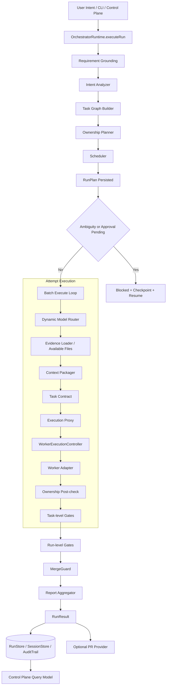
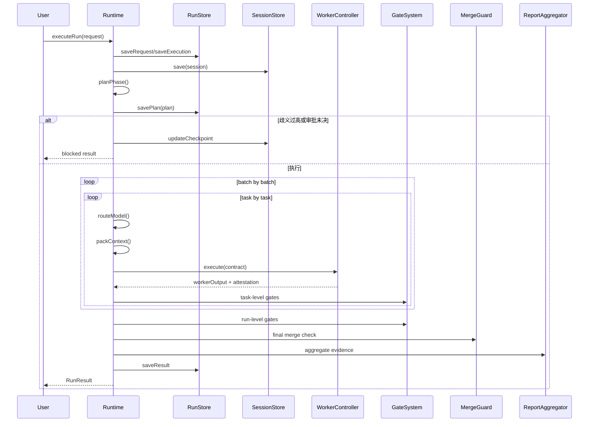
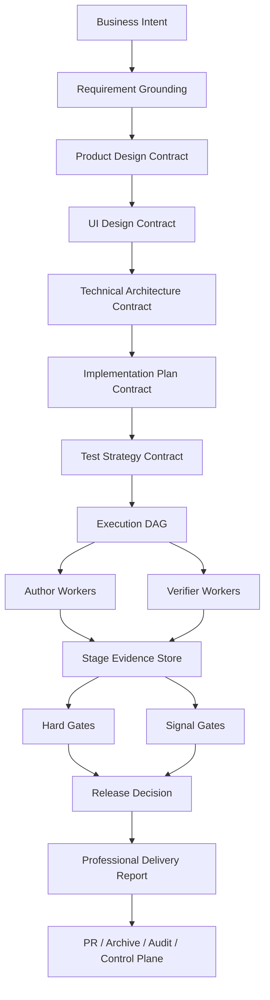

# 01. parallel-harness 生命周期与全流程架构设计

## 1. 文档目标

本文有两个目标：

1. 给出 `2026-03-31` 当前工作区中 `parallel-harness` 已经实现的真实架构。
2. 给出为了支撑“产品设计 -> UI 设计 -> 技术方案 -> 前后端实现 -> 测试 -> 质量保证 -> 报告生成”而需要的目标态全流程架构。

本文依据的核心实现包括：

- `runtime/engine/orchestrator-runtime.ts`
- `runtime/orchestrator/requirement-grounding.ts`
- `runtime/orchestrator/task-graph-builder.ts`
- `runtime/orchestrator/ownership-planner.ts`
- `runtime/scheduler/scheduler.ts`
- `runtime/session/context-packager.ts`
- `runtime/workers/execution-proxy.ts`
- `runtime/gates/gate-system.ts`
- `runtime/guards/merge-guard.ts`
- `runtime/persistence/session-persistence.ts`
- `runtime/integrations/pr-provider.ts`
- `runtime/integrations/report-aggregator.ts`
- `runtime/server/control-plane.ts`

本地验证基线：

- `2026-03-31` 执行 `bun test`，结果为 `268 pass / 0 fail / 601 expect()`
- `2026-03-31` 执行 `bunx tsc --noEmit`，结果为通过

## 2. 当前实现的执行摘要

当前 `parallel-harness` 已经不是只停留在 README 的概念系统。它已经形成了一个可运行的 orchestrator 主链：

- `RunRequest` 进入统一运行时
- 先做 `Requirement Grounding`
- 再做 `Intent Analysis`
- 构建 `Task Graph`
- 生成 `Ownership Plan`
- 生成 `Schedule Plan`
- 对每个 task attempt 做动态 `Model Routing`
- 打包 `ContextPack`
- 生成 `TaskContract`
- 经 `ExecutionProxy + WorkerExecutionController` 执行
- 进入 task-level 与 run-level gate
- 经 `MergeGuard` 收敛
- 输出 `RunResult + AuditTrail + Report + Optional PR`

这说明项目已经具备“可编排、可验证、可恢复、可审计”的骨架。

但当前骨架仍然主要覆盖“工程实现与验证”这条链，尚未把产品设计、UI 设计、架构设计和专业报告生成做成一等对象。

## 3. As-Is 总体架构图

## 4. 当前生命周期原理

## 5. 当前模块边界

| 层 | 关键模块 | 当前职责 | 当前判断 |
|----|----------|----------|----------|
| Intake | `engine/orchestrator-runtime.ts` | 生命周期驱动、状态机、审批恢复、最终汇总 | 主链完整 |
| Grounding | `orchestrator/requirement-grounding.ts` | 需求重述、歧义检测、验收矩阵、受影响模块推断 | 已接线，但过于启发式 |
| Planning | `intent-analyzer.ts` `task-graph-builder.ts` `ownership-planner.ts` | 任务拆解、依赖、路径所有权 | 有效，但 repo-aware 粒度不足 |
| Scheduling | `scheduler/scheduler.ts` | DAG 批次调度、风险并发控制 | 有效 |
| Context | `session/context-packager.ts` | 路径过滤、snippet 提取、占用率计算 | 有效，但相关性不够强 |
| Execution | `workers/execution-proxy.ts` `workers/worker-runtime.ts` | 执行前准备、执行后 attestation、重试与降级 | 已接线，但硬隔离不够 |
| Gates | `gates/gate-system.ts` | task/run 两级门禁 | 覆盖广，但真实性分层不足 |
| Guard | `guards/merge-guard.ts` | 最终写集与冲突收敛 | 已接线 |
| Governance | `governance/governance.ts` | RBAC、审批、人工介入 | 已接线 |
| Persistence | `persistence/session-persistence.ts` | request/plan/execution/result/session/audit 落盘 | 已接线 |
| Integration | `integrations/pr-provider.ts` `report-aggregator.ts` | PR 输出与质量报告聚合 | 已接线，但仍偏工程态 |
| Operate | `server/control-plane.ts` | 读模型、取消、审批 | 可用，但运维能力不完整 |

## 6. 当前实现原理

### 6.1 graph-first，而不是 agent-first

当前系统的主语不是“随意派几个 agent 去试”，而是：

- 先把需求落成 `RunPlan`
- 再以 `TaskGraph + OwnershipPlan + SchedulePlan` 驱动执行
- attempt 只是图上某个节点的一次具体执行

这是项目最正确的一条基础设计。

### 6.2 requirement grounding 已经进入主链

`Requirement Grounding` 不再只是文档概念，而已经在 `planPhase()` 中生成，并用于：

- 歧义阻断
- 将 grounding criteria 注入 `TaskContract`
- 把未满足的 blocking criteria 回写到 `quality_report.recommendations`

但它还没成为覆盖设计、实现、测试、报告四条链的统一真相源。

### 6.3 context budget 已经与 model routing 接线

本轮状态比旧文档更好的一点是：

- `routeModel()` 产生的 `context_budget`
- 已经在 `executeTask()` 中显式传给 `packContext()`
- `ContextPack` 也会记录 `occupancy_ratio` 与 `compaction_policy`

这说明“模型路由”和“上下文治理”已经有了第一层闭环。

### 6.4 执行、验证、报告已经形成单主链

当前已经不是“执行完再找几个脚本收尾”的拼装式系统，而是一条统一主链：

- worker 输出
- ownership 验证
- task gates
- run gates
- MergeGuard
- report aggregation
- optional PR

这条链对后续做独立 verifier、隐藏测试、专业报告模板是非常好的基础。

## 7. 当前架构没有覆盖好的部分

当前系统最大的结构性缺口，不是在“有没有 run-level gate”，而在“是不是支持产品开发全生命周期”。

目前缺的不是再多几个 runtime 模块，而是以下一等对象：

- 产品需求工件：PRD、用户故事、业务规则矩阵
- UI 设计工件：信息架构、页面清单、状态矩阵、交互原则、设计 token
- 技术方案工件：ADR、边界上下文、接口契约、数据迁移计划、回滚策略
- 测试设计工件：测试金字塔计划、覆盖矩阵、隐藏回归集、风险驱动测试策略
- 专业报告工件：管理摘要、证据索引、风险列表、残余风险、变更摘要、待确认项

## 8. 面向插件目标的 To-Be 全流程架构

## 9. 目标态阶段合同

| 阶段 | 必须产物 | 关键 gate |
|------|----------|-----------|
| Requirement Grounding | 需求重述、歧义项、验收矩阵、风险矩阵 | ambiguity gate、scope gate |
| Product Design | PRD、用户旅程、异常流、成功指标 | product completeness gate |
| UI Design | 页面清单、状态矩阵、组件契约、设计 token | UI consistency gate |
| Technical Architecture | ADR、模块边界、接口契约、数据模型、回滚方案 | architecture review gate |
| Implementation | task graph、reservation plan、代码改动、迁移脚本 | ownership gate、policy gate |
| Testing | 测试矩阵、隐藏回归集、覆盖报告、mutation 结果 | test gate、coverage gate |
| Reporting | 变更摘要、证据索引、风险摘要、残余风险、发布建议 | documentation gate、release readiness gate |

## 10. 设计原则

为了达到用户所要求的“任何细节和步骤都不能跳过”，建议后续架构坚持以下原则：

1. 每个阶段都必须输出结构化工件，而不是只输出自然语言总结。
2. 每个阶段都必须有独立 gate，不允许作者自证通过。
3. 每个阶段都必须能恢复，不依赖长历史对话回放。
4. 每个阶段都必须有证据引用，报告只允许引用已登记证据。
5. 并行只能发生在 reservation 不冲突的前提下。
6. 上下文扩张不能默许，必须有 occupancy 策略和拆分策略。
7. 最终报告必须反映真实 gate 结果、真实风险和真实缺口，而不是统一“完成”。

## 11. 结论

当前 `parallel-harness` 的优势，在于运行时骨架已经完整；当前 `parallel-harness` 的不足，在于全流程产品开发所需的阶段工件、独立验证和专业化报告还没有进入主链。

因此，后续增强的重点不是“继续补一个新模块”，而是把：

- 阶段合同
- 执行隔离
- verifier 平面
- 上下文闭环
- 报告专业化

这五件事正式做成系统的一等对象。
