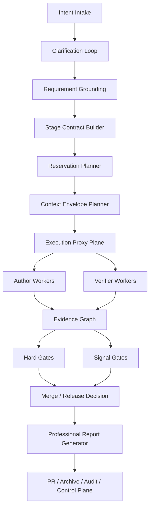

# 05. parallel-harness 修复与增强蓝图

## 1. 北极星目标

把 `parallel-harness` 从“代码导向的并行 orchestrator”升级成“面向产品开发全流程的高可靠治理型 harness”。

目标可以压缩成一句话：

**让每个阶段都有结构化工件、每个任务都有最小上下文、每次执行都有硬边界、每个结论都有独立验证、每份报告都有真实证据。**

## 2. 蓝图输入

本蓝图建立在 `01-04` 四份文档的事实基线上：

- 当前主链已经打通
- 类型检查与测试基线健康
- 但阶段合同、执行硬隔离、独立 verifier、context 语义治理和专业报告仍未完成

因此，本轮不需要推翻现有架构，而是要把已有骨架升级成可信闭环。

## 3. 目标态总架构



## 4. 八条改造主线

## 4.1 主线 A：阶段合同化

### 目标

把产品、UI、架构、实现、测试、报告全部做成一等工件。

### 新对象

```ts
interface StageContract {
  stage:
    | "product_design"
    | "ui_design"
    | "architecture_design"
    | "implementation"
    | "testing"
    | "reporting";
  required_artifacts: string[];
  acceptance_criteria: string[];
  blocking_questions: string[];
  verifier_plan: string[];
}
```

### 必做事项

1. `RequirementGrounding` 升级为 `GroundingBundle`
2. 在 `RunPlan` 中加入 `stage_contracts`
3. 每个 stage 必须有：
   - required artifacts
   - blocking criteria
   - verifier plan

### 完成标准

- 没有 UI 设计工件，就不能进入 UI 实现
- 没有架构决策工件，就不能进入高风险实现
- 没有测试矩阵，就不能结束测试阶段

## 4.2 主线 B：repo-aware reservation plan

### 目标

把并行安全从“事后合并检查”前移到“调度前原子保留”。

### 新对象

```ts
interface ReservationPlan {
  task_id: string;
  read_set: string[];
  write_set: string[];
  interface_outputs: string[];
  serial_constraints: string[];
  stage: string;
}
```

### 必做事项

1. 在 planner 引入文件树、import graph、测试映射、关键接口映射
2. `write_set` 冲突禁止同批
3. 对 schema、migration、shared config、design tokens 设置强串行域

### 完成标准

- MergeGuard 不再是第一道冲突发现点
- 高风险冲突在 dispatch 前就已显式降级

## 4.3 主线 C：Context Envelope V2

### 目标

把当前的 `ContextPack` 升级成真正的上下文治理对象。

### 新对象

```ts
interface ContextEnvelopeV2 {
  task_id: string;
  role: "planner" | "author" | "verifier" | "reporter";
  evidence_refs: Array<{
    ref: string;
    kind: "file" | "snippet" | "symbol" | "artifact" | "test" | "policy";
    rationale: string;
    priority: number;
  }>;
  dependency_outputs: Array<{ task_id: string; artifact_ref: string }>;
  budget: {
    max_input_tokens: number;
    occupancy_ratio: number;
    compaction_policy: "none" | "summarize" | "retrieve_only" | "symbol_only";
  };
}
```

### 必做事项

1. 引入 symbol-aware / dependency-aware 排序
2. 分离 author 与 verifier 上下文
3. 把 occupancy 阈值写入策略引擎

### 完成标准

- 重试时上下文必须与前次不同
- verifier 不再共享 author 的全量包

## 4.4 主线 D：Trusted Execution Plane

### 目标

把 `ExecutionProxy` 从“前后包装层”升级为真正的执行面。

### 必做事项

1. 默认 run 级独立 worktree 或隔离工作区
2. `ExecutionProxy` 直接负责：
   - repo root
   - cwd
   - tool allow/deny
   - path sandbox
   - stdout/stderr
   - diff ref
   - tool call trace
3. attestation 改为基于真实执行流生成

### 完成标准

- `tool_calls` 不再为空
- `diff_ref` 可追溯到真实改动
- 越界写入在执行中被阻断，而不是只在事后发现

## 4.5 主线 E：Verifier Plane

### 目标

建立独立于 author 的验证平面。

### 必做事项

1. author / verifier 角色分离
2. 新增 hidden gates：
   - hidden regression
   - tamper detection
   - artifact completeness
3. 新增 stage verifiers：
   - product completeness verifier
   - UI state consistency verifier
   - architecture contract verifier
   - test sufficiency verifier

### 完成标准

- 作者不能直接宣布任务通过
- 任何通过结论都要有独立 verifier 证据

## 4.6 主线 F：Gate 分层与质量体系升级

### 目标

把“9 类 gate”升级成清晰的硬门禁与信号门禁体系。

### 分层建议

**Hard Gates**

- ownership
- policy
- test
- lint/type
- hidden regression
- release readiness

**Signal Gates**

- review
- documentation
- perf
- coverage trend
- product completeness
- UI consistency
- architecture quality

### 完成标准

- 对外报告必须明确区分 hard pass 与 signal pass
- 不再把所有 gate 当作同一级别能力宣传

## 4.7 主线 G：Control Plane 与恢复能力增强

### 目标

把控制面从“只读为主”升级为“可安全干预”。

### 必做事项

1. 实现 graph-aware `retryTask`
2. control plane 的 run 详情以 `RunPlan` 为真相源
3. 增加：
   - occupancy dashboard
   - stage artifact dashboard
   - verifier trace
   - residual risk view

### 完成标准

- 运维侧可以安全地对单节点做重试或降级
- 查询视图与计划视图保持一致

## 4.8 主线 H：专业报告生成

### 目标

把当前工程摘要升级为正式交付文档。

### 新模板

1. 工程版报告
2. 管理版报告
3. 审计版报告
4. 发布建议报告

### 报告结构

- Executive Summary
- Delivered Artifacts
- Evidence Index
- Gate Decisions
- Risk Register
- Residual Risks
- Open Questions
- Release Recommendation

### 完成标准

- 每一条结论都能引用证据 ID
- 报告可直接进入归档和审计

## 5. 分阶段实施路线

## P0：先补硬约束

目标：把“会跑”升级成“更难出事故”。

1. Stage contracts 接入 `RunPlan`
2. Context occupancy 策略化
3. Trusted execution plane 最小版
4. hard/signal gate 分层
5. `retryTask` 实现
6. README / docs 对齐当前测试和成熟度

## P1：补独立验证和全流程工件

目标：把“代码 harness”升级成“全流程 harness”。

1. product/ui/architecture/test/report 工件入主链
2. verifier plane 落地
3. hidden gates 落地
4. 报告模板系统落地

## P2：补组织级控制面

目标：把“团队工具”升级成“组织级交付控制平面”。

1. multi-run scheduling governance
2. 审计导出与合规模板
3. SLO、成本、风险和缺陷趋势仪表盘
4. 基于工件质量的模型路由与预算策略

## 6. 建议的验收标准

建议将以下条目作为下一轮修复的强验收条件：

1. 任一 run 必须能列出阶段工件清单。
2. 任一 attempt 必须能列出 occupancy、compaction、evidence refs。
3. 任一成功任务必须有独立 verifier 记录。
4. 任一 PR 必须来自 run-owned worktree。
5. 任一报告必须引用真实 evidence IDs。
6. 任一高风险阶段都不能在缺少上游工件时自动放行。

## 7. 结论

当前 `parallel-harness` 不缺大方向，缺的是把既有骨架硬化成真正的治理能力。

最值得投入的不是“更多 agent”，而是：

- 更强阶段合同
- 更强执行隔离
- 更强 verifier 平面
- 更强上下文治理
- 更强专业报告

只要这五条主线落地，`parallel-harness` 才能从“并行编码编排器”升级成“产品开发全流程稳定性插件”。
