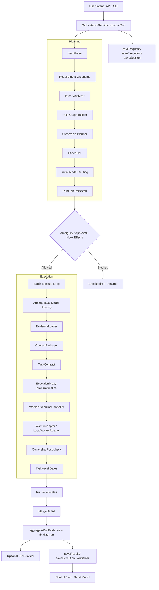
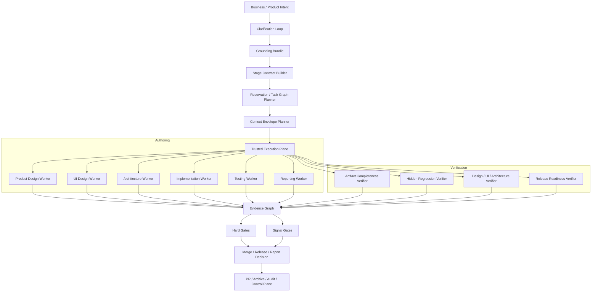

# 01. parallel-harness 生命周期与全流程架构设计

## 1. 文档目标

本文回答三个问题：

1. `parallel-harness` 当前真正接线的主运行时架构是什么。
2. 哪些模块只是“已实现但未接线”，不能被当作当前可用能力。
3. 如果插件目标是覆盖产品设计、UI 设计、技术方案、前后端实现、测试、质量保证和专业报告，目标态架构应如何演进。

## 2. 当前验证基线

当前工作区以 `2026-04-02` 为准：

- `bun test` -> `415 pass / 0 fail / 868 expect() calls / 24 files`
- `bunx tsc --noEmit` -> 通过

核心代码入口：

- `runtime/engine/orchestrator-runtime.ts`
- `runtime/orchestrator/*.ts`
- `runtime/session/*.ts`
- `runtime/workers/*.ts`
- `runtime/gates/*.ts`
- `runtime/guards/merge-guard.ts`
- `runtime/persistence/session-persistence.ts`
- `runtime/integrations/*.ts`
- `runtime/server/control-plane.ts`

## 3. 当前 As-Is 总体架构

## 4. 当前主链原理实现

### 4.1 graph-first，而不是 chat-loop-first

当前主链的正确基础在于：

- 请求先进入 `RunPlan`
- `TaskGraph + OwnershipPlan + SchedulePlan` 是执行真相源
- attempt 只是图上某个 task 的一次执行

这意味着系统的主语已经从“多开几个 agent”转成“先建图、再调度、再验证”。

### 4.2 统一状态机与持久化已经接线

当前主链已经具备：

- `RunRequest / RunPlan / RunExecution / RunResult`
- `SessionStore / RunStore / AuditTrail`
- blocked -> resume 的审批恢复
- `RunStatus` 与 `AttemptStatus` 的显式迁移

因此它已经是一个可恢复、可审计的运行时，而不是一组松散脚本。

### 4.3 需求 grounding 已进入 planPhase，但仍偏启发式

`planPhase()` 当前执行顺序：

1. `groundRequirement(request)`
2. `analyzeIntent(request.intent, projectContext)`
3. `buildTaskGraph(...)`
4. `planOwnership(...)`
5. `createSchedulePlan(...)`
6. `routeModel(...)`
7. `buildStageContracts(...)`

这说明 requirement grounding 已经进入主链；但它还不是 repo-aware、artifact-aware 的强 grounding，只是规则增强版入口层。

### 4.4 Context 和 Routing 已形成第一层闭环

当前每次 task attempt 会：

1. 重新 `routeModel(...)`
2. 用 `routingResult.context_budget` 调 `packContext(...)`
3. 把 `occupancy_ratio` 与 `compaction_policy` 写入审计

这比早期版本好，说明“模型路由”和“上下文治理”已经不是完全断开的两条线。

### 4.5 验证、合并和报告已经形成单主链

执行成功后当前会串起：

- task-level gates
- run-level gates
- `MergeGuard`
- `aggregateRunEvidence`
- `RunResult`
- 可选 PR 产出

这为后续把 verifier plane、专业报告和隐藏验证接入主链提供了骨架。

## 5. 当前模块分层与接线状态

### 5.1 已接线到主运行时

| 层 | 模块 | 当前状态 | 说明 |
|----|------|----------|------|
| Runtime | `engine/orchestrator-runtime.ts` | 已接线 | 主入口、状态机、审批恢复、最终汇总 |
| Planning | `intent-analyzer.ts` / `task-graph-builder.ts` / `ownership-planner.ts` | 已接线 | 但主要依赖规则、关键词与路径启发式 |
| Scheduling | `scheduler/scheduler.ts` | 已接线 | 按 DAG 批次并发，支持冲突回退 |
| Session | `evidence-loader.ts` / `context-packager.ts` | 已接线 | 但路径语义存在错位 |
| Execution | `execution-proxy.ts` / `worker-runtime.ts` | 已接线 | 但隔离强度和 attestation 真实性不足 |
| Gates | `gate-system.ts` / `gate-classification.ts` | 已接线 | hard/signal 已分层，但很多 gate 仍是启发式 |
| Governance | `governance.ts` | 已接线 | 审批、RBAC、人工介入骨架存在 |
| Persistence | `session-persistence.ts` | 已接线 | 默认落盘到 `.parallel-harness/data` |
| Integration | `pr-provider.ts` / `report-aggregator.ts` | 已接线 | PR 与轻量报告可用 |
| Read Model | `control-plane.ts` | 部分接线 | 读模型可用，生命周期视图未接线 |

### 5.2 已有代码，但未接入主运行时

| 模块 | 当前状态 | 影响 |
|------|----------|------|
| `engine/admission-control.ts` | 未接线 | 预算准入只是测试过的函数，不影响真实调度 |
| `models/routeWithOccupancy()` | 未接线 | occupancy 没有真正反向影响路由 |
| `session/context-memory-service.ts` | 未接线 | 长流程记忆没有进入真实 run |
| `lifecycle/lifecycle-spec-store.ts` | 未接线 | 生命周期阶段不驱动真实调度和放行 |
| `lifecycle/stage-contract-engine.ts` | 未接线 | StageContract 还不是运行时控制器 |
| `verifiers/evidence-producer.ts` | 未接线 | 设计/架构/报告证据生产器未参与验证 |
| `verifiers/hidden-eval-runner.ts` | 未接线 | hidden regression 只停留在库与测试 |
| `integrations/report-template-engine.ts` | 未接线 | 专业报告模板未进入主链 |
| `persistence/PersistentEventBusAdapter` / `ReplayEngine` | 未接线 | replay 能力有代码但不是实际控制面基础设施 |

### 5.3 当前结构里最重要的架构偏差

1. 主运行时仍以“代码实现任务”为中心，而不是“阶段工件”为中心。
2. `ExecutionProxy` 还不是真实执行面，更像执行前后包装层。
3. `ContextPackager` 与 `EvidenceLoader` 的路径语义没有统一。
4. 生命周期与专业报告模块有实现，但没有成为主链上的硬约束。

## 6. 当前执行链的关键不可靠点

### 6.1 上下文包与所有权路径的语义不一致

当前 `buildTaskGraph()` 常把 general task 的 `allowed_paths` 设为 `project_root`。但：

- `EvidenceLoader` 返回的是相对路径
- `ContextPackager.selectRelevantFiles()` 用字符串前缀直接比对 `task.allowed_paths`

因此 `allowed_paths = ["."]` 或绝对根路径时，会出现“任务有所有权，但上下文包里没有相关文件”的情况。

### 6.2 预算、token 和成本没有被分层建模

当前主链存在三种不同语义被混在一起：

- 成本预算：`budget_limit / remaining_budget`
- 上下文 token 预算：`token_budget / context_budget`
- 执行 token 统计：`tokens_used`

它们当前没有严格分离，导致：

- 路由可能被错误裁切
- 占用率和成本统计会互相污染
- 成本报告不再是稳定信号

### 6.3 验证与执行没有完全解耦

当前 task-level gate 在 `executeTask()` 成功后直接执行，且默认 gate 配置包含 `test` / `lint_type`。在并行批次下，这意味着多个 task 可能同时触发全仓测试和类型检查，既昂贵也不稳定。

## 7. To-Be 目标态全流程架构

## 8. 目标态设计原则

### 8.1 阶段工件一等化

目标态不应只规划 code task，还应把以下工件做成约束对象：

- 产品需求合同
- UI 状态矩阵
- 技术方案与 ADR
- 实施计划与接口契约
- 测试矩阵与隐藏回归集
- 工程版 / 管理版 / 审计版报告

### 8.2 执行面可信化

目标态 `ExecutionProxy` 应直接控制：

- worktree / sandbox
- tool allowlist / denylist
- cwd / env
- stdout / stderr
- diff ref / tool trace / attestation

而不是只在执行后根据 `WorkerOutput` 派生证明。

### 8.3 验证面独立化

目标态里 author 和 verifier 不共享同一个成功叙事：

- author 负责产出
- verifier 负责独立找证据
- hidden gates 负责反作弊与回归确认

### 8.4 文档与计划仓库化

参考 OpenAI `Harness engineering` 的做法，目标态应把：

- 计划
- 设计文档
- 质量说明
- 安全约束

沉淀到仓库内作为 source of truth，而不是只存在提示词和聊天上下文里。

## 9. 本文结论

当前 `parallel-harness` 最准确的定义不是“还没架构”，而是：

**已经完成一个面向代码实现主链的 graph-first orchestrator，但尚未完成面向全流程产品开发的 artifact-first harness。**

这意味着它的下一阶段重点不应该是继续堆 agent 数量，而应该是：

1. 修正上下文、预算、路径三类基础语义。
2. 把阶段合同、隐藏验证、专业报告真正接入主链。
3. 把执行与验证从“可用”升级到“可信”。
