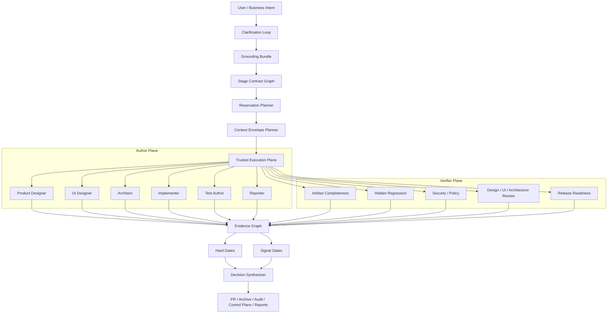

# 05. parallel-harness 修复与增强蓝图

## 1. 北极星目标

把 `parallel-harness` 从“面向代码实现主链的并行 orchestrator”升级成：

**面向产品开发全流程、具备强上下文治理、强执行隔离、强独立验证和强专业报告能力的 harness 编排插件。**

目标压缩成一句话：

> 让每个阶段都有结构化工件、每次执行都有可信边界、每个通过结论都有独立证据、每份报告都有专业模板与可追溯引用。

## 2. 设计输入

本蓝图建立在前四篇文档收敛出的事实基线之上：

- 主运行时骨架已经存在
- 状态机、持久化、审批恢复和图驱动执行可以保留
- 但当前最关键的问题已经转成：
  - 路径与上下文语义错位
  - 成本 / token / budget 混用
  - 执行与 attestation 不够可信
  - 生命周期和 verifier plane 未接线
  - 专业报告仍未主链化

所以本轮不应推翻现有架构，而应做一次**基线修复 + 运行时硬化 + 全流程扩展**。

## 3. 目标态总架构



## 4. P0：必须先修的基础语义与可信度问题

### P0-1. 统一路径系统，修复空上下文问题

**要解决的问题**

- `allowed_paths`、`EvidenceLoader`、`ContextPackager` 使用不同路径语义。
- `.` 和绝对根路径场景下 context pack 失效。

**设计**

新增统一路径类型：

```ts
interface NormalizedPath {
  repo_relative: string;
  repo_absolute: string;
  kind: "file" | "dir" | "glob" | "repo_root";
}
```

**实施**

1. `TaskNode.allowed_paths` 统一存 `repo_relative`。
2. `EvidenceLoader` 输入输出统一按 `repo_relative` 运行。
3. `ContextPackager` 只在归一化路径上做匹配。
4. 若 `allowed_paths` 非空但未选出文件，默认进入 `context_blocked`。

**验收标准**

- `project_root="."`、绝对路径、子目录路径三种场景都能稳定选中文件。
- 新增黑盒测试覆盖 relative/absolute/root path。

### P0-2. 拆分成本预算与 token 预算

**要解决的问题**

- `budget_limit` 被误用为 `token_budget`
- `cost_usd` 被误写成 `tokens_used`

**设计**

```ts
interface CostBudget {
  max_cost_units: number;
  remaining_cost_units: number;
}

interface TokenBudget {
  max_input_tokens: number;
  max_output_tokens: number;
}

interface UsageTelemetry {
  input_tokens?: number;
  output_tokens?: number;
  usage_source: "provider" | "estimated";
  cost_units: number;
}
```

**实施**

1. `routeModel()` 只消费 `TokenBudget`。
2. `AdmissionControl` 真正接入批次调度。
3. `WorkerOutput.tokens_used` 拆成 `input_tokens` / `output_tokens`。
4. `LocalWorkerAdapter` 若拿不到真实 token，就标 `usage_source="estimated"`。

**验收标准**

- 成本报表、上下文报表、模型路由三者数值口径不再混用。
- 所有成本 / token 字段都有明确定义和来源。

### P0-3. 重构 gate 调度，避免 task 级全仓命令风暴

**要解决的问题**

- 并行任务下重复跑全仓 `bun test` / `tsc`

**设计**

```ts
interface VerifierBatchPlan {
  scope: "task" | "batch" | "run";
  commands: string[];
  impacted_paths: string[];
  shared_evidence_refs: string[];
}
```

**实施**

1. task-level gate 只允许跑 task-scoped verifier。
2. batch-level / run-level verifier 统一执行全仓命令。
3. 引入 `TestImpactAnalysis` 和 `TypecheckScopeClassifier`。

**验收标准**

- 多 task 并发时，全仓测试 / 全仓类型检查最多执行一次。
- 默认配置不再把测试抖动直接放大为并行数量倍数。

### P0-4. 把 ExecutionProxy 升级为真实执行面

**要解决的问题**

- attestation 不是可信执行记录
- worktree 隔离未实现

**设计**

```ts
interface TrustedExecutionRecord {
  attempt_id: string;
  worktree_path: string;
  cwd: string;
  tool_trace: Array<{ tool: string; started_at: string; ended_at: string; args_hash: string }>;
  stdout_ref?: string;
  stderr_ref?: string;
  diff_ref: string;
  sandbox_enforced: boolean;
}
```

**实施**

1. 默认启用 per-run worktree。
2. `ExecutionProxy` 负责启动 runtime、记录 tool trace、生成 diff ref。
3. `WorkerExecutionController` 只负责生命周期与超时，不再承担可信执行职责。

**验收标准**

- `tool_calls` 不再是从路径倒推出的伪 trace。
- `diff_ref` 指向真实 diff 产物。
- 相对路径项目根仍能采集真实变更。

## 5. P1：把 latent modules 真正接入主链

### P1-1. StageContractEngine 主链化

**目标**

让产品设计、UI 设计、技术方案、实现、测试、报告成为真正的阶段。

**实施**

1. `LifecycleSpecStore` 与 `StageContractEngine` 接入 `RunExecution`。
2. `RunPlan.stage_contracts` 升级为真正的 stage graph。
3. `Control Plane` 暴露真实 lifecycle phases。

**阶段对象建议**

```ts
type LifecycleStage =
  | "requirement"
  | "product_design"
  | "ui_design"
  | "tech_plan"
  | "architecture"
  | "implementation"
  | "testing"
  | "reporting";
```

### P1-2. HiddenEvalRunner 与 EvidenceProducer 接线

**目标**

让 hidden regression、artifact completeness、design review、architecture review 不再只是测试过的库代码。

**实施**

1. `createDefaultProducers()` 接入 verifier plane。
2. `runHiddenTests()` 接入 testing / release stage。
3. 把 `compareWithReportedResults()` 结果写入 hard gate。

**验收标准**

- 作者成功不等于任务通过。
- 至少有一条独立 verifier 链参与 release 决策。

### P1-3. ReportTemplateEngine 主链化

**目标**

把当前轻量 run summary 升级成真正可交付的专业报告。

**实施**

1. `Engineering / Management / Audit / Release` 四类模板接入 finalize。
2. 报告中必须引用 evidence refs、grounding refs、risk refs。
3. 区分工程版、管理版和审计版 audience。

**验收标准**

- `RunResult` 可生成至少三类正式报告。
- 报告不再只是测试数、成本数和失败数摘要。

## 6. P2：把插件目标扩展到全流程最强形态

### P2-1. GroundingBundle + ClarificationLoop

把当前规则版 grounding 升级成：

- repo-aware evidence grounding
- clarification questions
- stage-specific acceptance matrix
- affected modules / interfaces / rollout constraints

### P2-2. ContextEnvelope V2

```ts
interface ContextEnvelopeV2 {
  task_id: string;
  role: "planner" | "author" | "verifier" | "reporter";
  evidence_refs: Array<{
    ref_id: string;
    kind: "file" | "snippet" | "symbol" | "artifact" | "test" | "policy";
    rationale: string;
    priority: number;
  }>;
  dependency_outputs: Array<{ task_id: string; artifact_ref: string }>;
  budget: TokenBudget;
  occupancy_ratio: number;
  compaction_policy: "none" | "retrieve_only" | "symbol_only" | "summary";
}
```

目标：

- symbol-aware
- dependency-aware
- role-aware
- retry-aware

### P2-3. ContextMemoryService 接线

将 memory 真正接入：

- 失败记忆
- 阶段总结
- 依赖输出索引
- repo / team level knowledge

### P2-4. 组织级知识治理与文档校验

参考 OpenAI `Harness engineering`：

- `AGENTS.md` 只做目录
- `docs/` 成为 source of truth
- CI 校验文档 freshness、cross-link、owner、stage completeness
- 引入 doc-gardening agent

### P2-5. Trace grading 与 post-run analysis

参考 OpenAI agent evals / graders、Devin Session Insights：

- 对 run trace 做 grading
- 对失败 run 生成根因报告
- 对高价值成功 run 提炼 playbook

## 7. 建议的实施顺序

### 第 1 轮：先修基础语义

1. P0-1 路径统一
2. P0-2 成本与 token 分层
3. P0-3 gate 调度改造
4. P0-4 ExecutionProxy worktree 化

### 第 2 轮：接回 latent modules

1. StageContractEngine
2. HiddenEvalRunner + EvidenceProducer
3. ReportTemplateEngine
4. Control Plane lifecycle

### 第 3 轮：做全流程强化

1. GroundingBundle + clarification
2. ContextEnvelope V2 + memory
3. trace grading + post-run insights
4. 文档治理与专业化报告闭环

## 8. 发布门槛建议

如果要把下一版称为“最强 parallel-harness 编排插件”，建议至少满足：

1. 根路径和绝对路径场景下不再出现空上下文包。
2. 成本 / token / routing 三条数据口径分离。
3. 默认配置不会并行触发多次全仓测试。
4. worktree 隔离与可信 attestation 可用。
5. StageContractEngine、HiddenEvalRunner、ReportTemplateEngine 已接线。
6. 控制面能看到真实 lifecycle。
7. 对外文档只宣传已接线能力，不把 latent modules 当 GA。

## 9. 本文结论

当前项目并不需要推翻重写。真正正确的方向是：

**保留现有 graph-first runtime 骨架，先修基础语义和可信执行，再把生命周期、独立验证、专业报告这三条线逐步拉进主运行时。**

这样做的收益最大：

- 返工最小
- 对现有测试资产复用最好
- 最能快速把“概念上的最强 harness”变成“运行时里可证明的最强 harness”
