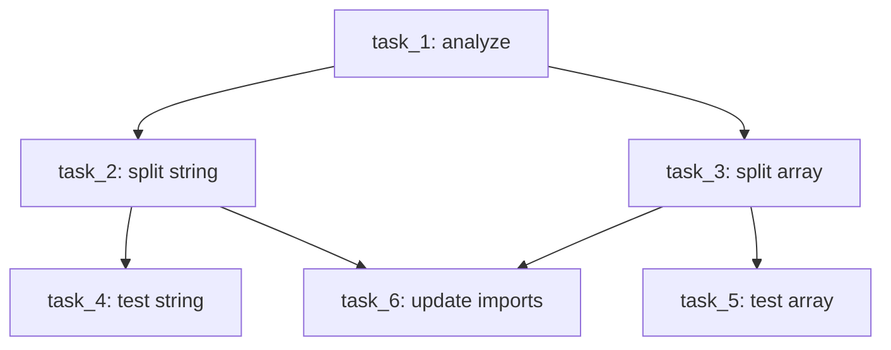
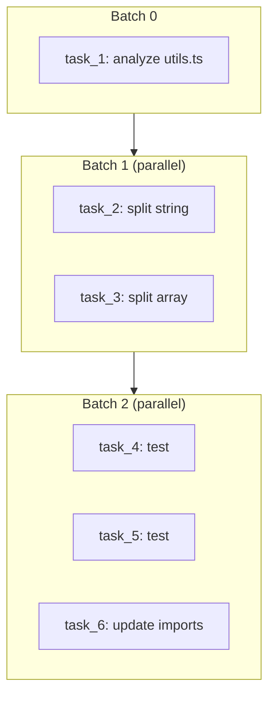
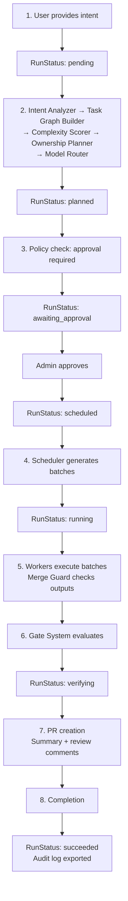

> **[中文版](basic-flow.zh.md)** | English (default)

# parallel-harness Basic Flow Examples

> Version: v1.6.0 (GA) | Last updated: 2026-04-09

## Example 1: Requirement Decomposition into a Task Graph

### User Input

```
Split all helper functions in utils.ts into separate modules and add unit tests for each module
```

### Intent Analysis (Intent Analyzer)

```json
{
  "intent_type": "refactor",
  "scope": "multi-file",
  "risk_level": "medium",
  "estimated_complexity": "medium",
  "affected_modules": ["src/utils.ts"],
  "output_expectations": ["module splitting", "unit tests"]
}
```

### Complexity Scoring (Complexity Scorer)

```json
{
  "overall": "medium",
  "dimensions": {
    "scope": "high",
    "risk": "medium",
    "effort": "medium",
    "dependencies": "low"
  }
}
```

### Task Graph Construction (Task Graph Builder)

```json
{
  "graph_id": "graph_abc123",
  "tasks": [
    {
      "id": "task_1",
      "title": "Analyze utils.ts exported functions",
      "goal": "Identify all helper functions to be split and their dependency relationships",
      "type": "planning",
      "complexity": "low",
      "risk_level": "low",
      "depends_on": [],
      "affected_paths": ["src/utils.ts"],
      "model_tier": "tier-1"
    },
    {
      "id": "task_2",
      "title": "Split string helpers",
      "goal": "Move string-related helper functions to src/helpers/string.ts",
      "type": "implementation",
      "complexity": "medium",
      "risk_level": "medium",
      "depends_on": ["task_1"],
      "affected_paths": ["src/utils.ts", "src/helpers/string.ts"],
      "model_tier": "tier-2"
    },
    {
      "id": "task_3",
      "title": "Split array helpers",
      "goal": "Move array-related helper functions to src/helpers/array.ts",
      "type": "implementation",
      "complexity": "medium",
      "risk_level": "medium",
      "depends_on": ["task_1"],
      "affected_paths": ["src/utils.ts", "src/helpers/array.ts"],
      "model_tier": "tier-2"
    },
    {
      "id": "task_4",
      "title": "Write string helpers tests",
      "goal": "Add unit tests for src/helpers/string.ts",
      "type": "test-writing",
      "complexity": "low",
      "risk_level": "low",
      "depends_on": ["task_2"],
      "affected_paths": ["tests/helpers/string.test.ts"],
      "model_tier": "tier-2"
    },
    {
      "id": "task_5",
      "title": "Write array helpers tests",
      "goal": "Add unit tests for src/helpers/array.ts",
      "type": "test-writing",
      "complexity": "low",
      "risk_level": "low",
      "depends_on": ["task_3"],
      "affected_paths": ["tests/helpers/array.test.ts"],
      "model_tier": "tier-2"
    },
    {
      "id": "task_6",
      "title": "Update import paths",
      "goal": "Update all files that reference utils.ts to import from the new modules",
      "type": "implementation",
      "complexity": "medium",
      "risk_level": "high",
      "depends_on": ["task_2", "task_3"],
      "affected_paths": ["src/**/*.ts"],
      "model_tier": "tier-2"
    }
  ]
}
```

### DAG Visualization



---

## Example 2: Parallel Execution Flow

### Ownership Planning (Ownership Planner)

```json
{
  "assignments": [
    {
      "task_id": "task_1",
      "exclusive_paths": [],
      "shared_read_paths": ["src/utils.ts"],
      "forbidden_paths": []
    },
    {
      "task_id": "task_2",
      "exclusive_paths": ["src/helpers/string.ts"],
      "shared_read_paths": ["src/utils.ts"],
      "forbidden_paths": []
    },
    {
      "task_id": "task_3",
      "exclusive_paths": ["src/helpers/array.ts"],
      "shared_read_paths": ["src/utils.ts"],
      "forbidden_paths": []
    },
    {
      "task_id": "task_4",
      "exclusive_paths": ["tests/helpers/string.test.ts"],
      "shared_read_paths": ["src/helpers/string.ts"],
      "forbidden_paths": []
    },
    {
      "task_id": "task_5",
      "exclusive_paths": ["tests/helpers/array.test.ts"],
      "shared_read_paths": ["src/helpers/array.ts"],
      "forbidden_paths": []
    },
    {
      "task_id": "task_6",
      "exclusive_paths": ["src/utils.ts"],
      "shared_read_paths": ["src/helpers/string.ts", "src/helpers/array.ts"],
      "forbidden_paths": [".env"]
    }
  ],
  "conflicts": [],
  "has_unresolvable_conflicts": false
}
```

### Scheduling Plan (Scheduler)

```json
{
  "batches": [
    {
      "batch_index": 0,
      "task_ids": ["task_1"],
      "max_concurrency": 1,
      "has_critical_path_task": true
    },
    {
      "batch_index": 1,
      "task_ids": ["task_2", "task_3"],
      "max_concurrency": 2,
      "has_critical_path_task": false
    },
    {
      "batch_index": 2,
      "task_ids": ["task_4", "task_5", "task_6"],
      "max_concurrency": 3,
      "has_critical_path_task": false
    }
  ],
  "total_batches": 3,
  "max_parallelism": 3,
  "estimated_rounds": 3
}
```

### Execution Timeline



### Model Routing Decisions

| Task | Complexity | Risk | Recommended Tier | Rationale |
|------|-----------|------|-----------------|-----------|
| task_1 | low | low | tier-1 | Simple analysis task |
| task_2 | medium | medium | tier-2 | Standard implementation task |
| task_3 | medium | medium | tier-2 | Standard implementation task |
| task_4 | low | low | tier-2 | Test writing (tier-2 baseline) |
| task_5 | low | low | tier-2 | Test writing (tier-2 baseline) |
| task_6 | medium | high | tier-3 | Escalated due to high risk |

---

## Example 3: Gate Verification Flow

### Task-Level Gate (after each task completes)

Using task_2 as an example, gate evaluations triggered after the worker completes:

```json
[
  {
    "gate_type": "test",
    "gate_level": "task",
    "passed": true,
    "blocking": true,
    "conclusion": {
      "summary": "Test gate passed",
      "findings": [],
      "risk": "low"
    }
  },
  {
    "gate_type": "lint_type",
    "gate_level": "task",
    "passed": true,
    "blocking": true,
    "conclusion": {
      "summary": "Lint/Type gate passed",
      "findings": [
        {
          "severity": "info",
          "message": "TypeScript file modified: src/helpers/string.ts"
        }
      ],
      "risk": "low"
    }
  },
  {
    "gate_type": "policy",
    "gate_level": "task",
    "passed": true,
    "blocking": true,
    "conclusion": {
      "summary": "Policy gate passed",
      "findings": [],
      "risk": "low"
    }
  }
]
```

### Run-Level Gate (after all tasks complete)

```json
[
  {
    "gate_type": "review",
    "gate_level": "run",
    "passed": true,
    "blocking": false,
    "conclusion": {
      "summary": "Review gate passed (1 suggestion)",
      "findings": [
        {
          "severity": "warning",
          "message": "6 files modified — recommend verifying import path consistency"
        }
      ],
      "risk": "low"
    }
  },
  {
    "gate_type": "security",
    "gate_level": "run",
    "passed": true,
    "blocking": true,
    "conclusion": {
      "summary": "Security gate passed",
      "findings": [],
      "risk": "low"
    }
  },
  {
    "gate_type": "release_readiness",
    "gate_level": "run",
    "passed": true,
    "blocking": true,
    "conclusion": {
      "summary": "Release readiness gate passed",
      "findings": [],
      "risk": "low"
    }
  }
]
```

### Gate Blocking Scenario

If a worker modifies the `.env` file, the Security Gate will block:

```json
{
  "gate_type": "security",
  "passed": false,
  "blocking": true,
  "conclusion": {
    "summary": "Security gate blocked: 1 security issue",
    "findings": [
      {
        "severity": "critical",
        "message": "Sensitive file modified: .env",
        "file_path": ".env",
        "rule_id": "SEC-001",
        "suggestion": "Please confirm whether this modification is necessary and whether it contains sensitive information"
      }
    ],
    "risk": "critical",
    "required_actions": ["Sensitive file modified: .env"]
  }
}
```

---

## Example 4: Approval Flow

### Triggering Approval

When a policy rule's enforcement is set to `approve`, the system pauses execution and creates an approval request:

```json
{
  "approval_id": "appr_abc123",
  "run_id": "run_xyz",
  "task_id": "task_6",
  "action": "Execute high-risk task",
  "reason": "Task task_6 has critical risk level and requires manual approval",
  "triggered_rules": ["risk-001"],
  "status": "pending",
  "requested_at": "2026-03-20T10:00:00Z"
}
```

### Automatic Approval

If `auto_approve_rules` is configured in `default-config.json`:

```json
{
  "run_config": {
    "auto_approve_rules": ["risk-001"]
  }
}
```

Approval requests triggered by the `risk-001` rule will be automatically approved.

### Manual Approval

Administrators or reviewers can process approvals via `ApprovalWorkflow.decide()`:

```typescript
const record = workflow.decide(
  "appr_abc123",          // approval ID
  "approved",             // decision: "approved" | "denied"
  "reviewer@example.com", // approver
  "Risk confirmed as acceptable"  // approval comment (optional)
);
```

When an approval is denied, the Task Attempt status transitions to `failed` with a failure classification of `approval_denied`.

### Human Feedback

When user input is needed during execution, feedback is requested via `HumanInteractionManager`:

```typescript
const requestId = manager.requestFeedback({
  run_id: "run_xyz",
  task_id: "task_6",
  question: "While updating import paths, src/legacy.ts was found to also reference utils.ts. Should it be updated as well?",
  options: ["Yes, update it too", "No, skip the legacy file"],
  context: "legacy.ts is legacy code — modifications may affect other modules",
  urgency: "medium",
});
```

The worker resumes execution after the user submits feedback.

---

## Complete Run Lifecycle Example


