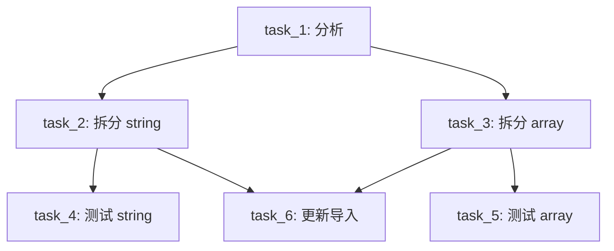
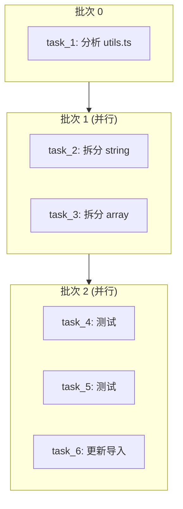
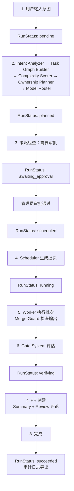

> [English](basic-flow.md) | 中文

# parallel-harness 基本流程示例

> 版本: v1.5.2 (GA) | 最后更新: 2026-04-09

## 示例 1：需求拆图

### 用户输入

```
将 utils.ts 中的所有 helper 函数拆分到独立模块，并为每个模块添加单元测试
```

### 意图分析（Intent Analyzer）

```json
{
  "intent_type": "refactor",
  "scope": "multi-file",
  "risk_level": "medium",
  "estimated_complexity": "medium",
  "affected_modules": ["src/utils.ts"],
  "output_expectations": ["模块拆分", "单元测试"]
}
```

### 复杂度评分（Complexity Scorer）

```json
{
  "overall": "medium",
  "dimensions": {
    "scope": "high",
    "risk": "medium",
    "effort": "medium",
    "dependencies": "low"
  }
}
```

### 任务图构建（Task Graph Builder）

```json
{
  "graph_id": "graph_abc123",
  "tasks": [
    {
      "id": "task_1",
      "title": "分析 utils.ts 导出函数",
      "goal": "识别所有需要拆分的 helper 函数和它们的依赖关系",
      "type": "planning",
      "complexity": "low",
      "risk_level": "low",
      "depends_on": [],
      "affected_paths": ["src/utils.ts"],
      "model_tier": "tier-1"
    },
    {
      "id": "task_2",
      "title": "拆分 string helpers",
      "goal": "将字符串相关 helper 函数移到 src/helpers/string.ts",
      "type": "implementation",
      "complexity": "medium",
      "risk_level": "medium",
      "depends_on": ["task_1"],
      "affected_paths": ["src/utils.ts", "src/helpers/string.ts"],
      "model_tier": "tier-2"
    },
    {
      "id": "task_3",
      "title": "拆分 array helpers",
      "goal": "将数组相关 helper 函数移到 src/helpers/array.ts",
      "type": "implementation",
      "complexity": "medium",
      "risk_level": "medium",
      "depends_on": ["task_1"],
      "affected_paths": ["src/utils.ts", "src/helpers/array.ts"],
      "model_tier": "tier-2"
    },
    {
      "id": "task_4",
      "title": "编写 string helpers 测试",
      "goal": "为 src/helpers/string.ts 添加单元测试",
      "type": "test-writing",
      "complexity": "low",
      "risk_level": "low",
      "depends_on": ["task_2"],
      "affected_paths": ["tests/helpers/string.test.ts"],
      "model_tier": "tier-2"
    },
    {
      "id": "task_5",
      "title": "编写 array helpers 测试",
      "goal": "为 src/helpers/array.ts 添加单元测试",
      "type": "test-writing",
      "complexity": "low",
      "risk_level": "low",
      "depends_on": ["task_3"],
      "affected_paths": ["tests/helpers/array.test.ts"],
      "model_tier": "tier-2"
    },
    {
      "id": "task_6",
      "title": "更新导入路径",
      "goal": "更新所有引用 utils.ts 的文件，改为引用新模块",
      "type": "implementation",
      "complexity": "medium",
      "risk_level": "high",
      "depends_on": ["task_2", "task_3"],
      "affected_paths": ["src/**/*.ts"],
      "model_tier": "tier-2"
    }
  ]
}
```

### DAG 可视化



---

## 示例 2：并行执行流程

### 所有权规划（Ownership Planner）

```json
{
  "assignments": [
    {
      "task_id": "task_1",
      "exclusive_paths": [],
      "shared_read_paths": ["src/utils.ts"],
      "forbidden_paths": []
    },
    {
      "task_id": "task_2",
      "exclusive_paths": ["src/helpers/string.ts"],
      "shared_read_paths": ["src/utils.ts"],
      "forbidden_paths": []
    },
    {
      "task_id": "task_3",
      "exclusive_paths": ["src/helpers/array.ts"],
      "shared_read_paths": ["src/utils.ts"],
      "forbidden_paths": []
    },
    {
      "task_id": "task_4",
      "exclusive_paths": ["tests/helpers/string.test.ts"],
      "shared_read_paths": ["src/helpers/string.ts"],
      "forbidden_paths": []
    },
    {
      "task_id": "task_5",
      "exclusive_paths": ["tests/helpers/array.test.ts"],
      "shared_read_paths": ["src/helpers/array.ts"],
      "forbidden_paths": []
    },
    {
      "task_id": "task_6",
      "exclusive_paths": ["src/utils.ts"],
      "shared_read_paths": ["src/helpers/string.ts", "src/helpers/array.ts"],
      "forbidden_paths": [".env"]
    }
  ],
  "conflicts": [],
  "has_unresolvable_conflicts": false
}
```

### 调度计划（Scheduler）

```json
{
  "batches": [
    {
      "batch_index": 0,
      "task_ids": ["task_1"],
      "max_concurrency": 1,
      "has_critical_path_task": true
    },
    {
      "batch_index": 1,
      "task_ids": ["task_2", "task_3"],
      "max_concurrency": 2,
      "has_critical_path_task": false
    },
    {
      "batch_index": 2,
      "task_ids": ["task_4", "task_5", "task_6"],
      "max_concurrency": 3,
      "has_critical_path_task": false
    }
  ],
  "total_batches": 3,
  "max_parallelism": 3,
  "estimated_rounds": 3
}
```

### 执行时间线



### 模型路由决策

| 任务 | 复杂度 | 风险 | 推荐 Tier | 理由 |
|------|--------|------|----------|------|
| task_1 | low | low | tier-1 | 简单分析任务 |
| task_2 | medium | medium | tier-2 | 一般实现任务 |
| task_3 | medium | medium | tier-2 | 一般实现任务 |
| task_4 | low | low | tier-2 | 测试编写（tier-2 基准） |
| task_5 | low | low | tier-2 | 测试编写（tier-2 基准） |
| task_6 | medium | high | tier-3 | 高风险提升 |

---

## 示例 3：Gate 验证流程

### Task-Level Gate（每个任务完成后）

以 task_2 为例，Worker 完成后触发的 Gate 评估：

```json
[
  {
    "gate_type": "test",
    "gate_level": "task",
    "passed": true,
    "blocking": true,
    "conclusion": {
      "summary": "测试 gate 通过",
      "findings": [],
      "risk": "low"
    }
  },
  {
    "gate_type": "lint_type",
    "gate_level": "task",
    "passed": true,
    "blocking": true,
    "conclusion": {
      "summary": "Lint/Type gate 通过",
      "findings": [
        {
          "severity": "info",
          "message": "TypeScript 文件已修改: src/helpers/string.ts"
        }
      ],
      "risk": "low"
    }
  },
  {
    "gate_type": "policy",
    "gate_level": "task",
    "passed": true,
    "blocking": true,
    "conclusion": {
      "summary": "Policy gate 通过",
      "findings": [],
      "risk": "low"
    }
  }
]
```

### Run-Level Gate（所有任务完成后）

```json
[
  {
    "gate_type": "review",
    "gate_level": "run",
    "passed": true,
    "blocking": false,
    "conclusion": {
      "summary": "Review gate 通过 (1 个建议)",
      "findings": [
        {
          "severity": "warning",
          "message": "修改了 6 个文件，建议检查导入路径一致性"
        }
      ],
      "risk": "low"
    }
  },
  {
    "gate_type": "security",
    "gate_level": "run",
    "passed": true,
    "blocking": true,
    "conclusion": {
      "summary": "Security gate 通过",
      "findings": [],
      "risk": "low"
    }
  },
  {
    "gate_type": "release_readiness",
    "gate_level": "run",
    "passed": true,
    "blocking": true,
    "conclusion": {
      "summary": "Release readiness gate 通过",
      "findings": [],
      "risk": "low"
    }
  }
]
```

### Gate 阻断场景

如果 Worker 修改了 `.env` 文件，Security Gate 会阻断：

```json
{
  "gate_type": "security",
  "passed": false,
  "blocking": true,
  "conclusion": {
    "summary": "Security gate 阻断: 1 个安全问题",
    "findings": [
      {
        "severity": "critical",
        "message": "修改了敏感文件: .env",
        "file_path": ".env",
        "rule_id": "SEC-001",
        "suggestion": "请确认该修改是否必要，是否包含敏感信息"
      }
    ],
    "risk": "critical",
    "required_actions": ["修改了敏感文件: .env"]
  }
}
```

---

## 示例 4：审批流程

### 触发审批

当策略规则的 enforcement 为 `approve` 时，系统暂停执行并创建审批请求：

```json
{
  "approval_id": "appr_abc123",
  "run_id": "run_xyz",
  "task_id": "task_6",
  "action": "执行高风险任务",
  "reason": "任务 task_6 风险等级为 critical，需要人工审批",
  "triggered_rules": ["risk-001"],
  "status": "pending",
  "requested_at": "2026-03-20T10:00:00Z"
}
```

### 自动审批

如果在 `default-config.json` 中配置了 `auto_approve_rules`：

```json
{
  "run_config": {
    "auto_approve_rules": ["risk-001"]
  }
}
```

匹配到 `risk-001` 规则触发的审批请求会自动通过。

### 手动审批

管理员或 reviewer 可以通过 `ApprovalWorkflow.decide()` 处理审批：

```typescript
const record = workflow.decide(
  "appr_abc123",          // 审批 ID
  "approved",             // 决策: "approved" | "denied"
  "reviewer@example.com", // 审批者
  "已确认风险可控"          // 审批意见（可选）
);
```

审批被拒绝时，Task Attempt 状态迁移到 `failed`，失败分类为 `approval_denied`。

### 人工反馈

在执行过程中需要用户输入时，通过 `HumanInteractionManager` 请求反馈：

```typescript
const requestId = manager.requestFeedback({
  run_id: "run_xyz",
  task_id: "task_6",
  question: "更新导入路径时发现 src/legacy.ts 也引用了 utils.ts，是否一并更新？",
  options: ["是，一并更新", "否，跳过 legacy 文件"],
  context: "legacy.ts 是遗留代码，修改可能影响其他模块",
  urgency: "medium",
});
```

用户提交反馈后，Worker 继续执行。

---

## 完整 Run 生命周期示例


