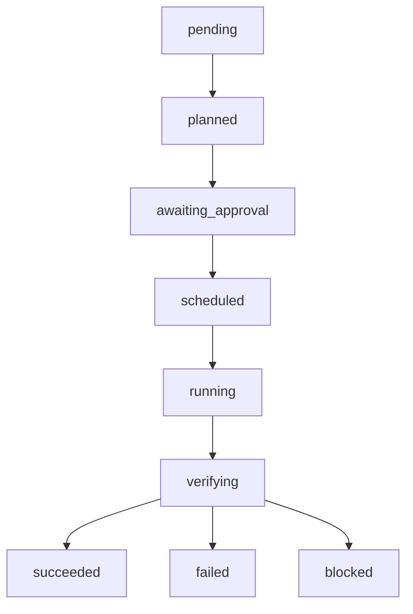

> [English](operator-guide.md) | 中文

# parallel-harness 运维指南

> 版本: v1.7.0 (GA) | 最后更新: 2026-04-09

## 安装和部署

### 前置条件

- **Bun** >= 1.0（运行时环境）
- **Claude Code** CLI（宿主平台）
- **gh CLI**（可选，GitHub PR/CI 集成需要）
- **Node.js** >= 18（仅用于 TypeScript 类型检查）

### 安装方式

**方式一：Claude Code 插件市场**

```bash
claude plugin install parallel-harness@lorainwings-plugins --scope project
```

**方式二：手动安装（开发环境）**

```bash
cd plugins/parallel-harness
bun install
```

**方式三：构建分发包**

```bash
bash tools/build-dist.sh
# 产出：dist/parallel-harness/
```

### 验证安装

```bash
# 运行测试套件
bun test tests/unit/

# 类型检查
bunx tsc --noEmit
```

预期结果：`295 pass / 0 fail`。

---

## 配置文件说明

### default-config.json

位于 `config/default-config.json`，控制运行时行为：

```json
{
  "$schema": "./run-config-schema.json",
  "version": "1.0.0",
  "run_config": {
    "max_concurrency": 5,
    "high_risk_max_concurrency": 2,
    "prioritize_critical_path": true,
    "budget_limit": 100000,
    "max_model_tier": "tier-3",
    "enabled_gates": ["test", "lint_type", "review", "policy"],
    "auto_approve_rules": [],
    "timeout_ms": 600000,
    "pr_strategy": "single_pr",
    "enable_autofix": false
  },
  "gate_overrides": {},
  "connector_configs": [],
  "instructions": {
    "org_level": [],
    "repo_level": []
  }
}
```

**关键参数说明**：

| 参数 | 类型 | 默认值 | 说明 |
|------|------|--------|------|
| `max_concurrency` | number | 5 | 全局最大并行 Worker 数 |
| `high_risk_max_concurrency` | number | 2 | 高风险任务最大并行数 |
| `prioritize_critical_path` | boolean | true | 是否优先调度关键路径任务 |
| `budget_limit` | number | 100000 | 预算上限（相对值，token 单位） |
| `max_model_tier` | string | "tier-3" | 允许的最高模型等级 |
| `enabled_gates` | string[] | 4 项 | 启用的门禁类型 |
| `auto_approve_rules` | string[] | [] | 自动审批规则（空 = 均需手动） |
| `timeout_ms` | number | 600000 | 单次 Run 超时（毫秒） |
| `pr_strategy` | string | "single_pr" | PR 策略：none / single_pr / stacked_pr |
| `enable_autofix` | boolean | false | 是否启用自动修复推送 |

### default-policy.json

位于 `config/default-policy.json`，定义安全和合规策略规则，详见 [策略配置指南](policy-guide.zh.md)。

---

## 日常运维操作

### 查看 Run 状态

Run 的完整生命周期通过 `RunStore` 管理。在 Claude Code 会话中，可以通过以下方式查看：

```
/harness 查看当前 run 的状态
```

**Run 状态机**：



每次状态迁移都会记录到 `StatusTransition` 列表，包含：
- `from`: 原状态
- `to`: 新状态
- `reason`: 迁移原因
- `timestamp`: 时间戳
- `actor`: 触发者（可选）

### 审计日志

所有关键动作通过 `AuditTrail` 记录。支持 32 种审计事件类型：

- **Run 生命周期**: run_created, run_planned, run_started, run_completed, run_failed, run_cancelled
- **Task 生命周期**: task_dispatched, task_completed, task_failed, task_retried
- **Worker**: worker_started, worker_completed, worker_failed
- **模型路由**: model_routed, model_escalated, model_downgraded
- **验证/门禁**: verification_started/passed/blocked, gate_passed, gate_blocked
- **策略**: policy_evaluated, policy_violated
- **审批**: approval_requested, approval_decided
- **所有权**: ownership_checked, ownership_violated
- **预算**: budget_consumed, budget_exceeded
- **PR/CI**: pr_created, pr_reviewed, pr_merged
- **人工反馈**: human_feedback
- **配置变更**: config_changed

**查询审计日志**：

```typescript
// 按 Run 查询
const events = await auditTrail.query({ run_id: "run_xxx" });

// 按时间范围查询
const events = await auditTrail.query({
  from: "2026-03-20T00:00:00Z",
  to: "2026-03-20T23:59:59Z"
});

// 获取 Run 时间线
const timeline = await auditTrail.getTimeline("run_xxx");
```

**导出审计日志**：

```typescript
// JSON 格式
const json = await auditTrail.export("json", { run_id: "run_xxx" });

// CSV 格式
const csv = await auditTrail.export("csv");
```

### 预算监控

预算通过 `CostLedger` 追踪。每次 Worker 执行完成后会记录：
- `task_id`: 关联任务
- `model_tier`: 使用的模型等级
- `tokens_used`: Token 消耗量
- `cost`: 成本（相对值）

**模型 Tier 成本基准**：

| Tier | 每 1K Token 成本 | 最大上下文预算 | 最大重试次数 |
|------|-----------------|---------------|------------|
| tier-1 | 1 | 16,000 | 3 |
| tier-2 | 5 | 64,000 | 2 |
| tier-3 | 25 | 200,000 | 1 |

**预算耗尽时行为**：自动停止执行，不静默继续。触发 `budget_exceeded` 审计事件。

---

## 故障排查流程

### 1. 查看事件日志

首先通过 EventBus 查看最近事件：

```typescript
const events = eventBus.getEventLog({ graph_id: "xxx" });
```

### 2. 查看状态迁移历史

检查 Run 或 Task Attempt 的 `status_history`：

```typescript
const execution = await runStore.getExecution("run_xxx");
// execution.status_history 包含完整迁移链
```

### 3. 检查 Gate 结果

Gate 结果包含详细的 findings 列表：

```typescript
// 每个 GateResult 包含：
// - passed: 是否通过
// - blocking: 是否为阻断性 gate
// - conclusion.findings: 具体发现列表
// - conclusion.required_actions: 必须修复项
// - conclusion.suggested_patches: 建议补丁
```

### 4. 检查降级触发条件

参见 [故障排查文档](troubleshooting.zh.md) 了解完整排查流程。

---

## 日志和监控

### EventBus 事件流

EventBus 支持：
- **按类型订阅**: `eventBus.on("task_completed", handler)`
- **通配符订阅**: `eventBus.on("*", handler)` — 接收所有事件
- **事件日志**: 自动保留最近 10,000 条事件
- **持久化适配器**: `PersistentEventBusAdapter` 自动将事件写入 AuditTrail

### 持久化适配器

两种持久化适配器：

| 适配器 | 类 | 适用场景 |
|--------|-----|---------|
| 内存 | `LocalMemoryStore` | 开发/测试 |
| 文件系统 | `FileStore` | 生产环境，数据持久化到 JSON 文件 |

文件存储路径格式：`{basePath}/{id}.json`

### 断点恢复

通过 `ReplayEngine` 支持断点恢复：

```typescript
const replayEngine = new ReplayEngine(auditTrail);

// 获取恢复点
const resumePoint = await replayEngine.getResumePoint("run_xxx");
// resumePoint.completed_tasks: 已完成的任务列表
// resumePoint.last_completed_task_id: 最后完成的任务
```
