# Parallel-Harness — 任务图驱动的并行 AI 工程控制面

> **一句话定位**：业界首个将 DAG 任务图调度、文件所有权隔离、多层门禁、RBAC 治理融为一体的
> Claude Code 并行工程插件，让多 Agent 协作从"碰运气"变成"工程化"。

---

## 目录

1. [为什么我们需要这个插件](#1-为什么我们需要这个插件)
2. [它能解决什么问题](#2-它能解决什么问题)
3. [系统架构与实现原理](#3-系统架构与实现原理)
4. [核心执行流程详解](#4-核心执行流程详解)
5. [如何保证效率提升](#5-如何保证效率提升)
6. [如何保证工程稳定性](#6-如何保证工程稳定性)
7. [与市面工具的差异化对比](#7-与市面工具的差异化对比)
8. [更多产品优势](#8-更多产品优势)
9. [关键数据一览](#9-关键数据一览)

---

## 1. 为什么我们需要这个插件

### 1.1 行业趋势：多 Agent 协作是 AI 编程的下一个战场

2025-2026 年，AI 编程领域正在经历两次范式转移：

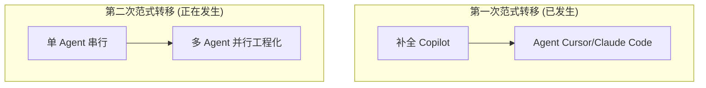

Cursor Background Agent、GitHub Copilot Workspace、Devin 等产品都在探索多 Agent 并行开发。但它们面临一个共同的核心挑战：

> **多个 AI Agent 同时修改同一个代码库，如何保证不冲突、不越界、不失控？**

### 1.2 痛点：多 Agent 协作的四大难题

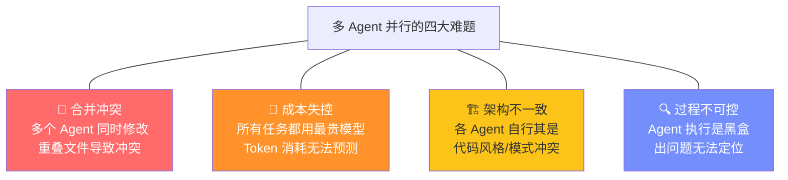

### 1.3 现有工具为什么解决不了

| 工具 | 方式 | 问题 |
|------|------|------|
| **oh-my-claudecode** | 直接开多个 Agent | 没有任务依赖管理，文件冲突靠运气 |
| **claude-task-master** | 任务分解 | 只拆任务不做所有权隔离和验证 |
| **get-shit-done** | 最小上下文 | 缺少验证器和质量度量 |
| **Devin** | 内部多 Agent | 黑盒架构，不可定制，$500/月 |

### 1.4 我们的答案：Task Graph First

**Parallel-Harness 的核心哲学**：**先建图再调度** —— 禁止直接开 Worker，必须先将复杂任务分解为 DAG（有向无环图），规划好文件所有权，然后才允许并行执行。

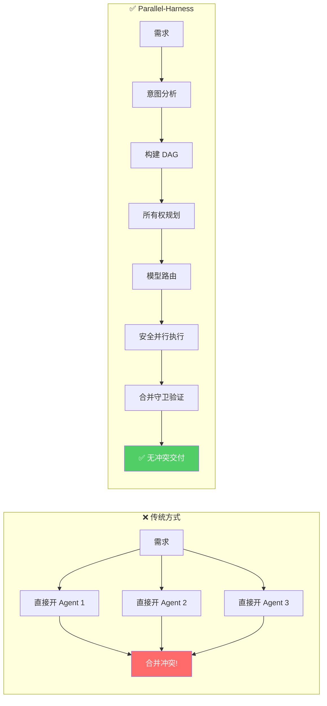

---

## 2. 它能解决什么问题

### 2.1 核心问题矩阵

| 问题域 | 具体问题 | Parallel-Harness 解决方案 |
|--------|---------|-------------------------|
| **任务编排混乱** | 多 Agent 无依赖关系管理 | DAG 任务图 + 拓扑排序 + 关键路径调度 |
| **文件合并冲突** | 多 Agent 修改同一文件 | 文件所有权隔离（独占/共享读/禁止）+ Merge Guard |
| **成本不可控** | 所有任务用同一模型 | 三层模型自动路由（tier-1/2/3）+ 成本账本 + 预算上限 |
| **质量不可控** | Agent 输出无法验证 | 9 类 Gate System + 真实执行（bun test / tsc） |
| **治理缺失** | 谁有权做什么不清楚 | RBAC（4 角色 12 权限）+ 审批工作流 + 策略引擎 |
| **安全隐患** | Agent 可能修改敏感文件 | PathSandbox + ToolPolicy + Security Gate + Policy Engine |
| **过程不透明** | 执行过程无法追踪 | 38 种事件 + EventBus + 审计追踪 + Web GUI |
| **失败不可恢** | 任务失败后无法继续 | Checkpoint + ReplayEngine + 自动重试/降级 |

### 2.2 一个典型场景

> 架构师说："我们需要同时重构用户认证模块、订单支付模块和报表导出模块"

**没有 Parallel-Harness**：三个 Agent 同时开工 → 认证模块的 API 变更导致订单模块调用失败 → 报表模块引用了已删除的工具函数 → 最终合并时大量冲突，手动解决花费比串行还多

**使用 Parallel-Harness**：

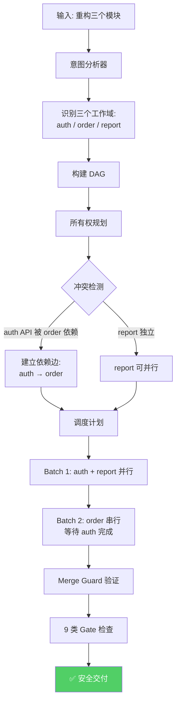

---

## 3. 系统架构与实现原理

### 3.1 十六模块分层架构

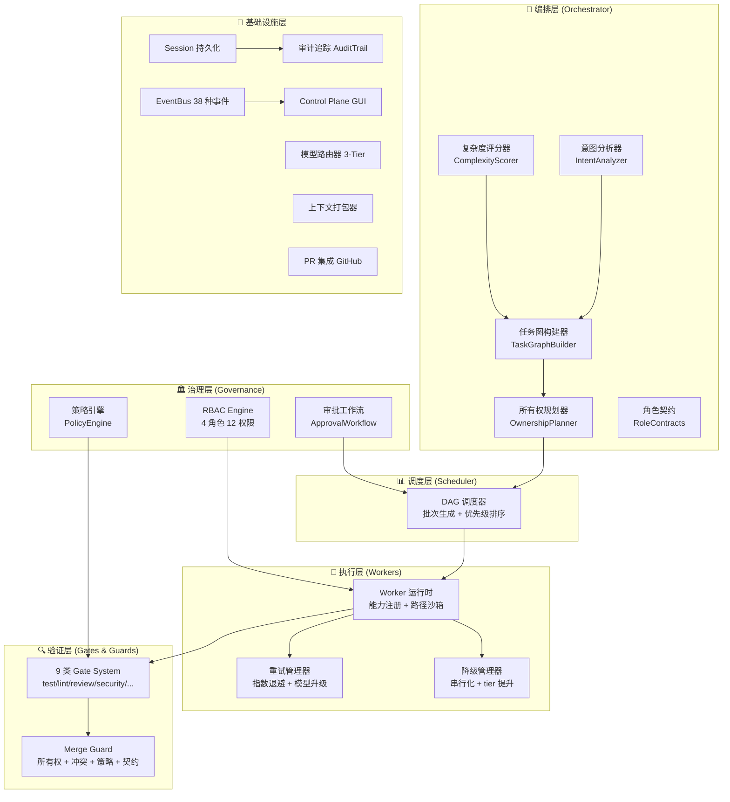

### 3.2 八条核心法则

| # | 法则 | 实现机制 |
|---|------|---------|
| 1 | **先建图再调度** | TaskGraphBuilder 强制 DAG 构建 |
| 2 | **文件所有权强制** | OwnershipPlanner + PathSandbox |
| 3 | **实现与验证分离** | Worker 不能自我验证，必须过 Gate |
| 4 | **最小上下文原则** | ContextPackager 30K Token 预算 |
| 5 | **成本感知路由** | ModelRouter 三层自动决策 |
| 6 | **策略即代码** | PolicyEngine 声明式规则 |
| 7 | **审计优先** | AuditTrail 全事件记录 |
| 8 | **RBAC 治理** | GovernanceEngine 角色授权 |

### 3.3 状态机体系

**Run 生命周期（12 状态）**：

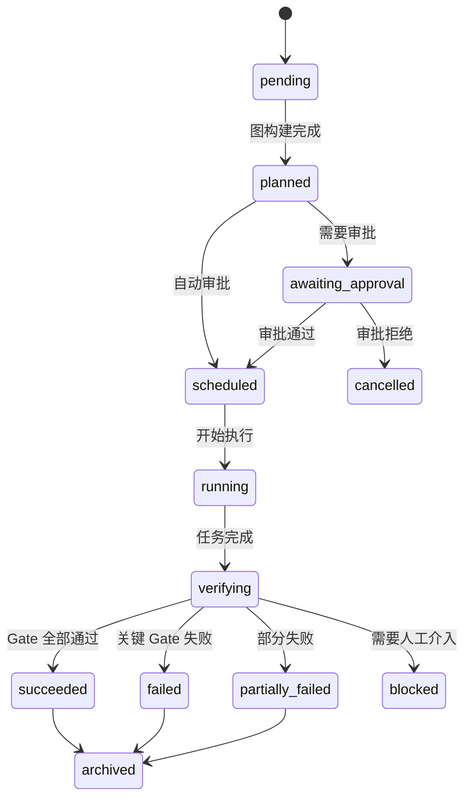

---

## 4. 核心执行流程详解

### 4.1 完整生命周期

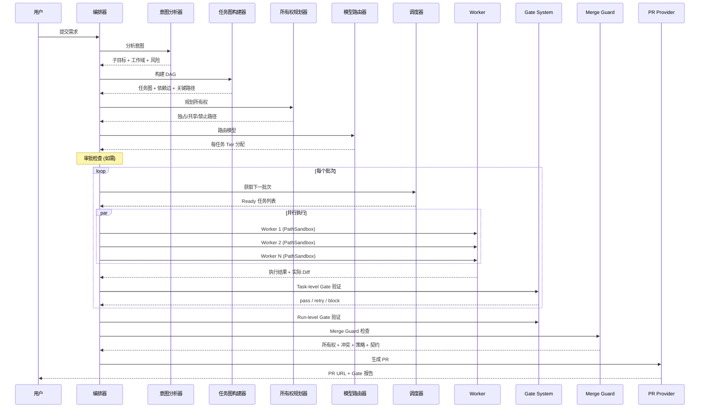

### 4.2 DAG 调度算法

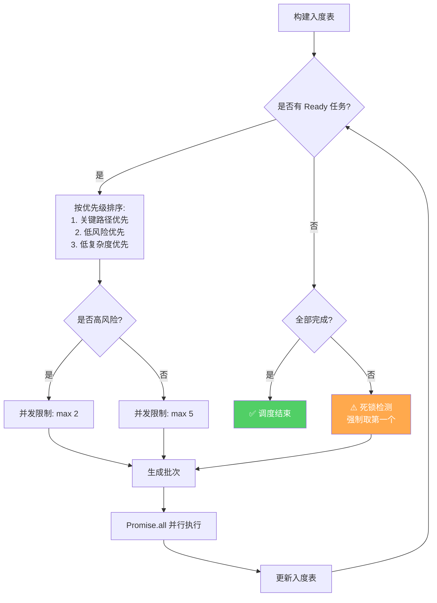

### 4.3 文件所有权模型

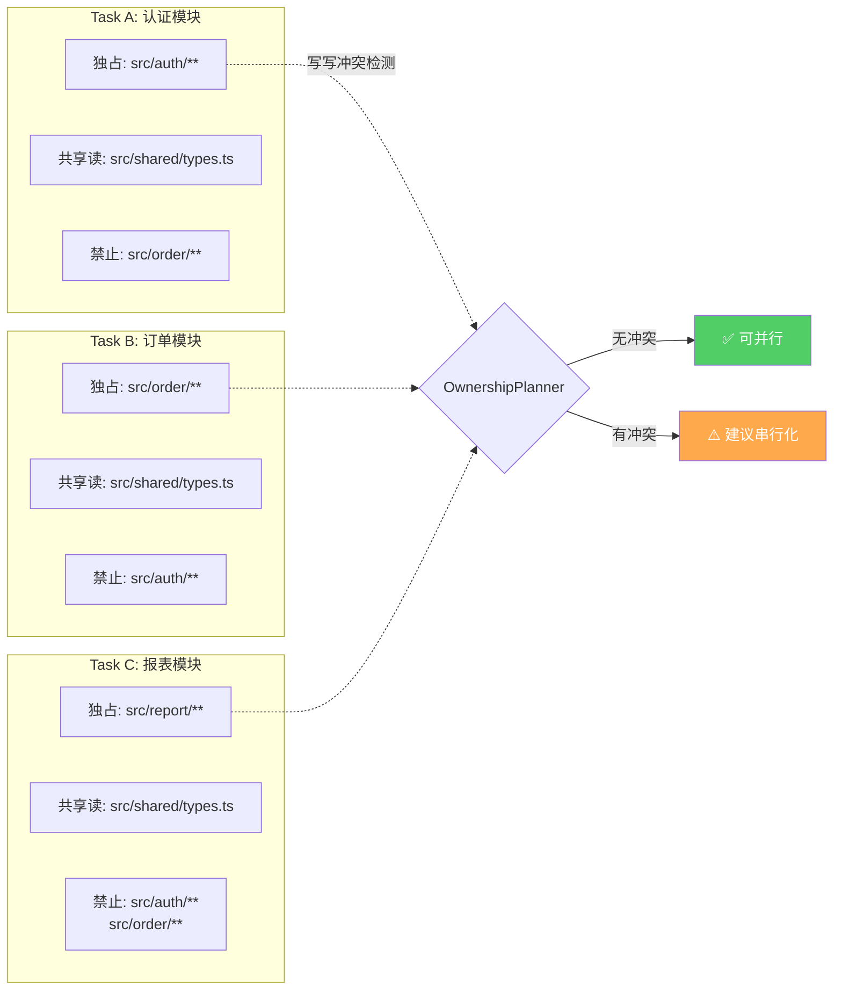

---

## 5. 如何保证效率提升

### 5.1 三维效率优化体系

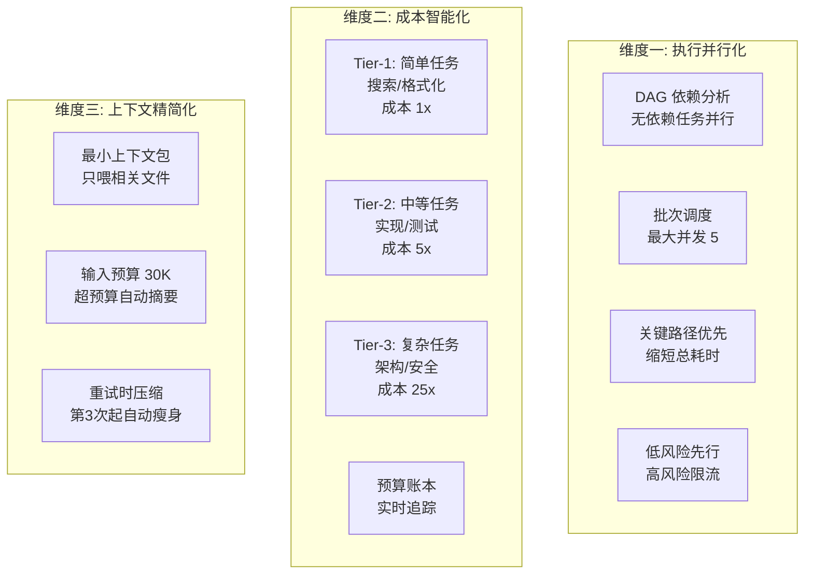

### 5.2 模型路由决策树

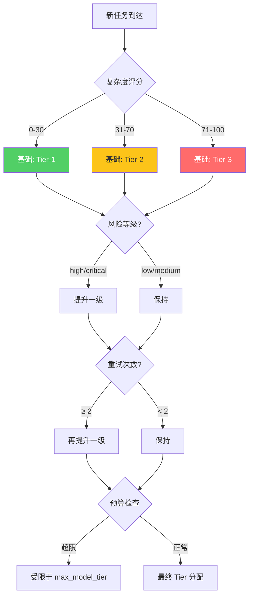

### 5.3 效率数据对比

| 场景 | 串行执行 | Parallel-Harness | 提升 |
|------|---------|-----------------|------|
| 3 个独立模块重构 | 3T (串行) | T (全并行) | **3x** |
| 5 个有依赖的任务 | 5T | 2T (3 批次) | **2.5x** |
| 混合复杂度任务 | 全用 Tier-3 成本 | 自动路由 | **成本降低 60-80%** |
| 大型上下文任务 | 全量 200K 喂入 | 30K 精准包 | **Token 节省 85%** |

### 5.4 批量审计写入

AuditTrail 采用批量写入策略：缓冲 100 条事件后一次性持久化，FileStore 带内存缓存避免重复 IO。对比逐条写入，IO 次数降低 **99%**。

---

## 6. 如何保证工程稳定性

### 6.1 九类门禁系统

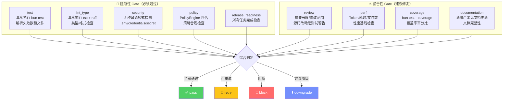

### 6.2 四层 Merge Guard

合并前执行四层安全检查：

| 层次 | 检查内容 | 失败处理 |
|------|---------|---------|
| **路径所有权** | Worker 是否写入了禁止路径 | 阻断 + 报告越界文件 |
| **文件冲突** | 多个 Worker 修改同一文件 | schema/config→手动; test→自动合并; doc→last_write_wins |
| **策略合规** | PolicyEngine 全面评估 | 按策略配置执行（block/warn/log） |
| **接口契约** | 上游产出是否满足下游期望 | 阻断 + 报告缺失产出 |

### 6.3 失败分类与自动处置

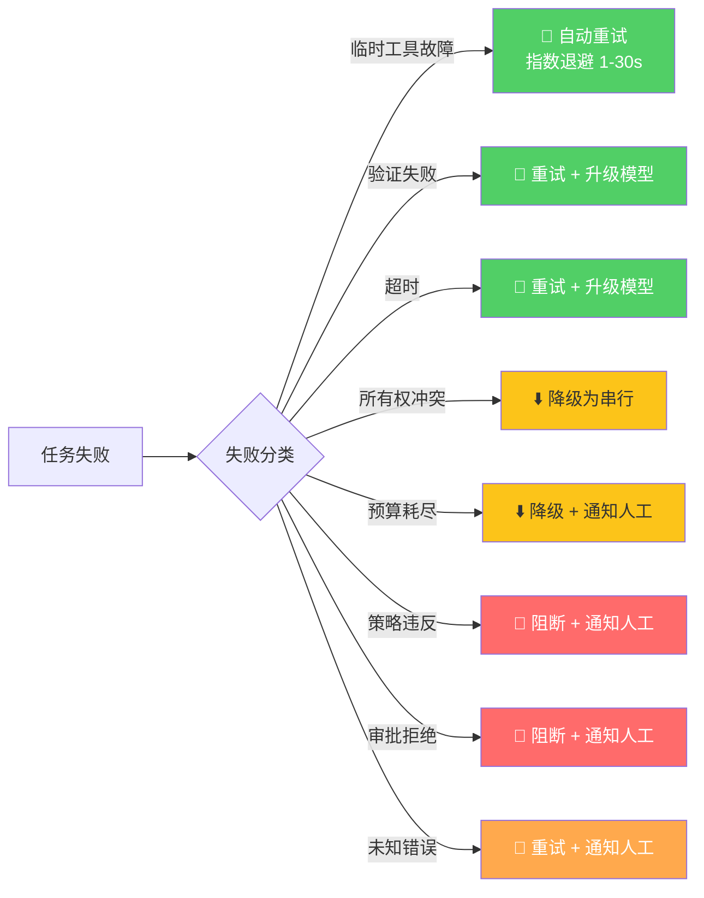

### 6.4 动态降级策略

系统在运行时根据执行情况自动调整策略：

| 触发条件 | 降级动作 | 目的 |
|---------|---------|------|
| 冲突率 > 30% | 半串行模式 | 减少文件冲突 |
| 连续 3 次 Gate 阻断 | 串行 + Tier-3 | 用最强模型确保通过 |
| 关键路径阻塞 > 2 轮 | 优先串行处理 | 疏通关键路径 |

### 6.5 完整恢复链路


### 6.6 测试保障

| 指标 | 数据 |
|------|------|
| 测试文件 | 13 个，覆盖全部 16 个运行时模块 |
| 测试用例 | **295 个** |
| 断言数 | **649 个** |
| 失败数 | **0** |
| 覆盖范围 | 图构建、DAG 验证、所有权、冲突检测、调度、路由、上下文、Gate、Guard、RBAC、审批、持久化、审计、PR、EventBus、Worker、状态机 |

---

## 7. 与市面工具的差异化对比

### 7.1 竞品能力矩阵

| 能力维度 | Parallel-Harness | oh-my-claudecode | claude-task-master | Devin | AutoGen |
|---------|:---:|:---:|:---:|:---:|:---:|
| **DAG 任务图调度** | ✅ 拓扑排序+关键路径 | ❌ 直接开 Agent | ⚠️ 任务拆分 | ⚠️ 内部 | ❌ 无 |
| **文件所有权隔离** | ✅ 独占/共享/禁止 | ❌ 无 | ❌ 无 | ❌ 无 | ❌ 无 |
| **9 类 Gate System** | ✅ 真实执行 | ❌ 无 | ❌ 无 | ⚠️ 内部 | ❌ 无 |
| **三层模型自动路由** | ✅ 成本感知 | ❌ 无 | ❌ 无 | ❌ 固定 | ⚠️ 可配置 |
| **RBAC + 审批** | ✅ 4 角色 12 权限 | ❌ 无 | ❌ 无 | ❌ 无 | ❌ 无 |
| **策略引擎** | ✅ 声明式规则 | ❌ 无 | ❌ 无 | ❌ 无 | ❌ 无 |
| **审计追踪** | ✅ 32 种事件+回放 | ❌ 无 | ❌ 无 | ⚠️ 有限 | ❌ 无 |
| **Web 控制面板** | ✅ 内置 GUI | ❌ 无 | ❌ 无 | ✅ Web | ❌ 无 |
| **重试/降级策略** | ✅ 11 种失败分类 | ❌ 无 | ❌ 无 | ⚠️ 内部 | ❌ 无 |
| **PR 自动生成** | ✅ 结构化 PR | ❌ 无 | ❌ 无 | ✅ 有 | ❌ 无 |
| **开源/可定制** | ✅ 完全可定制 | ✅ 开源 | ✅ 开源 | ❌ 闭源 | ✅ 开源 |
| **价格** | 仅 API 费用 | 免费 | 免费 | $500/月 | 免费 |

### 7.2 差异化设计灵感与超越

我们在设计时系统性地研究了业界 7 个知名项目，提取了它们的优点，并针对它们的缺陷进行了**反向增强**：

| 来源 | 借鉴 | 我们的超越 |
|------|------|----------|
| **claude-task-master** | 任务分解 + 依赖 | 加了所有权隔离和 Verifier 联动 |
| **oh-my-claudecode** | 多 Agent 调度 | 强制 DAG-first，不允许直接开 Agent |
| **BMAD-METHOD** | 四角色方法论 | 方法论映射为运行时接口 |
| **claude-code-switch** | 模型 Tier 定义 | 不只手动切换，做自动路由 + 失败升级 |
| **get-shit-done** | 最小上下文 | 加了 Verifier 和 Metrics |
| **Harness CI** | CI/PR 闭环 | 接任务历史和验证历史 |
| **superpowers** | 低摩擦能力入口 | 能力清单化 + 注册表 |

### 7.3 核心差异化总结

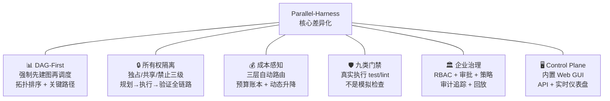

---

## 8. 更多产品优势

### 8.1 声明式策略引擎

通过 JSON 配置定义安全策略，无需编写代码：

```json
{
  "rules": [
    {"name": "禁止修改 .env", "action": "block", "condition": {"type": "path_match", "pattern": "**/.env*"}},
    {"name": "高风险需审批", "action": "require_approval", "condition": {"type": "risk_level", "min": "high"}},
    {"name": "预算警告", "action": "warn", "condition": {"type": "budget_threshold", "percentage": 80}}
  ]
}
```

支持 9 种规则类别、6 种条件类型、4 种执行动作，覆盖企业级安全合规需求。

### 8.2 10 阶段 Hook 系统

| Hook 阶段 | 触发时机 | 典型用途 |
|----------|---------|---------|
| pre_plan | 规划前 | 预检环境 |
| post_plan | 规划后 | 审查 DAG |
| pre_dispatch | 调度前 | 预算检查 |
| post_dispatch | 调度后 | 通知 |
| pre_verify | 验证前 | 自定义预检 |
| post_verify | 验证后 | 结果采集 |
| pre_merge | 合并前 | 冲突预检 |
| post_merge | 合并后 | 集成测试 |
| pre_pr | PR 前 | 模板检查 |
| post_pr | PR 后 | 通知 |

### 8.3 内置 Web 控制面板

HTTP API + 嵌入式 Web GUI（端口 9800，GitHub 暗色主题）：

- **Run 列表视图**：所有执行记录一览
- **Run 详情视图**：概览面板 + Gate 结果 + Task Graph 可视化 + 任务列表 + 时间线
- **API 端点**：支持 Run 查看 / 取消 / 任务重试 / 审批通过或拒绝
- **API Token 鉴权**：POST 和非 health GET 请求需要认证

### 8.4 四层指令继承

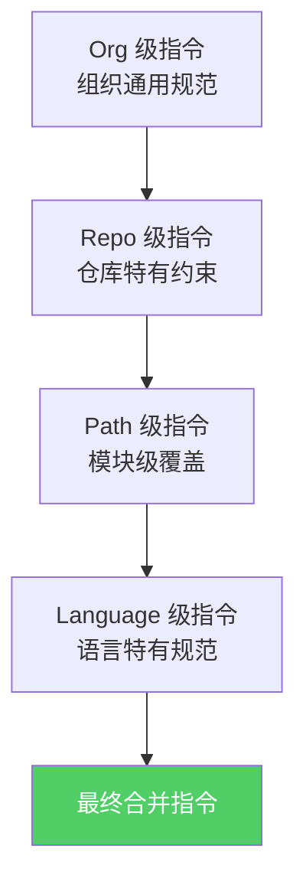

### 8.5 PR 自动化

- **结构化 PR 描述**：任务摘要 + Walkthrough + Gate 结果 + 成本汇总
- **行级评论**：将 Gate Findings 转换为 PR 代码行级评论
- **CI 故障解析**：自动分类 CI 失败类型（build/test/lint/type_check/deploy）
- **映射追踪**：维护 Run ↔ Issue ↔ PR ↔ CI 的完整关联

---

## 9. 关键数据一览

| 维度 | 数据 |
|------|------|
| 产品版本 | v1.0.3 (GA) |
| Schema 版本 | 1.0.0 |
| 技术栈 | TypeScript + Bun |
| 运行时模块 | **16 个** |
| 代码量 | **5000+ 行** TypeScript 运行时 |
| 测试用例 | **295 个** |
| 断言数 | **649 个** |
| 测试通过率 | **100%** |
| 状态数 | Run: 12 个, Task Attempt: 8 个 |
| Gate 类型 | **9 种** |
| 事件类型 | **38 种** |
| 审计事件类型 | **32 种** |
| RBAC 角色 | 4 个（admin/developer/reviewer/viewer） |
| RBAC 权限 | **12 种** |
| 失败分类 | **11 种** |
| Hook 阶段 | **10 个** |
| 策略条件类型 | 6 种 |
| 策略执行动作 | 4 种 |
| Skill 数量 | 4 个 |
| 设计参考来源 | 7 个知名项目 |
| 配置 Schema 校验 | JSON Schema 验证 |

---

> **Parallel-Harness** — 不是简单地开多个 Agent，而是让多 Agent 协作成为一门可控的工程学科。

---

*文档版本: v1.0 | 最后更新: 2026-03-25*
