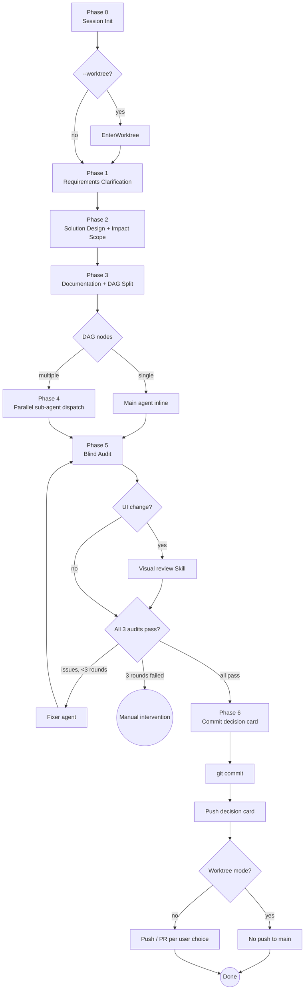

[中文版](README.zh.md)

# slim-task

> Structured 7-phase task execution SOP for AI coding with multi-language and worktree support

**Version**: 0.6.0 <!-- x-release-please-version -->

## Overview

slim-task is a pure-Skill Claude Code plugin that provides a structured Standard Operating Procedure (SOP) for AI task execution. It solves 8 common problems when AI agents execute coding tasks:

1. Starting without requirements clarification
2. No best-practice research during solution design
3. Bug fixes touching unrelated code
4. Code changes without user approval
5. No persistent task documentation
6. Commits without user approval
7. Slow sequential execution instead of parallelism
8. Self-audit cheating — the agent that wrote the code grading its own work

## Architecture

- **Main-Check-Sub-Execute**: Main agent only inspects/decides/dispatches/verifies; sub-agents do actual coding
- **DAG Parallelism**: Tasks decomposed into a DAG, same-layer tasks dispatched simultaneously with no concurrency limit
- **Impact Scoping**: Mandatory file-level impact scope table prevents touching unrelated code
- **Blind-Audit Phase 5**: Quality review delegated to independent auditor sub-agents in isolated context — the implementing agent never grades its own work
- **Multi-Language**: All AI dialogue, decision cards, generated docs, and sub-agent prompts respect a configured language (default `zh-CN`); Conventional Commits prefixes stay English
- **Worktree Isolation**: Optional `--worktree` mode runs the full pipeline inside a dedicated git worktree, enabling true multi-task parallelism without staging conflicts
- **7 User Checkpoints**: Every phase transition requires explicit user confirmation

## 7-Phase SOP



| Phase | Name | Key Output |
|-------|------|------------|
| 0 | Session Init | Language / Worktree config |
| 1 | Requirements Clarification | Refined requirements summary |
| 2 | Solution Design | Solution + impact scope table |
| 3 | Documentation + DAG Split | Task doc + DAG graph |
| 4 | Parallel Execution | Sub-agent deliverables |
| 5 | Blind Audit | scope / practice / engineering audit.json |
| 6 | Commit Confirmation | commit + optional push / PR |

## Installation

```bash
claude install StoicAtom/claude-autopilot --plugin slim-task
```

## Usage

```
/slim-task [task description] [--lang zh-CN|en-US|...] [--worktree] [--base <branch>]
```

Examples:

```
# Default (Chinese, no worktree, backward-compatible)
/slim-task fix the auth header bug in middleware

# English output, isolated worktree based on current branch
/slim-task --lang en-US --worktree add health check endpoint

# English output, worktree branched from origin/main
/slim-task --lang en-US --worktree --base origin/main refactor logger
```

Natural language triggers also work: "structured task execution", "SOP execution".

### Configuration

The first time you pass `--lang`, the value is persisted to `.claude/slim-task.json` as your default. Subsequent calls without `--lang` reuse it.

### Worktree Notes

- Worktree mode is **off** by default; pass `--worktree` to enable.
- The full 7-phase pipeline runs inside the worktree.
- Commits inside a worktree are **never auto-merged or pushed to `main`** — slim-task hands you a `git merge` command at Phase 6 so you can integrate manually.
- Worktree mode forbids committing `release-please-config.json`, `.release-please-manifest.json`, or `marketplace.json` (shared monorepo state).

## License

MIT
