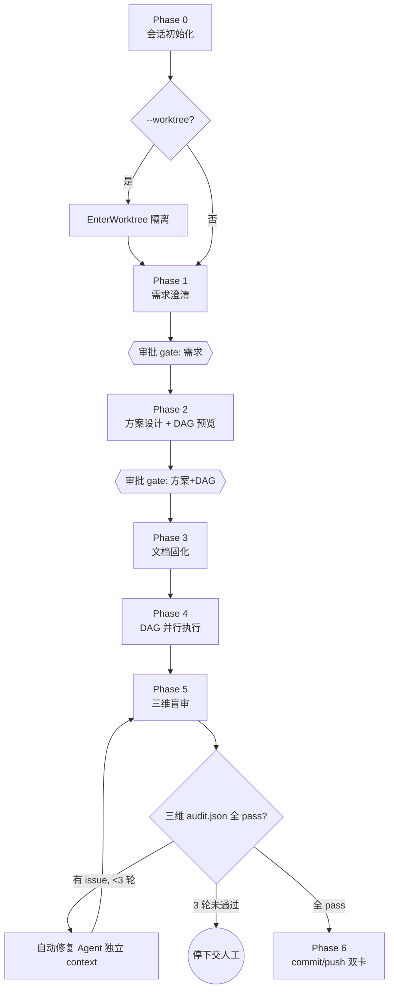

[English](README.md)

# slim-task

> 结构化 7 阶段 AI 任务执行 SOP，支持多语言与 worktree 并行

**版本**: 0.8.1 <!-- x-release-please-version -->

## 概述

slim-task 是一个纯 Skill 型 Claude Code 插件，提供结构化的标准操作流程（SOP）来执行 AI 编码任务。它解决了 AI 执行任务时的 8 个常见问题：

1. 未进行需求澄清就开始执行
2. 方案设计阶段未调研业界最佳实践
3. 修复 BUG 时修改到无关代码
4. 代码改动未经用户审批就开始执行
5. 方案未固化到项目文档
6. 代码未经审批就直接提交推送
7. 任务执行太慢，未使用并行子 Agent
8. AI 自审作弊——写代码的 Agent 给自己打分

## 架构

- **主检子执**: 主 Agent 只做检查/决策/派发/验证，子 Agent 负责实际编码
- **DAG 并行**: 任务按依赖关系构建有向无环图，同层任务全部并行派发，无数量上限
- **影响范围锁定**: 强制输出文件级影响范围表，防止修改无关代码
- **Phase 5 盲审**: 质量检查派发独立 auditor 子 Agent 在隔离 context 内执行——写实现的 Agent 永远不评自己的代码
- **多语言支持**: AI 对话、决策卡、生成文档、子 Agent prompt 全部按配置语言输出（默认 `zh-CN`）；Conventional Commits 前缀保持英文
- **Worktree 隔离**: 可选 `--worktree` 模式将整个流水线运行在独立 git worktree 内，实现真正的多任务并行（无 staging 冲突）
- **审批点收敛**: 人工决策集中在需求/方案/提交三处关键 gate，Phase 2 审批后执行段（文档固化→并行执行→盲审）全自动接管，仅异常暂停；`--interactive` 可恢复逐阶段确认
- **确定性编排**: DAG 节点数 ≥ 4 时调用 Workflow 工具，由 JS 引擎确定性保证「逐层并行 barrier」「三维审计强制并行」「修复循环硬计数 ≤3 轮」，消除编排层跳步风险
- **断点续跑**: 执行段每个关键节点落盘 checkpoint，会话中断/context 压缩后可从断点恢复，跳过已完成层、续用修复轮次计数，无需从头重跑
- **执行段可控**: 自动推进全程进度透明（逐层/逐轮汇报），用户可随时主动暂停；7 类异常各带明确可选动作 + 自动回滚，而非静默或一停了之
- **边界硬隔离**: 子 Agent 输出 schema 强制汇报实际改动文件，与影响范围表白名单实时比对，越界即拦截；审计 diff 消毒剥离实现痕迹，保证盲审独立性

## 7 阶段 SOP



> 注：Phase 4 执行模式按 DAG 节点数三档分流——1 节点单 Agent 直派 / 2-3 节点指令式 fan-out / ≥4 节点调用 Workflow 工具做确定性编排。详见 SKILL.md。

| 阶段 | 名称 | 关键产出 |
|------|------|---------|
| 0 | 会话初始化 | 语言 / Worktree 配置 |
| 1 | 需求澄清 | 精炼需求摘要 |
| 2 | 方案设计 + DAG 预览 | 方案 + 影响范围表 + DAG 图 |
| 3 | 文档固化 | 任务文档 |
| 4 | 最大化并行执行 | 实现 Agent 交付物 |
| 5 | 质量检查（盲审） | scope / practice / engineering audit.json |
| 6 | 提交确认 | commit + 可选 push / PR |

## 安装

```bash
claude install stoicatom/claude-autopilot --plugin slim-task
```

## 使用

```
/slim-task [任务描述] [--lang zh-CN|en-US|...] [--worktree] [--base <分支>]
```

示例：

```
# 默认（中文，不启用 worktree，向后兼容）
/slim-task 修复 middleware 中 auth header 的 bug

# 英文输出 + 基于当前分支创建独立 worktree
/slim-task --lang en-US --worktree add health check endpoint

# 英文输出 + 基于 origin/main 创建 worktree
/slim-task --lang en-US --worktree --base origin/main refactor logger
```

也可使用自然语言触发："结构化任务"、"SOP 执行"、"拆分任务并行执行"。

### 配置

首次传入 `--lang` 后，该值会被持久化到 `.claude/slim-task.json` 作为默认偏好；后续调用无需重复传参。

### Worktree 注意事项

- Worktree 模式**默认关闭**，需显式 `--worktree` 开启。
- 整个 7 阶段流水线在 worktree 内执行。
- worktree 内的 commit **永不会被自动合并或 push 到 `main`**——slim-task 在 Phase 6 给出 `git merge` 命令，由用户人工合并。
- worktree 模式禁止 commit `release-please-config.json` / `.release-please-manifest.json` / `marketplace.json`（monorepo 共享状态）。

## 许可证

MIT
