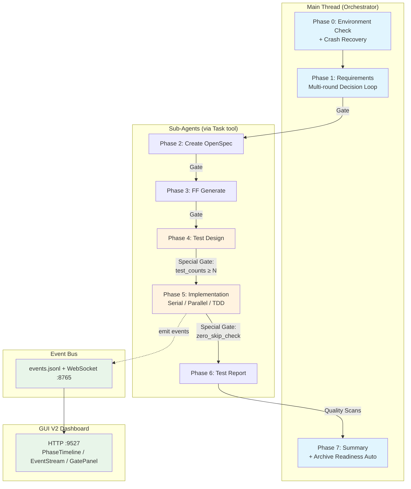
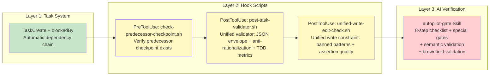
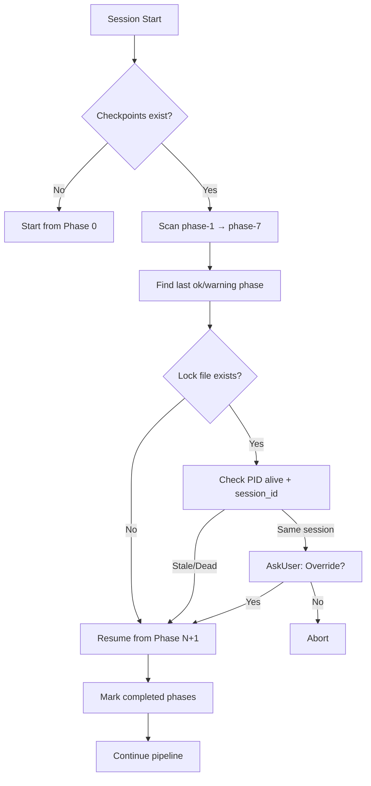
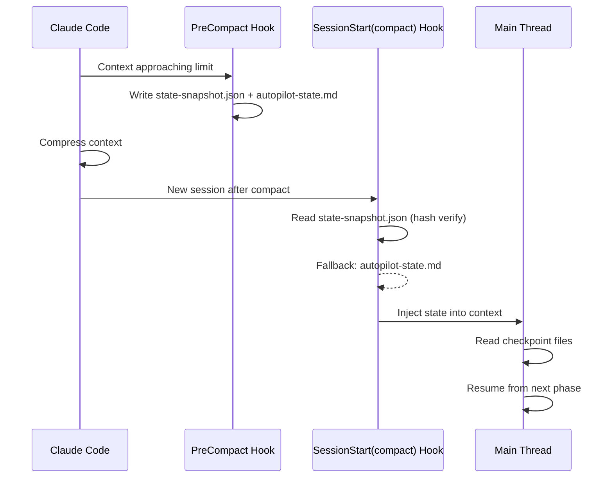

> **[中文版](README.zh.md)** | English (default)

# spec-autopilot

> Spec-driven autopilot orchestration for delivery pipelines — 8-phase workflow with 3-layer gate system and crash recovery.

[](CHANGELOG.md) <!-- x-release-please-version -->
[](LICENSE)

## Overview

**spec-autopilot** is a Claude Code plugin that automates the full software delivery lifecycle: from requirements gathering through implementation, testing, reporting, and archival. It enforces quality through a deterministic 3-layer gate system and provides resilient crash recovery.

### Key Features

- **8-Phase Pipeline**: Requirements → OpenSpec → FF Generate → Test Design → Implementation → Test Report → Archive
- **3-Layer Gate System**: TaskCreate dependencies + Hook checkpoint validation + AI checklist verification
- **Crash Recovery**: Automatic checkpoint scanning and session resume (with anchor_sha validation)
- **Context Compaction Resilience**: State persistence across Claude Code context compression
- **Anti-Rationalization**: 16 pattern detection (bilingual CN/EN) to prevent sub-agents from skipping work
- **Test Pyramid Enforcement**: Hook-level validation of test distribution (L2/L3 layered thresholds)
- **TDD Deterministic Cycle**: RED-GREEN-REFACTOR with L2 `tdd_metrics` validation
- **Requirements Routing**: Auto-classify requirements as Feature/Bugfix/Refactor/Chore with dynamic gate thresholds
- **Event Bus**: Real-time event streaming via `events.jsonl` + WebSocket for GUI and external tools
- **GUI V2 Dashboard**: Three-column real-time dashboard (Phase timeline / Event stream / Gate decisions) with decision_ack feedback loop
- **Parallel Execution**: Domain-level parallel agents (backend ‖ frontend ‖ node) with file ownership enforcement
- **7-Agent Parallel Audit**: Comprehensive parallel audit across 7 dimensions
- **Modular Test Suite**: 98 test files with 1169+ assertions covering all hooks and scripts
- **Requirements Clarity Detection**: Pre-scan rule engine to detect vague requirements before research
- **Metrics Collection**: Per-phase timing and retry tracking
- **Socratic Requirements Mode**: Deep requirements analysis through challenging questions (+Step 7 non-functional requirements)

## Architecture



### 3-Layer Gate System



### Crash Recovery Flow



### Context Compaction Recovery



### GUI V2 Dashboard

Real-time visualization of execution status and gate decision interaction.

**Launch command**:

```bash
bun run plugins/spec-autopilot/runtime/server/autopilot-server.ts
```

**Three-column layout**:

| Column | Component | Content |
|--------|-----------|---------|
| Left | PhaseTimeline | Phase progress timeline + status indicators |
| Center | EventStream | Real-time event stream (VirtualTerminal incremental rendering) |
| Right | GatePanel + TelemetryPanel | Gate decision overlay + telemetry panel |

**Ports**: HTTP `9527` (static assets) + WebSocket `8765` (real-time push + decision_ack)

### Event Emission Scripts

| Script | Event Type | Trigger |
|--------|-----------|---------|
| `emit-phase-event.sh` | `phase_start` / `phase_end` / `error` | Phase start and end |
| `emit-gate-event.sh` | `gate_pass` / `gate_block` | After gate decision |
| `emit-task-progress.sh` | `task_progress` | After each Phase 5 task completes |

## Installation

### Zero-Config Onboarding

New projects only need a single configuration file to run autopilot:

1. Install plugin: `claude plugin add lorainwings/claude-autopilot`
2. Run `Start autopilot [requirement description]`
3. The plugin auto-detects project structure and generates `.claude/autopilot.config.yaml`
4. Built-in templates handle all phases automatically — no additional files needed

### Step 1: Add marketplace

```bash
claude plugin marketplace add lorainwings/claude-autopilot
```

### Step 2: Install plugin

```bash
# Project-level (recommended)
claude plugin install spec-autopilot@lorainwings-plugins --scope project

# User-level (all projects)
claude plugin install spec-autopilot@lorainwings-plugins --scope user
```

### Step 3: Restart Claude Code

Restart your Claude Code session to activate the plugin.

### Verify

```bash
claude plugin list
# Should show: spec-autopilot@lorainwings-plugins
```

## Configuration

Create `.claude/autopilot.config.yaml` in your project root (or run `autopilot-setup` to auto-generate):

```yaml
version: "1.0"

services:
  backend:
    health_url: "http://localhost:8080/actuator/health"

phases:
  requirements:
    agent: "general-purpose"    # Default safe fallback. Run /autopilot-agents install to swap in recommended agents (analyst / business-analyst).
    min_qa_rounds: 1
    mode: "structured"           # structured | socratic
  testing:
    agent: "general-purpose"    # Default. Recommended: qa-expert / test-engineer (install via /autopilot-agents install).
    gate:
      min_test_count_per_type: 5
      required_test_types: [unit, api, e2e, ui]
  implementation:
    serial_task:
      max_retries_per_task: 3
    worktree:
      enabled: false
  reporting:
    format: "allure"
    coverage_target: 80
    zero_skip_required: true

test_pyramid:
  min_unit_pct: 50
  max_e2e_pct: 20
  min_total_cases: 20

gates:
  user_confirmation:
    after_phase_1: false
    after_phase_3: false
    after_phase_4: false

test_suites:
  backend_unit:
    command: "cd backend && ./gradlew test"
    type: unit
    allure: junit_xml
```

> Full configuration reference: [docs/getting-started/configuration.md](docs/getting-started/configuration.md)

## Components

### Skills

| Skill | Invocable | Purpose |
|-------|-----------|---------|
| `autopilot` | Yes | Main 8-phase orchestrator (runs in main thread) |
| `autopilot-setup` | Yes | Auto-detect tech stack, generate config |
| `autopilot-dispatch` | No | Sub-Agent dispatch with JSON envelope contract |
| `autopilot-gate` | No | 8-step checklist + special gates + checkpoint R/W + semantic/brownfield validation |
| `autopilot-phase0` | No | Environment check + config loading + crash recovery + lock file |
| `autopilot-phase7` | No | Summary display + archive + git autosquash + mode-aware Summary Box |
| `autopilot-recovery` | No | Crash recovery via checkpoint scanning + anchor_sha validation |

### Hook Scripts

| Script | Event | Purpose |
|--------|-------|---------|
| `check-predecessor-checkpoint.sh` | PreToolUse(Task) | Verify predecessor checkpoint + wall-clock timeout + mode-aware gates |
| `post-task-validator.sh` | PostToolUse(Task) | Unified validator: JSON envelope + anti-rationalization + code constraints + merge guard + decision format + TDD metrics |
| `unified-write-edit-check.sh` | PostToolUse(Write/Edit) | Unified write constraint: banned patterns + assertion quality + checkpoint protection + file ownership |
| `guard-no-verify.sh` | PreToolUse(Bash) | Block `--no-verify` flag in git commands to enforce hook execution |
| `scan-checkpoints-on-start.sh` | SessionStart | Report existing checkpoints (mode-aware resume suggestion) |
| `save-state-before-compact.sh` | PreCompact | Persist orchestration state |
| `reinject-state-after-compact.sh` | SessionStart(compact) | Restore state after compression |

### Utility Scripts

| Script | Purpose |
|--------|---------|
| `validate-config.sh` | Validate autopilot.config.yaml schema |
| `collect-metrics.sh` | Aggregate per-phase execution metrics |
| `check-allure-install.sh` | Detect Allure toolchain installation |
| `emit-phase-event.sh` | Emit phase lifecycle events to Event Bus |
| `emit-gate-event.sh` | Emit gate pass/block events to Event Bus |
| `emit-task-progress.sh` | Emit Phase 5 task progress events |
| `capture-hook-event.sh` | Capture and log hook execution events for diagnostics |
| `emit-tool-event.sh` | Emit tool-level events to Event Bus |
| `autopilot-server.ts` | GUI dual-mode server: HTTP:9527 + WebSocket:8765 |
| `_common.sh` | Shared utility functions |

### Development Tools (`tools/`)

| Script | Purpose |
|--------|---------|
| `build-dist.sh` | Build distribution package for publishing |
| `mock-event-emitter.js` | Mock event emitter for GUI component testing |

> **Note**: Version bumping is handled by the repo-level `tools/release.sh` wizard.

## Requirements

- **Claude Code** CLI (v1.0.0+)
- **python3** (3.8+): Required for hook scripts
- **bash** (4.0+): Hook script execution
- **git**: Version control integration

## Project Setup

### 1. Generate config

```bash
# In Claude Code, invoke:
Skill("spec-autopilot:autopilot-setup")
```

### 2. Create project-side skill wrapper

Create `.claude/skills/autopilot/SKILL.md`:

```markdown
---
name: autopilot
description: "Full autopilot orchestrator"
argument-hint: "[requirement description or PRD file path]"
---

Invoke Skill("spec-autopilot:autopilot", args="$ARGUMENTS") to start the orchestrator.
```

### 3. Add phase instruction files

Place project-specific instructions in `.claude/skills/autopilot/phases/` and reference them from config's `instruction_files` arrays.

## Troubleshooting

Common issues and solutions: [docs/operations/troubleshooting.md](docs/operations/troubleshooting.md)

## Documentation

| Document | Content | Chinese |
|----------|---------|---------|
| [Quick Start](docs/getting-started/quick-start.md) | 5-minute quick start guide | [中文](docs/getting-started/quick-start.zh.md) |
| [Integration Guide](docs/getting-started/integration-guide.md) | Step-by-step project onboarding, config examples, checklist | [中文](docs/getting-started/integration-guide.zh.md) |
| [Configuration](docs/getting-started/configuration.md) | Complete YAML field reference with types and defaults | [中文](docs/getting-started/configuration.zh.md) |
| [Architecture](docs/architecture/overview.md) | System architecture, event bus, GUI V2, parallel dispatch, routing | [中文](docs/architecture/overview.zh.md) |
| [Phases](docs/architecture/phases.md) | Per-phase execution guide, I/O tables, checkpoint formats, TDD cycle | [中文](docs/architecture/phases.zh.md) |
| [Gates](docs/architecture/gates.md) | 3-layer gate deep dive, anti-rationalization, routing_overrides, decision_ack | [中文](docs/architecture/gates.zh.md) |
| [Config Tuning](docs/operations/config-tuning-guide.md) | Per-project-type configuration optimization | [中文](docs/operations/config-tuning-guide.zh.md) |
| [Troubleshooting](docs/operations/troubleshooting.md) | Common errors, debugging hooks, recovery scenarios | [中文](docs/operations/troubleshooting.zh.md) |
| [Event Bus API](skills/autopilot/references/event-bus-api.md) | Event types, transport layer, consumption examples | [中文](skills/autopilot/references/event-bus-api.zh.md) |
| [Changelog](CHANGELOG.md) | Version history | — |

## Contributing

1. Fork the repository
2. Create a feature branch: `git checkout -b feature/my-feature`
3. Run tests: `make test`
4. Rebuild distribution: `make build`
5. Ensure JSON files are valid
6. Submit a pull request

## License

MIT
