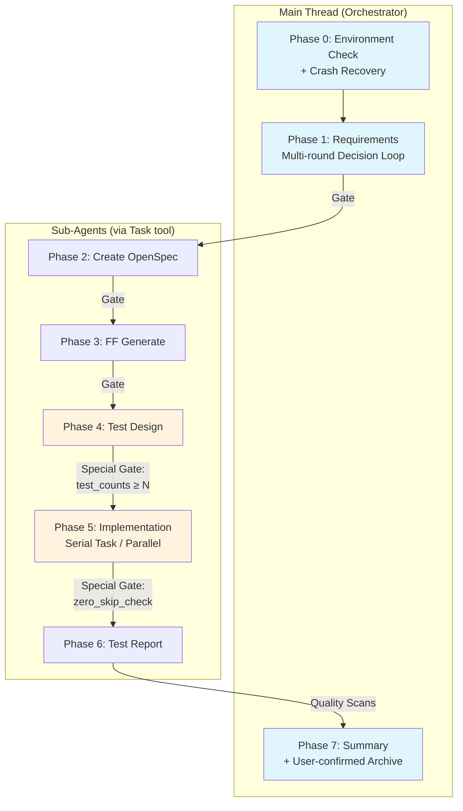
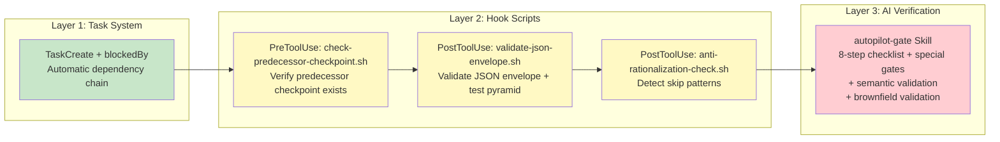
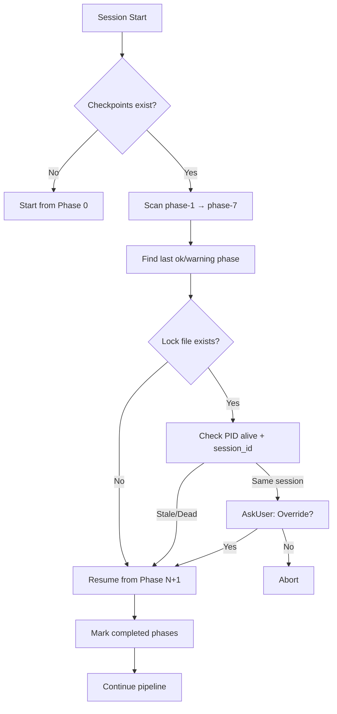
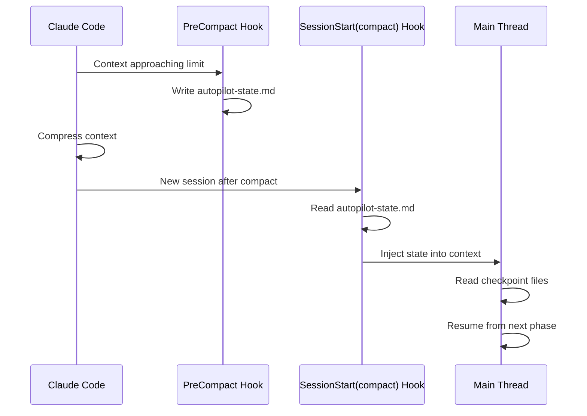

# spec-autopilot

> Spec-driven autopilot orchestration for delivery pipelines — 8-phase workflow with 3-layer gate system and crash recovery.

[](CHANGELOG.md)
[](LICENSE)

## Overview

**spec-autopilot** is a Claude Code plugin that automates the full software delivery lifecycle: from requirements gathering through implementation, testing, reporting, and archival. It enforces quality through a deterministic 3-layer gate system and provides resilient crash recovery.

### Key Features

- **8-Phase Pipeline**: Requirements → OpenSpec → FF Generate → Test Design → Implementation → Test Report → Archive
- **3-Layer Gate System**: TaskCreate dependencies + Hook checkpoint validation + AI checklist verification
- **Crash Recovery**: Automatic checkpoint scanning and session resume
- **Context Compaction Resilience**: State persistence across Claude Code context compression
- **Anti-Rationalization**: Pattern detection to prevent sub-agents from skipping work
- **Test Pyramid Enforcement**: Hook-level validation of test distribution
- **Metrics Collection**: Per-phase timing and retry tracking
- **Socratic Requirements Mode**: Deep requirements analysis through challenging questions

## Architecture



### 3-Layer Gate System



### Crash Recovery Flow



### Context Compaction Recovery



## Installation

### 零配置接入（v3.0）

新项目只需一个配置文件即可运行 autopilot：

1. 安装插件: `claude plugin add lorainwings/claude-autopilot`
2. 运行 `启动autopilot [需求描述]`
3. 插件自动检测项目结构，生成 `.claude/autopilot.config.yaml`
4. 内置模板自动处理所有阶段 — 无需创建额外文件

### Step 1: Add marketplace

```bash
claude plugin marketplace add lorainwings/claude-autopilot
```

### Step 2: Install plugin

```bash
# Project-level (recommended)
claude plugin install spec-autopilot@lorainwings-plugins --scope project

# User-level (all projects)
claude plugin install spec-autopilot@lorainwings-plugins --scope user
```

### Step 3: Restart Claude Code

Restart your Claude Code session to activate the plugin.

### Verify

```bash
claude plugin list
# Should show: spec-autopilot@lorainwings-plugins
```

## Configuration

Create `.claude/autopilot.config.yaml` in your project root (or run `autopilot-init` to auto-generate):

```yaml
version: "1.0"

services:
  backend:
    health_url: "http://localhost:8080/actuator/health"

phases:
  requirements:
    agent: "business-analyst"
    min_qa_rounds: 1
    mode: "structured"           # structured | socratic
  testing:
    agent: "qa-expert"
    gate:
      min_test_count_per_type: 5
      required_test_types: [unit, api, e2e, ui]
  implementation:
    serial_task:
      max_retries_per_task: 3
    worktree:
      enabled: false
  reporting:
    format: "allure"
    coverage_target: 80
    zero_skip_required: true

test_pyramid:
  min_unit_pct: 50
  max_e2e_pct: 20
  min_total_cases: 20

gates:
  user_confirmation:
    after_phase_1: true
    after_phase_3: false
    after_phase_4: false

test_suites:
  backend_unit:
    command: "cd backend && ./gradlew test"
    type: unit
    allure: junit_xml
```

> Full configuration reference: [docs/configuration.md](docs/configuration.md)

## Components

### Skills

| Skill | Invocable | Purpose |
|-------|-----------|---------|
| `autopilot` | Yes | Main 8-phase orchestrator (runs in main thread) |
| `autopilot-init` | Yes | Auto-detect tech stack, generate config |
| `autopilot-dispatch` | No | Sub-Agent dispatch with JSON envelope contract |
| `autopilot-gate` | No | 8-step checklist + special gates + semantic/brownfield validation |
| `autopilot-checkpoint` | No | Checkpoint read/write + task-level checkpoints |
| `autopilot-recovery` | No | Crash recovery via checkpoint scanning |

### Hook Scripts

| Script | Event | Purpose |
|--------|-------|---------|
| `check-predecessor-checkpoint.sh` | PreToolUse(Task) | Verify predecessor checkpoint + wall-clock timeout |
| `validate-json-envelope.sh` | PostToolUse(Task) | Validate JSON envelope + test pyramid floors |
| `anti-rationalization-check.sh` | PostToolUse(Task) | Detect rationalization/skip patterns |
| `scan-checkpoints-on-start.sh` | SessionStart | Report existing checkpoints |
| `save-state-before-compact.sh` | PreCompact | Persist orchestration state |
| `reinject-state-after-compact.sh` | SessionStart(compact) | Restore state after compression |

### Utility Scripts

| Script | Purpose |
|--------|---------|
| `validate-config.sh` | Validate autopilot.config.yaml schema |
| `collect-metrics.sh` | Aggregate per-phase execution metrics |
| `check-allure-install.sh` | Detect Allure toolchain installation |
| `_common.sh` | Shared utility functions |

## Requirements

- **Claude Code** CLI (v1.0.0+)
- **python3** (3.8+): Required for hook scripts
- **bash** (4.0+): Hook script execution
- **git**: Version control integration

## Project Setup

### 1. Generate config

```bash
# In Claude Code, invoke:
Skill("spec-autopilot:autopilot-init")
```

### 2. Create project-side skill wrapper

Create `.claude/skills/autopilot/SKILL.md`:

```markdown
---
name: autopilot
description: "Full autopilot orchestrator"
argument-hint: "[需求描述或 PRD 文件路径]"
---

调用 Skill("spec-autopilot:autopilot", args="$ARGUMENTS") 启动编排器。
```

### 3. Add phase instruction files

Place project-specific instructions in `.claude/skills/autopilot/phases/` and reference them from config's `instruction_files` arrays.

## Troubleshooting

Common issues and solutions: [docs/troubleshooting.md](docs/troubleshooting.md)

## Documentation

| Document | Content |
|----------|---------|
| [Integration Guide](docs/integration-guide.md) | Step-by-step project onboarding, config examples, checklist |
| [Architecture](docs/architecture.md) | Layer design, hook execution flow, skill interactions, data flow |
| [Configuration](docs/configuration.md) | Complete YAML field reference with types and defaults |
| [Gates](docs/gates.md) | 3-layer gate deep dive, special gates, anti-rationalization |
| [Phases](docs/phases.md) | Per-phase execution guide, I/O tables, checkpoint formats |
| [Troubleshooting](docs/troubleshooting.md) | Common errors, debugging hooks, recovery scenarios |
| [Changelog](../../CHANGELOG.md) | Version history |

## Contributing

1. Fork the repository
2. Create a feature branch: `git checkout -b feature/my-feature`
3. Run tests: `bash plugins/spec-autopilot/scripts/test-hooks.sh`
4. Ensure all bash scripts pass syntax check: `bash -n plugins/spec-autopilot/scripts/*.sh`
5. Ensure JSON files are valid
6. Submit a pull request

## License

MIT
