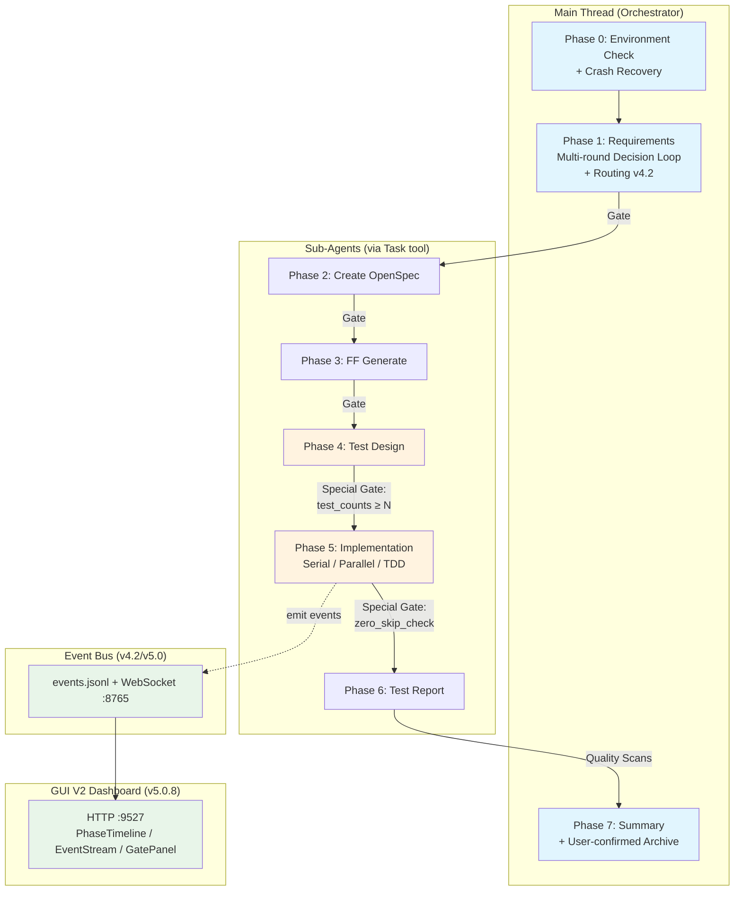
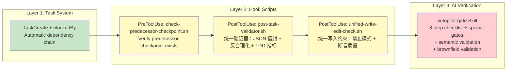
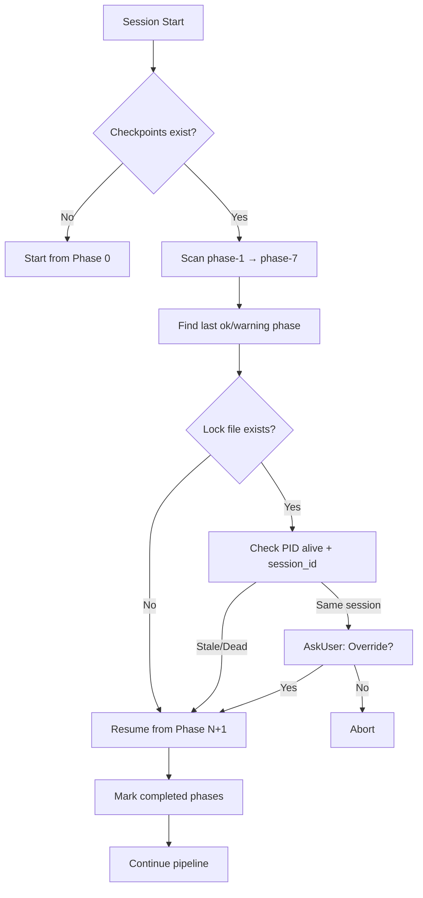
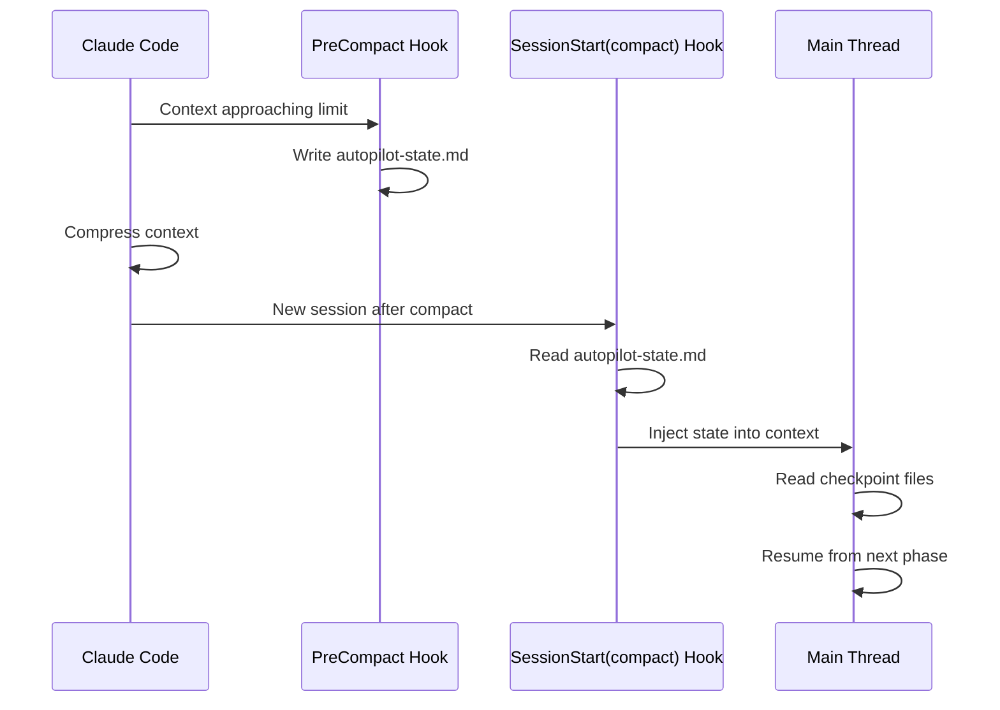

> [English](README.md) | 中文

# spec-autopilot

> 规范驱动的自动驾驶交付编排 — 8 阶段工作流 + 3 层门禁系统 + 崩溃恢复。

[](CHANGELOG.md)
[](LICENSE)

## 概述

**spec-autopilot** 是一个 Claude Code 插件，自动化完整的软件交付生命周期：从需求收集到实现、测试、报告和归档。它通过确定性的 3 层门禁系统保障质量，并提供弹性的崩溃恢复能力。

### 核心特性

- **8 阶段流水线**: 需求 → OpenSpec → FF 生成 → 测试设计 → 实现 → 测试报告 → 归档
- **3 层门禁系统**: TaskCreate 依赖链 + Hook 检查点验证 + AI 清单校验
- **崩溃恢复**: 自动扫描检查点并恢复会话（含 anchor_sha 验证）
- **上下文压缩韧性**: 跨 Claude Code 上下文压缩的状态持久化
- **反合理化检测**: 16 种模式检测（v5.2: +时间/环境/第三方借口，中英双语）防止子 Agent 跳过工作
- **测试金字塔强制**: Hook 级别的测试分布验证（L2/L3 分层阈值）
- **TDD 确定性循环**: RED-GREEN-REFACTOR，含 L2 `tdd_metrics` 验证（v4.1）
- **需求路由（v4.2）**: 自动分类需求为 Feature/Bugfix/Refactor/Chore，动态调整门禁阈值
- **事件总线（v4.2/v5.0）**: 通过 `events.jsonl` + WebSocket 实时事件流，支持 GUI 和外部工具
- **GUI V2 大盘（v5.0.8）**: 三栏实时仪表盘（Phase 时间轴 / 事件流 / 门禁决策）含 decision_ack 反馈回路
- **并行执行（v5.0）**: 领域级并行 Agent（backend ‖ frontend ‖ node）含文件所有权强制
- **7-Agent 并行审计（v5.0.10）**: 跨 7 个维度的全面并行审计
- **模块化测试套件**: 76 个测试文件，692+ 个断言，覆盖所有 Hook 和脚本
- **需求清晰度检测**: 预扫描规则引擎，在研究前检测模糊需求（v4.1）
- **指标采集**: 每阶段计时和重试追踪
- **苏格拉底需求模式**: 通过挑战性问题进行深度需求分析（v5.0.6: +Step 7 非功能需求）

## 架构



### 3 层门禁系统



### 崩溃恢复流程



### 上下文压缩恢复



### GUI V2 大盘（v5.0.8）

实时可视化执行状态和门禁决策交互。

**启动命令**:

```bash
bun run plugins/spec-autopilot/scripts/autopilot-server.ts
```

**三栏布局**:

| 栏位 | 组件 | 内容 |
|------|------|------|
| 左栏 | PhaseTimeline | Phase 进度时间轴 + 状态指示灯 |
| 中栏 | EventStream | 实时事件流（VirtualTerminal 增量渲染） |
| 右栏 | GatePanel + TelemetryPanel | 门禁决策浮层 + 遥测面板 |

**端口**: HTTP `9527`（静态资源） + WebSocket `8765`（实时推送 + decision_ack）

### 事件发射脚本（v4.2/v5.0）

| 脚本 | 事件类型 | 触发时机 |
|------|---------|---------|
| `emit-phase-event.sh` | `phase_start` / `phase_end` / `error` | 阶段开始和结束 |
| `emit-gate-event.sh` | `gate_pass` / `gate_block` | 门禁判定后 |
| `emit-task-progress.sh` | `task_progress` | Phase 5 每个 task 完成后（v5.2） |

## 安装

### 零配置接入（v3.0）

新项目只需一个配置文件即可运行 autopilot：

1. 安装插件: `claude plugin add lorainwings/claude-autopilot`
2. 运行 `启动autopilot [需求描述]`
3. 插件自动检测项目结构，生成 `.claude/autopilot.config.yaml`
4. 内置模板自动处理所有阶段 — 无需创建额外文件

### 步骤 1: 添加市场源

```bash
claude plugin marketplace add lorainwings/claude-autopilot
```

### 步骤 2: 安装插件

```bash
# 项目级（推荐）
claude plugin install spec-autopilot@lorainwings-plugins --scope project

# 用户级（所有项目）
claude plugin install spec-autopilot@lorainwings-plugins --scope user
```

### 步骤 3: 重启 Claude Code

重启 Claude Code 会话以激活插件。

### 验证

```bash
claude plugin list
# Should show: spec-autopilot@lorainwings-plugins
```

## 配置

在项目根目录创建 `.claude/autopilot.config.yaml`（或运行 `autopilot-init` 自动生成）：

```yaml
version: "1.0"

services:
  backend:
    health_url: "http://localhost:8080/actuator/health"

phases:
  requirements:
    agent: "business-analyst"
    min_qa_rounds: 1
    mode: "structured"           # structured | socratic
  testing:
    agent: "qa-expert"
    gate:
      min_test_count_per_type: 5
      required_test_types: [unit, api, e2e, ui]
  implementation:
    serial_task:
      max_retries_per_task: 3
    worktree:
      enabled: false
  reporting:
    format: "allure"
    coverage_target: 80
    zero_skip_required: true

test_pyramid:
  min_unit_pct: 50
  max_e2e_pct: 20
  min_total_cases: 20

gates:
  user_confirmation:
    after_phase_1: true
    after_phase_3: false
    after_phase_4: false

test_suites:
  backend_unit:
    command: "cd backend && ./gradlew test"
    type: unit
    allure: junit_xml
```

> 完整配置参考: [docs/getting-started/configuration.zh.md](docs/getting-started/configuration.zh.md)

## 组件

### Skills

| Skill | 可调用 | 用途 |
|-------|--------|------|
| `autopilot` | 是 | 主 8 阶段编排器（在主线程运行） |
| `autopilot-init` | 是 | 自动检测技术栈，生成配置 |
| `autopilot-dispatch` | 否 | 子 Agent 分发，含 JSON 信封契约 |
| `autopilot-gate` | 否 | 8 步清单 + 特殊门禁 + 检查点读写 + 语义/棕地验证 |
| `autopilot-phase0` | 否 | 环境检查 + 配置加载 + 崩溃恢复 + 锁文件 |
| `autopilot-phase7` | 否 | 摘要展示 + 归档 + git autosquash + 模式感知 Summary Box |
| `autopilot-recovery` | 否 | 通过检查点扫描进行崩溃恢复 + anchor_sha 验证 |

### Hook 脚本

| 脚本 | 事件 | 用途 |
|------|------|------|
| `check-predecessor-checkpoint.sh` | PreToolUse(Task) | 验证前置检查点 + 挂钟超时 + 模式感知门禁 |
| `post-task-validator.sh` | PostToolUse(Task) | 统一验证器：JSON 信封 + 反合理化 + 代码约束 + 合并守卫 + 决策格式 + TDD 指标（v5.1） |
| `unified-write-edit-check.sh` | PostToolUse(Write/Edit) | 统一写入约束：禁止模式 + 断言质量 + 检查点保护 + 文件所有权（v5.1） |
| `guard-no-verify.sh` | PreToolUse(Bash) | 阻断 git 命令中的 `--no-verify` 标志以强制执行 hook |
| `scan-checkpoints-on-start.sh` | SessionStart | 报告现有检查点（模式感知的恢复建议） |
| `save-state-before-compact.sh` | PreCompact | 持久化编排状态 |
| `reinject-state-after-compact.sh` | SessionStart(compact) | 压缩后恢复状态 |

### 工具脚本

| 脚本 | 用途 |
|------|------|
| `validate-config.sh` | 验证 autopilot.config.yaml 模式 |
| `collect-metrics.sh` | 汇总每阶段执行指标 |
| `check-allure-install.sh` | 检测 Allure 工具链安装 |
| `emit-phase-event.sh` | 向事件总线发射阶段生命周期事件（v4.2） |
| `emit-gate-event.sh` | 向事件总线发射门禁通过/阻断事件（v4.2） |
| `emit-task-progress.sh` | 发射 Phase 5 任务进度事件（v5.2） |
| `capture-hook-event.sh` | 捕获并记录 hook 执行事件，用于诊断 |
| `emit-tool-event.sh` | 向事件总线发射工具级事件 |
| `autopilot-server.ts` | GUI 双模服务器：HTTP:9527 + WebSocket:8765（v5.0.8） |
| `_common.sh` | 共享工具函数 |

### 开发工具 (`tools/`)

| 脚本 | 用途 |
|------|------|
| `build-dist.sh` | 构建发布分发包 |
| `bump-version.sh` | 同步 plugin.json / marketplace.json / README.md / CHANGELOG.md 版本号 |
| `mock-event-emitter.js` | 用于 GUI 组件测试的模拟事件发射器 |

## 环境要求

- **Claude Code** CLI（v1.0.0+）
- **python3**（3.8+）：Hook 脚本所需
- **bash**（4.0+）：Hook 脚本执行
- **git**：版本控制集成

## 项目配置

### 1. 生成配置

```bash
# In Claude Code, invoke:
Skill("spec-autopilot:autopilot-init")
```

### 2. 创建项目侧 Skill 包装

创建 `.claude/skills/autopilot/SKILL.md`：

```markdown
---
name: autopilot
description: "Full autopilot orchestrator"
argument-hint: "[需求描述或 PRD 文件路径]"
---

调用 Skill("spec-autopilot:autopilot", args="$ARGUMENTS") 启动编排器。
```

### 3. 添加阶段指令文件

将项目特定指令放在 `.claude/skills/autopilot/phases/` 目录下，并在配置的 `instruction_files` 数组中引用。

## 故障排查

常见问题及解决方案: [docs/operations/troubleshooting.zh.md](docs/operations/troubleshooting.zh.md)

## 文档

| 文档 | 内容 | English |
|------|------|---------|
| [快速开始](docs/getting-started/quick-start.zh.md) | 5 分钟快速入门指南 | [EN](docs/getting-started/quick-start.md) |
| [集成指南](docs/getting-started/integration-guide.zh.md) | 分步项目接入、配置示例、检查清单 | [EN](docs/getting-started/integration-guide.md) |
| [配置参考](docs/getting-started/configuration.zh.md) | 完整 YAML 字段参考，含类型和默认值 | [EN](docs/getting-started/configuration.md) |
| [架构概览](docs/architecture/overview.zh.md) | 系统架构、事件总线、GUI V2、并行分发、路由 | [EN](docs/architecture/overview.md) |
| [阶段详解](docs/architecture/phases.zh.md) | 每阶段执行指南、I/O 表、检查点格式、TDD 循环 | [EN](docs/architecture/phases.md) |
| [门禁详解](docs/architecture/gates.zh.md) | 3 层门禁深入、反合理化、routing_overrides、decision_ack | [EN](docs/architecture/gates.md) |
| [配置调优](docs/operations/config-tuning-guide.zh.md) | 按项目类型的配置优化 | [EN](docs/operations/config-tuning-guide.md) |
| [故障排查](docs/operations/troubleshooting.zh.md) | 常见错误、Hook 调试、恢复场景 | [EN](docs/operations/troubleshooting.md) |
| [事件总线 API](skills/autopilot/references/event-bus-api.zh.md) | 事件类型、传输层、消费示例 | [EN](skills/autopilot/references/event-bus-api.md) |
| [变更日志](CHANGELOG.md) | 版本历史 | — |

## 贡献

1. Fork 本仓库
2. 创建特性分支：`git checkout -b feature/my-feature`
3. 运行测试：`make test`
4. 重新构建分发包：`make build`
5. 确保 JSON 文件有效
6. 提交 Pull Request

## 许可证

MIT
