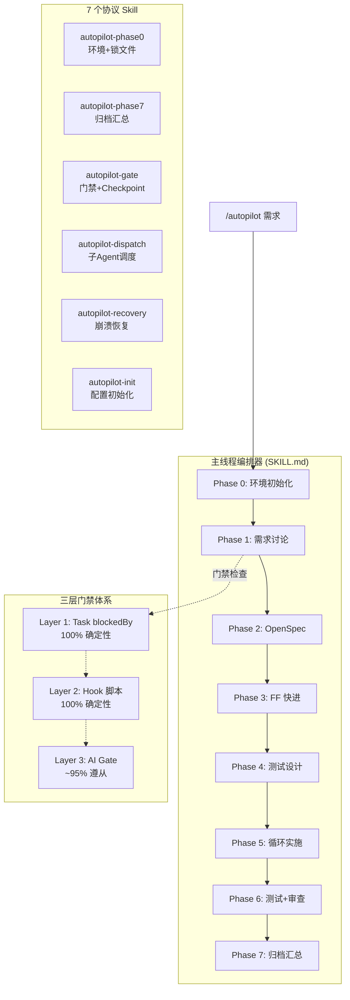

# 架构总览

> spec-autopilot 系统架构全景图，包含 8 阶段流水线、三层门禁、7 个 Skill 协作关系。

## 系统架构



## 执行模式

```
full:    Phase 0 → 1 → 2 → 3 → 4 → 5 → 6 → 7   (完整流程)
lite:    Phase 0 → 1 ───────────→ 5 → 6 → 7       (跳过 OpenSpec)
minimal: Phase 0 → 1 ───────────→ 5 ──────→ 7     (最精简)
```

## 三层门禁详解

| 层级 | 执行者 | 确定性 | 覆盖范围 | 失败行为 |
|------|--------|--------|---------|---------|
| **L1** | TaskCreate blockedBy | 100% | 阶段依赖顺序 | 任务系统自动阻止 |
| **L2** | Hook 脚本 (Python/Bash) | 100% | JSON 信封/反合理化/代码约束/测试金字塔 | block/deny JSON 输出 |
| **L3** | autopilot-gate Skill | ~95% | 8 步检查清单/特殊门禁/语义验证 | 硬阻断下一阶段 |

**设计原则**: L1+L2 覆盖所有可确定性验证的场景，L3 补充 AI 能力范围内的语义验证。即使 L3 失效，L1+L2 仍能阻止关键的阶段跳过。

## Hook 脚本架构

```
PreToolUse(Task)
  └── check-predecessor-checkpoint.sh   ← 前驱 checkpoint 验证

PostToolUse(Task)
  └── post-task-validator.sh            ← 统一入口 (v4.0 合并 5→1)
      ├── JSON 信封验证
      ├── 反合理化检测 (Phase 4/5/6)
      ├── 代码约束检查 (Phase 4/5/6)
      ├── 并行合并守卫 (Phase 5)
      └── 决策格式验证 (Phase 1)

PostToolUse(Write|Edit)
  └── write-edit-constraint-check.sh    ← 文件写入约束

PreCompact
  └── save-state-before-compact.sh      ← 上下文压缩前保存状态

SessionStart
  ├── scan-checkpoints-on-start.sh      ← 崩溃恢复扫描 (async)
  ├── check-skill-size.sh              ← SKILL.md 大小警告
  └── reinject-state-after-compact.sh   ← 压缩后状态注入 (compact)
```

## 数据流

```
用户需求 → Phase 1 (需求确认)
  ↓ phase-1-requirements.json
Phase 2-3 (规范生成)
  ↓ OpenSpec + tasks.md
Phase 4 (测试设计)
  ↓ phase-4-testing.json + test files
Phase 5 (代码实施)
  ↓ phase-5-implement.json + source files
Phase 6 (测试执行 + 代码审查)
  ↓ phase-6-report.json + test reports
Phase 7 (归档)
  ↓ phase-7-summary.json + git squash
```

所有 checkpoint 文件存储在：
```
openspec/changes/<name>/context/phase-results/
├── phase-1-requirements.json
├── phase-2-openspec.json
├── phase-3-ff.json
├── phase-4-testing.json
├── phase-5-implement.json
├── phase-6-report.json
└── phase-7-summary.json
```

## 上下文保护机制

1. **JSON 信封**: 子 Agent 自行 Write 产出文件，仅返回精简 JSON 摘要（~200 tokens vs ~5K tokens）
2. **后台 Agent**: Phase 2/3/4/6 使用 `run_in_background: true`，不污染主窗口上下文
3. **Checkpoint Agent**: 每阶段的 checkpoint 写入 + git fixup 合并为一个后台 Agent
4. **PreCompact Hook**: 上下文压缩前自动保存编排状态，压缩后自动恢复

## 文件结构

```
spec-autopilot/
├── skills/           (7 个 Skill)
│   ├── autopilot/    (主编排器 + references/ + templates/)
│   ├── autopilot-phase0/   (环境初始化 + 锁文件管理)
│   ├── autopilot-phase7/   (归档汇总)
│   ├── autopilot-gate/     (门禁验证 + Checkpoint 管理)
│   ├── autopilot-dispatch/ (子 Agent 调度)
│   ├── autopilot-recovery/ (崩溃恢复)
│   └── autopilot-init/     (配置初始化向导)
├── scripts/          (Hook 脚本 + 共享模块)
│   ├── _hook_preamble.sh        (公共 Hook 前言)
│   ├── _common.sh               (共享 Bash 工具)
│   ├── _envelope_parser.py      (JSON 信封解析)
│   ├── _constraint_loader.py    (约束加载)
│   ├── _config_validator.py     (配置验证)
│   ├── _post_task_validator.py  (统一 PostToolUse 验证)
│   └── ...                      (各 Hook 脚本)
├── hooks/hooks.json  (Hook 注册)
└── docs/             (文档)
```
