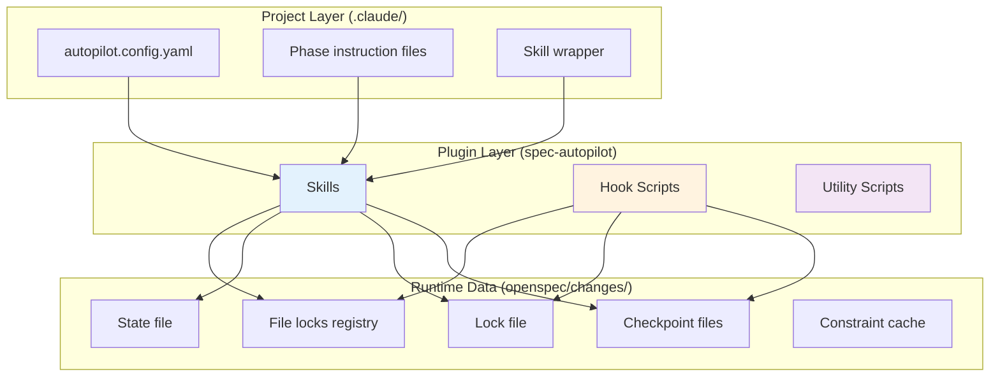
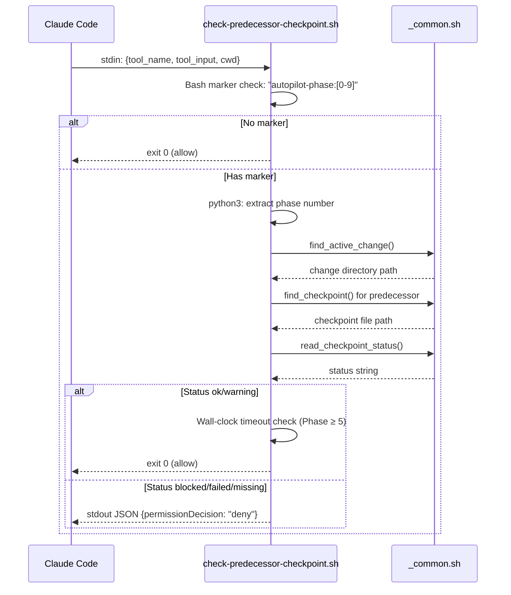
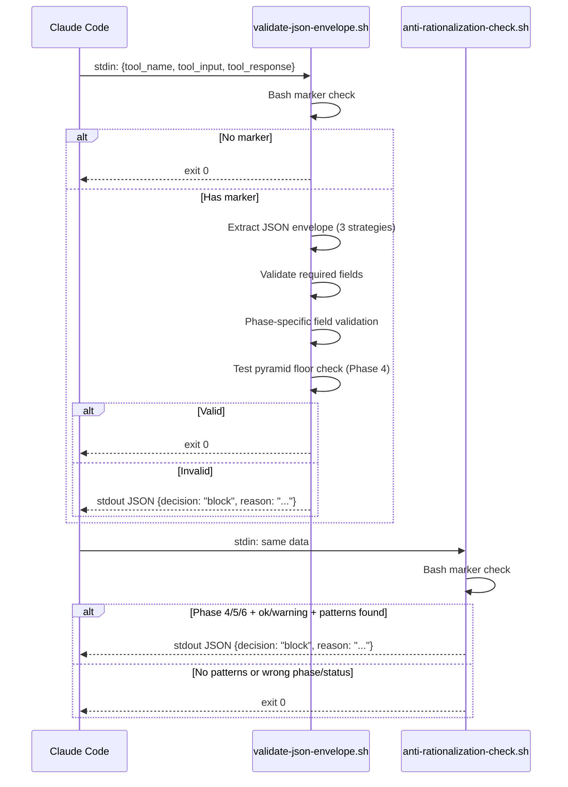
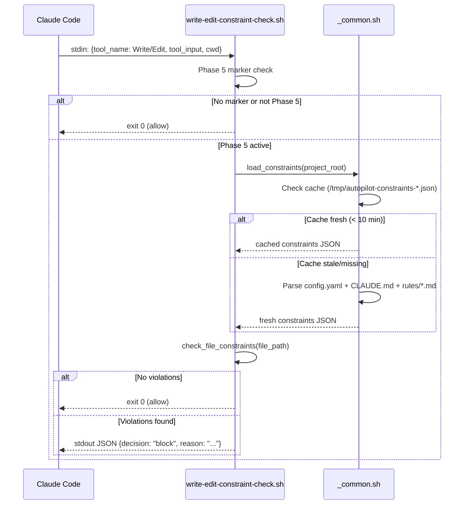
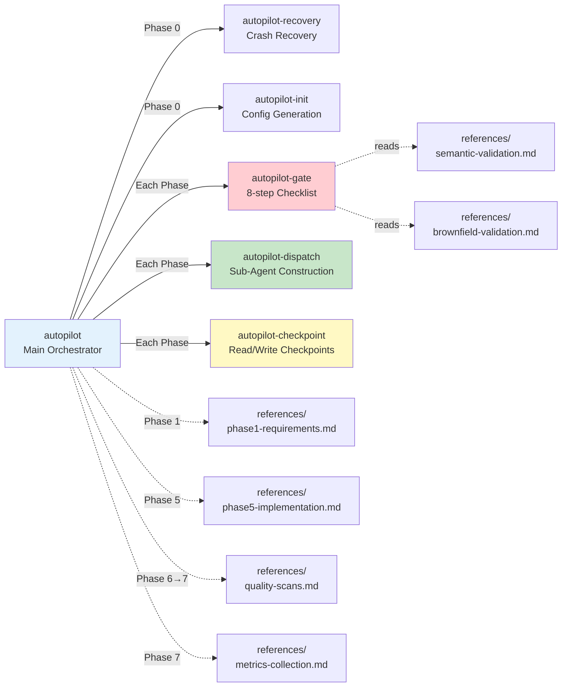

# Architecture

> spec-autopilot plugin architecture — layers, hooks, skills, and data flow.

## Layer Design

spec-autopilot uses a two-layer architecture:

| Layer | Location | Responsibility |
|-------|----------|----------------|
| **Plugin Layer** | `plugins/spec-autopilot/` | Reusable orchestration: Skills, Hooks, Scripts |
| **Project Layer** | `.claude/` in user project | Project-specific config, phase instructions, checkpoint data |



## Hook Execution Flow

### PreToolUse(Task)



### PostToolUse(Task) — Two Hooks in Sequence



### PostToolUse(Write/Edit) — Constraint Check (v3.1)



## Skill Interaction Map



## Data Flow

### Checkpoint Data

```
openspec/changes/<name>/
├── context/
│   ├── phase-results/
│   │   ├── phase-1-requirements.json    # Written by main thread
│   │   ├── phase-2-openspec.json        # Written after sub-agent
│   │   ├── phase-3-ff.json
│   │   ├── phase-4-testing.json
│   │   ├── phase-5-implement.json
│   │   ├── phase5-start-time.txt        # Wall-clock reference
│   │   ├── phase5-tasks/                # Task-level checkpoints
│   │   │   ├── task-1.json
│   │   │   └── task-2.json
│   │   ├── phase5-ownership/           # File ownership registry (v3.1)
│   │   │   ├── agent-1.json
│   │   │   ├── agent-2.json
│   │   │   └── file-locks.json
│   │   ├── phase-6-report.json
│   │   └── phase-7-summary.json
│   └── autopilot-state.md               # PreCompact state save
├── tasks.md                              # Task completion tracking
└── ...
```

### Lock File

```json
{
  "change": "<name>",
  "pid": "<process_id>",
  "started": "<ISO-8601>",
  "session_cwd": "<project_root>",
  "anchor_sha": "<git_sha>",
  "session_id": "<millisecond_timestamp>"
}
```

Located at `openspec/changes/.autopilot-active`. Used by hooks to identify the active change directory.

### JSON Envelope

Every sub-agent must return a JSON envelope:

```json
{
  "status": "ok | warning | blocked | failed",
  "summary": "One-line decision-level summary",
  "artifacts": ["file/paths"],
  "risks": ["risk descriptions"],
  "next_ready": true,
  "_metrics": {
    "start_time": "ISO-8601",
    "end_time": "ISO-8601",
    "duration_seconds": 0,
    "retry_count": 0
  }
}
```

Phase-specific additional fields are documented in [phases.md](phases.md).

## Performance Considerations

### Fast Bypass Pattern

All hook scripts use a pure-bash grep check before invoking python3:

```bash
if ! echo "$STDIN_DATA" | grep -q 'autopilot-phase:[0-9]'; then
  exit 0  # ~1ms for non-autopilot Task calls
fi
```

This avoids forking python3 (~200-500ms) for every non-autopilot Task call.

### Fail-Closed Design

All hooks follow a fail-closed pattern:
- Missing python3 → block/deny (never allow)
- JSON parse error → block/deny
- Missing checkpoint → deny

Exception: `anti-rationalization-check.sh` allows when python3 is missing (it's a secondary check).

## Constraint Loading Cache (v3.1)

The `_common.sh` utility provides a `load_constraints()` function with file-based caching:

1. **Cache key**: MD5 hash of project root path
2. **Cache location**: `/tmp/autopilot-constraints-<hash>.json`
3. **TTL**: 10 minutes (600 seconds)
4. **Content**: Merged constraints from config.yaml `code_constraints` + CLAUDE.md forbidden patterns + `.claude/rules/*.md` extraction

### Extraction priority:
1. `config.yaml` `code_constraints` section (highest priority)
2. `CLAUDE.md` forbidden file/pattern extraction
3. `.claude/rules/*.md` table rows + explicit forbidden markers + list format constraints

### Shared functions in `_common.sh`:

| Function | Purpose |
|----------|---------|
| `has_active_autopilot()` | Check if autopilot session is active (pure bash, ~1ms) |
| `parse_lock_file()` | Parse JSON or legacy lock file |
| `find_active_change()` | Find active change directory (3-priority fallback) |
| `load_constraints()` | Load + cache code constraints from config/CLAUDE.md/rules |
| `check_file_constraints()` | Validate a file against loaded constraints |
| `extract_project_root()` | Extract project root from stdin JSON or git |
| `should_bypass_hook()` | Standard Hook bypass checks (lock file + phase marker) |

## File-Level Locking (v3.1)

Phase 5 parallel execution uses a file-level lock registry:

**Location**: `openspec/changes/<name>/context/phase-results/phase5-ownership/file-locks.json`

**Format**:
```json
{
  "backend/src/Controller.java": "agent-1",
  "frontend/src/App.vue": "agent-2"
}
```

**Enforcement**:
- `write-edit-constraint-check.sh` validates file ownership before allowing Write/Edit
- Files not in the registry → fall back to directory-level ownership check
- Agent completion → main thread releases corresponding lock entries
