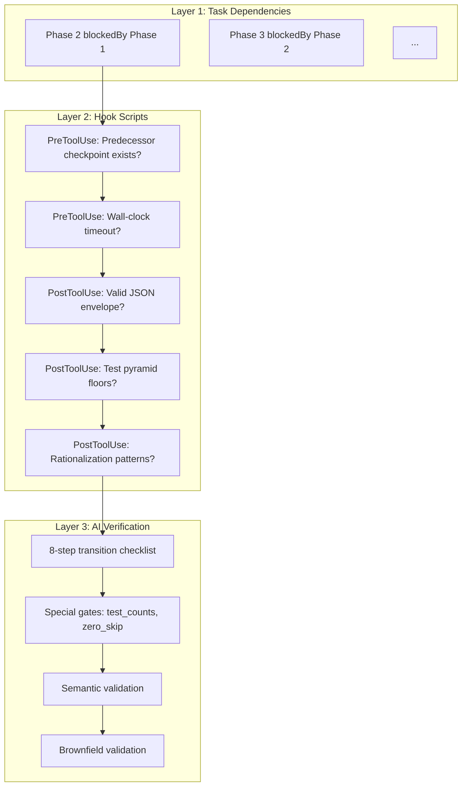

# Gate System

> Deep dive into the 3-layer gate system, special gates, anti-rationalization, and wall-clock timeout.

## Overview

spec-autopilot enforces quality through three independent, complementary gate layers. Each layer catches different classes of violations:

| Layer | Mechanism | Executor | Catches |
|-------|-----------|----------|---------|
| **Layer 1** | TaskCreate + blockedBy | Task system (automatic) | Out-of-order phase dispatch |
| **Layer 2** | Hook scripts (disk checkpoint) | Shell scripts (deterministic) | Missing/invalid checkpoints, pyramid violations, timeouts |
| **Layer 3** | 8-step checklist + semantic | autopilot-gate Skill (AI) | Threshold violations, content quality, drift |



## Layer 1: Task Dependencies

Phase 0 creates 8 tasks with a blockedBy chain:

```
Task(Phase 1) → Task(Phase 2, blockedBy: [Phase 1]) → ... → Task(Phase 7, blockedBy: [Phase 6])
```

This prevents Claude from starting a phase before its predecessor's task is marked complete. Enforced automatically by the Task system.

## Layer 2: Hook Scripts

### PreToolUse Gate (`check-predecessor-checkpoint.sh`)

Runs before every `Task` tool call. For autopilot phases:

1. **Predecessor checkpoint exists** with `ok` or `warning` status
2. **Sequential ordering**: Cannot skip phases (e.g., jump from Phase 2 to Phase 5)
3. **Phase 2 special**: Phase 1 checkpoint must exist (written by main thread)
4. **Phase 5 special**: Phase 4 must be `ok` (not `warning`)
5. **Phase 6 special**: Phase 5 `zero_skip_check.passed === true` + all `tasks.md` items `[x]`
6. **Wall-clock timeout** (Phase >= 5): Denies if Phase 5 running > 7200s (2 hours)

### PostToolUse Envelope Validation (`validate-json-envelope.sh`)

Runs after every `Task` tool call. For autopilot phases:

1. **JSON envelope exists** in sub-agent output (3 extraction strategies)
2. **Required fields**: `status`, `summary`
3. **Valid status**: `ok`, `warning`, `blocked`, `failed`
4. **Phase-specific fields**:
   - Phase 4: `test_counts`, `dry_run_results`, `test_pyramid`
   - Phase 5: `test_results_path`, `tasks_completed`, `zero_skip_check`
   - Phase 6: `pass_rate`, `report_path`, `report_format`
5. **Phase 4 warning block**: Phase 4 only accepts `ok` or `blocked`
6. **Phase 4/6 artifacts**: Must be non-empty list
7. **Test pyramid floors** (Phase 4 only):
   - `unit_pct >= 30` (lenient floor)
   - `e2e_pct <= 40` (lenient ceiling)
   - `total_cases >= 10` (minimum)

### PostToolUse Anti-Rationalization (`anti-rationalization-check.sh`)

Runs after envelope validation. Detects patterns suggesting the sub-agent is rationalizing skipping work:

**Trigger conditions** (all must be true):
1. Phase 4, 5, or 6 (testing/implementation/reporting)
2. Status is `ok` or `warning` (not `blocked`/`failed`)
3. Output contains rationalization patterns

**10 Detected Patterns**:

| # | Pattern | Example |
|---|---------|---------|
| 1 | `out of scope` | "This feature is out of scope" |
| 2 | `pre-existing issue/bug` | "This is a pre-existing bug" |
| 3 | `skip(ped/ping) this test/task` | "Skipped this test" |
| 4 | `not needed/necessary/required` | "Not needed for this phase" |
| 5 | `already covered/tested` | "Already covered by other tests" |
| 6 | `too complex/difficult/risky` | "Too complex to implement now" |
| 7 | `will be done later/separately` | "Can be done in a future iteration" |
| 8 | `deferred/postponed` | "Deferred to next sprint" |
| 9 | `minimal/low impact/priority` | "Low priority item" |
| 10 | `works/good enough` | "Works enough for now" |

## Layer 3: AI Gate (`autopilot-gate` Skill)

### 8-Step Transition Checklist

Every Phase N → Phase N+1 transition:

```
Step 1: Confirm Phase N sub-agent returned JSON envelope
Step 2: Verify JSON status is "ok" or "warning"
Step 3: Write checkpoint via autopilot-checkpoint Skill
Step 4: TaskUpdate Phase N → completed
Step 5: TaskGet Phase N+1 task, confirm blockedBy empty
Step 6: Read phase-results/phase-N-*.json, confirm exists and parseable
Step 6.5: (Optional) Semantic validation checks
Step 7: TaskUpdate Phase N+1 → in_progress
Step 8: Prepare dispatch via autopilot-dispatch Skill
```

### Special Gate: Phase 4 → Phase 5

Additional verification (thresholds from `config.phases.testing.gate`):

- `test_counts[type] >= min_test_count_per_type` for each required type
- `artifacts` contains files for each `required_test_types`
- `dry_run_results` all fields are 0 (exit codes)
- Phase 4 `warning` → forced to `blocked` if test counts insufficient

### Special Gate: Phase 5 → Phase 6

- `test-results.json` exists
- `zero_skip_check.passed === true`
- `tasks.md` all items `[x]`

### Semantic Validation (Optional Layer 3 Extension)

Per-phase content quality checks beyond structural validation. See [architecture.md](architecture.md) for the full checklist per transition.

Key checks by phase:
- Phase 1→2: Requirements are testable, no contradictory decisions
- Phase 3→4: Tasks cover all proposal features, granularity is reasonable
- Phase 4→5: Tests cover all tasks (not just happy path), pyramid is reasonable
- Phase 5→6: Implementation matches design, no unresolved TODOs
- Phase 6→7: Report includes all test suites, coverage meets target

### Brownfield Validation (Opt-in Layer 3 Extension)

When `brownfield_validation.enabled: true`, performs three-way consistency checks:

| Gate Point | Check |
|------------|-------|
| Phase 4→5 | Design-test alignment |
| Phase 5 start | Test-implementation readiness |
| Phase 5→6 | Implementation-design consistency |

`strict_mode: true` blocks on inconsistency; `false` (default) warns only.

## Wall-Clock Timeout

Phase 5 (implementation) has a 2-hour hard time limit enforced at the Hook layer:

1. Phase 5 start writes ISO-8601 timestamp to `phase5-start-time.txt`
2. Every subsequent `Task(autopilot-phase:N)` where N >= 5 checks elapsed time
3. Elapsed > 7200s → deny with timeout message
4. Parse failure → fallback to 0 (fail-open for this single check)

## Fail-Closed vs Fail-Open

| Component | Behavior | Rationale |
|-----------|----------|-----------|
| Missing python3 | **Fail-closed** (deny) | Core dependency, cannot validate |
| JSON parse error | **Fail-closed** (block) | Cannot trust output |
| Missing checkpoint | **Fail-closed** (deny) | Phase not completed |
| Wall-clock parse error | **Fail-open** (allow) | Single auxiliary check |
| Anti-rationalization (no python3) | **Fail-open** (allow) | Secondary check, primary already ran |
