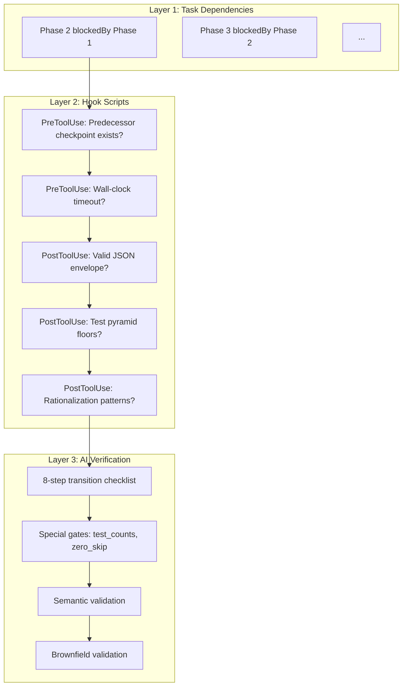

> [English](gates.md) | 中文

# 门禁系统

> 深入了解三层门禁系统、特殊门禁、反合理化机制和墙钟超时。

## 概述

spec-autopilot 通过三个独立且互补的门禁层级来保障质量。每一层捕获不同类别的违规：

| 层级 | 机制 | 执行者 | 捕获 |
|------|------|--------|------|
| **层级 1** | TaskCreate + blockedBy | 任务系统（自动） | 阶段乱序派发 |
| **层级 2** | Hook 脚本（磁盘检查点） | Shell 脚本（确定性） | 缺失/无效检查点、金字塔违规、超时 |
| **层级 3** | 8 步检查清单 + 语义验证 | autopilot-gate Skill（AI） | 阈值违规、内容质量、偏移 |



## 层级 1: 任务依赖

Phase 0 创建 8 个任务，形成 blockedBy 链：

```
Task(Phase 1) → Task(Phase 2, blockedBy: [Phase 1]) → ... → Task(Phase 7, blockedBy: [Phase 6])
```

这确保 Claude 在前置阶段的任务标记完成之前无法启动后续阶段。由任务系统自动执行。

## 层级 2: Hook 脚本

### PreToolUse 门禁 (`check-predecessor-checkpoint.sh`)

在每次 `Task` 工具调用前运行。对于 autopilot 阶段：

1. **前置检查点存在**，状态为 `ok` 或 `warning`
2. **顺序执行**：不可跳过阶段（如从 Phase 2 跳到 Phase 5）
3. **Phase 2 特殊规则**：Phase 1 检查点必须存在（由主线程写入）
4. **Phase 5 特殊规则**：Phase 4 必须为 `ok`（不接受 `warning`）
5. **Phase 6 特殊规则**：Phase 5 `zero_skip_check.passed === true` + 所有 `tasks.md` 条目 `[x]`
6. **墙钟超时**（Phase >= 5）：Phase 5 运行超过 7200 秒（2 小时）则拒绝

### PostToolUse 信封验证 (`validate-json-envelope.sh`)

> **v5.1 说明**: 实际 Hook 注册使用 `post-task-validator.sh` 作为统一入口，内部调用 `_post_task_validator.py` 执行所有验证（包括信封验证、反合理化、代码约束、TDD 指标等）。`validate-json-envelope.sh` 和 `anti-rationalization-check.sh` 作为独立脚本保留但不再单独注册。

在每次 `Task` 工具调用后运行。对于 autopilot 阶段：

1. **JSON 信封存在**于子 Agent 输出中（3 种提取策略）
2. **必填字段**：`status`、`summary`
3. **有效状态**：`ok`、`warning`、`blocked`、`failed`
4. **阶段特定字段**：
   - Phase 4: `test_counts`、`dry_run_results`、`test_pyramid`
   - Phase 5: `test_results_path`、`tasks_completed`、`zero_skip_check`
   - Phase 6: `pass_rate`、`report_path`、`report_format`
5. **Phase 4 warning 阻断**：Phase 4 仅接受 `ok` 或 `blocked`
6. **Phase 4/6 产物**：必须为非空列表
7. **测试金字塔地板**（仅 Phase 4）：
   - `unit_pct >= 30`（宽松下限）
   - `e2e_pct <= 40`（宽松上限）
   - `total_cases >= 10`（最低数量）

### PostToolUse 反合理化 (`anti-rationalization-check.sh`)

在信封验证之后运行。检测子 Agent 合理化跳过工作的模式：

**触发条件**（全部满足时触发）：
1. Phase 4、5 或 6（测试/实现/报告）
2. 状态为 `ok` 或 `warning`（非 `blocked`/`failed`）
3. 输出包含合理化模式

**16 种检测模式 (v5.2)**:

| # | 模式 | 示例 | 版本 |
|---|------|------|------|
| 1 | `out of scope` | "This feature is out of scope" | v1.0 |
| 2 | `pre-existing issue/bug` | "This is a pre-existing bug" | v1.0 |
| 3 | `skip(ped/ping) this test/task` | "Skipped this test" | v1.0 |
| 4 | `not needed/necessary/required` | "Not needed for this phase" | v1.0 |
| 5 | `already covered/tested` | "Already covered by other tests" | v1.0 |
| 6 | `too complex/difficult/risky` | "Too complex to implement now" | v1.0 |
| 7 | `will be done later/separately` | "Can be done in a future iteration" | v1.0 |
| 8 | `deferred/postponed` | "Deferred to next sprint" | v1.0 |
| 9 | `minimal/low impact/priority` | "Low priority item" | v1.0 |
| 10 | `works/good enough` | "Works enough for now" | v1.0 |
| 11 | `时间不够/来不及` | "时间不够实现这个功能" | v5.2 |
| 12 | `环境/工具限制` | "当前环境不支持" / "Environment limitation" | v5.2 |
| 13 | `第三方依赖/API 问题` | "第三方 API 暂不可用" / "Third-party API issue" | v5.2 |
| 14 | `not enough time` | "Not enough time to complete" | v5.2 |
| 15 | `environment.*limit` | "Environment limitation prevents this" | v5.2 |
| 16 | `third.party.*issue` | "Third-party dependency issue" | v5.2 |

### routing_overrides 动态门禁 (v4.2)

L2 Hook 从 Phase 1 checkpoint 的 `routing_overrides` 字段读取需求类型覆盖值，动态调整门禁阈值：

| 字段 | 默认值 | Bugfix 覆盖 | Refactor 覆盖 | Chore 覆盖 |
|------|--------|------------|--------------|-----------|
| `sad_path_min_pct` | 20 | 40 | 20 | 0 |
| `change_coverage_min_pct` | 80 | 100 | 100 | 60 |
| `require_reproduction_test` | false | true | false | false |
| `require_behavior_preservation_test` | false | false | true | false |

**读取逻辑**:

1. `post-task-validator.sh` 在 Phase 4/5 验证时定位最新 Phase 1 checkpoint
2. 解析 `routing_overrides` 字段（不存在则使用默认值）
3. 将覆盖值注入 `_post_task_validator.py` 的阈值参数
4. 复合需求 (v5.0.6) 的数组格式自动取 max/union 合并

> 注意：`routing_overrides` 由 Phase 1 主线程写入，子 Agent 无法修改（L2 Hook `unified-write-edit-check.sh` 阻断 checkpoint 写入）。

## 层级 3: AI 门禁 (`autopilot-gate` Skill)

### 8 步过渡检查清单

每次 Phase N → Phase N+1 过渡：

```
Step 1: Confirm Phase N sub-agent returned JSON envelope
Step 2: Verify JSON status is "ok" or "warning"
Step 3: Write checkpoint via autopilot-checkpoint Skill
Step 4: TaskUpdate Phase N → completed
Step 5: TaskGet Phase N+1 task, confirm blockedBy empty
Step 6: Read phase-results/phase-N-*.json, confirm exists and parseable
Step 6.5: (Optional) Semantic validation checks
Step 7: TaskUpdate Phase N+1 → in_progress
Step 8: Prepare dispatch via autopilot-dispatch Skill
```

### 特殊门禁: Phase 4 → Phase 5

附加验证（阈值来自 `config.phases.testing.gate`）：

- `test_counts[type] >= min_test_count_per_type`（每个必需类型）
- `artifacts` 包含每个 `required_test_types` 对应的文件
- `dry_run_results` 所有字段为 0（退出码）
- Phase 4 `warning` → 若测试数量不足则强制降级为 `blocked`

### 特殊门禁: Phase 5 → Phase 6

- `test-results.json` 存在
- `zero_skip_check.passed === true`
- `tasks.md` 所有条目 `[x]`

### 语义验证（可选层级 3 扩展）

超越结构验证的逐阶段内容质量检查。完整的过渡检查清单见 [overview.zh.md](overview.zh.md)。

各阶段关键检查：
- Phase 1→2: 需求可测试，无矛盾决策
- Phase 3→4: 任务覆盖所有提案特性，粒度合理
- Phase 4→5: 测试覆盖所有任务（不仅是正常路径），金字塔合理
- Phase 5→6: 实现匹配设计，无未解决的 TODO
- Phase 6→7: 报告包含所有测试套件，覆盖率达标

### 棕地验证（可选层级 3 扩展）

当 `brownfield_validation.enabled: true` 时，执行三方一致性检查：

| 门禁点 | 检查内容 |
|--------|---------|
| Phase 4→5 | 设计-测试对齐 |
| Phase 5 启动 | 测试-实现就绪性 |
| Phase 5→6 | 实现-设计一致性 |

`strict_mode: true` 在不一致时阻断；`false`（默认）仅警告。

## decision_ack 决策反馈闭环 (v5.0.6)

当门禁阻断时，GUI 大盘提供可视化决策界面，形成完整的人机闭环：

### 7 步闭环流程

```
Step 1: gate_block → emit-gate-event.sh 发射事件到 events.jsonl
Step 2: WebSocket 推送 → GUI EventStream 渲染 GateBlockCard
Step 3: 用户在 GUI 中选择操作: retry / fix / override
Step 4: GUI 通过 WebSocket 发送 decision_ack 消息
Step 5: autopilot-server.ts 接收并写入 decision.json
Step 6: poll-gate-decision.sh 轮询检测 decision.json 文件
Step 7: 主编排器读取决策 → 执行对应动作 → 发射 ack 事件
```

### 决策选项

| 选项 | 行为 | 后续流程 |
|------|------|---------|
| **retry** | 重新派发当前阶段 | 子 Agent 重新执行 → 门禁重新验证 |
| **fix** | 暂停，等待用户手动修复 | 用户修复后手动触发继续 |
| **override** | 强制通过门禁 | 跳过当前阻断，继续下一阶段（记录 audit log） |

> `decision_ack` 事件仅通过 WebSocket 传输，不写入 `events.jsonl`（GUI 闭环事件，无需持久化）。

## 墙钟超时

Phase 5（实现阶段）有 2 小时硬性时间限制，在 Hook 层级强制执行：

1. Phase 5 启动时将 ISO-8601 时间戳写入 `phase5-start-time.txt`
2. 后续每次 `Task(autopilot-phase:N)`（N >= 5）检查已用时间
3. 已用时间 > 7200 秒 → 以超时消息拒绝
4. 解析失败 → 回退为 0（此单项检查采用失败放行）

## 失败关闭 vs 失败放行

| 组件 | 行为 | 原因 |
|------|------|------|
| 缺失 python3 | **失败关闭**（拒绝） | 核心依赖，无法验证 |
| JSON 解析错误 | **失败关闭**（阻断） | 无法信任输出 |
| 缺失检查点 | **失败关闭**（拒绝） | 阶段未完成 |
| 墙钟解析错误 | **失败放行**（允许） | 单项辅助检查 |
| 反合理化（无 python3） | **失败放行**（允许） | 次要检查，主要检查已执行 |
