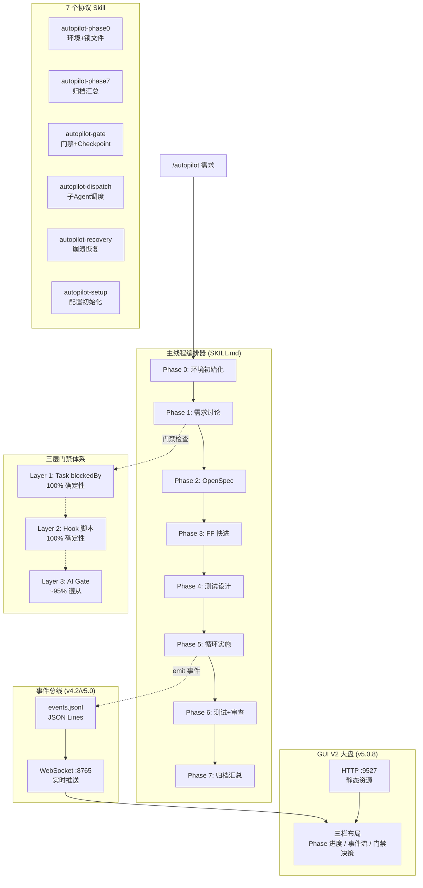

> **[中文版](overview.zh.md)** | English (default)

# Architecture Overview

> A panoramic view of the spec-autopilot system architecture, covering the 8-phase pipeline, 3-layer gate system, and 12 Skill collaboration relationships.

## System Architecture



## Execution Modes

```
full:    Phase 0 → 1 → 2 → 3 → 4 → 5 → 6 → 7   (完整流程)
lite:    Phase 0 → 1 ───────────→ 5 → 6 → 7       (跳过 OpenSpec)
minimal: Phase 0 → 1 ───────────→ 5 ──────→ 7     (最精简)
```

| Mode | Pipeline | Description |
|------|----------|-------------|
| **full** | Phase 0 → 1 → 2 → 3 → 4 → 5 → 6 → 7 | Complete pipeline |
| **lite** | Phase 0 → 1 → 5 → 6 → 7 | Skips OpenSpec (Phases 2-4) |
| **minimal** | Phase 0 → 1 → 5 → 7 | Most streamlined |

## 3-Layer Gate System Details

| Layer | Executor | Determinism | Coverage | Failure Behavior |
|-------|----------|-------------|----------|------------------|
| **L1** | TaskCreate blockedBy | 100% | Phase dependency ordering | Task system auto-blocks |
| **L2** | Hook scripts (Python/Bash) | 100% | JSON envelope / anti-rationalization / code constraints / test pyramid | block/deny JSON output |
| **L3** | autopilot-gate Skill | ~95% | 8-step checklist / special gates / semantic validation | Hard-blocks next phase |

**Design Principle**: L1+L2 cover all deterministically verifiable scenarios; L3 supplements with AI-powered semantic validation. Even if L3 fails, L1+L2 can still prevent critical phase skips.

## Hook Script Architecture

```
PreToolUse(Task)
  └── check-predecessor-checkpoint.sh   ← 前驱 checkpoint 验证

PostToolUse(Task)
  └── post-task-validator.sh            ← 统一入口 (v4.0 合并 5→1)
      ├── JSON 信封验证
      ├── 反合理化检测 (Phase 4/5/6, v5.2: +6 种新模式)
      ├── 代码约束检查 (Phase 4/5/6)
      ├── 并行合并守卫 (Phase 5)
      ├── 决策格式验证 (Phase 1)
      └── TDD 指标验证 (Phase 5, tdd_mode=true)

PostToolUse(Write|Edit)
  └── unified-write-edit-check.sh       ← 统一写入约束 (v5.1, 合并 banned-patterns + assertion-quality + checkpoint 保护)

PreCompact
  └── save-state-before-compact.sh      ← 上下文压缩前保存状态

SessionStart
  ├── scan-checkpoints-on-start.sh      ← 崩溃恢复扫描 (async)
  ├── check-skill-size.sh              ← SKILL.md 大小警告
  └── reinject-state-after-compact.sh   ← 压缩后状态注入 (compact)

事件发射脚本 (v4.2/v5.0)
  ├── emit-phase-event.sh               ← phase_start / phase_end / error
  ├── emit-gate-event.sh                ← gate_pass / gate_block
  └── emit-task-progress.sh             ← task_progress (Phase 5, v5.2)
```

| Hook Point | Script | Role |
|------------|--------|------|
| PreToolUse(Task) | `check-predecessor-checkpoint.sh` | Predecessor checkpoint validation |
| PostToolUse(Task) | `post-task-validator.sh` | Unified entry (v4.0, merged 5 into 1): JSON envelope validation, anti-rationalization detection (Phase 4/5/6, v5.2: +6 new patterns), code constraint checks (Phase 4/5/6), parallel merge guard (Phase 5), decision format validation (Phase 1), TDD metric validation (Phase 5, tdd_mode=true) |
| PostToolUse(Write\|Edit) | `unified-write-edit-check.sh` | Unified write constraints (v5.1, merged banned-patterns + assertion-quality + checkpoint protection) |
| PreCompact | `save-state-before-compact.sh` | Save state before context compaction |
| SessionStart | `scan-checkpoints-on-start.sh` | Crash recovery scan (async) |
| SessionStart | `check-skill-size.sh` | SKILL.md size warning |
| SessionStart | `reinject-state-after-compact.sh` | State re-injection after compaction |
| Event Emitters (v4.2/v5.0) | `emit-phase-event.sh` | phase_start / phase_end / error |
| Event Emitters | `emit-gate-event.sh` | gate_pass / gate_block |
| Event Emitters | `emit-task-progress.sh` | task_progress (Phase 5, v5.2) |

## Data Flow

```
用户需求 → Phase 1 (需求确认)
  ↓ phase-1-requirements.json
Phase 2-3 (规范生成)
  ↓ OpenSpec + tasks.md
Phase 4 (测试设计)
  ↓ phase-4-testing.json + test files
Phase 5 (代码实施)
  ↓ phase-5-implement.json + source files
Phase 6 (测试执行 + 代码审查)
  ↓ phase-6-report.json + test reports
Phase 7 (归档)
  ↓ phase-7-summary.json + git squash
```

| Stage | Input | Output |
|-------|-------|--------|
| Phase 1 | User requirements | `phase-1-requirements.json` |
| Phase 2-3 | Requirements | OpenSpec + `tasks.md` |
| Phase 4 | Design spec | `phase-4-testing.json` + test files |
| Phase 5 | Tasks | `phase-5-implement.json` + source files |
| Phase 6 | Implementation | `phase-6-report.json` + test reports |
| Phase 7 | All results | `phase-7-summary.json` + git squash |

All checkpoint files are stored in:
```
openspec/changes/<name>/context/phase-results/
├── phase-1-requirements.json
├── phase-2-openspec.json
├── phase-3-ff.json
├── phase-4-testing.json
├── phase-5-implement.json
├── phase-6-report.json
└── phase-7-summary.json
```

## Context Protection Mechanisms

1. **JSON Envelope**: Sub-agents write output files themselves, returning only concise JSON summaries (~200 tokens vs ~5K tokens)
2. **Background Agents**: Phases 2/3/4/6 use `run_in_background: true`, avoiding main window context pollution
3. **Checkpoint Agent**: Each phase's checkpoint writing + git fixup are combined into a single background agent
4. **PreCompact Hook**: Orchestration state is automatically saved before context compaction and restored afterward

## Event Bus Architecture (v4.2/v5.0)

The event bus provides a standardized real-time event stream for the GUI dashboard and external tools.

### Transport Layer

| Channel | Protocol | Path / Port | Description |
|---------|----------|-------------|-------------|
| File System | JSON Lines | `logs/events.jsonl` | Persistent, append-only |
| Real-time Push | WebSocket | `ws://localhost:8765` | autopilot-server.ts watches events.jsonl and pushes updates |

### Event Types

| Event | Emitter Script | Trigger |
|-------|---------------|---------|
| `phase_start` | `emit-phase-event.sh` | Phase begins |
| `phase_end` | `emit-phase-event.sh` | Phase ends (includes status/duration) |
| `error` | `emit-phase-event.sh` | Phase error |
| `gate_pass` | `emit-gate-event.sh` | Gate passed |
| `gate_block` | `emit-gate-event.sh` | Gate blocked |
| `task_progress` | `emit-task-progress.sh` | Phase 5 task-level progress (v5.2) |
| `decision_ack` | autopilot-server.ts | GUI decision acknowledgment (WebSocket-only, v5.2) |

### Common Context Fields

All events include the following top-level fields:

| Field | Type | Description |
|-------|------|-------------|
| `change_name` | string | Current change name |
| `session_id` | string | Unique session identifier |
| `phase_label` | string | Human-readable phase name |
| `total_phases` | number | Total phases for current mode (full=8, lite=5, minimal=4) |
| `sequence` | number | Global auto-incrementing event sequence number for GUI ordering |
| `timestamp` | string | ISO-8601 timestamp |

> For detailed event interface definitions, see `skills/autopilot/references/event-bus-api.md`.

## GUI V2 Dashboard Architecture (v5.0.8)

### Tech Stack

| Layer | Technology | Version |
|-------|-----------|---------|
| Framework | React + TypeScript | 18.x |
| Styling | Tailwind CSS | v4 |
| Build | Vite | 6.x |
| Fonts | JetBrains Mono / Space Grotesk / Orbitron | Local woff2 |
| Server | Bun + autopilot-server.ts | -- |

### 3-Column Layout

| Column | Component | Content |
|--------|-----------|---------|
| Left | PhaseTimeline | Phase progress timeline + status indicators |
| Center | EventStream | Real-time event stream (VirtualTerminal incremental rendering) |
| Right | GatePanel | Gate decision overlay + TelemetryPanel telemetry dashboard |

### Dual-Mode Server

| Protocol | Port | Purpose |
|----------|------|---------|
| HTTP | 9527 | Static assets (Vite build output) |
| WebSocket | 8765 | Real-time event push + decision_ack feedback |

### decision_ack Decision Feedback Loop (v5.0.6)

```
1. gate_block 事件 → GUI GateBlockCard 渲染
2. 用户在 GUI 中选择: retry / fix / override
3. GUI 通过 WebSocket 发送 decision_ack
4. autopilot-server.ts 写入 decision.json
5. poll-gate-decision.sh 轮询检测 decision.json
6. 主编排器读取决策并执行对应动作
7. 发射 gate_pass 或重新进入门禁流程
```

1. `gate_block` event --> GUI renders GateBlockCard
2. User selects in GUI: retry / fix / override
3. GUI sends `decision_ack` via WebSocket
4. `autopilot-server.ts` writes `decision.json`
5. `poll-gate-decision.sh` polls for `decision.json`
6. Main orchestrator reads the decision and executes corresponding action
7. Emits `gate_pass` or re-enters gate flow

## Parallel Dispatch Topology (v5.0)

### Per-Phase Parallelism Conditions

| Phase | Parallelism Condition | Description |
|-------|----------------------|-------------|
| 2-3 | Always serial | OpenSpec artifacts have strong dependencies |
| 4 | Always serial | Test design requires complete design input |
| 5 | `parallel.enabled = true` | Domain-grouped parallelism: backend ‖ frontend ‖ node |
| 6 | Always serial | Test reports require full results |
| 6→7 | Quality scans parallel | contract / perf / visual / mutation run in parallel |

### Domain-Level Parallelism Core Flow (Phase 5)

```
tasks.md → dependency_analysis → 域分组
  ├── backend Agent  →  owned_files: backend/**
  ├── frontend Agent →  owned_files: frontend/**
  └── node Agent     →  owned_files: node/**
每组完成 → parallel-merge-guard.sh → 批量 code review → 合并
```

```
tasks.md → dependency_analysis → domain grouping
  ├── backend Agent  →  owned_files: backend/**
  ├── frontend Agent →  owned_files: frontend/**
  └── node Agent     →  owned_files: node/**
Each group completes → parallel-merge-guard.sh → batch code review → merge
```

### Fallback Strategy

| Condition | Fallback Behavior |
|-----------|-------------------|
| Merge conflicts > 3 files | Fall back to serial mode |
| 2 consecutive group failures | Fall back to serial mode |
| User explicit choice | Fall back to serial mode |
| Single domain failure | Retry only that domain; others preserved |
| File ownership violation | Block that agent; requires re-partitioning |

### File Ownership (ENFORCED)

In parallel mode, each agent may only modify files within its `owned_files` scope. `unified-write-edit-check.sh` (v5.1) enforces this check at PostToolUse(Write|Edit) time -- ownership violations are blocked immediately.

## Requirements Routing (v4.2)

### 4-Category Threshold Matrix

| Category | sad_path Ratio | change_coverage | Special Requirements |
|----------|---------------|-----------------|---------------------|
| **Feature** | >= 20% (default) | >= 80% | -- |
| **Bugfix** | >= 40% | 100% | Must include reproduction test |
| **Refactor** | -- | 100% | Must include behavior-preserving test |
| **Chore** | -- | >= 60% | Typecheck pass is sufficient |

### Compound Requirements Routing (v5.0.6)

When a requirement spans multiple categories:

- The Phase 1 checkpoint `requirement_type` field uses array format: `["feature", "bugfix"]`
- Threshold merge strategy:
  - Numeric thresholds use **max** (e.g., change_coverage: max(80%, 100%) = 100%)
  - Boolean requirements use **union** (e.g., bugfix's reproduction test + refactor's behavior-preserving test must both be satisfied)
- Merged results are written to the `routing_overrides` field for L2 Hook consumption

## File Structure

```
spec-autopilot/
├── skills/           (12 个 Skill)
│   ├── autopilot/    (主编排器 + references/ + templates/)
│   ├── autopilot-phase0/   (环境初始化 + 锁文件管理)
│   ├── autopilot-phase7/   (归档汇总)
│   ├── autopilot-gate/     (门禁验证 + Checkpoint 管理)
│   ├── autopilot-dispatch/ (子 Agent 调度)
│   ├── autopilot-recovery/ (崩溃恢复)
│   └── autopilot-setup/     (配置初始化向导)
├── scripts/          (Hook 脚本 + 事件发射 + 共享模块)
│   ├── _hook_preamble.sh        (公共 Hook 前言)
│   ├── _common.sh               (共享 Bash 工具)
│   ├── _envelope_parser.py      (JSON 信封解析)
│   ├── _constraint_loader.py    (约束加载)
│   ├── _config_validator.py     (配置验证)
│   ├── _post_task_validator.py  (统一 PostToolUse 验证)
│   ├── emit-phase-event.sh      (Phase 事件发射, v4.2)
│   ├── emit-gate-event.sh       (Gate 事件发射, v4.2)
│   ├── emit-task-progress.sh    (Task 进度发射, v5.2)
│   ├── autopilot-server.ts      (GUI 双模服务器, v5.0.8)
│   └── ...                      (各 Hook 脚本)
├── tools/           (开发/发布工具, 不进入 dist)
│   ├── build-dist.sh            (分发包构建)
│   └── mock-event-emitter.js    (GUI 事件模拟)
├── gui/              (GUI V2 大盘, v5.0.8)
│   └── src/
│       ├── App.tsx              (主应用)
│       ├── main.tsx             (入口)
│       ├── components/          (PhaseTimeline / EventStream / GatePanel ...)
│       ├── store/               (状态管理)
│       ├── lib/                 (工具函数)
│       └── fonts/               (本地 woff2 字体)
├── hooks/hooks.json  (Hook 注册)
├── tests/            (104 个测试文件, 1245+ 断言)
└── docs/             (文档)
```

| Directory | Contents |
|-----------|----------|
| `skills/` | 12 Skills: main orchestrator, phase0-init, phase1-requirements, phase2-3-openspec, phase4-testcase, phase5-implement, phase6-report, phase7-archive, gate, dispatch, recovery, setup |
| `scripts/` | Hook scripts + event emitters + shared modules |
| `gui/` | GUI V2 dashboard (v5.0.8): React + TypeScript + Tailwind v4 |
| `hooks/` | Hook registration (`hooks.json`) |
| `tests/` | 104 test files, 1245+ assertions |
| `docs/` | Documentation |
