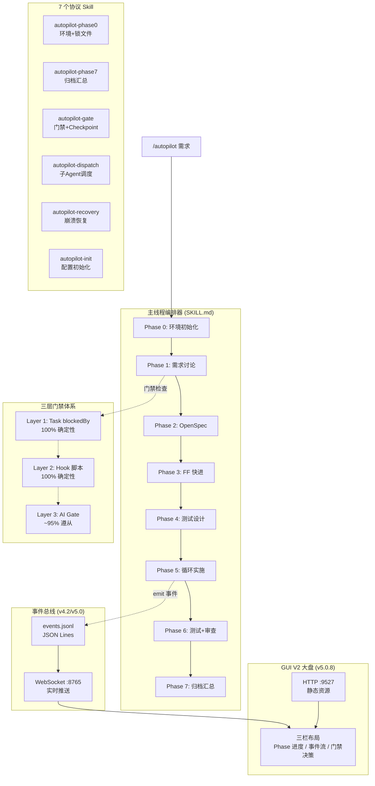

> [English](overview.md) | 中文

# 架构总览

> spec-autopilot 系统架构全景图，包含 8 阶段流水线、三层门禁、7 个 Skill 协作关系。

## 系统架构



## 执行模式

```
full:    Phase 0 → 1 → 2 → 3 → 4 → 5 → 6 → 7   (完整流程)
lite:    Phase 0 → 1 ───────────→ 5 → 6 → 7       (跳过 OpenSpec)
minimal: Phase 0 → 1 ───────────→ 5 ──────→ 7     (最精简)
```

## 三层门禁详解

| 层级 | 执行者 | 确定性 | 覆盖范围 | 失败行为 |
|------|--------|--------|---------|---------|
| **L1** | TaskCreate blockedBy | 100% | 阶段依赖顺序 | 任务系统自动阻止 |
| **L2** | Hook 脚本 (Python/Bash) | 100% | JSON 信封/反合理化/代码约束/测试金字塔 | block/deny JSON 输出 |
| **L3** | autopilot-gate Skill | ~95% | 8 步检查清单/特殊门禁/语义验证 | 硬阻断下一阶段 |

**设计原则**: L1+L2 覆盖所有可确定性验证的场景，L3 补充 AI 能力范围内的语义验证。即使 L3 失效，L1+L2 仍能阻止关键的阶段跳过。

## Hook 脚本架构

```
PreToolUse(Task)
  └── check-predecessor-checkpoint.sh   ← 前驱 checkpoint 验证

PostToolUse(Task)
  └── post-task-validator.sh            ← 统一入口 (v4.0 合并 5→1)
      ├── JSON 信封验证
      ├── 反合理化检测 (Phase 4/5/6, v5.2: +6 种新模式)
      ├── 代码约束检查 (Phase 4/5/6)
      ├── 并行合并守卫 (Phase 5)
      ├── 决策格式验证 (Phase 1)
      └── TDD 指标验证 (Phase 5, tdd_mode=true)

PostToolUse(Write|Edit)
  └── unified-write-edit-check.sh       ← 统一写入约束 (v5.1, 合并 banned-patterns + assertion-quality + checkpoint 保护)

PreCompact
  └── save-state-before-compact.sh      ← 上下文压缩前保存状态

SessionStart
  ├── scan-checkpoints-on-start.sh      ← 崩溃恢复扫描 (async)
  ├── check-skill-size.sh              ← SKILL.md 大小警告
  └── reinject-state-after-compact.sh   ← 压缩后状态注入 (compact)

事件发射脚本 (v4.2/v5.0)
  ├── emit-phase-event.sh               ← phase_start / phase_end / error
  ├── emit-gate-event.sh                ← gate_pass / gate_block
  └── emit-task-progress.sh             ← task_progress (Phase 5, v5.2)
```

## 数据流

```
用户需求 → Phase 1 (需求确认)
  ↓ phase-1-requirements.json
Phase 2-3 (规范生成)
  ↓ OpenSpec + tasks.md
Phase 4 (测试设计)
  ↓ phase-4-testing.json + test files
Phase 5 (代码实施)
  ↓ phase-5-implement.json + source files
Phase 6 (测试执行 + 代码审查)
  ↓ phase-6-report.json + test reports
Phase 7 (归档)
  ↓ phase-7-summary.json + git squash
```

所有 checkpoint 文件存储在：
```
openspec/changes/<name>/context/phase-results/
├── phase-1-requirements.json
├── phase-2-openspec.json
├── phase-3-ff.json
├── phase-4-testing.json
├── phase-5-implement.json
├── phase-6-report.json
└── phase-7-summary.json
```

## 上下文保护机制

1. **JSON 信封**: 子 Agent 自行 Write 产出文件，仅返回精简 JSON 摘要（~200 tokens vs ~5K tokens）
2. **后台 Agent**: Phase 2/3/4/6 使用 `run_in_background: true`，不污染主窗口上下文
3. **Checkpoint Agent**: 每阶段的 checkpoint 写入 + git fixup 合并为一个后台 Agent
4. **PreCompact Hook**: 上下文压缩前自动保存编排状态，压缩后自动恢复

## 事件总线架构 (v4.2/v5.0)

事件总线为 GUI 大盘和外部工具提供标准化的实时事件流。

### 传输层

| 通道 | 协议 | 路径 / 端口 | 说明 |
|------|------|------------|------|
| 文件系统 | JSON Lines | `logs/events.jsonl` | 持久化，append-only |
| 实时推送 | WebSocket | `ws://localhost:8765` | autopilot-server.ts 监听 events.jsonl 并推送 |

### 事件类型

| 事件 | 发射脚本 | 触发时机 |
|------|---------|---------|
| `phase_start` | `emit-phase-event.sh` | 阶段开始 |
| `phase_end` | `emit-phase-event.sh` | 阶段结束（含 status/duration） |
| `error` | `emit-phase-event.sh` | 阶段异常 |
| `gate_pass` | `emit-gate-event.sh` | 门禁通过 |
| `gate_block` | `emit-gate-event.sh` | 门禁阻断 |
| `task_progress` | `emit-task-progress.sh` | Phase 5 任务粒度进度 (v5.2) |
| `decision_ack` | autopilot-server.ts | GUI 决策确认 (WebSocket-only, v5.2) |

### 通用上下文字段

所有事件均包含以下顶层字段：

| 字段 | 类型 | 说明 |
|------|------|------|
| `change_name` | string | 当前变更名称 |
| `session_id` | string | 会话唯一标识 |
| `phase_label` | string | Phase 人类可读名称 |
| `total_phases` | number | 当前模式的总阶段数 (full=8, lite=5, minimal=4) |
| `sequence` | number | 全局事件自增序号，保证 GUI 排序 |
| `timestamp` | string | ISO-8601 时间戳 |

> 详细事件接口定义见 `skills/autopilot/references/event-bus-api.md`。

## GUI V2 大盘架构 (v5.0.8)

### 技术栈

| 层级 | 技术 | 版本 |
|------|------|------|
| 框架 | React + TypeScript | 18.x |
| 样式 | Tailwind CSS | v4 |
| 构建 | Vite | 6.x |
| 字体 | JetBrains Mono / Space Grotesk / Orbitron | 本地 woff2 |
| 服务端 | Bun + autopilot-server.ts | — |

### 三栏布局

| 列 | 组件 | 内容 |
|----|------|------|
| 左栏 | PhaseTimeline | Phase 进度时间轴 + 状态指示灯 |
| 中栏 | EventStream | 实时事件流 (VirtualTerminal 增量渲染) |
| 右栏 | GatePanel | 门禁决策浮层 + TelemetryPanel 遥测面板 |

### 双模服务器

| 协议 | 端口 | 用途 |
|------|------|------|
| HTTP | 9527 | 静态资源 (Vite build 产出) |
| WebSocket | 8765 | 实时事件推送 + decision_ack 回传 |

### decision_ack 决策反馈闭环 (v5.0.6)

```
1. gate_block 事件 → GUI GateBlockCard 渲染
2. 用户在 GUI 中选择: retry / fix / override
3. GUI 通过 WebSocket 发送 decision_ack
4. autopilot-server.ts 写入 decision.json
5. poll-gate-decision.sh 轮询检测 decision.json
6. 主编排器读取决策并执行对应动作
7. 发射 gate_pass 或重新进入门禁流程
```

## 并行调度拓扑 (v5.0)

### 各 Phase 并行条件

| Phase | 并行条件 | 说明 |
|-------|---------|------|
| 2-3 | 始终串行 | OpenSpec 制品有强依赖 |
| 4 | 始终串行 | 测试设计需完整 design 输入 |
| 5 | `parallel.enabled = true` | 按域分组并行：backend ‖ frontend ‖ node |
| 6 | 始终串行 | 测试报告需全量结果 |
| 6→7 | 质量扫描并行 | contract / perf / visual / mutation 并行执行 |

### 域级并行核心流程 (Phase 5)

```
tasks.md → dependency_analysis → 域分组
  ├── backend Agent  →  owned_files: backend/**
  ├── frontend Agent →  owned_files: frontend/**
  └── node Agent     →  owned_files: node/**
每组完成 → parallel-merge-guard.sh → 批量 code review → 合并
```

### 降级策略

| 条件 | 降级行为 |
|------|---------|
| 合并冲突 > 3 文件 | 降级为串行模式 |
| 连续 2 组失败 | 降级为串行模式 |
| 用户显式选择 | 降级为串行模式 |
| 单域失败 | 仅该域重试，其他域保持 |
| 文件所有权违规 | 阻断该 Agent，需重新划分 |

### 文件所有权 (ENFORCED)

并行模式下每个 Agent 仅可修改 `owned_files` 范围内的文件。`unified-write-edit-check.sh` (v5.1) 在 PostToolUse(Write|Edit) 时强制校验，违规写入直接阻断。

## 需求路由 (v4.2)

### 4 类需求阈值矩阵

| 类别 | sad_path 比例 | change_coverage | 特殊要求 |
|------|-------------|----------------|---------|
| **Feature** | ≥ 20% (默认) | ≥ 80% | — |
| **Bugfix** | ≥ 40% | 100% | 必须含复现测试 |
| **Refactor** | — | 100% | 必须含行为保持测试 |
| **Chore** | — | ≥ 60% | typecheck 通过即可 |

### 复合需求路由 (v5.0.6)

当需求同时覆盖多个类别时：

- Phase 1 checkpoint 的 `requirement_type` 字段使用数组格式：`["feature", "bugfix"]`
- 阈值合并策略：
  - 数值阈值取 **max**（如 change_coverage: max(80%, 100%) = 100%）
  - 布尔要求取 **union**（如 bugfix 的复现测试 + refactor 的行为保持测试均需满足）
- 合并结果写入 `routing_overrides` 字段，供 L2 Hook 读取

## 文件结构

```
spec-autopilot/
├── skills/           (7 个 Skill)
│   ├── autopilot/    (主编排器 + references/ + templates/)
│   ├── autopilot-phase0/   (环境初始化 + 锁文件管理)
│   ├── autopilot-phase7/   (归档汇总)
│   ├── autopilot-gate/     (门禁验证 + Checkpoint 管理)
│   ├── autopilot-dispatch/ (子 Agent 调度)
│   ├── autopilot-recovery/ (崩溃恢复)
│   └── autopilot-init/     (配置初始化向导)
├── scripts/          (Hook 脚本 + 事件发射 + 共享模块)
│   ├── _hook_preamble.sh        (公共 Hook 前言)
│   ├── _common.sh               (共享 Bash 工具)
│   ├── _envelope_parser.py      (JSON 信封解析)
│   ├── _constraint_loader.py    (约束加载)
│   ├── _config_validator.py     (配置验证)
│   ├── _post_task_validator.py  (统一 PostToolUse 验证)
│   ├── emit-phase-event.sh      (Phase 事件发射, v4.2)
│   ├── emit-gate-event.sh       (Gate 事件发射, v4.2)
│   ├── emit-task-progress.sh    (Task 进度发射, v5.2)
│   ├── autopilot-server.ts      (GUI 双模服务器, v5.0.8)
│   ├── build-dist.sh            (分发包构建)
│   └── ...                      (各 Hook 脚本)
├── gui/              (GUI V2 大盘, v5.0.8)
│   └── src/
│       ├── App.tsx              (主应用)
│       ├── main.tsx             (入口)
│       ├── components/          (PhaseTimeline / EventStream / GatePanel ...)
│       ├── store/               (状态管理)
│       ├── lib/                 (工具函数)
│       └── fonts/               (本地 woff2 字体)
├── hooks/hooks.json  (Hook 注册)
├── tests/            (76 个测试文件, 692+ 断言)
└── docs/             (文档)
```
