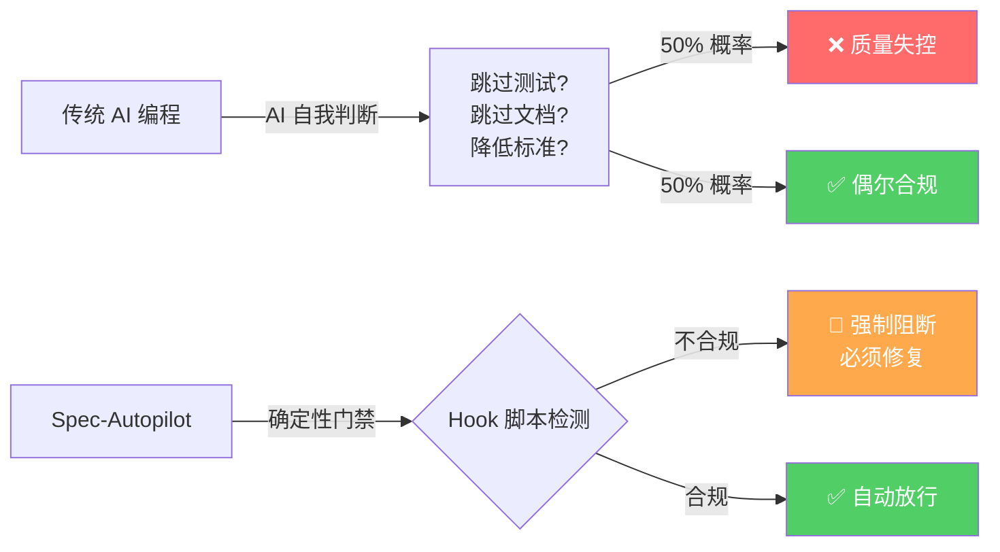
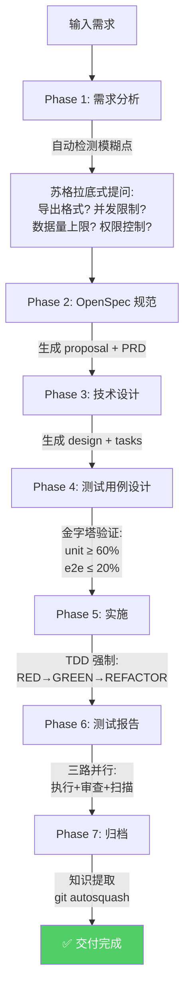
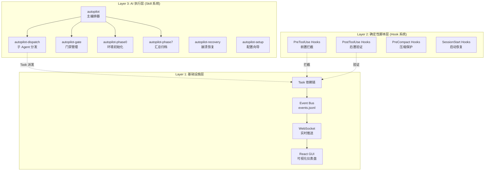
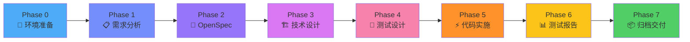
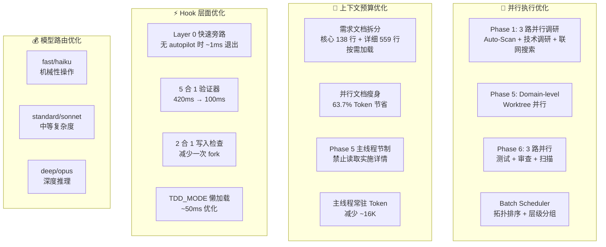
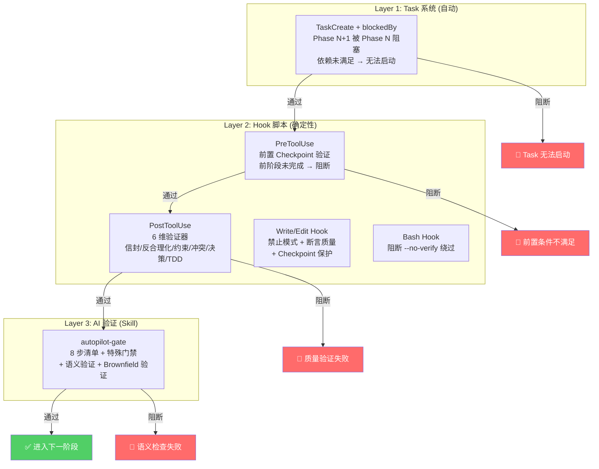
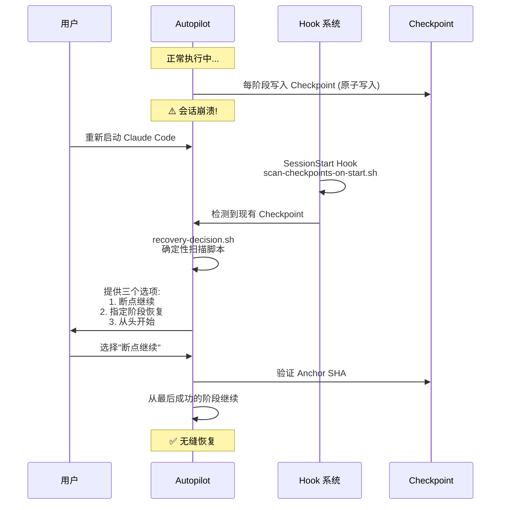
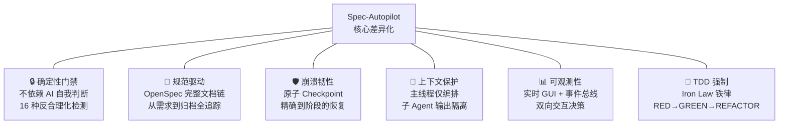

# Spec-Autopilot — AI 自动驾驶交付引擎

> **一句话定位**：业界首个将"需求到交付"全生命周期封装为确定性流水线的 Claude Code 插件，
> 用机器可验证的门禁系统取代 AI 的自我判断，让每一次交付都有据可查、质量可控。

---

## 目录

1. [为什么我们需要这个插件](#1-为什么我们需要这个插件)
2. [它能解决什么问题](#2-它能解决什么问题)
3. [系统架构与实现原理](#3-系统架构与实现原理)
4. [八阶段流水线详解](#4-八阶段流水线详解)
5. [如何保证效率提升](#5-如何保证效率提升)
6. [如何保证交付稳定性](#6-如何保证交付稳定性)
7. [与市面工具的差异化对比](#7-与市面工具的差异化对比)
8. [更多产品优势](#8-更多产品优势)
9. [关键数据一览](#9-关键数据一览)

---

## 1. 为什么我们需要这个插件

### 1.1 行业背景：AI 编程正从"辅助"走向"自主"

2025-2026 年，AI 编程助手正在经历从 **Copilot 模式**（补全建议）向 **Agent 模式**（自主执行）的范式转移。Cursor Agent Mode、GitHub Copilot Agent、Devin 等产品纷纷入场，AI 辅助开发市场预计在 2027 年达到 **300-500 亿美元**规模。

然而，所有 Agent 工具都面临一个核心挑战：

> **AI 擅长写代码，但不擅长遵守流程。**

### 1.2 痛点：AI 的"合理化跳过"问题

在实际使用中，LLM 有一个普遍且隐蔽的行为模式 —— **合理化跳过（Rationalization）**：

- "为了简洁起见，先跳过测试"
- "这个功能比较简单，不需要设计文档"
- "环境配置问题，等后续处理"
- "时间有限，先实现核心逻辑"

这些看似合理的借口，最终导致：

```
❌ 没有需求文档 → 范围蔓延
❌ 没有设计评审 → 架构债务
❌ 没有测试用例 → 线上故障
❌ 没有代码审查 → 安全漏洞
❌ 没有交付报告 → 无法复盘
```

### 1.3 我们的答案：确定性优先

**Spec-Autopilot 的核心哲学**：用**机器可验证的确定性脚本**来强制执行软件交付流程，而不是依赖 AI 的自我约束。



---

## 2. 它能解决什么问题

### 2.1 核心问题矩阵

| 问题域 | 具体问题 | Spec-Autopilot 解决方案 |
|--------|---------|----------------------|
| **流程缺失** | AI 开发没有标准化流程 | 8 阶段确定性流水线（需求→规范→设计→测试→实施→报告→归档） |
| **质量不可控** | AI 生成代码质量波动大 | 三层门禁系统 + 16 种反合理化检测模式 |
| **上下文丢失** | 长对话中 AI 忘记之前的决策 | Checkpoint 持久化 + 上下文压缩韧性机制 |
| **崩溃不可恢** | 会话中断后无法继续 | 原子 Checkpoint + Anchor SHA + 精确恢复 |
| **成本不透明** | AI 调用成本难以控制 | 三级模型路由（fast/standard/deep）+ 按阶段差异化 |
| **过程不可见** | AI 执行过程是黑盒 | 实时 GUI 仪表盘 + 事件总线 + WebSocket 双向交互 |
| **知识不积累** | 每次开发从零开始 | Phase 7 自动知识提取 + `.autopilot-knowledge.json` |
| **并行效率低** | 大任务只能串行执行 | Domain-level Worktree 并行 + Batch Scheduler |

### 2.2 一个典型场景

> 产品经理提了一个需求："为患者管理系统增加批量导出功能"

**没有 Spec-Autopilot**：开发者输入需求 → AI 直接开始写代码 → 缺少边界条件考虑 → 没有测试 → 上线后发现并发导出导致 OOM

**使用 Spec-Autopilot**：



---

## 3. 系统架构与实现原理

### 3.1 分层架构



### 3.2 核心设计原则

| 原则 | 实现方式 | 目的 |
|------|---------|------|
| **确定性优先** | 所有质量判断由 Shell/Python 脚本执行，不依赖 AI | 消除 AI 自我合理化 |
| **上下文隔离** | 主线程仅编排，子 Agent 输出不灌入主线程 | 保护主线程上下文预算 |
| **崩溃韧性** | 每阶段原子写入 Checkpoint (.tmp → mv) | 任何时刻中断都可精确恢复 |
| **阶段不可跳** | Phase 顺序由状态机强制，Hook 验证前置 Checkpoint | 防止 AI 自行跳过阶段 |

### 3.3 子 Agent 通信协议

所有子 Agent 必须返回标准化 JSON 信封：

```json
{
  "status": "ok | warning | blocked | failed",
  "summary": "本阶段完成摘要",
  "artifacts": ["生成的文件路径列表"]
}
```

Hook 系统对返回结果进行 6 维验证：
1. **结构验证** — JSON 格式和必填字段
2. **反合理化检测** — 16 种借口模式匹配（中英双语）
3. **代码约束检查** — 禁止模式 / 断言质量
4. **并行合并守卫** — 文件冲突检测
5. **决策格式验证** — 决策字段结构
6. **TDD 指标验证** — RED/GREEN/REFACTOR 三阶段覆盖

---

## 4. 八阶段流水线详解

### 4.1 阶段总览



### 4.2 三种执行模式

| 模式 | 阶段路径 | 适用场景 | 自动选择条件 |
|------|---------|---------|------------|
| **Full** | 0→1→2→3→4→5→6→7 | 中大型功能，需要完整规范 | 默认模式 |
| **Lite** | 0→1→5→6→7 | 小功能迭代，跳过 OpenSpec | `mode=lite` 或关键词触发 |
| **Minimal** | 0→1→5→7 | 极简需求/热修复 | `mode=minimal` 或关键词触发 |

### 4.3 各阶段核心价值

| 阶段 | 主线程/子Agent | 核心输出 | 门禁要求 |
|------|---------------|---------|---------|
| **Phase 0** | 主线程 | 配置加载、GUI 启动、锁文件、Anchor Commit | 环境检测通过 |
| **Phase 1** | 主线程 | 需求文档、复杂度评估、多轮决策记录 | 需求分类完成 |
| **Phase 2** | 子 Agent | proposal.md, prd.md, discussion.md | 规范文件齐全 |
| **Phase 3** | 子 Agent | design.md, specs/, tasks.md | 设计文件齐全 |
| **Phase 4** | 子 Agent | 实际测试文件、金字塔分布验证 | **只接受 ok/blocked** |
| **Phase 5** | 子 Agent（支持并行） | 实现代码、通过测试 | TDD 三阶段验证 |
| **Phase 6** | 子 Agent（三路并行） | 测试报告、代码审查、质量扫描 | zero_skip_check 通过 |
| **Phase 7** | 主线程 | 知识提取、git autosquash、自动归档 | Archive readiness 通过自动执行，失败阻断 |

---

## 5. 如何保证效率提升

### 5.1 效率优化全景图



### 5.2 关键效率数据

| 优化项 | 优化前 | 优化后 | 提升幅度 |
|--------|--------|--------|---------|
| PostToolUse Hook 耗时 | ~420ms (5 个独立脚本) | ~100ms (1 个统一验证器) | **76% ↓** |
| 并行文档 Token 消耗 | 全量加载 | 按 Phase 裁剪 | **63.7% ↓** |
| Phase 5 串行 → 批次调度 | 逐任务串行 | 拓扑排序 + 层级并行 | **40-60% ↓** |
| Phase 6 串行 → 三路并行 | 顺序执行 | 同时执行 | **~3x ↑** |
| 主线程常驻 Token | 基准 | 减少 ~16K | 更多上下文空间 |

### 5.3 智能模型路由

不同阶段使用不同级别的模型，在质量和成本之间取得最优平衡：

| 阶段 | 默认模型 | 原因 |
|------|---------|------|
| Phase 1 需求分析 | deep (opus) | 需要深度理解和推理 |
| Phase 2-3 文档生成 | standard (sonnet) | 结构化输出，复杂度中等 |
| Phase 4 测试设计 | standard (sonnet) | 模板化输出为主 |
| Phase 5 代码实施 | deep (opus) | 代码质量要求最高 |
| Phase 6 测试报告 | fast (haiku) | 格式化和汇总为主 |

---

## 6. 如何保证交付稳定性

### 6.1 三层门禁联防体系



### 6.2 反合理化检测系统

系统内置 **16 种借口模式**的确定性检测（中英双语），任何匹配都会触发阻断：

| 类别 | 检测模式示例 |
|------|------------|
| **延迟类** | "将来实现"、"后续处理"、"等后续阶段" |
| **跳过类** | "暂时跳过"、"简单起见"、"不在范围内" |
| **外部借口** | "时间不够"、"Deadline 限制"、"环境配置问题" |
| **依赖借口** | "第三方阻塞"、"等待依赖方" |
| **手动类** | "手动完成"、"人工处理" |

### 6.3 崩溃恢复全流程



### 6.4 Fail-Closed 策略

关键依赖不可用时，系统选择**阻断而非静默跳过**：

| 场景 | 行为 |
|------|------|
| python3 不可用 | 硬阻断，提示安装 |
| jq 不可用 | 硬阻断，提示安装 |
| 配置验证失败 | 显示缺失字段，提示修复 |
| JSON 解析失败 | 阻断，不静默跳过 |
| Checkpoint 写入失败 | 阻断当前阶段 |

---

## 7. 与市面工具的差异化对比

### 7.1 竞品能力矩阵

| 能力维度 | Spec-Autopilot | Cursor Agent | GitHub Copilot Agent | Devin | SWE-Agent |
|---------|:---:|:---:|:---:|:---:|:---:|
| **标准化交付流水线** | ✅ 8 阶段确定性 | ❌ 自由对话 | ❌ Issue→PR 单步 | ⚠️ 内部流程不透明 | ❌ 无 |
| **确定性质量门禁** | ✅ 三层联防 | ❌ 仅 AI 判断 | ❌ 仅 CI | ⚠️ 内部检查 | ❌ 无 |
| **反合理化检测** | ✅ 16 种模式 | ❌ 无 | ❌ 无 | ❌ 无 | ❌ 无 |
| **崩溃精确恢复** | ✅ Checkpoint+Anchor | ❌ Session 级 | ❌ 无 | ⚠️ 有限 | ❌ 无 |
| **实时可视化仪表盘** | ✅ React GUI | ❌ IDE 内 | ❌ Web 界面 | ✅ Web 界面 | ❌ 无 |
| **TDD 强制执行** | ✅ Iron Law | ❌ 建议性 | ❌ 无 | ❌ 无 | ❌ 无 |
| **并行域隔离** | ✅ Worktree 并行 | ⚠️ 云端 VM | ❌ 无 | ⚠️ 内部 | ❌ 无 |
| **模型路由优化** | ✅ Per-Phase Tier | ⚠️ 手动切换 | ❌ 固定 | ❌ 固定 | ⚠️ 可配置 |
| **上下文预算保护** | ✅ 主线程隔离 | ❌ 无 | ❌ 无 | ❌ 无 | ❌ 无 |
| **知识积累** | ✅ 自动提取 | ❌ 无 | ❌ 无 | ❌ 无 | ❌ 无 |
| **开源/可定制** | ✅ 完全可定制 | ❌ 闭源 | ❌ 闭源 | ❌ 闭源 | ✅ 开源 |
| **价格** | 仅 API 调用费 | $20/月 | $10/月 | $500/月 | 免费 |

### 7.2 核心差异化总结



---

## 8. 更多产品优势

### 8.1 企业级工程成熟度

| 指标 | 数据 |
|------|------|
| 版本迭代 | **v5.1.56**，历经 56 个版本持续优化 |
| 测试覆盖 | **102 个测试文件，1245+ 断言** |
| 文档体量 | **100+ 文档**，中英双语 |
| 代码质量工具 | shellcheck + shfmt + ruff + mypy + TypeScript strict |
| CI/CD | GitHub Actions + pre-commit hooks |

### 8.2 实时可视化仪表盘

赛博朋克风格的 React GUI，提供完整的执行可视化：

- **左栏**：Phase 时间轴，hex 节点 + 状态指示灯
- **中央上方**：Agent 卡片看板，实时状态 + 耗时 + 摘要
- **中央下方**：虚拟终端，ANSI 彩色事件流 + 分类过滤
- **右栏上方**：遥测仪表盘，SVG 环形图 + 阶段耗时统计
- **右栏下方**：门禁决策面板，支持 Override / Retry / Fix 交互

### 8.3 灵活的配置体系

通过 `autopilot.config.yaml` 可自定义：

- 执行模式（full / lite / minimal）
- 门禁阈值（测试覆盖率、通过率要求）
- 并行策略（domain agents 划分、并发数）
- 模型路由（每阶段的默认模型等级）
- TDD 模式开关
- 最小 QA 轮数
- 自动继续策略

### 8.4 知识积累闭环

Phase 7 自动提取本次开发过程中的关键知识：
- 技术决策和取舍理由
- 遇到的问题和解决方案
- 架构模式和最佳实践

存储到 `.autopilot-knowledge.json`，为后续开发提供经验库。

### 8.5 Git 最佳实践集成

- **Anchor Commit**：每次 autopilot 运行前创建锚点，失败时可精确回滚
- **Git Autosquash**：Phase 7 自动压缩中间提交，保持 git 历史整洁
- **--no-verify 拦截**：PreToolUse Hook 阻断任何绕过 git hook 的尝试

---

## 9. 关键数据一览

| 维度 | 数据 |
|------|------|
| 产品版本 | v5.1.56 (GA) |
| 技术栈 | TypeScript + Python + Shell |
| Skill 数量 | 7 个（含编排器 + 分发 + 门禁 + 恢复等） |
| Hook 数量 | ~20 个，覆盖 9 类 Claude Code 事件 |
| 运行时脚本 | ~50 个 Shell/Python 脚本 |
| 参考文档 | 25 个，总计约 500KB 知识库 |
| 反合理化模式 | 16 种（中英双语） |
| 测试文件 | 102 个 |
| 断言数 | 1245+ |
| 版本迭代 | 56 个版本 |
| GUI 组件 | 11 个 React 组件 |
| 服务端模块 | 7 层 19 个 TypeScript 模块 |
| 支持语言 | 中英双语（文档 + 检测模式） |

---

> **Spec-Autopilot** — 不是让 AI 更快地写代码，而是让 AI 更可靠地交付软件。

---

*文档版本: v1.0 | 最后更新: 2026-03-25*
