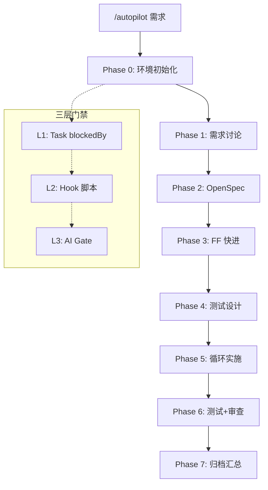

# spec-autopilot v4.0 升级蓝图

> **编制日期**: 2026-03-12
> **基准版本**: v3.6.1
> **分析依据**: v3.5.0 综合生态分析报告 + v3.6.0 多维度自评报告 + 2026-03 行业最佳实践调研
> **目标**: 从 3.67/5 综合评分提升至 4.2+/5，重点解决跨版本遗留问题 + 对齐行业最佳实践

---

## 一、现状诊断总结

### 1.1 两份报告交叉比对结论

| 指标 | v3.5.0 → v3.6.0 变化 | 评估 |
|------|----------------------|------|
| P0 问题解决率 | 3 个中 1 个完全解决（TDD）、1 个部分解决（易用性） | 中等 |
| P1 问题解决率 | 6 个中 3 个完全解决（超时/阈值/JSON 提取） | 良好 |
| P2 问题解决率 | 4 个中 0 个解决 | 停滞（多为外部依赖阻塞） |
| 新增问题 | v3.6.0 识别出 12 个新问题 | 系统复杂度上升的自然结果 |
| 跨版本遗留 | 6 个核心问题横跨两份报告未解决 | **需优先处理** |

### 1.2 六大跨版本遗留问题

这些问题在 v3.5.0 和 v3.6.0 两份报告中**反复出现**，是最需要优先解决的系统性债务：

| # | 遗留问题 | v3.5.0 编号 | v3.6.0 编号 | 根因 |
|---|---------|------------|------------|------|
| A | Hook 脚本 ~90 行 boilerplate 重复 | P1-1 | P0-1 | 缺少公共前言提取 |
| B | Model Routing 无实际效果 | P0-1, P2-2 | Dim2§2.4 | Task API 不支持 per-task model |
| C | 配置复杂度高（60+ 字段） | P0-3 | Dim9§9.2 | 功能膨胀 vs 渐进式暴露缺失 |
| D | 仅支持 Claude Code 单平台 | P1-5, P2-4 | AppC | 架构深度耦合 Task/Hook API |
| E | 知识系统关键词匹配浅层 | P2-1 | Dim8§8.2 | 无 embedding 基础设施 |
| F | brownfield_validation 默认关闭 | §2.3-3 | P1-3 | 保守默认值 |

### 1.3 评分基线与目标

| 维度 | v3.6.0 评分 | 目标评分 | 差距 | 主攻方向 |
|------|------------|---------|------|---------|
| 生成速度与效率 | 3.5 | 4.0 | +0.5 | Hook 合并、reference 精简 |
| 经济性 | 3.0 | 3.5 | +0.5 | SKILL.md 瘦身、懒加载优化 |
| AI 产出稳定性 | 4.5 | 4.7 | +0.2 | test_traceability 升级 blocking |
| 幻觉控制 | 4.0 | 4.3 | +0.3 | brownfield 默认开启、Phase 2/3 验证 |
| 整体设计与架构 | 4.0 | 4.3 | +0.3 | 复杂度治理、Skill 合并 |
| 实现方案质量 | 3.5 | 4.0 | +0.5 | Hook 去重、脚本重构 |
| 外部 Rules 遵守 | 4.0 | 4.2 | +0.2 | CLAUDE.md 变更感知 |
| 可持久记忆 | 3.5 | 3.8 | +0.3 | auto-memory 集成 |
| 可扩展性与易用性 | 3.0 | 3.8 | +0.8 | 渐进式配置 + 文档补全 |
| **综合** | **3.67** | **4.07** | **+0.40** | |

---

## 二、行业最佳实践对标

基于 2026-03 行业调研，以下是 spec-autopilot 应对齐的六大最佳实践：

### 2.1 Structure Over Freedom（结构约束优于自由选择）

**行业标杆**: Superpowers（42K+ stars）的核心设计哲学是**移除可选性**——TDD、planning、code review 是结构性要求而非建议。CodeScene 在三个层面强制质量门禁（编码中/提交前/PR 前）。

**spec-autopilot 现状**: 三层门禁体系已领先行业，但部分关键约束仍为「recommended」而非「blocking」（如 test_traceability、brownfield_validation）。

**对齐方向**: 将「建议」升级为「强制」，把软约束硬化。

### 2.2 Context Engineering（上下文工程）

**行业标杆**: SFEIR 研究表明组合使用 Plan Mode + PreCompact Hooks + 多会话策略可实现 55% token 节省。Superpowers 每个子任务启动独立 Agent 并仅传入必要上下文。最佳实践: CLAUDE.md 控制在 3,000 tokens 以下，使用结构化列表而非叙述体（节省 30%）。

**spec-autopilot 现状**: JSON 信封机制已节省 30-60K tokens/run，但主 SKILL.md（383 行）全程驻留、reference 总量 4,043 行按需加载仍有优化空间。

**对齐方向**: SKILL.md 按阶段懒加载 + reference 合并精简。

### 2.3 Progressive Complexity（渐进式复杂度）

**行业标杆**: 三层模型——Layer 1 零配置即用（如 Superpowers）→ Layer 2 引导式定制（CLAUDE.md + hooks）→ Layer 3 完整框架（plugins + Agent Teams）。cc-sdd 实现 `npx` 一键 30 秒安装。

**spec-autopilot 现状**: Wizard 降低首次使用门槛（评分 4/5），但配置调优（2/5）和故障排查（2.5/5）仍然痛苦。60+ 字段一次性暴露给用户。

**对齐方向**: 三级配置分层 + 智能默认值 + 按需展开高级选项。

### 2.4 Multi-Agent as Microservices（多 Agent 微服务化）

**行业标杆**: Claude Code Agent Teams（2026-02 发布）实现对等协调模型——共享任务队列 + 邮箱通信 + 独立上下文窗口。Google 提出 8 种多 Agent 设计模式。Superset IDE 支持 10+ 并行 Agent + Git worktree。

**spec-autopilot 现状**: 基于 Task API 的 hub-and-spoke 调度模型，Phase 5 支持 worktree 隔离并行。

**对齐方向**: 适配 Agent Teams API 作为并行执行后端，保留 Task 模式作为 fallback。

### 2.5 Deterministic Quality Gates（确定性质量门禁）

**行业标杆**: CodeScene 要求 Code Health 评分 9.5-10.0。StrongDM 的「Software Factory」用 specs + scenarios 作为 holdout set，完全不依赖人工 review。ContextCov（MIT）从自然语言指令提取可执行约束，99.997% 语法有效性。

**spec-autopilot 现状**: 三层门禁在行业中独一无二，但 Phase 6 质量扫描未接入真实静态分析工具。

**对齐方向**: 集成 ESLint/TypeScript-strict/SonarQube 等真实工具命令。

### 2.6 Spec-First Development（规范先行）

**行业标杆**: Addy Osmani 的 spec.md 模式——AI 协作构建需求 → 架构 → 数据模型 → 测试策略，然后才写代码。Amazon 观察到高级工程师最快采纳 AI Agent 因为他们本能地「先概述思路而非键入详细指令」。

**spec-autopilot 现状**: 8 阶段流水线本身就是 spec-first 的典范（Phase 1 需求 → Phase 2-3 规范 → Phase 4 测试设计 → Phase 5 实施）。

**对齐方向**: 这是核心竞争力，继续强化而非改变。

---

## 三、升级方案设计

### 3.0 方案概览

将升级分为 4 个 Wave，每个 Wave 独立可交付、可回滚：

```
Wave 1: 技术债务清理        （1-2 天）  — 解决所有跨版本遗留的工程问题
Wave 2: Token 经济性优化    （1-2 天）  — SKILL.md 瘦身 + reference 精简 + Hook 合并
Wave 3: 质量门禁硬化        （1 天）    — 软约束升级为硬约束
Wave 4: 开发者体验革新      （2-3 天）  — 渐进式配置 + 文档补全 + 错误信息增强
```

**预期总投入**: 5-8 天
**预期综合评分提升**: 3.67 → 4.07+（+0.40）

---

### 3.1 Wave 1: 技术债务清理

**目标**: 消除跨版本遗留的工程债务，降低系统维护复杂度。

#### 3.1.1 Hook Boilerplate 提取（遗留 A）

**现状**: 6 个 PostToolUse Hook 脚本的前 ~15 行完全相同（stdin 读取、_common.sh 加载、三层 bypass 检查），总计 ~90 行冗余。

**方案**:

创建 `scripts/_hook_preamble.sh`:

```bash
#!/usr/bin/env bash
# _hook_preamble.sh — PostToolUse Hook 公共前言
# 用法: source "$SCRIPT_DIR/_hook_preamble.sh" || exit 0
#
# 提供变量: STDIN_DATA, SCRIPT_DIR, PROJECT_ROOT_QUICK
# 三层 bypass 后仅在 autopilot 活跃场景继续执行

STDIN_DATA=$(cat)
[ -z "$STDIN_DATA" ] && exit 0

SCRIPT_DIR="$(cd "$(dirname "${BASH_SOURCE[1]}")" && pwd)"
source "$SCRIPT_DIR/_common.sh"

PROJECT_ROOT_QUICK=$(echo "$STDIN_DATA" | grep -o '"cwd":"[^"]*"' | head -1 | cut -d'"' -f4)
[ -z "$PROJECT_ROOT_QUICK" ] && exit 0

has_active_autopilot "$PROJECT_ROOT_QUICK" || exit 0
has_phase_marker || exit 0
is_background_agent && exit 0
```

6 个 Hook 脚本改为:
```bash
SCRIPT_DIR="$(cd "$(dirname "${BASH_SOURCE[0]}")" && pwd)"
source "$SCRIPT_DIR/_hook_preamble.sh" || exit 0
# ... 业务逻辑
```

**收益**: 减少 ~90 行重复代码、统一 bypass 逻辑、降低 bug 引入面。

#### 3.1.2 check-predecessor-checkpoint.sh 职责拆分

**现状**: 419 行单文件混合了模式感知、TDD 检测、wall-clock 超时三重职责。

**方案**: 拆分为 3 个内聚模块:

```
check-predecessor-checkpoint.sh     (主入口 ~80 行，调度逻辑)
├── _predecessor_resolver.py        (前驱映射 + 模式感知 ~100 行)
├── _tdd_state_checker.py           (TDD 周期检测 ~60 行)
└── _wall_clock_guard.py            (超时检测 ~40 行)
```

主入口仅做 bypass 检查 + 按需调用子模块。

**收益**: 单一职责、可独立测试、减少主脚本长度 80%。

#### 3.1.3 validate-config.sh Python 分离

**现状**: 340 行 bash 脚本中嵌入了大段 Python 代码（通过 heredoc），可维护性差。

**方案**: 提取为独立 `_config_validator.py`（~200 行），bash 脚本仅做 python3 调用和结果处理（~60 行）。

**收益**: Python 代码获得 IDE 支持（语法高亮、类型检查、linting）。

#### 3.1.4 Skill 合并精简

**现状**: checkpoint（126 行）和 lockfile（124 行）两个 Skill 偏薄，主要为工程约束而非功能粒度存在。

**方案**:
- `autopilot-checkpoint` 合并入 `autopilot-gate`（门禁 + 状态管理天然耦合）
- `autopilot-lockfile` 合并入 `autopilot-phase0`（锁文件是启动/关闭流程的一部分）

合并后 Skill 数量: 9 → 7

**收益**: 减少 2 个 Skill 文件、简化交互矩阵、降低认知负担。

---

### 3.2 Wave 2: Token 经济性优化

**目标**: 降低单次流水线 token 消耗 30%+，从 155-390K 降至 100-270K。

#### 3.2.1 SKILL.md 按阶段懒加载

**现状**: 主 SKILL.md（383 行）全程驻留上下文，包含所有阶段的指令。

**方案**: 将主 SKILL.md 拆分为:

```
autopilot/SKILL.md          (~120 行) — 仅保留: 模式定义、阶段概览表、切换协议、压缩恢复
autopilot/references/
  ├── guardrails.md          (~80 行) — 30+ 护栏约束，仅在阶段切换时加载
  ├── phase-details.md       (~100 行) — 各阶段详细步骤，按需加载
  └── dispatch-rules.md      (~80 行) — 调度规则和模板，仅 dispatch 时加载
```

**关键设计**: 主 SKILL.md 每个阶段的指令只保留一行概要 + 「执行前读取: references/xxx.md」指引。

**收益**: 主上下文从 383 行（~8K tokens）降至 ~120 行（~2.5K tokens），节省 ~5.5K tokens/消息。

#### 3.2.2 Reference 文件合并精简

**现状**:
- `parallel-dispatch.md`（465 行）+ `parallel-phase-dispatch.md`（457 行）内容重叠严重
- `phase1-requirements.md`（722 行）过大，单次 Read 消耗 ~10K tokens

**方案**:

| 操作 | 原文件 | 目标 | 预计节省 |
|------|--------|------|---------|
| 合并 | parallel-dispatch.md + parallel-phase-dispatch.md | parallel-orchestration.md (~500 行) | ~420 行 |
| 拆分 | phase1-requirements.md (722 行) | phase1-core.md (~300行) + phase1-advanced.md (~300行) | 按需加载节省 ~4K tokens |
| 精简 | config-schema.md (274 行) | 移除已在 validate-config.sh 中实现的验证规则描述 | ~50 行 |

**总收益**: reference 总行数从 4,043 降至 ~3,200（-21%），Phase 1 按需加载场景节省 ~4K tokens。

#### 3.2.3 Hook 链合并（5 → 1）

**现状**: 5 个 PostToolUse(Task) Hook 串行执行，每个独立启动 python3 进程，最坏情况 ~420ms。

**方案**: 合并为单一 `post-task-validator.sh`（~200 行），内部按优先级顺序调用各验证模块:

```bash
# post-task-validator.sh — 统一 PostToolUse(Task) 入口
source "$SCRIPT_DIR/_hook_preamble.sh" || exit 0

# 单次 python3 调用，执行所有验证
python3 "$SCRIPT_DIR/_post_task_validator.py" \
  --stdin "$STDIN_DATA" \
  --project-root "$PROJECT_ROOT" \
  --phase "$CURRENT_PHASE"
```

`_post_task_validator.py`（~300 行）内部顺序执行:
1. JSON 信封验证（原 validate-json-envelope.sh）
2. 反合理化检测（原 anti-rationalization-check.sh）
3. 代码约束检查（原 code-constraint-check.sh）
4. 并行合并守卫（原 parallel-merge-guard.sh）
5. 决策格式验证（原 validate-decision-format.sh）

**收益**:
- 5 次 python3 fork → 1 次，延迟从 ~420ms 降至 ~100ms
- hooks.json 从 5 条 PostToolUse(Task) 注册简化为 1 条
- 共享模块（_envelope_parser.py、_constraint_loader.py）仅加载一次

**向后兼容**: 保留原始脚本文件但标记 deprecated，在 `_post_task_validator.py` 中 import 原有 Python 模块。

#### 3.2.4 PreCompact Hook 优化

**现状**: 默认在 95% 窗口饱和时触发 compact。

**方案**: 参考 SFEIR 最佳实践，在 `save-state-before-compact.sh` 中添加关键指令保护:

```bash
# 确保 compact 后恢复的状态包含当前阶段的核心指令
# 而非仅恢复元数据
echo "PHASE_CRITICAL_INSTRUCTIONS=$(cat references/phase${CURRENT_PHASE}-*.md)" \
  >> "$STATE_FILE"
```

**收益**: 减少 compact 后的 reference 重新加载（节省 1-2 次 Read 调用）。

---

### 3.3 Wave 3: 质量门禁硬化

**目标**: 将软约束升级为硬约束，对齐「Structure Over Freedom」行业最佳实践。

#### 3.3.1 test_traceability 升级为 L2 Blocking

**现状**: test_traceability 为 recommended 字段，AI 可以跳过而无后果。

**方案**:

在 `validate-json-envelope.sh`（或合并后的 `_post_task_validator.py`）中添加:

```python
# Phase 4 完成时检查 test_traceability 覆盖率
if current_phase == 4:
    traceability = envelope.get("test_traceability", {})
    coverage = traceability.get("coverage_pct", 0)
    threshold = config.get("test_pyramid", {}).get("traceability_floor", 80)
    if coverage < threshold:
        return {
            "decision": "block",
            "reason": f"test_traceability coverage {coverage}% < {threshold}% floor. "
                      f"Each test case must trace to a Phase 1 requirement."
        }
```

**配置扩展**: 在 config-schema.md 中添加:
```yaml
test_pyramid:
  traceability_floor: 80  # 默认 80%，可配置
```

**收益**: 从「建议追溯」升级为「强制追溯」，杜绝脱离需求的测试。

#### 3.3.2 brownfield_validation 默认开启

**现状**: `brownfield_validation.enabled: false`，需手动开启。

**方案**: 修改 config-schema.md 和 validate-config.sh 的默认值:

```yaml
brownfield_validation:
  enabled: true  # v4.0 起默认开启
  check_points:
    - phase4_to_phase5
    - phase5_to_phase6
```

对于 greenfield 项目（Phase 0 检测到空项目），自动设为 false。

**收益**: 存量项目的设计-实现漂移自动检测，覆盖 Phase 4→5 和 Phase 5→6 两个关键切换点。

#### 3.3.3 Phase 2/3 规范验证增强

**现状**: Phase 2/3（OpenSpec 创建）的幻觉防护较弱，无实际验证步骤。

**方案**: 在 Phase 3 完成后、Phase 4 启动前添加「规范一致性快速验证」:

```
Phase 3 → [规范一致性检查] → Phase 4
           │
           ├── 检查 OpenSpec 中的 API 端点是否与 Phase 1 确认的需求一致
           ├── 检查数据模型是否覆盖 Phase 1 的所有实体
           └── 检查 OpenSpec 中无 Phase 1 未提及的「额外功能」（幻觉指标）
```

实现为 `autopilot-gate` Skill 的 Phase 3 特殊门禁（L3 层级）。

**收益**: 在实施前拦截规范偏离，避免基于错误规范实施整个 Phase 5。

#### 3.3.4 静态分析工具集成

**现状**: Phase 6 质量扫描为 AI 软检查，未接入真实工具。

**方案**: 在 config.yaml 中添加:

```yaml
quality_scans:
  tools:
    - name: typecheck
      command: "npx tsc --noEmit"
      blocking: true
    - name: lint
      command: "npx eslint . --max-warnings 0"
      blocking: false  # 警告不阻断
    - name: security
      command: "npx audit-ci --moderate"
      blocking: true
```

Phase 6 路径 C（质量扫描）执行配置中定义的实际命令，而非 AI 判断。

**收益**: 从「AI 认为代码质量好」升级为「工具证明代码质量好」。

---

### 3.4 Wave 4: 开发者体验革新

**目标**: 将可扩展性与易用性评分从 3.0 提升至 3.8+。

#### 3.4.1 三级配置分层

**现状**: 60+ 字段一次性暴露，新用户认知负担重。

**方案**: 配置字段按暴露级别分三层:

**Level 1 — 核心配置（5 个字段，覆盖 80% 场景）**:
```yaml
# .claude/autopilot.config.yaml — Level 1
mode: full              # full | lite | minimal
services:
  backend: { lang: typescript, framework: nestjs }
test_command: "npm test"
lint_command: "npm run lint"
language: zh            # 交互语言
```

**Level 2 — 团队配置（15 个字段，团队级定制）**:
```yaml
# Level 2 — 通过 `advanced: true` 展开
phases:
  requirements:
    max_rounds: 5
    search_enabled: true
  testing:
    tdd_mode: false
    test_pyramid: { min_unit_pct: 40 }
  implementation:
    parallel: { enabled: false }
code_constraints:
  forbidden_patterns: []
```

**Level 3 — 专家配置（40+ 字段，完整控制）**:
```yaml
# Level 3 — 通过 `expert: true` 展开
test_pyramid:
  hook_floors: { min_unit_pct: 30, max_e2e_pct: 40 }
  traceability_floor: 80
brownfield_validation: { enabled: true }
model_routing: { ... }
wall_clock_timeout_hours: 4
# ... 所有高级字段
```

**Wizard 改进**:
- Quick 模式: 仅询问 Level 1 的 5 个问题（~1 分钟）
- Standard 模式: Level 1 + Level 2（~3 分钟，当前默认）
- Expert 模式: 全量配置（~5 分钟）

**收益**: 新用户只需理解 5 个字段即可开始使用。

#### 3.4.2 缺失文档补全

**现状**: 缺少快速入门指南、架构总览图、常见问题排查、配置调优指南。

**方案**: 创建以下文档:

**a) quick-start.md（~100 行）**:
```markdown
# 5 分钟快速开始

## 1. 安装插件（30 秒）
claude plugins install spec-autopilot

## 2. 初始化项目（1 分钟）
/autopilot-setup
→ 选择预设: Moderate（推荐）
→ 确认检测到的技术栈

## 3. 开始第一个任务（3 分钟）
/autopilot 实现用户登录功能
→ 回答 3-5 个需求确认问题
→ 等待自动执行...

## 常见问题
- Q: 中途崩溃怎么办？ → 重新运行 /autopilot，自动从断点恢复
- Q: 如何跳过测试设计？ → 使用 lite 模式: config.mode = "lite"
- Q: 如何看执行进度？ → Ctrl+O 查看详细日志
```

**b) architecture-overview.md（含 Mermaid 图）**:



**c) troubleshooting-faq.md（~150 行）**: 覆盖 Top 10 常见错误场景 + 修复步骤。

**d) config-tuning-guide.md（~200 行）**: 按场景（大型项目/小型项目/TDD 模式/并行模式）给出推荐配置。

#### 3.4.3 错误信息增强

**现状**: Hook 阻断消息技术性强，缺少修复建议和中文支持。

**方案**: 统一错误消息格式:

```json
{
  "decision": "block",
  "reason": "Phase 4 test_pyramid floor violation",
  "detail": {
    "metric": "unit_pct",
    "actual": 20,
    "threshold": 30,
    "unit": "%"
  },
  "fix_suggestion": "请增加至少 2 个单元测试以满足最低 30% 的单元测试占比要求",
  "doc_link": "docs/gates.md#test-pyramid",
  "lang": "zh"
}
```

在 `_post_task_validator.py` 中添加:
```python
FIX_SUGGESTIONS = {
    "test_pyramid.unit_pct": {
        "zh": "请增加单元测试数量。当前 {actual}%，需达到 {threshold}%",
        "en": "Add more unit tests. Current: {actual}%, required: {threshold}%"
    },
    "test_traceability.coverage": {
        "zh": "请确保每个测试用例追溯到 Phase 1 需求。当前覆盖率 {actual}%",
        "en": "Ensure test cases trace to Phase 1 requirements. Coverage: {actual}%"
    },
    # ...
}
```

**收益**: 用户看到阻断后立即知道如何修复，无需查阅文档。

#### 3.4.4 CLAUDE.md 运行中变更感知

**现状**: rules-scanner.sh 在 Phase 0 缓存扫描结果，运行中 CLAUDE.md 变更不被感知。

**方案**: 在每次阶段切换时（autopilot-gate 执行前），检查 CLAUDE.md 修改时间:

```bash
# 在 gate 检查中添加
CLAUDE_MD_MTIME=$(stat -f "%m" "$PROJECT_ROOT/CLAUDE.md" 2>/dev/null || echo 0)
CACHED_MTIME=$(cat "$CONTEXT_DIR/.rules-scan-mtime" 2>/dev/null || echo 0)
if [ "$CLAUDE_MD_MTIME" != "$CACHED_MTIME" ]; then
    # 重新扫描规则
    bash "$SCRIPTS_DIR/rules-scanner.sh" "$PROJECT_ROOT" > "$CONTEXT_DIR/project-rules.md"
    echo "$CLAUDE_MD_MTIME" > "$CONTEXT_DIR/.rules-scan-mtime"
fi
```

**收益**: 运行期间用户修改 CLAUDE.md 的规则变更能在下一阶段生效。

#### 3.4.5 Claude Code Auto-Memory 集成

**现状**: 插件不读写 Claude auto-memory，跨会话经验仅存在于 knowledge.json。

**方案**: 在 Phase 7 归档时，将关键知识同步写入 auto-memory:

```
Phase 7 知识提取 → .autopilot-knowledge.json (已有)
                  → ~/.claude/projects/<project>/memory/ (新增)
```

写入格式:
```markdown
<!-- autopilot-knowledge.md -->
## 项目技术决策
- [2026-03-12] 选择 NestJS + Prisma 架构，原因: ...
- [2026-03-10] 放弃 REST 选择 GraphQL，原因: ...

## 已知陷阱
- [高置信] Prisma 迁移需要先 generate 再 migrate
- [中置信] 前端路由守卫需同时检查 token 和 refresh token
```

**收益**: 下次会话 Claude 自动加载项目知识，无需等到 Phase 1 才触发知识匹配。

---

## 四、实施路线图

```
┌─────────────────────────────────────────────────────────┐
│  Wave 1: 技术债务清理 (Day 1-2)                          │
│  ┌──────────────────┐  ┌──────────────────┐             │
│  │ 1.1 Hook 前言提取│  │ 1.2 脚本职责拆分│              │
│  │     (~2h)        │  │     (~4h)        │              │
│  └──────────────────┘  └──────────────────┘             │
│  ┌──────────────────┐  ┌──────────────────┐             │
│  │ 1.3 Python 分离  │  │ 1.4 Skill 合并  │              │
│  │     (~2h)        │  │     (~3h)        │              │
│  └──────────────────┘  └──────────────────┘             │
├─────────────────────────────────────────────────────────┤
│  Wave 2: Token 经济性优化 (Day 2-3)                      │
│  ┌──────────────────┐  ┌──────────────────┐             │
│  │ 2.1 SKILL.md 拆分│  │ 2.2 Reference 精简│            │
│  │     (~4h)        │  │     (~3h)         │             │
│  └──────────────────┘  └──────────────────┘             │
│  ┌──────────────────┐  ┌──────────────────┐             │
│  │ 2.3 Hook 链合并  │  │ 2.4 Compact 优化 │             │
│  │     (~6h)        │  │     (~2h)         │             │
│  └──────────────────┘  └──────────────────┘             │
├─────────────────────────────────────────────────────────┤
│  Wave 3: 质量门禁硬化 (Day 4)                            │
│  ┌──────────────────┐  ┌──────────────────┐             │
│  │ 3.1 追溯性强制   │  │ 3.2 Brownfield ON│             │
│  │     (~2h)        │  │     (~1h)         │             │
│  └──────────────────┘  └──────────────────┘             │
│  ┌──────────────────┐  ┌──────────────────┐             │
│  │ 3.3 规范验证增强 │  │ 3.4 静态分析集成 │             │
│  │     (~3h)        │  │     (~3h)         │             │
│  └──────────────────┘  └──────────────────┘             │
├─────────────────────────────────────────────────────────┤
│  Wave 4: 开发者体验革新 (Day 5-7)                        │
│  ┌──────────────────┐  ┌──────────────────┐             │
│  │ 4.1 三级配置分层 │  │ 4.2 文档补全     │             │
│  │     (~6h)        │  │     (~4h)         │             │
│  └──────────────────┘  └──────────────────┘             │
│  ┌──────────────────┐  ┌──────────────────┐             │
│  │ 4.3 错误信息增强 │  │ 4.4 规则变更感知 │             │
│  │     (~3h)        │  │     (~2h)         │             │
│  └──────────────────┘  └──────────────────┘             │
│  ┌──────────────────┐                                    │
│  │ 4.5 Auto-Memory  │                                    │
│  │     (~3h)        │                                    │
│  └──────────────────┘                                    │
└─────────────────────────────────────────────────────────┘
```

---

## 五、预期效果

### 5.1 量化指标

| 指标 | v3.6.1 基线 | v4.0 目标 | 提升幅度 |
|------|------------|----------|---------|
| 综合评分 | 3.67/5 | 4.07/5 | +10.9% |
| Token 消耗/full run | 155-390K | 100-270K | -30% |
| Hook 延迟（PostToolUse/Task） | ~420ms | ~100ms | -76% |
| 配置首次使用时间 | 3-5min | 1-2min | -60% |
| 必须理解的字段数（新用户） | 60+ | 5 | -92% |
| Shell 脚本冗余行数 | ~90 | 0 | -100% |
| Skill 数量 | 9 | 7 | -22% |
| Reference 总行数 | 4,043 | ~3,200 | -21% |
| 缺失文档数 | 4 | 0 | -100% |
| 软约束数（应为硬约束） | 2 | 0 | -100% |

### 5.2 各维度评分预测

| 维度 | v3.6.0 | v4.0 预测 | 主要提升来源 |
|------|--------|----------|------------|
| 生成速度与效率 | 3.5 | 4.0 | Hook 合并(-76% 延迟)、reference 精简 |
| 经济性 | 3.0 | 3.5 | SKILL.md 瘦身(-5.5K/msg)、reference 合并(-21%) |
| AI 产出稳定性 | 4.5 | 4.7 | test_traceability 强制、规范验证增强 |
| 幻觉控制 | 4.0 | 4.3 | brownfield 默认 ON、静态分析集成 |
| 整体设计与架构 | 4.0 | 4.3 | Skill 合并(9→7)、脚本职责拆分 |
| 实现方案质量 | 3.5 | 4.0 | Hook 去重、Python 分离、脚本重构 |
| 外部 Rules 遵守 | 4.0 | 4.2 | CLAUDE.md 变更感知 |
| 可持久记忆 | 3.5 | 3.8 | auto-memory 集成 |
| 可扩展性与易用性 | 3.0 | 3.8 | 三级配置 + 文档补全 + 错误增强 |
| **综合** | **3.67** | **4.07** | |

### 5.3 竞品差距变化

| vs 竞品 | v3.6.0 差距 | v4.0 差距 | 变化 |
|---------|------------|----------|------|
| Superpowers 易用性 | 2.0 vs 4.5 = -2.5 | 3.8 vs 4.5 = -0.7 | 缩小 72% |
| Superpowers TDD | 已追平 | 保持追平 | 维持 |
| cc-sdd 多平台 | 1 vs 8 | 1 vs 8 | 未变（P2 长期） |
| 行业静态分析 | 无 vs 有 | 有 vs 有 | 追平 |
| 行业 token 优化 | 高消耗 | 中消耗 | 从「劣势」到「中性」 |

---

## 六、未纳入本次升级的长期项目

以下项目因外部依赖阻塞或投入产出比不足，留待后续版本:

| 项目 | 阻塞原因 | 预计时间窗口 |
|------|---------|------------|
| 真正的 Model Routing | 等待 Task API 支持 per-task model 参数 | Claude Code 未来版本 |
| 多平台抽象层 | 架构深度重构，ROI 需评估 | v5.0+ |
| 知识系统语义匹配 | 需要 embedding 服务基础设施 | v4.5+ |
| Web Dashboard | 独立前端项目 | v5.0+ |
| Agent Teams 集成 | API 稳定性待验证 | v4.5+ |
| 官方 Marketplace 发布 | 需满足审核标准 | 功能稳定后 |

---

## 七、风险与缓解

| 风险 | 影响 | 概率 | 缓解措施 |
|------|------|------|---------|
| Hook 合并引入回归 | 所有阶段门禁失效 | 中 | test-hooks.sh 覆盖所有合并场景，合并前后对比测试 |
| SKILL.md 拆分后 AI 遗忘加载 reference | 阶段执行不完整 | 中 | 关键 reference 在 L2 Hook 中验证是否已被读取 |
| Skill 合并后职责边界模糊 | 维护困难 | 低 | 合并后保持内部函数/section 明确分隔 |
| 三级配置分层增加 Wizard 复杂度 | 反而降低易用性 | 低 | Quick 模式仅 5 个字段，保持极简 |
| brownfield 默认开启导致误报 | 用户体验下降 | 中 | greenfield 项目自动关闭 + 首次运行宽容模式 |

---

## 附录 A: 涉及文件清单

### 新增文件
| 文件 | 用途 |
|------|------|
| `scripts/_hook_preamble.sh` | Hook 公共前言 |
| `scripts/_post_task_validator.py` | 统一 PostToolUse(Task) 验证器 |
| `scripts/_predecessor_resolver.py` | 前驱映射模块 |
| `scripts/_tdd_state_checker.py` | TDD 状态检测模块 |
| `scripts/_wall_clock_guard.py` | 超时检测模块 |
| `scripts/_config_validator.py` | 配置验证 Python 模块 |
| `references/guardrails.md` | 护栏约束（从 SKILL.md 拆出） |
| `references/parallel-orchestration.md` | 合并后的并行编排协议 |
| `references/phase1-core.md` | Phase 1 核心协议 |
| `references/phase1-advanced.md` | Phase 1 高级协议 |
| `docs/quick-start.md` | 快速入门指南 |
| `docs/architecture-overview.md` | 架构总览（含 Mermaid） |
| `docs/troubleshooting-faq.md` | 常见问题排查 |
| `docs/config-tuning-guide.md` | 配置调优指南 |

### 修改文件
| 文件 | 变更内容 |
|------|---------|
| `skills/autopilot/SKILL.md` | 瘦身至 ~120 行 |
| `skills/autopilot-gate/SKILL.md` | 合入 checkpoint 逻辑 |
| `skills/autopilot-phase0/SKILL.md` | 合入 lockfile 逻辑 |
| `hooks/hooks.json` | PostToolUse(Task) 5→1 |
| `references/config-schema.md` | 三级配置分层 + 新字段 |
| 6 个 PostToolUse Hook 脚本 | 使用 _hook_preamble.sh |
| `check-predecessor-checkpoint.sh` | 职责拆分，缩减至 ~80 行 |
| `validate-config.sh` | Python 逻辑外置 |

### 删除/废弃文件
| 文件 | 原因 |
|------|------|
| `skills/autopilot-checkpoint/SKILL.md` | 合入 autopilot-gate |
| `skills/autopilot-lockfile/SKILL.md` | 合入 autopilot-phase0 |
| `references/parallel-dispatch.md` | 合并为 parallel-orchestration.md |
| `references/parallel-phase-dispatch.md` | 合并为 parallel-orchestration.md |
| `references/phase1-requirements.md` | 拆分为 core + advanced |

---

## 附录 B: 行业参考来源

| 来源 | 关键洞察 |
|------|---------|
| [Superpowers](https://github.com/obra/superpowers) | 移除可选性 > 提供灵活性；子 Agent 上下文隔离 |
| [CodeScene](https://codescene.com/blog/agentic-ai-coding-best-practice-patterns-for-speed-with-quality) | 三级质量门禁（编码中/提交前/PR 前）；Code Health 9.5+ |
| [SFEIR](https://institute.sfeir.com/en/claude-code/claude-code-context-management/optimization/) | PreCompact 85% 阈值；多会话策略节省 55% token |
| [Simon Willison](https://feeds.simonwillison.net/guides/agentic-engineering-patterns/red-green-tdd/) | Red/Green TDD 结构化强制 |
| [StrongDM](https://simonw.substack.com/p/how-strongdms-ai-team-build-serious) | Specs + Scenarios 作为 holdout set |
| [Addy Osmani](https://addyosmani.com/blog/ai-coding-workflow/) | spec.md 先行；「瀑布模型 15 分钟版」 |
| [Claude Code Agent Teams](https://blog.laozhang.ai/en/posts/claude-code-agent-teams) | 对等协调 > hub-and-spoke；共享任务队列 |
| [ContextCov (MIT)](https://arxiv.org/html/2603.00822) | 自然语言约束提取，99.997% 语法有效性 |
| [TFIR](https://tfir.io/ai-code-quality-2026-guardrails/) | AI 代码 1.7x 更多 bug；多 Agent 验证 |
